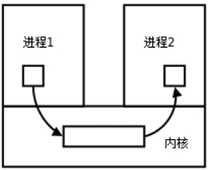
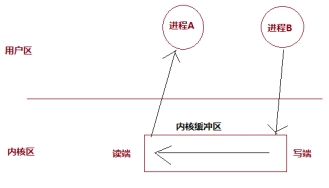
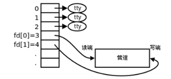
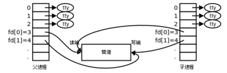
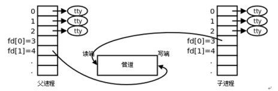
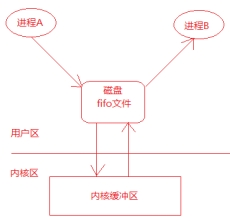
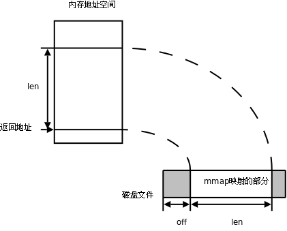
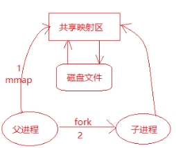

# 进程间通信

## 进程间通信相关概念

### 什么是进程间通信

Linux环境下，进程地址空间相互独立，每个进程各自有不同的用户地址空间。任何一个进程的全局变量在另一个进程中都看不到，所以进程和进程之间不能相互访问，要交换数据必须通过内核，在内核中开辟一块缓冲区，进程1把数据从用户空间拷到内核缓冲区，进程2再从内核缓冲区把数据读走，内核提供的这种机制称为进程间通信（IPC，InterProcess Communication）。



### 进程间通信的方式

在进程间完成数据传递需要借助操作系统提供特殊的方法，如：文件、管道、信号、共享内存、消息队列、套接字、命名管道等。随着计算机的蓬勃发展，一些方法由于自身设计缺陷被淘汰或者弃用。**现今常用的进程间通信方式有：**

+ **管道 (使用最简单)**

+ **信号 (开销最小)**

+ **共享映射区 (无血缘关系)**

+ **本地套接字 (最稳定)**

## 匿名管道-pipe

### 管道的概念

管道是一种最基本的IPC机制，也称匿名管道，应用于有血缘关系的进程之间，完成数据传递。调用pipe函数即可创建一个管道。



有如下特质：

+ 管道的本质是一块内核缓冲区 

+ 由两个文件描述符引用，一个表示读端，一个表示写端。

+ 规定数据从管道的写端流入管道，从读端流出。

+ 当两个进程都终结的时候，管道也自动消失。

+ 管道的读端和写端默认都是阻塞的。

### 管道的原理

+ 管道的实质是内核缓冲区，内部使用环形队列实现。

+ 默认缓冲区大小为4K，可以使用ulimit -a命令获取大小。

+ 实际操作过程中缓冲区会根据数据压力做适当调整。

### 管道的局限性

+ 数据一旦被读走，便不在管道中存在，不可反复读取。

+ 数据只能在一个方向上流动，若要实现双向流动，必须使用两个管道

+ 只能在有血缘关系的进程间使用管道。

### 创建管道

创建管道使用`pipe`函数，函数原型如下：

```c
int pipe(int pipefd[2]);
```

+ 函数参数：
  + 若函数调用成功，fd[0]存放管道的读端，fd[1]存放管道的写端

+ 返回值：

  +  成功返回0；

  +  失败返回-1，并设置errno值。

 函数调用成功返回读端和写端的文件描述符，其中**fd[0]是读端， fd[1]是写端**，**向管道读写数据是通过使用这两个文件描述符进行的，读写管道的实质是操作内核缓冲区。**

管道创建成功以后，创建该管道的进程（父进程）同时掌握着管道的读端和写端。如何实现父子进程间通信呢？

### 父子进程使用管道通信

一个进程在由pipe()创建管道后，一般再fork一个子进程，然后通过管道实现父子进程间的通信（因此也不难推出，只要两个进程中存在血缘关系，这里的血缘关系指的是具有共同的祖先，都可以采用管道方式来进行通信）。**父子进程间具有相同的文件描述符，且指向同一个管道pipe**，其他没有关系的进程不能获得pipe（）产生的两个文件描述符，也就不能利用同一个管道进行通信。

**第一步：父进程创建管道**

 

**第二步：父进程fork出子进程**

 

**第三步：父进程关闭fd[0]，子进程关闭fd[1]**

 

**创建步骤总结：**

+ 父进程调用pipe函数创建管道，得到两个文件描述符fd[0]和fd[1]，分别指向管道的读端和写端。

+ 父进程调用fork创建子进程，那么子进程也有两个文件描述符指向同一管。

+ 父进程关闭管道读端，子进程关闭管道写端。父进程可以向管道中写入数据，子进程将管道中的数据读出，这样就实现了父子进程间通信。

### 管道练习

+ 一个进程能否使用管道完成读写操作呢？能，两个进程都可以，一个肯定可以，但是多余了

+ 使用管道完成父子进程间通信？

```c
#include <stdio.h>
#include <stdlib.h>
#include <string.h>
#include <sys/types.h>
#include <unistd.h>
#include <sys/wait.h>

int main()
{
	//创建管道
	//int pipe(int pipefd[2]);
	int fd[2];
	int ret = pipe(fd);
	if(ret<0)
	{
		perror("pipe error");
		return -1;
	}

	//创建子进程
	pid_t pid = fork();
	if(pid<0) 
	{
		perror("fork error");
		return -1;
	}
	else if(pid>0)
	{
		//关闭读端
		close(fd[0]);
		sleep(5);
		write(fd[1], "hello world", strlen("hello world"));	

		wait(NULL);
	}
	else 
	{
		//关闭写端
		close(fd[1]);
		
		char buf[64];
		memset(buf, 0x00, sizeof(buf));
		int n = read(fd[0], buf, sizeof(buf));
		printf("read over, n==[%d], buf==[%s]\n", n, buf);
	
	}

	return 0;
}
```

+ 父子进程间通信, 实现ps aux | grep bash（使用execlp函数和dup2函数）

+  兄弟进程间通信, 实现ps aux | grep bash（使用execlp函数和dup2函数），父进程要调用waitpid函数完成对子进程的回收

### 管道的读写行为

+ 读操作

  + 有数据：read正常读，返回读出的字节数

  +  无数据
    + 写端全部关闭:：read解除阻塞，返回0, 相当于读文件读到了尾部

  +  没有全部关闭
    + read阻塞

+ 写操作

  + 读端全部关闭：管道破裂，进程终止, 内核给当前进程发SIGPIPE信号

  +  读端没全部关闭

    +  缓冲区写满了：write阻塞

    + 缓冲区没有满：继续write

### 如何设置管道为非阻塞

默认情况下，管道的读写两端都是阻塞的，若要设置读或者写端为非阻塞，则可参

考下列三个步骤进行：

第1步： int flags = fcntl(fd[0], F_GETFL, 0); 

第2步： flag |= O_NONBLOCK;

第3步： fcntl(fd[0], F_SETFL, flags);

若是读端设置为非阻塞：

+ 写端没有关闭，管道中没有数据可读，则read返回-1；

+ 写端没有关闭，管道中有数据可读，则read返回实际读到的字节数

+ 写端已经关闭，管道中有数据可读，则read返回实际读到的字节数

+ 写端已经关闭，管道中没有数据可读，则read返回0

### 如何查看管道缓冲区大小

+ 命令

```bash
ulimit -a
```

+ 函数 

```c
long fpathconf(int fd, int name);
printf("pipe size==[%ld]\n", fpathconf(fd[0], _PC_PIPE_BUF));
printf("pipe size==[%ld]\n", fpathconf(fd[1], _PC_PIPE_BUF));
```

## 命名管道-FIFO

### FIFO介绍

**FIFO常被称为命名管道**，以区分管道(pipe)。管道(pipe)只能用于“有血缘关系”的进程间通信。但通过FIFO，不相关的进程也能交换数据。

 FIFO是Linux基础文件类型中的一种（文件类型为p，可通过ls -l查看文件类型）。但FIFO文件在磁盘上没有数据块，文件大小为0，仅仅用来标识内核中一条通道。进程可以打开这个文件进行read/write，实际上是在读写内核缓冲区，这样就实现了进程间通信。

### 创建管道

+ 方式1：使用命令 `mkfifo`

  + 命令格式： mkfifo 管道名

  + 例如：mkfifo myfifo

+ 方式2：使用函数

  ```c
   int mkfifo(const char *pathname, mode_t mode);
  ```

>  参数说明和返回值可以查看man 3 mkfifo

当创建了一个FIFO，就可以使用open函数打开它，常见的文件I/O函数都可用于FIFO。如：close、read、write、unlink等。

FIFO严格遵循先进先出（first in first out），对FIFO的读总是从开始处返回数据，对它们的写则把数据添加到末尾。**它们不支持诸如**lseek**()等文件定位操作。**

### 使用FIFO完成两个进程通信

+ 使用FIFO完成两个进程通信的示意图

 

思路：

+ 进程A：

  + 创建一个fifo文件：myfifo

  + 调用open函数打开myfifo文件

  + 调用write函数写入一个字符串如：“hello world”（其实是将数据写入到了内核缓冲区）

  + 调用close函数关闭myfifo文件

+ 进程B：

  + 调用open函数打开myfifo文件

  + 调用read函数读取文件内容（其实就是从内核中读取数据）

  + 打印显示读取的内容

  + 调用close函数关闭myfifo文件

注意：myfifo文件是在进程A中创建的，如果先启动进程B会报错。思考一下如何解决这个问题呢？？？

## 内存映射区

### 存储映射区介绍

 存储映射I/O (Memory-mapped I/O) 使一个磁盘文件与存储空间中的一个缓冲区相映射。从缓冲区中取数据，就相当于读文件中的相应字节；将数据写入缓冲区，则会将数据写入文件。这样，就可在不使用read和write函数的情况下，使用地址（指针）完成I/O操作。

使用存储映射这种方法，首先应通知内核，将一个指定文件映射到存储区域中。这个映射工作可以通过mmap函数来实现。



### mmap函数

mmap函数用于创建存储映射区，函数原型如下：

```c
 void *mmap(void addr[.length], size_t length, int prot, int flags,int fd, off_t offset);
```

+ 函数返回值：

  + 成功：返回创建的映射区首地址；

  + 失败：MAP_FAILED宏

+ 参数： 

  + addr:  指定映射的起始地址, 通常设为NULL, 由系统指定

  +  length：映射到内存的文件长度

  + prot： 映射区的保护方式, 最常用的:

    + 读：PROT_READ

    + 写：PROT_WRITE

    + 读写：PROT_READ | PROT_WRITE

  +  flags： 映射区的特性, 可以是

    + MAP_SHARED: 写入映射区的数据会写回文件, 且允许其他映射该文件的进程共享。

    + MAP_PRIVATE: 对映射区的写入操作会产生一个映射区的复制(copy-on-write), 对此区域所做的修改不会写回原文件。

  + fd：由open返回的文件描述符, 代表要映射的文件。

  + offset：以文件开始处的偏移量, **必须是4k的整数倍**, 通常为0, 表示从文件头开始映射。

### munmap函数

munmap函数用于释放由mmap函数建立的存储映射区，函数原型如下：

```c
int munmap(void addr[.length], size_t length);
```

+ 返回值：

  + 成功：返回0

  + 失败：返回-1，设置errno值

+ 函数参数:

  + addr：调用mmap函数成功返回的映射区首地址

  +  length：映射区大小（mmap函数的第二个参数）

### mmap注意事项

+ 创建映射区的过程中，隐含着一次对映射文件的读操作，将文件内容读取到映射区

+ 当MAP_SHARED时，要求：映射区的权限应 <=文件打开的权限(出于对映射区的保护)。而MAP_PRIVATE则无所谓，因为mmap中的权限是对内存的限制。

+ 映射区的释放与文件关闭无关，只要映射建立成功，文件可以立即关闭。

+ 特别注意，当映射文件大小为0时，不能创建映射区。所以，用于映射的文件必须要有实际大小；mmap使用时常常会出现总线错误，通常是由于共享文件存储空间大小引起的。

+  munmap传入的地址一定是mmap的返回地址。坚决杜绝指针++操作。

+ 文件偏移量必须为0或者4K的整数倍

+ mmap创建映射区出错概率非常高，一定要检查返回值，确保映射区建立成功再进行后续操作。

###  有关mmap函数的使用总结

+ 第一个参数写成NULL

+ 第二个参数要映射的文件大小 > 0

+ 第三个参数：PROT_READ 、PROT_WRITE

+ 第四个参数：MAP_SHARED 或者 MAP_PRIVATE

+ 第五个参数：打开的文件对应的文件描述符

+ 第六个参数：4k的整数倍

### mmap函数相关思考题

+ 可以open的时候O_CREAT一个新文件来创建映射区吗?

+ 如果open时O_RDONLY, mmap时PROT参数指定PROT_READ|PROT_WRITE会怎样？

+ mmap映射完成之后, 文件描述符关闭，对mmap映射有没有影响？

+ 如果文件偏移量为1000会怎样？

+ 对mem越界操作会怎样？

+  如果mem++，munmap可否成功？

+  mmap什么情况下会调用失败？

+  如果不检测mmap的返回值，会怎样？

### mmap应用练习

+ 练习1：使用mmap完成对文件的读写操作

+ 练习:2：使用mmap完成父子进程间通信

  + 图解说明

   

  + 思路

    + 调用mmap函数创建存储映射区，返回映射区首地址ptr

    + 调用fork函数创建子进程，子进程也拥有了映射区首地址

    + 父子进程可以通过映射区首地址指针ptr完成通信

    + 调用munmap函数释放存储映射区

+ 练习3：使用mmap完成没有血缘关系的进程间通
  + 思路：两个进程都打开相同的文件，然后调用mmap函数建立存储映射区，这样两个进程共享同一个存储映射区。

 

使用mmap函数建立匿名映射：

mmap(NULL, 4096, PROT_READ | PROT_WRITE, MAP_SHARED | MAP_ANONYMOUS, -1, 0);