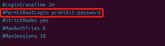
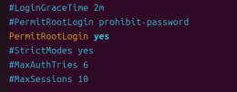

## 后台启动程序

**一、使用 nohup 命令**

1. **基本语法和原理**
   - `nohup`命令用于在忽略挂起信号（hangup signal）的情况下运行指定的命令。当你退出终端会话时，使用`nohup`启动的程序不会收到 SIGHUP 信号而终止。
   - 基本语法是：`nohup command [arguments] &`。其中，`command`是要运行的程序命令，`arguments`是程序的参数，`&`表示将命令放入后台运行。
2. **示例**
   - 假设要在后台启动一个名为`myprogram`的可执行文件，并且该文件位于当前目录下。可以使用以下命令：

```css
nohup./myprogram &
```

- 执行此命令后，程序会在后台运行。系统会返回一个进程 ID（PID），你可以使用这个 PID 来监控或管理程序。例如，如果想查看程序的输出，可以查看`nohup.out`文件（默认情况下，程序的标准输出和标准错误输出会被重定向到这个文件）。

**二、使用 systemd 服务（适用于长期运行的服务型程序）**

1. 创建服务单元文件
   - 首先，需要创建一个`.service`文件来定义服务。以启动一个名为`my_service`的自定义服务为例，创建一个文件（例如`/etc/systemd/system/my_service.service`），内容如下：

```css
[Unit]
Description=My Service
After=network.target

[Service]
ExecStart=/path/to/your/executable
Type=forking
PIDFile=/var/run/my_service.pid
Restart=always

[Install]
WantedBy=multi - user.target
```

- 在这个文件中：
  - `[Unit]`部分定义了服务的基本描述和启动顺序相关的信息。`After = network.target`表示在网络服务启动后再启动这个服务。
  - `[Service]`部分是核心内容。`ExecStart`指定了服务启动的命令（需要替换为实际的可执行文件路径）。`Type = forking`表示服务启动后会派生（fork）一个子进程，并且父进程会退出。`PIDFile`指定了记录服务进程 ID 的文件路径。`Restart = always`表示如果服务意外终止，将自动重启。
  - `[Install]`部分定义了服务的安装目标，`WantedBy = multi - user.target`表示该服务在多用户模式下应该被启动。

1. 启动、停止和管理服务
   - 创建好服务单元文件后，可以使用以下命令来启动服务：

```css
systemctl start my_service
```

- 要停止服务，使用：

```css
systemctl stop my_service
```

- 查看服务状态：

```css
systemctl status my_service
```

- 还可以设置服务开机自启：

```css
systemctl enable my_service
```

**三、使用 screen 或 tmux 工具（适用于需要交互式会话的程序）**

1. screen 工具
   - 安装 screen（如果尚未安装）：

```css
yum install screen -y
```

- 启动 screen 会话：

```css
screen -S my_session
```

- 这里`my_session`是会话的名称，可以自定义。进入 screen 会话后，就可以像在普通终端一样启动程序。例如，运行`myprogram`：

```css
./myprogram
```

- 当想要退出会话但让程序继续运行时，按下`Ctrl + A`，然后松开，再按下`D`键（`Ctrl + A`和`D`组合键），这样就会将 screen 会话放入后台。
- 要重新连接到 screen 会话，可以使用：

```css
screen -r my_session
```

1. tmux 工具（类似 screen）
   - 安装 tmux：

```css
yum install tmux -y
```

- 启动 tmux 会话：

```css
tmux new - session - s my_session
```

- 在会话中启动程序后，要将会话放入后台，可以按下`Ctrl + B`，然后松开，再按下`D`键。
- 重新连接到 tmux 会话的命令是：

```css
tmux attach - session - s my_session
```


## SSH拒绝密码登录

使用ssh登录linux时，密码输入正确，但是确总是让重新输入。

1. 输入 `vim /etc/ssh/sshd_config`

​	将`#PermitRootLogin prohibit-password`改为`PermitRootLogin yes`，一定要去掉#号注释才有效

+ 修改之前



+ 修改之后



2.输入:wq，表示保存并退出

3.输入sudo /etc/init.d/ssh restart ，重启下ssh服务

4.重新连接ssh服务，连接成功
