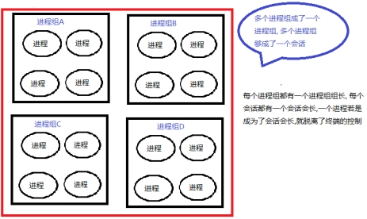
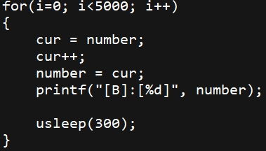
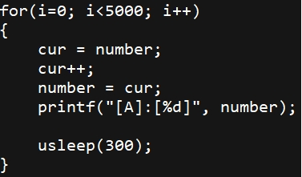
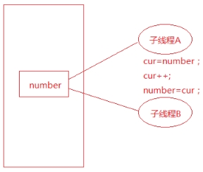
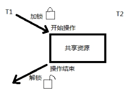
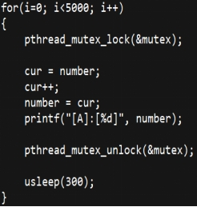
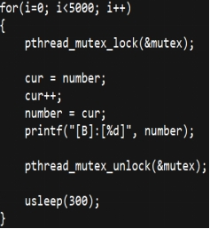

# ***\*08-守护进程和线程\****

## ***\*学习目标\****

] 说出守护进程的特点

] 独立完成守护进程的创建

] 独立实现多个线程的创建

] 独立实现线程的退出和资源回收

] 理解线程同步的思想

## ***\*1 守护进程\****

### ***\*1.1 守护进程介绍\****

Daemon(精灵)进程，是Linux中的后台服务进程，通常独立于控制终端并且周期性地执行某种任务或等待处理某些发生的事件。一般采用以d结尾的名字，如vsftpd

Linux后台的一些系统服务进程，没有控制终端，不能直接和用户交互。不受用户登录、注销的影响，一直在运行着，他们都是守护进程。如：预读入缓输出机制的实现；ftp服务器；nfs服务器等。

] 总结守护进程的特点：

Ø Linux后台服务进程

Ø 独立于控制终端

Ø 周期性的执行某种任务

Ø 不受用户登陆和注销的影响

Ø 一般采用以d结尾的名字

### ***\*1.2 进程组和会话\****

] 进程组

Ø 进程组是一个或者多个进程的集合，每个进程都属于一个进程组，引入进程组是为了简化对进程的管理。当父进程创建子进程的时候，默认子进程与父进程属于同一个进程组。

进程组ID==第一个进程ID（组长进程）。如父进程创建了多个子进程，父进程和多个子进程同属于一个组，而由于父进程是进程组里的第一个进程，所以父进程就是这个组的组长, 组长ID==父进程ID。

Ø 可以使用kill -SIGKILL -进程组ID(负的)来将整个进程组内的进程全部杀死。

Ø 只要进程组中有一个进程存在，进程组就存在，与组长进程是否终止无关。

Ø 进程组生存期：从进程组创建到最后一个进程离开

] 会话

Ø 一个会话是一个或多个进程组的集合。

Ø 创建会话的进程不能是进程组组长

Ø 创建会话的进程成为一个进程组的组长进程，同时也成为会话的会长。

Ø 需要有root权限（ubuntu不需要）

Ø 新创建的会话丢弃原有的控制终端

Ø 建立新会话时，先调用fork, 父进程终止，子进程调用setsid函数

] 可以使用ps ajx来查看进程组ID和会话ID

Ø 可以fork出几个子进程，然后查看进程组ID和会话ID

] 进程组和会话的关系图

 

### ***\*1.3 创建守护进程的模型\****

第1步：fork子进程，父进程退出

Ø 子进程继承了父进程的进程组ID, 但具有一个新的进程ID,这样就保证了子进程不是一个进程组的组长ID,这对于下面要做的setsid函数的调用是必要的前提条件

第2步：子进程调用setsid函数创建新会话

Ø 调用这个函数以后

² 该进程成为新会话的首进程，是会话的会长

² 成为一个新进程组的组长进程，是进程组组长

² 不受控制终端的影响

第3步：改变当前工作目录chdir

Ø 如：a.out在U盘上，启动这个程序，这个程序的当前的工作目录就是这个u盘，如果u盘拔掉后进程的当前工作目录将消失，a.out将不能正常工作。

第4步：重设文件掩码  mode & ~umask

Ø 子进程会继承父进程的掩码

Ø 增加子进程程序操作的灵活性

Ø umask(0000);

第5步：关闭文件描述符

Ø 守护进程不受控制终端的影响所以可以关闭，以释放资源 

Ø close(STDIN_FILENO);

close(STDOUT_FILENO);

close(STDERR_FILENO);

第6步：执行核心工作

Ø 守护进程的核心代码逻辑

### ***\*1.4\**** ***\*练习\****

 编写一个守护进程，每隔2S钟获取一次系统时间，并将这个时间写入磁盘文件。

分析：首先要按照1.3介绍的守护进行的步骤创建一个守护进程

题目要求每隔2S钟，所以需要一个定时器，2S钟触发一次，需要调用setitimer函数创建一个定时器，并且要捕获SIGALRM信号，然后在SIGALRM信号处理函数里面完成获取系统时间，然后将时间写入文件。

用到的主要知识点：

Ø 创建守护进程的模型

Ø setitimer函数的使用

Ø sigaction函数

Ø 文件I/O操作

Ø 获取系统时间函数time，将time_t类型转换为字符串ctime函数

## **2** ***\*线程\****

***\*2\*******\*.1 什么是线程\****

Ø 轻量级的进程（LWP：light weight process），在Linux环境下线程的本质仍是进程。

Ø 进程：拥有独立的地址空间，拥有PCB，相当于独居。

Ø 线程：有PCB，但没有独立的地址空间，多个线程共享进程空间，相当于合租。

 

] 在Linux操作系统下： 

Ø 线程：最小的执行单位

Ø 进程：最小分配资源单位，可看成是只有一个线程的进程。

] 线程的特点

Ø 类Unix系统中，早期是没有“线程”概念的，80年代才引入，借助进程机制实现出了线程的概念。因此在这类系统中，进程和线程关系密切。

Ø 线程是轻量级进程(light-weight process)，也有PCB，创建线程使用的底层函数和进程一样，都是clone

Ø 从内核里看进程和线程是一样的，都有各自不同的PCB.

Ø 进程可以蜕变成线程

Ø 在linux下，线程最是小的执行单位；进程是最小的分配资源单位

 

Ø 察看指定线程的LWP号：ps –Lf pid

实际上，无论是创建进程的fork，还是创建线程的pthread_create，底层实现都是调用同一个内核函数 clone。

Ø 如果复制对方的地址空间，那么就产出一个“进程”；

Ø 如果共享对方的地址空间，就产生一个“线程”。

so：**Linux内核是不区分进程和线程的, 只在用户层面上进行区分**。

所以，线程所有操作函数 pthread_* 是库函数，而非系统调用。

***\*2.2\**** ***\*线程共享资源\****

Ø 文件描述符表

Ø 每种信号的处理方式

Ø 当前工作目录

Ø 用户ID和组ID

Ø 内存地址空间 (.text/.data/.bss/heap/共享库) 

***\*2.3\**** ***\*线程非共享资源\****

Ø 线程id

Ø 处理器现场和栈指针(内核栈)

Ø 独立的栈空间(用户空间栈)

Ø errno变量

Ø 信号屏蔽字

Ø 调度优先级

***\*2.4\**** ***\*线程优、缺点\****

] 优点： 

Ø 提高程序并发性 

Ø 开销小 

Ø 数据通信、共享数据方便

] 缺点： 

Ø 库函数，不稳定 

Ø gdb调试、编写困难 

Ø 对信号支持不好

优点相对突出，缺点均不是硬伤。Linux下由于实现方法导致进程、线程差别不是很大。

***\*2.5\**** ***\*pthread_create\*******\*函数\****

] 函数作用：

Ø 创建一个新线程

] 函数原型

Ø int pthread_create(pthread_t *thread, 

const pthread_attr_t *attr,

​        void *(*start_routine) (void *),

 void *arg);

] 返回值

Ø 成功，返回0

Ø 失败，返回错误号

] 函数参数：

Ø pthread_t：传出参数，保存系统为我们分配好的线程ID

² 当前Linux中可理解为：typedef unsigned long int pthread_t。

Ø attr：通常传NULL，表示使用线程默认属性。若想使用具体属性也可以修改该参数。

Ø start_routine：函数指针，指向线程主函数(线程体)，该函数运行结束，则线程结束。

Ø arg：线程主函数执行期间所使用的参数。

] 注意点

Ø 由于pthread_create的错误码不保存在errno中，因此不能直接用perror()打印错误信息，可以先用strerror()把错误码转换成错误信息再打印。

Ø 如果任意一个线程调用了exit或_exit，则整个进程的所有线程都终止，由于从main函数return也相当于调用exit，为了防止新创建的线程还没有得到执行就终止，我们在main函数return之前延时1秒，这只是一种权宜之计，即使主线程等待1秒，内核也不一定会调度新创建的线程执行，下一节我们会看到更好的办法。

] 练习题：

1 编写程序创建一个线程。

2 编写程序创建一个线程，并给线程传递一个int参数

3 编写程序创建一个线程，并给线程传递一个结构体参数。

4 编写程序，主线程循环创建5个子线程，并让子线程判断自己是第几个子线程。

练习4分析：最后每个子线程打印出来的值并不是想象中的值，比如都是5，分析其原因：

在创建子线程的时候使用循环因子作为参数传递给子线程，这样主线程和多个子线程就会共享变量i（变量i在main函数中定义，在整个进程都一直有效）所以在子线程看来变量i是合法的栈内存空间。

那么为什么最后每个子线程打印出来的值都是5呢?

是由于主线程可能会在一个cpu时间片内连续创建了5个子线程，此时变量i的值变成了5，当主线程失去cpu的时间片后，子线程得到cpu的时间片，子线程访问的是变量i的内存空间的值，所以打印出来值为5.

 

主线程和子线程共享同一块内存空间

 

主线程和子线程分时使用cpu资源

解决办法：不能使多个子线程都共享同一块内存空间，应该使每个子线程访问不同的内存空间，可以在主线程定义一个数组：int arr[5];，然后创建线程的时候分别传递不同的数组元素，这样每个子线程访问的就是互不相同的内存空间，这样就可以打印正确的值。

如下图：

 

多个子线程各自访问不同的内存空间

] 根据测试程序还可以得出结论：

Ø 如果主线程早于子线程退出，则子线程可能得不到执行，因为主线程退出，整个进程空间都会被回收，子线程没有了生存空间，所以也就得不到执行。

Ø 线程之间（包含主线程和子线程）可以共享同一变量，包含全局变量或者非全局变量（但是非全局变量必须在其有效的生存期内）

***\*2.6\**** ***\*pthread_exit函数\****

在线程中禁止调用exit函数，否则会导致整个进程退出，取而代之的是调用pthread_exit函数，这个函数是使一个线程退出，如果主线程调用pthread_exit函数也不会使整个进程退出，不影响其他线程的执行。

 

] 函数描述

Ø 将单个线程退出

] 函数原型

Ø void pthread_exit(void *retval); 

] 函数参数

Ø retval表示线程退出状态，通常传NULL

另注意，pthread_exit或者return返回的指针所指向的内存单元必须是全局的或者是用malloc分配的，不能在线程函数的栈上分配，因为当其它线程得到这个返回指针时线程函数已经退出了，栈空间就会被回收。

练习：编写程序测试pthread_exit函数使一个线程退出。

通过程序测试得知，pthread_exit函数只是使一个线程退出，假如子线程里面调用了exit函数，会使整个进程终止；如果主线程调用了pthread_exit函数，并不影响子线程，只是使主线程自己退出。

***\*2.7 pthread_join函数\****

] 函数描述：阻塞等待线程退出，获取线程退出状态。其作用，对应进程中的waitpid() 函数。

] 函数原型：int pthread_join(pthread_t thread, void **retval); 

] 函数返回值：

Ø 成功：0；

Ø 失败：错误号

] 函数参数： 

Ø thread：线程ID

Ø retval：存储线程结束状态，整个指针和pthread_exit的参数是同一块内存地址。

练习：编写程序，使主线程获取子线程的退出状态。

一般先定义void *ptr; 然后pthread_join(threadid, &ptr);

***\*2.8 pthread_\*******\*detach\*******\*函数\****

线程分离状态：指定该状态，线程主动与主控线程断开关系。线程结束后，其退出状态不由其他线程获取，而直接自己自动释放。网络、多线程服务器常用。

进程若有该机制，将不会产生僵尸进程。僵尸进程的产生主要由于进程死后，大部分资源被释放，一点残留资源仍存于系统中，导致内核认为该进程仍存在。

也可使用 pthread_create函数参2(线程属性)来设置线程分离。pthread_detach函数是在创建线程之后调用的。

] 函数描述

Ø 实现线程分离

] 函数原型

Ø int pthread_detach(pthread_t thread); 

] 函数返回值

Ø 成功：0；

Ø 失败：错误号

一般情况下，线程终止后，其终止状态一直保留到其它线程调用pthread_join获取它的状态为止。但是线程也可以被置为detach状态，**这**样的线程一旦终止就立刻回收它占用的所有资源，而不保留终止状态。不能对一个已经处于detach状态的线程调用pthread_join，这样的调用将返回EINVAL错误。也就是说，如果已经对一个线程调用了pthread_detach就不能再调用pthread_join了。

练习：编写程序，在创建线程之后设置线程的分离状态。

说明：如果线程已经设置了分离状态，则再调用pthread_join就会失败，可用这个方法验证是否已成功设置分离状态。

***\*2.9 pthread_cancel函数\****

] 函数描述

Ø 杀死(取消)线程。其作用，对应进程中 kill() 函数。

] 函数原型

Ø int pthread_cancel(pthread_t thread); 

] 函数返回值

Ø 成功：0；

Ø 失败：错误号

【注意】：线程的取消并不是实时的，而有一定的延时。需要等待线程到达某个取消点(检查点)。

类似于玩游戏存档，必须到达指定的场所(存档点，如：客栈、仓库、城里等)才能存储进度。杀死线程也不是立刻就能完成，必须要到达取消点。

取消点：是线程检查是否被取消，并按请求进行动作的一个位置。通常是一些系统调用creat，open，pause，close，read，write..... 执行命令man 7 pthreads可以查看具备这些取消点的系统调用列表。可粗略认为一个系统调用(进入内核)即为一个取消点。还以通过调用pthread_testcancel函数设置一个取消点。

Ø 函数原型：void pthread_testcancel(void);

练习：编写程序，让主线程取消子线程的执行。

先测试一下没有取消点看看能否使线程取消；然后调用pthread_testcancel设置一个取消点，看看能够使线程取消。

***\*2.10 pthread_equal函数\****

] 函数描述：

Ø 比较两个线程ID是否相等。

] 函数原型

Ø int pthread_equal(pthread_t t1, pthread_t t2);

注意：这个函数是为了以能够扩展使用的， 有可能Linux在未来线程ID pthread_t 类型被修改为结构体实现。

***\*2.11 进程函数和线程函数比较\****

| ***\*进程\****         | ***\*线程\**** |
| ---------------------- | -------------- |
| ***\*fork\****         | pthread_create |
| ***\*exit\****         | pthread_exit   |
| ***\*wait/waitpid\**** | pthread_join   |
| ***\*kill\****         | pthread_cancel |
| ***\*getpid\****       | pthread_self   |

## **3** ***\*线程属性\****

linux下线程的属性是可以根据实际项目需要，进行设置，之前讨论的线程都是采用线程的默认属性，默认属性已经可以解决绝大多数开发时遇到的问题，如果对程序的性能提出更高的要求，则需要设置线程属性，本节以设置线程的分离属性为例讲解设置线程属性。

] 线程的分离状态决定一个线程以什么样的方式来终止自己，有两种状态：

Ø 非分离状态：线程的默认属性是非分离状态，这种情况下，原有的线程等待创建的线程结束。只有当pthread_join()函数返回时，创建的线程才算终止，才能释放自己占用的系统资源。

Ø 分离状态：分离线程没有被其他的线程所等待，自己运行结束了，线程也就终止了，马上释放系统资源。应该根据自己的需要，选择适当的分离状态。

] 设置线程属性分为以下步骤

第1步：定义线程属性类型类型的变量

Ø pthread_attr_t  attr; 

第2步：对线程属性变量进行初始化

Ø int pthread_attr_init (pthread_attr_t* attr);

第3步：设置线程为分离属性

Ø int pthread_attr_setdetachstate(

pthread_attr_t *attr, 

int detachstate);

² 参数:

u attr: 线程属性

u detachstate:

l PTHREAD_CREATE_DETACHED(分离)

l PTHREAD_CREATE_JOINABLE（非分离)

  注意：这一步完成之后调用pthread_create函数创建线程，

​    则创建出来的线程就是分离线程；其实上述三步就是

​    pthread_create的第二个参数做准备工作。

第4步：释放线程属性资源

Ø int pthread_attr_destroy(pthread_attr_t *attr);

参数：线程属性

 

练习：编写程序，创建一个分离属性的线程。

验证：设置为分离属性的线程是不能够被pthread_join函数回收的，

可以通过调用pthread_join函数测试该线程是否已经是分离属性的线程。

## **4** ***\*线程同步\****

***\*4.1 线程同步的概念\****

线程同步，指一个线程发出某一功能调用时，在没有得到结果之前，该调用不返回。同时其它线程为保证数据一致性，不能调用该功能。

***\*4.2 线程同步的例子\****

创建两个线程，让两个线程共享一个全局变量int number， 然后让每个线程数5000次数，看最后打印出这个number值是多少？

 

线程A代码片段：

 

线程B代码片段：

 

] 代码片段说明

Ø 代码中使用调用usleep是为了让两个子线程能够轮流使用CPU，避免一个子线程在一个时间片内完成5000次数数。

Ø 对number执行++操作，使用了中间变量cur是为了尽可能的模拟cpu时间片用完而让出cpu的情况。

] 测试结果

Ø 经过多次测试最后的结果显示，有可能会出现number值少于5000*2=10000的情况。

] 分析原因

Ø 假如子线程A执行完了cur++操作，还没有将cur的值赋值给number失去了cpu的执行权，子线程B得到了cpu执行权，而子线程B最后执行完了number=cur，而后失去了cpu的执行权；此时子线程A又重新得到cpu的执行权，并执行number=cur操作，这样会把线程B刚刚写回number的值被覆盖了，造成number值不符合预期的值。

 

 

] 数据混乱的原因

Ø 资源共享（独享资源则不会） 

Ø 调度随机（线程操作共享资源的先后顺序不确定） 

Ø 线程间缺乏必要的同步机制。

以上3点中，前两点不能改变，欲提高效率，传递数据，资源必须共享。只要共享资源，就一定会出现竞争。只要存在竞争关系，数据就很容易出现混乱。所以只能从第三点着手解决。使多个线程在访问共享资源的时候，出现互斥。

] 如何解决问题

Ø 原子操作的概念

原子操作指的是该操作要么不做，要么就完成。

Ø 使用互斥锁解决同步问题

使用互斥锁其实是模拟原子操作，互斥锁示意图：

Linux中提供一把互斥锁mutex（也称之为互斥量）。每个线程在对资源操作前都尝试先加锁，成功加锁才能操作，操作结束解锁。

资源还是共享的，线程间也还是竞争的，但通过“锁”就将资源的访问变成互斥操作，而后与时间有关的错误也不会再产生了。

 

线程1访问共享资源的时候要先判断锁是否锁着，如果锁着就阻塞等待；若锁是解开的就将这把锁加锁，此时可以访问共享资源，访问完成后释放锁，这样其他线程就有机会获得锁。

应该注意：图中同一时刻，只能有一个线程持有该锁，只要该线程未完成操作就不释放锁。

 使用互斥锁之后，两个线程由并行操作变成了串行操作，效率降低了，但是数据不一致的问题得到解决了。

***\*4.3\**** ***\*互斥锁主要相关函数\****

] pthread_mutex_t 类型

Ø 其本质是一个结构体，为简化理解，应用时可忽略其实现细节，简单当成整数看待。

Ø pthread_mutex_t mutex; 变量mutex只有两种取值1、0。

] pthread_mutex_init函数

Ø 函数描述：

² 初始化一个互斥锁(互斥量) ---> 初值可看作1

Ø 函数原型：

² int pthread_mutex_init(pthread_mutex_t *restrict mutex, 

​          const pthread_mutexattr_t *restrict attr);

Ø 函数参数

² mutex：传出参数，调用时应传 &mutex 

² attr：互斥锁属性。是一个传入参数，通常传NULL，选用默认属性(线程间共享)。

**restrict关键字**：只用于限制指针，告诉编译器，所有修改该指针指向内存中内容的操作，只能通过本指针完成。不能通过除本指针以外的其他变量或指针修改互斥量mutex的两种初始化方式：

u **静态初始化：**如果互斥锁 mutex 是静态分配的（定义在全局，或加了static关键字修饰），可以直接使用宏进行初始化。

pthead_mutex_t **muetx** = **PTHREAD_MUTEX_INITIALIZER**;

u **动态初始化：**局部变量应采用动态初始化。

**pthread_mutex_init**(&mutex, NULL)

] pthread_mutex_destroy函数

Ø 函数描述

² 销毁一个互斥锁

Ø 函数原型

² int pthread_mutex_destroy(pthread_mutex_t *mutex);

Ø 函数参数

² mutex—互斥锁变量

] pthread_mutex_lock函数

Ø 函数描述

² 对互斥所加锁，可理解为将mutex--

Ø 函数原型

int pthread_mutex_lock(pthread_mutex_t *mutex);

Ø 函数参数

² mutex—互斥锁变量

] pthread_mutex_unlock函数

Ø 函数描述

² 对互斥所解锁，可理解为将mutex ++

Ø 函数原型

² int pthread_mutex_unlock(pthread_mutex_t *mutex);

] pthread_mutex_trylock函数

Ø 函数描述

² 尝试加锁

Ø 函数原型

² int pthread_mutex_trylock(pthread_mutex_t *mutex);

Ø 函数参数

² mutex—互斥锁变量

***\*4.4 加锁和解锁\****

] lock尝试加锁，如果加锁不成功，线程阻塞，阻塞到持有该互斥量的其他线程解锁为止。

] unlock主动解锁函数，同时将阻塞在该锁上的所有线程全部唤醒，至于哪个线程先被唤醒，取决于优先级、调度。默认：先阻塞、先唤醒。

练习：使用互斥锁解决两个线程数数不一致的问题。

代码片段：在访问共享资源前加锁，访问结束后立即解锁。锁的“粒度”应越小越好。

 

总结：使用互斥锁之后，两个线程由并行变为了串行，效率降低了，但是可以使两个线程同步操作共享资源，从而解决了数据不一致的问题。