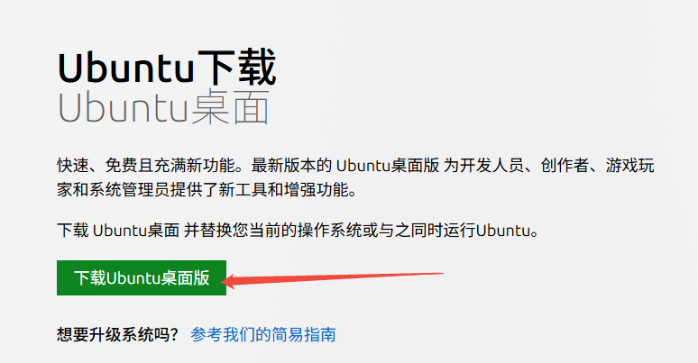
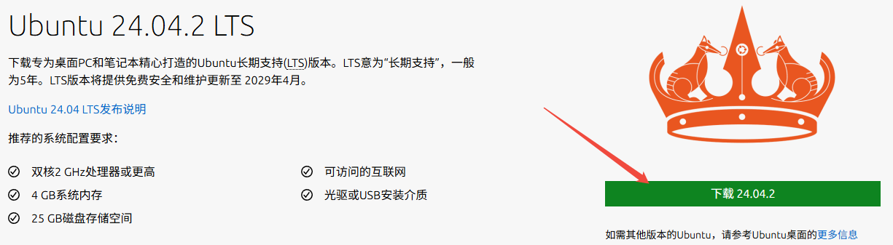
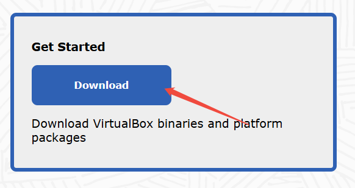
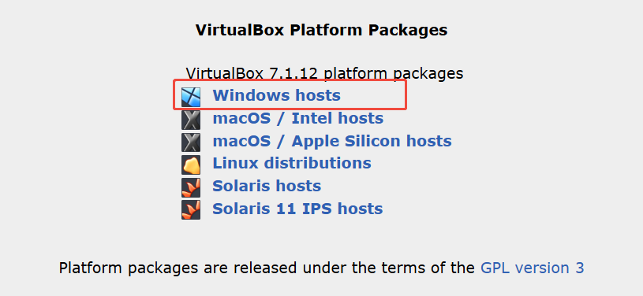

## Ubuntu

### 下载

进入[Ubuntu系统下载](https://cn.ubuntu.com/download)。

进入新页面之后，稍微往下拉一下，点击下载！

大概有6GB，下载会比较慢~

## Virtual Box

Oracle 的 Virtualbox 是一款强大的虚拟化软件，允许用户在一台物理计算机上运行多个操作系统。

进入[Oracle VirtualBox](https://www.virtualbox.org/)下载。

选择Windows hosts,下载！

下载下来之后，双击安装即可！

