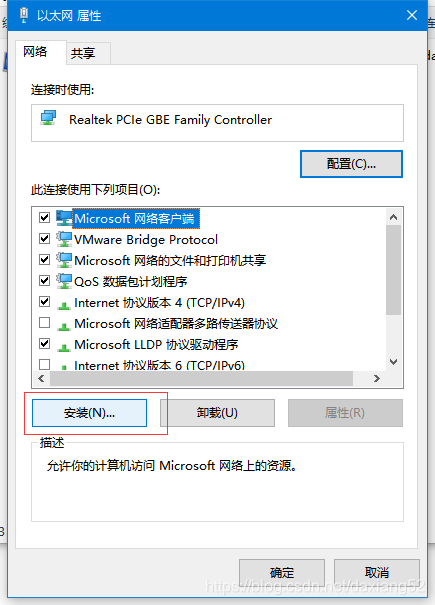

# VirtualBox

## virtualbox 虚拟机启动报错“物理网卡未找到”

##### 现象

virtualbox 启动虚拟机出现如下错误：

未能启动虚拟电脑 ，由于下述物理网卡未找到:

**Realtek PCIe GBE Family Controller (adapter 2), Realtek PCIe GBE Family Controller (adapter 3)**。

你可修改虚拟电脑的网络设置或停用之。

##### 原因

是因为某种原因导致virtualbox 虚拟网卡驱动损坏

##### 解决办法

重新安装虚拟网卡驱动，如下图所示，修改网络适配器–>属性：

> 选择到`D:\Program Files\Oracle\VirtualBox\drivers\network\netlwf\VBoxNetLwf.inf` 文件，在你的VirtualBox安装目录下。

然后一直确定就行了，重启VirtualBox问题已解决。

