# VMware虚拟机

**操作系统：**Win10

**VMware版本：**VMware Workstation 15 Pro

**所有系统镜像：**[ISO](https://pan.baidu.com/s/1o85AZONpr9uMbloNJOQTqA?pwd=gd0z )

## VMware 安装MAC OS

在新建虚拟机时并没有显示Mac 操作系统，此时需要进行解锁，以增加对Mac OS的支持！

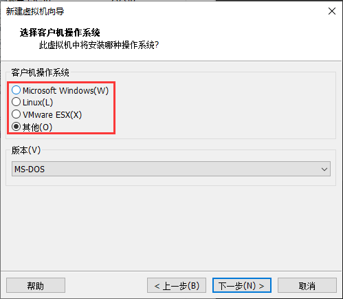

### 解锁

+ 如果虚拟机已打开，则先关闭！然后下载解锁器[unlocker -提取码gd0z ](https://pan.baidu.com/s/1o85AZONpr9uMbloNJOQTqA)

+ 下载之后解压，并进入如下目录`unlocker420\windows`

  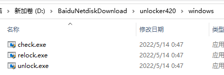

+ 运行`unlock.exe`进行解锁，解锁之后打开虚拟机，新建虚拟机，发现已经有了Mac操作系统！

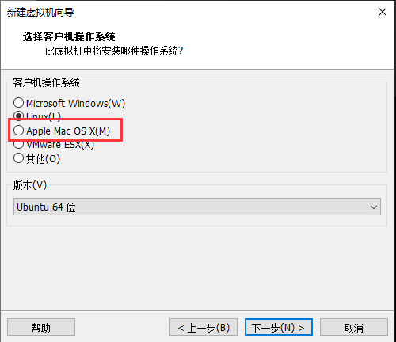

### 新建虚拟机

1. 选择菜单-文件->新建虚拟机

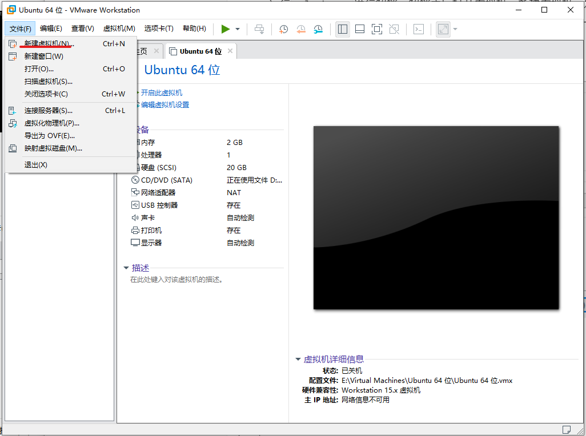

2. 其他步骤不在赘述

### 安装Mac Os

虚拟机创建完成后，点击开启虚拟机，进入安装！

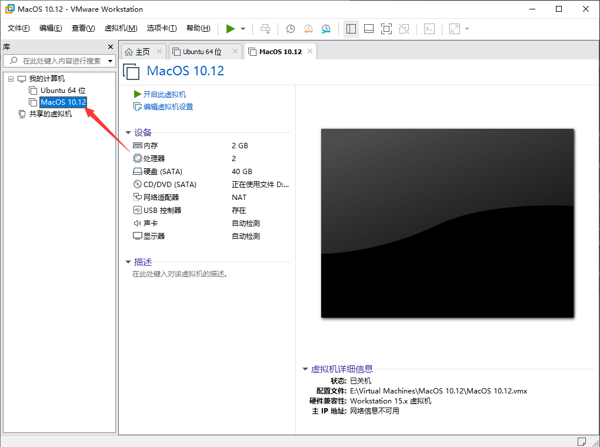

进入安装界面，等待加载完成即可！

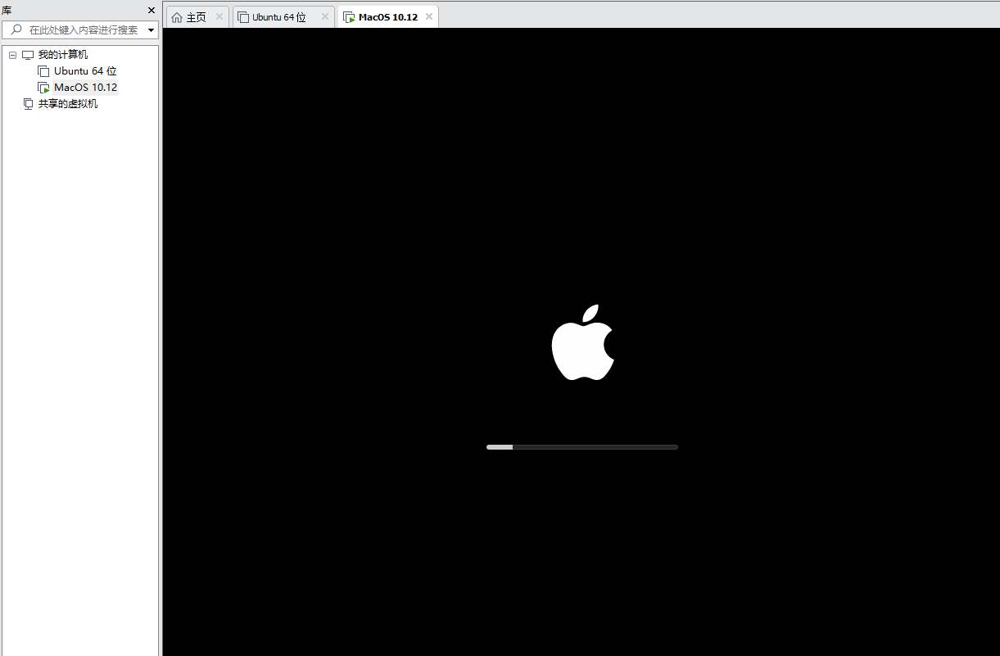

加载完成之后，进入语言选择界面！

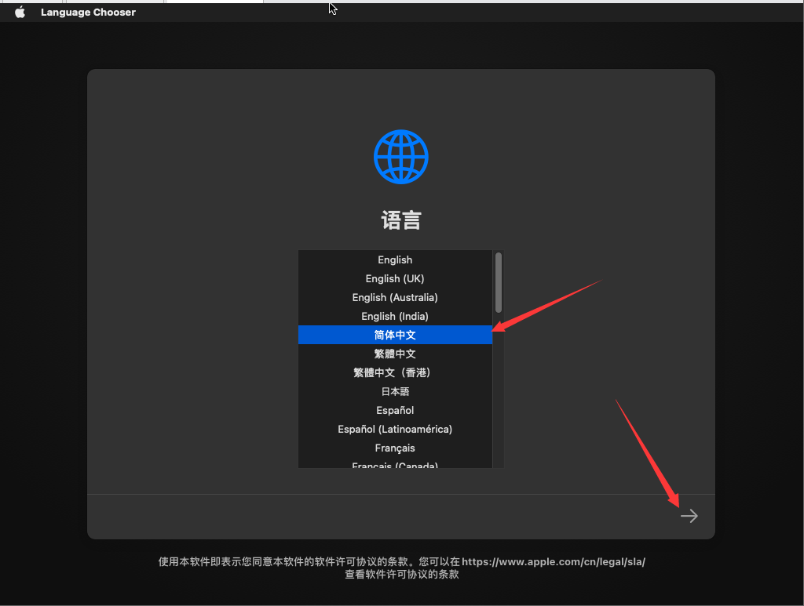

接下来，可以选择恢复、安装、磁盘管理等功能。

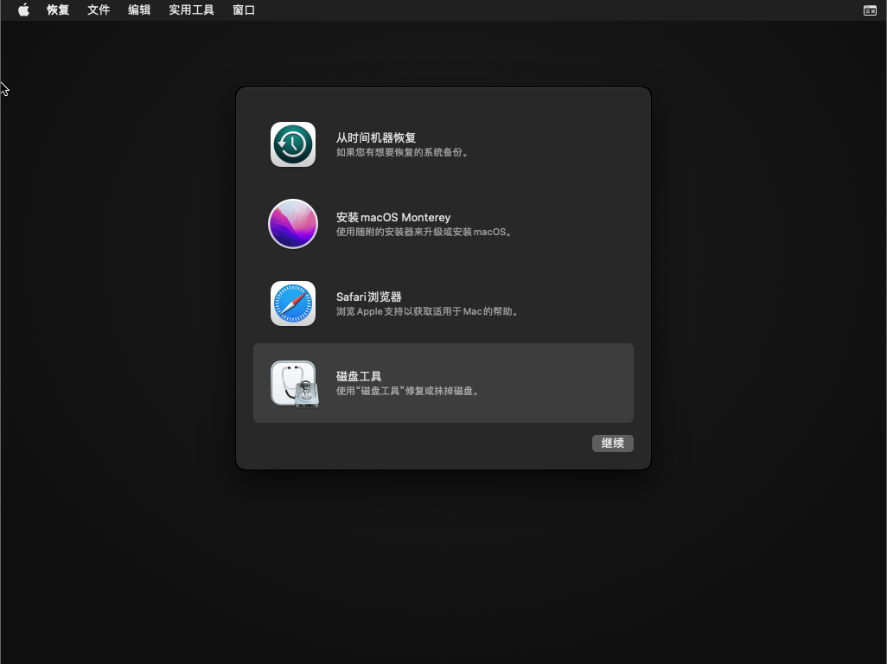

首先，必须先进入`磁盘工具`把磁盘进行初始化。

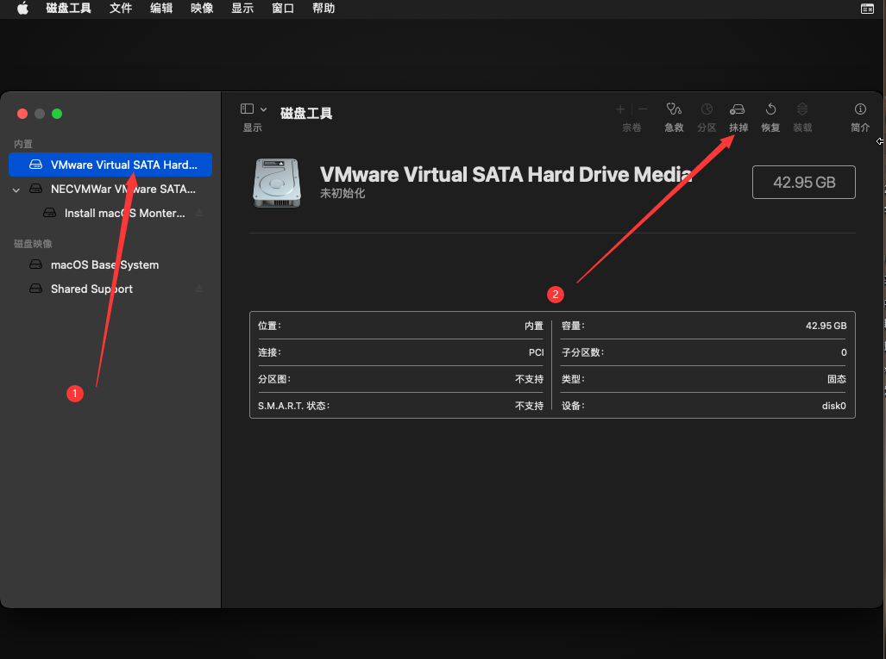

可以填写磁盘名称

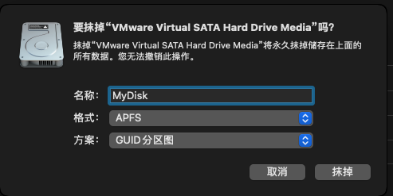

菜单-退出磁盘管理

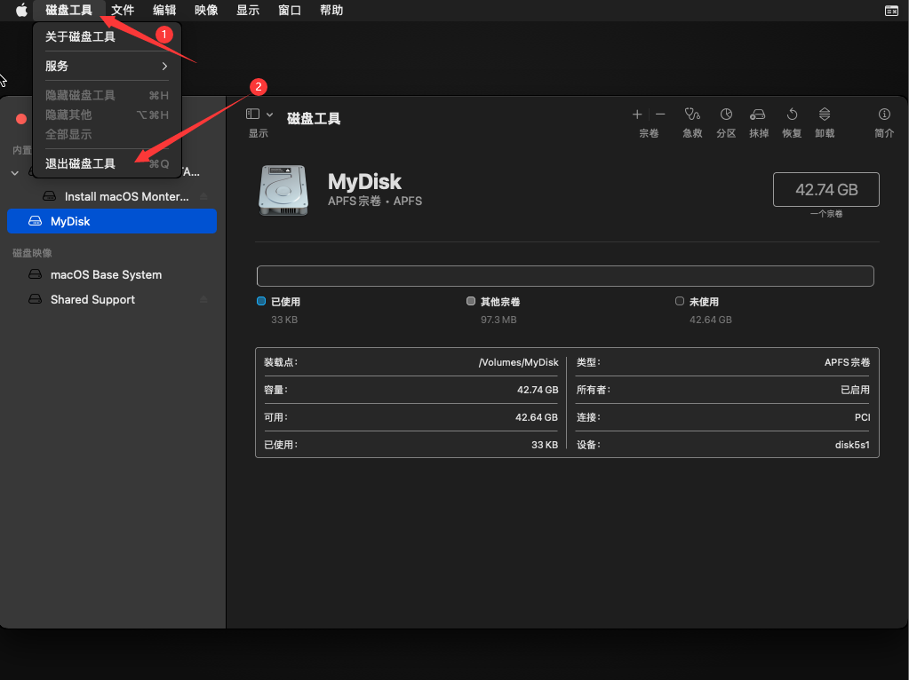

接下来，选择安装系统

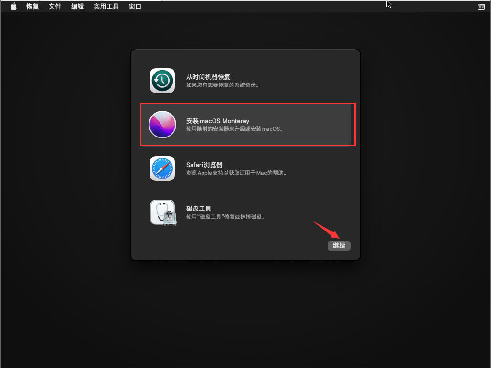

继续即可！

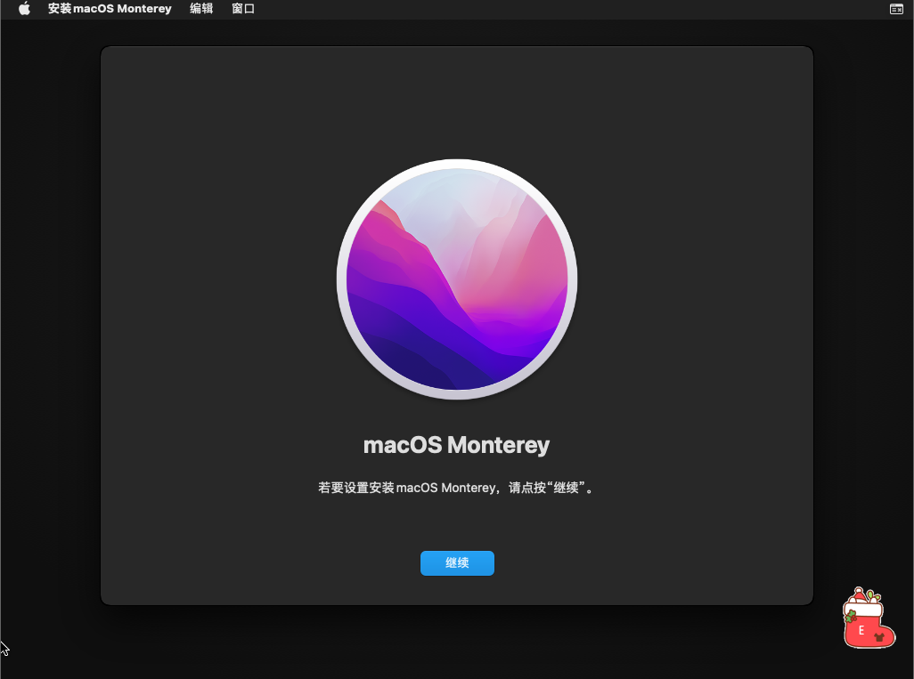

同意协议

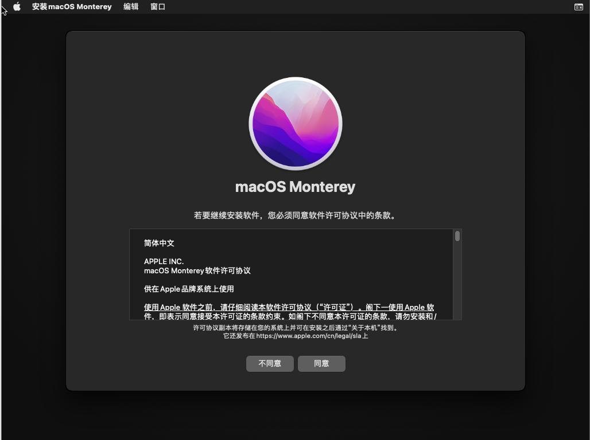

选择磁盘(如果没有磁盘，请先初始化磁盘)

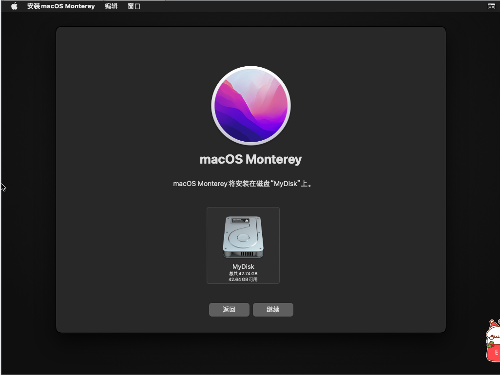

点击继续，进入安装界面，等待十几分钟即可！(电脑配置不同，速度不同)

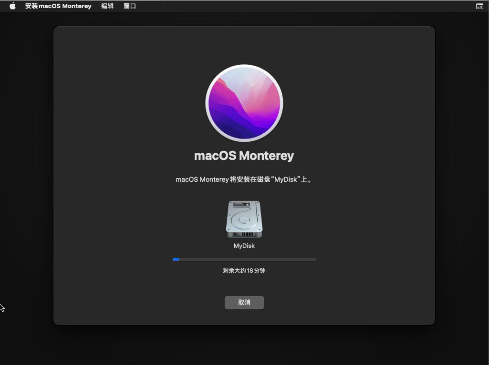