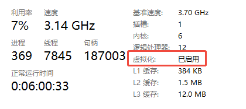
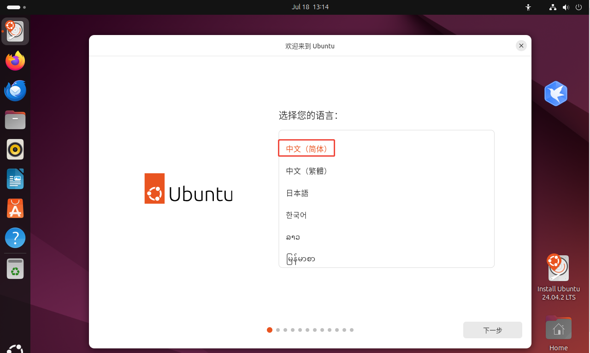
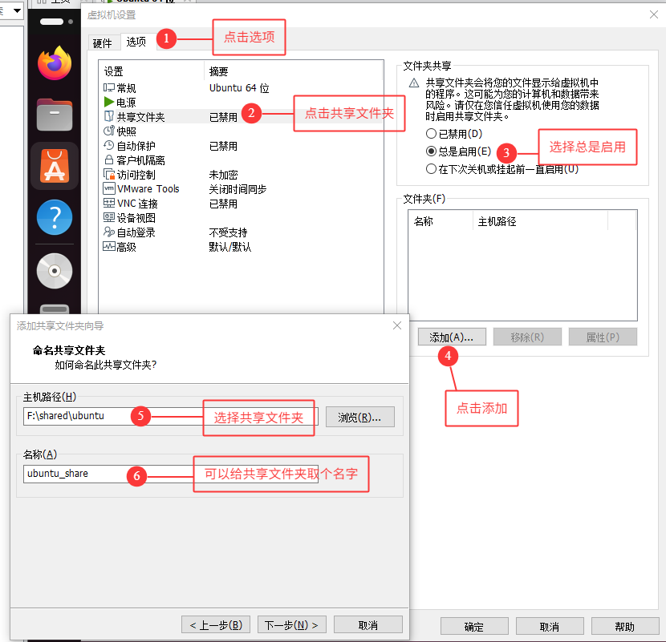

## vmware下载与安装

进入官网[VMware by Broadcom - Cloud Computing for the Enterprise](https://www.vmware.com/)，然后点击右上角登录，没有账号，点击去注册即可！


### 注册登录账号

登录注册界面长这样，快捷入口[Home - Support Portal - Broadcom support portal](https://support.broadcom.com/)。


点击Register，进入页面后，输入邮箱进行注册！


输入完邮箱，填写完验证码，点击下一步，然后需要填写邮箱中的验证码，点击校验，校验成功，进入信息填写页面！


+ 姓名可以随便写，建议自己的姓名拼音，好记忆！
+ 国家选择China
+ 工作可以不写
+ 密码必须包含大写、小写字母、数字和特殊字符，且长度不能小于8位！

成功之后，再次进入登录页面，登录即可！

### 下载vmware

因为是免费软件，所以下载链接隐藏的比较深！！！所以直接点击链接进入吧！[Fusion and Workstation | VMware](https://www.vmware.com/products/desktop-hypervisor/workstation-and-fusion)。

> 可以在首页搜索 Desktop Hypervisor 然后慢慢找！！！


进来之后并不能直接下载，还得再点击一下！如下图所示！


进来之后，往下拉页面，找到如下图所示：


然后在选择你对应的系统的安装包：


点击之后可以选择vmware版本，我这里选择17.6.4版本。


点进来之后，还要查看一下**条款和协议**，然后打上勾！


然后点击下载，还需要进行下载前验证，无语！！！点击yes吧


需要填写地址、城市、国家、邮编，然后点击右下角Submit。


然后又会跳到另外一个下载页面，好了不要怕，没有后续操作了，直接点击下载按钮！


历经千幸万苦终于下载下来了！


### 安装vmware

首先，CPU的虚拟化一定要启用，可进入任务管理器进行查看！(如果没有开启需要进入BIOS进行设置，具体设置看电脑品牌QAQ)



当确定虚拟化已经启用后，就双击vmware安装包进行安装！

基本上是傻瓜式安装，下一步，直到出现安装位置选择界面：选择合适的位置，路径中不要有中文！！！


点击下一步会有一个警告弹出窗，直接点确定就行！

然后一直下一步，等待安装完成即可！


## 安装Ubuntu系统

### 创建新的虚拟机

首先要创建一个系统，打开vmware软件，点击创建新的虚拟机！


选择自定义。


点击下一步。


点击稍后安装操作系统。


按如下图所示，选择ubuntu 64位 linux！


选择虚拟机存放位置：


处理器配置，默认即可！


然后一直下一步，直到选择磁盘容量。开大一点，不要小气！我这里选择100G！输入之后点击下一步！


然后再一直下一步，直到完成！能到主界面看到刚创建的Ubuntu虚拟机即可！


### 安装Ubuntu系统

点击，编辑虚拟机设置！


选择CD/DVD，然后选择使用ISO映像文件，然后选择你下载的Ubutnu系统，最后点击保存！


然后再点击开启此虚拟机！


默认第一个，直接回车即可！


然后选择语言为中文(简体)。



然后一直下一步，直到来到连接到互联网界面，选择我现在**不想连接到互联网**


更新可用，直接跳过


安装类型，直接下一步


应用程序和更新，直接下一步


然后一直下一步，直到来到设置你的账户(用户名不要用中文，密码随便，一定要自己记住！)


然后一直下一步，最后点安装，等待安装完成(大约需要一刻钟)即可！


安装完成，点击重启即可！


### 移除安装媒体

重启时，会提示让你**移除安装媒体，然后按回车键**。


先关机！


然后再进入虚拟机设置，找到CD/DVD,再选择使用物理驱动器！然后点击确定，再次开机即可！


开机时会弹出对话框，点击否即可！


### 安装vmware tools

> 其实如果不使用ubuntu图形界面，不装也行！

安装 VMware Tools 是创建新的虚拟机过程的一部分，而升级 VMware Tools 是使虚拟机符合最新标准过程的一部分。尽管客户机操作系统在未安装 VMware Tools 的情况下仍可运行，但许多 VMware 功能只有在安装 VMware Tools 后才可用。安装 VMware Tools 以后，套件中的实用程序会提高虚拟机中客户机操作系统的性能和改善虚拟机管理。

+ 最大的好处是可以直接把windows界面的文件拖进linux虚拟机内。
+ 鼠标可以直接从虚拟机移动到windows等等好处。

+ 系统界面可以跟随虚拟机窗口大小进行缩放。

打开终端，然后按照一下步骤进行操作！

1. 先更新软件源

```shell
sudo apt update
```

2. 移除旧的vmware tools

```shell
sudo apt autoremove open-vm-tools
```

3. 安装vmware tools

```shell
sudo apt install open-vm-tools-desktop
```

4. 安装完成后，重启系统！

```shell
sudo reboot  #可以执行此命令来重启
```

### 共享文件夹

如何在Windows主机和Ubuntu虚拟机之间建立共享文件夹，实现数据备份和传输。

1. 进入虚拟机设置，点击选项，如下图所示步骤操作！



2. 设置好文件夹，点击下一步，然后在虚拟机设置界面点击确定！然后就可以在ubuntu的`/mnt/hgfs`目录中看到共享目录了！


3. 你可以在目录中放一个文件进行，测试！如下，可以看到两边同时都有这个test.txt文件了


### 调整用户目录语言

调整 Linux 系统的语言环境和用户目录（如 “文档”“下载” 等）的命名语言，中文很难敲，所以需要改成英文！

在Linux终端中输入如下命令：

```shell
export LANG=en_US
xdg-user-dirs-gtk-update
```

+ `export LANG=en_US`：临时设置当前终端的语言环境为英文（`en_US` 表示美国英语）。
  + `LANG` 是 Linux 系统中控制语言、编码的环境变量，影响终端输出、软件界面语言等。
  + 该命令仅对当前终端会话有效，关闭终端后失效。若需永久生效，需写入配置文件（如 `~/.bashrc` 或 `~/.profile`）。
+ `xdg-user-dirs-gtk-update`：新用户目录（如 `Documents`、`Downloads` 等）的命名，并同步到图形界面（GTK 环境）
  + Linux 系统默认会在用户主目录（`~/`）下创建多个标准目录（文档、下载、音乐等），其名称会根据系统语言自动适配（如中文环境下为 “文档”“下载”）。
  + 该命令会根据当前 `LANG` 环境变量的设置，重新生成这些目录的名称，并更新配置文件（`~/.config/user-dirs.dirs`）

> 反之，若要将英文目录名改为中文，只需将 `LANG` 设为 `zh_CN.UTF-8` 后执行第二条命令即可。