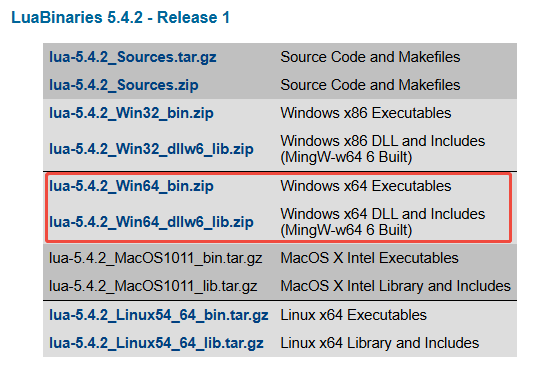
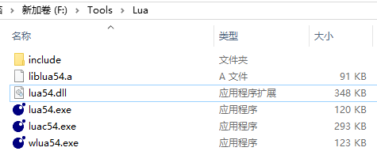
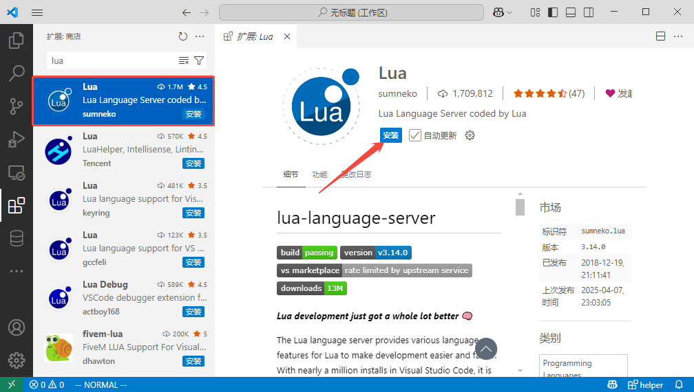
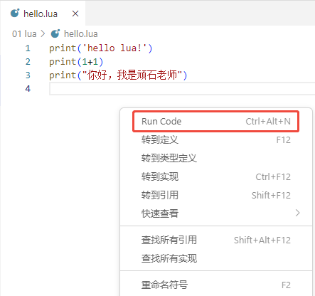
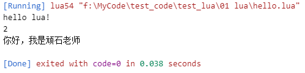

## 什么是 Lua？

​        Lua 是一种轻量小巧的脚本语言，它用标准C语言编写并以源代码形式开放。这意味着什么呢？这意味着Lua虚拟机可以很方便的嵌入别的程序里，从而为应用程序提供灵活的扩展和定制功能。而整个Lua虚拟机编译后仅仅一百余K，经过适当的裁剪还能做到更小，十分适合嵌入式的开发。

## Lua环境安装

### Linux 系统上安装

```c
curl -L -R -O https://www.lua.org/ftp/lua-5.3.6.tar.gz
tar zxf lua-5.3.6.tar.gz
cd lua-5.3.6
make all test
make install
```

### Window 系统上安装

访问[Lua Binaries Download](https://luabinaries.sourceforge.net/download.html)下载，把下图中红框中的两个都下载下来。

+ [lua-5.4.2_Win64_bin.zip](./assets/lua-5.4.2_Win64_bin.zip)是Lua解释器
+ [lua-5.4.2_Win64_dllw6_lib.zip](./assets/lua-5.4.2_Win64_dllw6_lib.zip)是Lua C语言的开发库



下载之后，把两个压缩包的内容放在同一目录中，里面有dll文件重复了，取可执行文件包内的就行了。



**最后，将当前目录配置到环境变量`path`中，`F:\Tools\Lua`！！**

### vs code搭建开发环境

在vs code中安装`lua插件`，请认准作者，不要安装错了！！！这是提供Lua智能提示的插件！



再安装一个一键运行Lua脚本的插件。


这个插件需要配置一下！进入设置，找到Run Code插件，找到Executor Map，点击在settings.json中编辑。


点击之后，会自动添加如下json配置。

```json
"code-runner.executorMap": {
		#....
        "lua": "lua54",
   		#....
    },
```

不用管其他语言，找到"lua"把值改为lua54即可，保存一下！

然后右键要运行的文件就可以，运行啦！



输出结果如下图所示



## 基本语法

### 注释

#### 单行注释

单行注释以两个连字符 `--` 开头，后面跟随的内容将被解释器忽略。

```lua
--
```

单行注释通常用于对代码的简短解释或标记。

#### 多行注释

多行注释以 `--[[` 开始，并以 `]]` 结束，适用于需要对大段代码进行说明的情况。

```lua
--[[
 多行注释
 多行注释
 --]]
```

### 标识符

Lua 标识符用于定义一个变量，函数获取其他用户定义的项。标识符以一个字母 A 到 Z 或 a 到 z 或下划线 **_** 开头后加上 0 个或多个字母，下划线，数字（0 到 9）。

最好不要使用下划线加大写字母的标识符，因为Lua的保留字也是这样的。

Lua 不允许使用特殊字符如 **@**, **$**, 和 **%** 来定义标识符。 Lua 是一个区分大小写的编程语言。因此在 Lua 中 Runoob 与 runoob 是两个不同的标识符。

以下列出了一些正确的标识符：

```
mohd         zara      abc     move_name    a_123
myname50     _temp     j       a23b9        retVal
```

### 关键词

以下列出了 Lua 的保留关键词。保留关键字不能作为常量或变量或其他用户自定义标示符：

| and      | break | do    | else   |
| -------- | ----- | ----- | ------ |
| elseif   | end   | false | for    |
| function | if    | in    | local  |
| nil      | not   | or    | repeat |
| return   | then  | true  | until  |
| while    | goto  |       |        |

一般约定，以下划线开头连接一串大写字母的名字（比如 _VERSION）被保留用于 Lua 内部全局变量。

### 数据类型

Lua 是动态类型语言，变量不要类型定义,只需要为变量赋值。 值可以存储在变量中，作为参数传递或结果返回。

Lua 中有 8 个基本类型分别为：nil、boolean、number、string、userdata、function、thread 和 table。

| 数据类型 | 描述                                                         |
| :------- | :----------------------------------------------------------- |
| nil      | 这个最简单，只有值nil属于该类，表示一个无效值（在条件表达式中相当于false）。 |
| boolean  | 包含两个值：false和true。                                    |
| number   | 表示双精度类型的实浮点数                                     |
| string   | 字符串由一对双引号或单引号来表示                             |
| function | 由 C 或 Lua 编写的函数                                       |
| userdata | 表示任意存储在变量中的C数据结构                              |
| thread   | 表示执行的独立线路，用于执行协同程序                         |
| table    | Lua 中的表（table）其实是一个"关联数组"（associative arrays），数组的索引可以是数字、字符串或表类型。在 Lua 里，table 的创建是通过"构造表达式"来完成，最简单构造表达式是{}，用来创建一个空表。 |

我们可以使用 type 函数测试给定变量或者值的类型：

**实例**

```lua
print(type("Hello world"))  --> string
print(type(10.4*3))         --> number
print(type(print))          --> function
print(type(type))           --> function
print(type(true))           --> boolean
print(type(nil))            --> nil
print(type(type(X)))        --> string
```

### 变量


## 流程控制

Lua 流程控制语句包括条件语句（如 `if` 语句）和循环语句（如 `for`、`while`、`repeat` 语句）。下面为你详细介绍 Lua 的流程控制：

### 1. if 语句

`if` 语句用于根据条件执行代码块。它可以单独使用，也可以和 `else`、`elseif` 一起使用。

```lua
-- 简单的 if 语句
local num = 10
if num > 5 then
    print("数字大于 5")
end

-- if-else 语句
local num2 = 3
if num2 > 5 then
    print("数字大于 5")
else
    print("数字小于或等于 5")
end

-- if-elseif-else 语句
local grade = 85
if grade >= 90 then
    print("A 等级")
elseif grade >= 80 then
    print("B 等级")
elseif grade >= 70 then
    print("C 等级")
elseif grade >= 60 then
    print("D 等级")
else
    print("F 等级")
end
```

### 2. for 循环

Lua 提供了两种 `for` 循环：数值型 `for` 循环和泛型 `for` 循环。

```lua
-- 数值型 for 循环，i从1开始遍历到10(包含10)
for i = 1, 10 do
    print(i)
end

-- 泛型 for 循环遍历数组
local fruits = {"apple", "banana", "cherry"}
for index, value in ipairs(fruits) do
    print(index, value)
end

-- 泛型 for 循环遍历 table
local person = {name = "Alice", age = 25, city = "New York"}
for key, value in pairs(person) do
    print(key, value)
end
```

### 3. while 循环

`while` 循环在条件为真时重复执行代码块。

```lua
local count = 1
while count <= 5 do
    print(count)
    count = count + 1
end
```

### 4. repeat-until 循环

`repeat-until` 循环至少执行一次代码块，直到条件为真，退出循环。

```lua
local num3 = 1
repeat
    print(num3)
    num3 = num3 + 1
until num3 > 5
```

### 5. break 和 goto 语句

`break` 语句用于跳出当前循环，`goto` 语句用于跳转到指定的标签处。

```lua
-- break 语句示例
for i = 1, 10 do
    if i == 5 then
        break
    end
    print(i)
end

-- goto 语句示例
local j = 1
::loop::
print(j)
j = j + 1
if j <= 5 then
    goto loop
end
```

以上就是 Lua 中主要的流程控制语句，合理使用这些语句可以实现各种复杂的逻辑。

## 函数