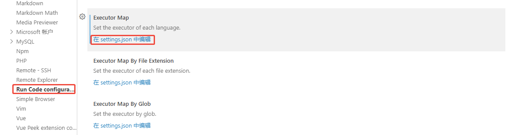

## 什么是 Lua？

​        Lua 是一种轻量小巧的脚本语言，它用标准C语言编写并以源代码形式开放。这意味着什么呢？这意味着Lua虚拟机可以很方便的嵌入别的程序里，从而为应用程序提供灵活的扩展和定制功能。而整个Lua虚拟机编译后仅仅一百余K，经过适当的裁剪还能做到更小，十分适合嵌入式的开发。

## Lua环境安装

### Linux 系统上安装

```c
curl -L -R -O https://www.lua.org/ftp/lua-5.3.6.tar.gz
tar zxf lua-5.3.6.tar.gz
cd lua-5.3.6
make all test
make install
```

### Window 系统上安装

访问[Lua Binaries Download](https://luabinaries.sourceforge.net/download.html)下载，把下图中红框中的两个都下载下来。

+ [lua-5.4.2_Win64_bin.zip](./assets/lua-5.4.2_Win64_bin.zip)是Lua解释器
+ [lua-5.4.2_Win64_dllw6_lib.zip](./assets/lua-5.4.2_Win64_dllw6_lib.zip)是Lua C语言的开发库


下载之后，把两个压缩包的内容放在同一目录中，里面有dll文件重复了，取可执行文件包内的就行了。


**最后，将当前目录配置到环境变量`path`中，`F:\Tools\Lua`！！**

### vs code搭建开发环境

在vs code中安装`lua插件`，请认准作者，不要安装错了！！！这是提供Lua智能提示的插件！


再安装一个一键运行Lua脚本的插件。


这个插件需要配置一下！进入设置，找到Run Code插件，找到Executor Map，点击在settings.json中编辑。



点击之后，会自动添加如下json配置。

```json
"code-runner.executorMap": {
		#....
        "lua": "lua54",
   		#....
    },
```

不用管其他语言，找到"lua"把值改为lua54即可，保存一下！

然后右键要运行的文件就可以，运行啦！


输出结果如下图所示

