# MySQL下载与安装

## 下载 

1，进入MySQL官网[官网地址](<https://www.mysql.com/>)，选择Downloads。


2，往下翻，找到[MySQL Community (GPL) Downloads »](https://dev.mysql.com/downloads/)，点击进入。


3，选择MySQL Community Server


4，下载解压版

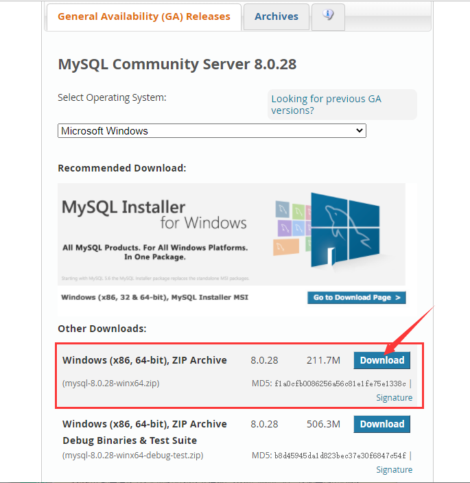

5，弹出如下页面，选择不登录直接下载(下载过程可能有点慢)

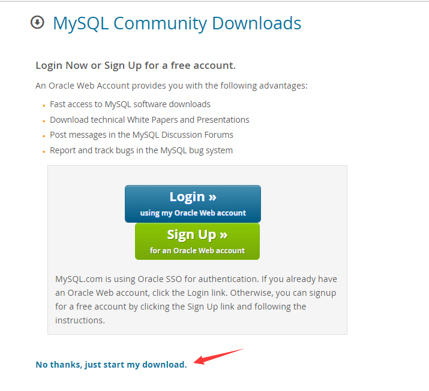

## 配置

1，下载之后，解压放到一个自己能找到的目录里面。

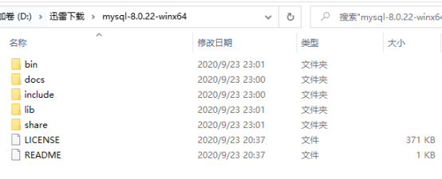

2，以管理员身份运行cmd，并切换到mysql的bin目录。

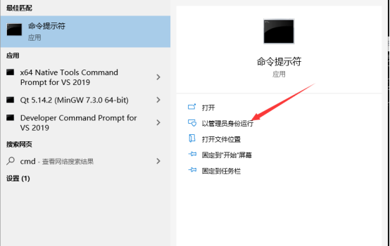


3，输入`mysqld --install`安装mysql服务，移除服务的命令是`mysqld --remove`


4，输入`mysqld --initialize --console`初始化，记一下初始密码哦~

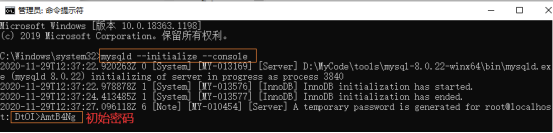

5，然后输入`net start mysql` 启动服务，停止服务命令是`net stop mysql`

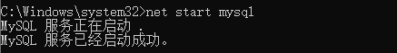

6，最后登录一下mysql -uroot -p，出现如下界面说明已经成功登录啦~

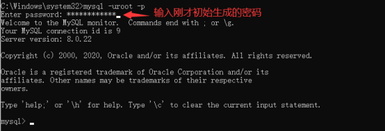

7，然后自己修改一下密码 `set password for 'root'@'localhost'='你的新密码'`

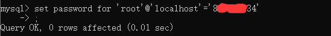

8，输入quit可以退出mysql哦

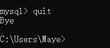

9，为了方便登录操作MySQL，设置一个环境变量，进入bin目录，然后复制路径，添加到系统环境变量

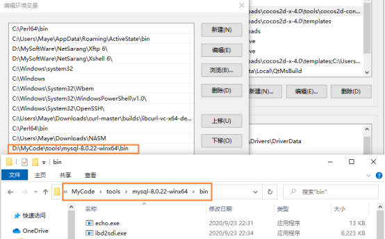


# MySQL密码忘记了怎么办？

1. 用管理员权限打开cmd，关闭mysql服务；

```css
> net stop mysql
```


2. 设置启动mysql服务时跳过权限验证；

```css
> mysqld --console --skip-grant-tables --shared-memory
```

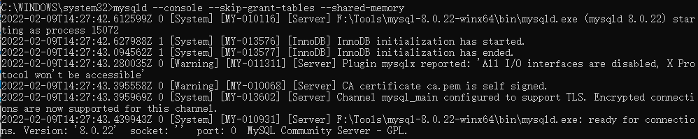

3. 重新打开！重新打开！重新打开一个cmd窗口(用管理员权限)，先前的窗口不要关掉，然后输入mysql，如果成功登录，如下图所示：

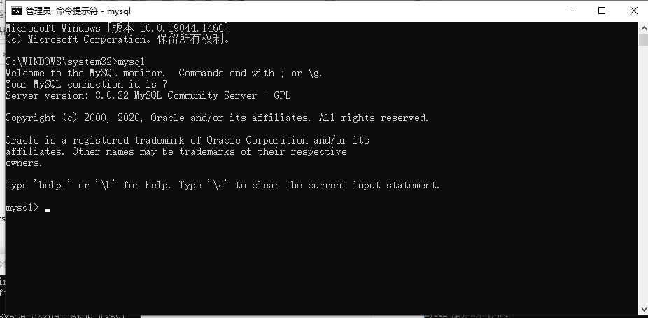

4. 使用指定的数据库

在*MySQL*中就有很多系统自带的数据库,那么在操作数据库之前就必须要确定是哪一个数据库。使用use 命令选择数据库。

```css
> use mysql;
```


5. 修改密码

```css
/*update user set password=password("123456") where user="root";*/
alter user root@localhost identified by '123456';
```


卧槽，发现报错了，不要慌，关键来了！！

+ 先更新一下权限 `flush privileges;`
+ 再执行修改密码命令 `alter user root@localhost identified by '123456';`

6. 退出mysql

```css
> quit;
```


7. 关闭所有控制台，重新打开一个，重启mysql服务，并登录。

```css
> net start mysql;
```

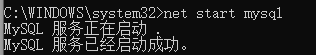

```css
> mysql -uroot -p
```

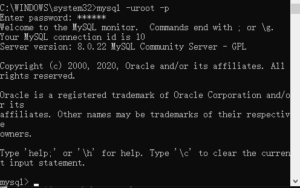

OK!连接成功~

# Navicat 15 for MySQL

**Navicat 15 for MySQL **是一款针对MySQL数据库而开发的第三方MySQL管理工具，该软件可以用于 MySQL 数据库服务器版本 3.21 或以上的和 MariaDB 5.1 或以上。能够同时连接 MySQL 和 MariaDB 数据库，并与 Amazon RDS、Amazon Aurora、Oracle Cloud、Microsoft Azure、阿里云、腾讯云和华为云等云数据库兼容，支持无缝数据迁移、简单的SQL编辑、智能数据库设计、高级安全连接等功能，为数据库管理、开发和维护提供了一款直观而强大的图形界面，是管理和开发 MySQL 或 MariaDB 的理想解决方案。

