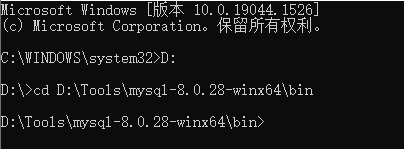
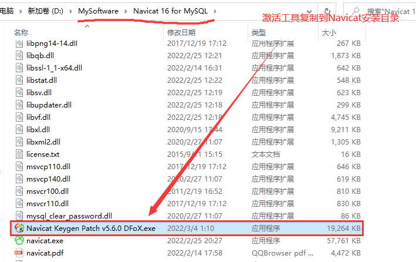
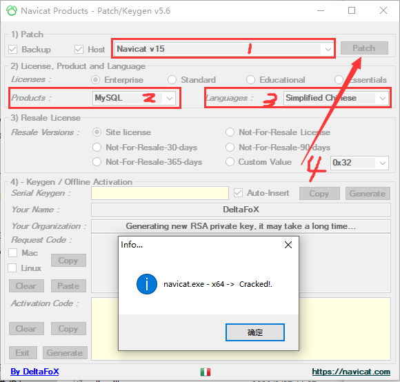
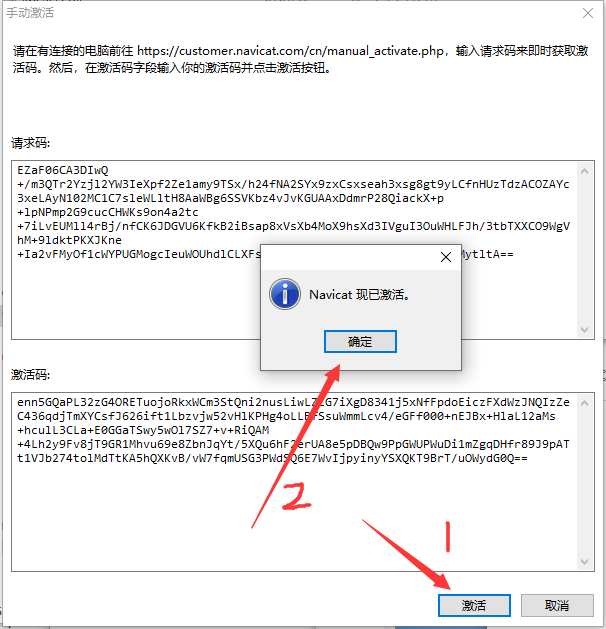

# MySQL简介

MySQL 的历史最早可以追溯到1979年，Monty Widenius用BASIC设计了一个报表工具，过了不久，又将此工具使用C语言重写，移植到UNIX平台，当时只是一个底层的面向报表的存储引擎。

1985年，三个瑞典人 David Axmark、Allan Larsson和 Michael Widenius 成立了一家公司，这就是 MySQLAB 的前身，这个公司最初并不是为了开发数据库产品，而是在实现想法的过程中需要一个数据库并希望能够使用开源的产品。但在当时并没有一个合适的选择。因此自己设计了一个利用索引顺序存取数据的方法，也就是ISAM（Indexed Sequential Access Method）存储引擎核心算法的前身。此软件以创始人之一 Michael Widenius 女儿 My 的名字命名。MySQL的 Logo 为海豚标志，如下图所示，海豚代表了速度、动力、精确等 MySQL所拥有的特性。Logo 中海豚名字叫"sakila"，是由来自非洲斯威士兰的开源软件开发者 Ambrose Twebaze 提供的。根据 Ambrose 所说，Sakila来自一种叫 SiSwati 的斯威士兰方言，也是在 Ambrose 的家乡乌干达附近坦桑尼亚的 Arusha 的一个小镇的名字。


MySQL 是一款免费开源、小型、关系型数据库管理系统。随着该数据库功能的不断完善、性能的不断提高，可靠性不断增强。

2000年4月，MySQL对旧的存储引擎进行了整理，命名为 MyISAM。

2001 年，支持事务处理和行级锁存储引擎 InnoDB 被集成到 MySQL 发行版中，该版本集成了MyISAM与 InnoDB存储引擎，MySQL与InnoDB的正式结合版本是4.0。2004年10月，发布了经典的4.1版本。 2005年10月，发布了里程碑的一个版本，MySQL 5.0，在5.0中加入了游标，存储过程，触发器，视图和事务的支持。在 5.0 之后的版本里，MySQL 明确地表现出迈向高性能数据库的发展步伐。MySOL 公司于2008年1月16号被 SUN公司收购，而在2009 年 SUN 又被 Oracle 收购。MySQL的发展前途一片光明。

MySQL 虽然是免费的，但与其他商业数据库一样，具有数据库系统的通用性，提供了数据的存取、增加、修改、删除或更加复杂的数据操作。同时 MySQL 是关系型的数据库系统，支持标准的结构化查询语言，同时 MySQL 为客户端提供了不同的程序接口和链接库，如C、C++、Java、PHP 等。目前 MySQL 被广泛地应用在 Internet 上的中小型网站中。由于其体积小、速度快、总体拥有成本低，尤其是开放源码这一特点，因此许多中小型网站为了降低网站总体拥有成本而选择了MySQL 作为网站数据库。

# MySQL下载与安装

## 下载 

1，进入MySQL官网[官网地址](<https://www.mysql.com/>)，选择Downloads。


2，往下翻，找到[MySQL Community (GPL) Downloads »](https://dev.mysql.com/downloads/)，点击进入。


3，选择MySQL Community Server


4.1，下载解压版


4.2，下载离线版安装版


4.2.1 选择离线安装版下载


5，弹出如下页面，选择不登录直接下载(下载过程可能有点慢)


## 解压版安装配置

1，下载之后，解压放到一个自己能找到的目录里面。


2，以管理员身份运行cmd，并切换到mysql的bin目录。




3，输入`mysqld --install`安装mysql服务，移除服务的命令是`mysqld --remove`


4，输入`mysqld --initialize --console`初始化，记一下初始密码哦~


5，然后输入`net start mysql` 启动服务，停止服务命令是`net stop mysql`


6，最后登录一下mysql -uroot -p，出现如下界面说明已经成功登录啦~


7，然后自己修改一下密码 `set password for 'root'@'localhost'='你的新密码'`


8，输入quit可以退出mysql哦


9，为了方便登录操作MySQL，设置一个环境变量，进入bin目录，然后复制路径，添加到系统环境变量


**注意：**如果需要添加my.ini配置文件，操作如下

1. 在mysql程序的根目录下，新建一个my.ini空白文件，用记事本打开，将以下内容复制进去，保存：

```ini
# For advice on how to change settings please see
# http://dev.mysql.com/doc/refman/5.6/en/server-configuration-defaults.html
# *** DO NOT EDIT THIS FILE. It's a template which will be copied to the
# *** default location during install, and will be replaced if you
# *** upgrade to a newer version of MySQL.
[client]
default-character-set = utf8mb4
[mysql]
default-character-set = utf8mb4
[mysqld]
character-set-client-handshake = FALSE
character-set-server = utf8mb4
collation-server = utf8mb4_bin
init_connect='SET NAMES utf8mb4'
# Remove leading # and set to the amount of RAM for the most important data
# cache in MySQL. Start at 70% of total RAM for dedicated server, else 10%.
innodb_buffer_pool_size = 128M
# Remove leading # to turn on a very important data integrity option: logging
# changes to the binary log between backups.
# log_bin
# These are commonly set, remove the # and set as required.
basedir = D:\MySQL
datadir = D:\MySQL\data
port = 3306
# server_id = .....
# Remove leading # to set options mainly useful for reporting servers.
# The server defaults are faster for transactions and fast SELECTs.
# Adjust sizes as needed, experiment to find the optimal values.
join_buffer_size = 128M
sort_buffer_size = 16M
read_rnd_buffer_size = 16M 
sql_mode=NO_ENGINE_SUBSTITUTION,STRICT_TRANS_TABLES
```

2. 先移除mysql服务

```shell
mysqld --remove;
```

3. 重新安装mysql服务，并指定配置文件

```mysql
mysqld --install "MySQL80" --defaults-file="F:\Tools\mysql-8.0.22-winx64\my.ini"
#"MySQL80" 是服务名称
#--defaults-file 是指定配置文件位置
```

4. 启动新安装的mysql服务

```shell
net start MySQL80;
```


## 安装版安装配置

1，双击下载的msi文件


2，选择安装类型


+ Developer Default：安装MySQL开发所需的所有产品
+ Server only：只安装MySQL服务端
+ Client only：只安装MySQL客户端
+ Full：安装上述所有
+ Custom：手动选择需要安装在系统上的产品

这里咱们选择Custom自定义安装，看一下再安装过程中需要选择一些什么组件。

3，选择需要安装的产品，选择好安装路径之后，点击下一步即可！


4，点击下一步，直到安装界面，等待安装完成即可！


5，安装完成之后，就是对MySQL进行配置了！


5，选择类型和网络


6，账户和角色


7，windows服务


8，应用配置，全部是绿色勾就说明完成了！


# MySQL密码忘记了怎么办？

1. 用管理员权限打开cmd，关闭mysql服务；

```css
> net stop mysql
```


2. 设置启动mysql服务时跳过权限验证；

```css
> mysqld --console --skip-grant-tables --shared-memory
```


3. 重新打开！重新打开！重新打开一个cmd窗口(用管理员权限)，先前的窗口不要关掉，然后输入mysql，如果成功登录，如下图所示：


4. 使用指定的数据库

在*MySQL*中就有很多系统自带的数据库,那么在操作数据库之前就必须要确定是哪一个数据库。使用use 命令选择数据库。

```css
> use mysql;
```


5. 修改密码

```css
/*update user set password=password("123456") where user="root";*/
alter user root@localhost identified by '123456';
```


卧槽，发现报错了，不要慌，关键来了！！

+ 先更新一下权限 `flush privileges;`
+ 再执行修改密码命令 `alter user root@localhost identified by '123456';`

6. 退出mysql

```css
> quit;
```


7. 关闭所有控制台，重新打开一个，重启mysql服务，并登录。

```css
> net start mysql;
```


```css
> mysql -uroot -p
```


OK!连接成功~

# 安装Navicat 15 for MySQL

**Navicat 15 for MySQL **是一款针对MySQL数据库而开发的第三方MySQL管理工具，该软件可以用于 MySQL 数据库服务器版本 3.21 或以上的和 MariaDB 5.1 或以上。能够同时连接 MySQL 和 MariaDB 数据库，并与 Amazon RDS、Amazon Aurora、Oracle Cloud、Microsoft Azure、阿里云、腾讯云和华为云等云数据库兼容，支持无缝数据迁移、简单的SQL编辑、智能数据库设计、高级安全连接等功能，为数据库管理、开发和维护提供了一款直观而强大的图形界面，是管理和开发 MySQL 或 MariaDB 的理想解决方案。

**1.下载Navicat for MySQL 15**

[网盘下载 提取码 4ixt](https://pan.baidu.com/s/1eFDCYwjv4H90y6u9dRC6xA )


**2.下载激活工具**

[网盘下载 提取码 09az](https://pan.baidu.com/s/1j2C3qz3zMQc11YUC04l8BQ)


**3.安装Navicat**

按步骤安装即可，安装完毕后先不要打开软件，<font style="color:red">断开网络连接，一定要断开！！！</font>


然后将激活工具复制到Navicat安装路径下，如下图所示。




以**管理员身份运行激活工具**，在弹出界面选择Navicat 15版本， Products选择MySQL，Languages选择Simplefied Chinese 点击Patch，如下：



4.打开Navicat，点击注册


5.返回到激活工具界面，点击Generate会自动填写注册码到软件输入框


6.在点击激活按钮，点击手动激活


7.将请求码复制到激活工具的文本框中，点击Generate激活码会自动填写到Navicat激活码文本框中，点击激活即可。


8. 点击激活，弹出激活成功，over！！！




# Navicat连接MySQL

1. 在Navicat中新建MySQL连接。


2. 默认端口3306，单击测试连接按钮，连接成功！最后点击确定即可。


3. 双击连接名称，即可看到所有数据库。


好了可以尽情使用它了！！！

