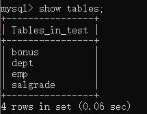
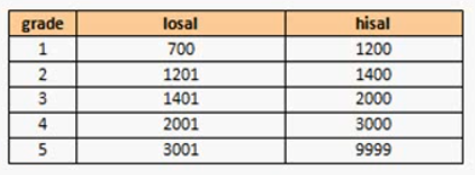

## 准备测试数据

要学习SQL查询语句，首先必须解决一个问题，数据问题。

为了方便大家学习，在视频目录中提供了一个test.sql文件。

登录MySQL，输入`source  xxx/test.sql`导入sql文件，sql文件实际上是一个脚本文件，里面有多行SQL语句，通过source命令可以批量执行。


执行完毕之后，使用`show databases;`查看所有数据库，发现多了一个名为test的数据库。


使用`show tables;`查看test数据库下所有的数据表，发现有四个表。



**test数据库表**

以后讲解SQL语句的时候，主要使用的是test数据库下的四张表，所以首先就必须对这些表的作用以及列的数据类型做一个基本的了解。


**部门表：dept**

| No.  | 字段名 |    类型     |          描述          |
| :--: | :----: | :---------: | :--------------------: |
|  1   | DEPTNO |  SMALLINT   |        部门编号        |
|  2   | DNAME  | VARCHAR(14) | 部门名称，最多14个字符 |
|  3   |  LOC   | VARCHAR(13) | 部门位置，最多13个字符 |


相关英语翻译：

+ accounting 会计   new york 纽约
+ research 研究员   dallas  达拉斯
+ sales 销售              chicago 芝加哥
+ operarions 运营   boston 波士顿


**雇员表：emp**

| No.  |  字段名  |     类型     |                 描述                 |
| :--: | :------: | :----------: | :----------------------------------: |
|  1   |  EMPNO   |   SMALLINT   |               雇员编号               |
|  2   |  ENAME   | VARCHAR(10)  |               雇员姓名               |
|  3   |   JOB    |  VARCHAR(9)  |              职位(工作)              |
|  4   |   MGR    |   SMALLINT   | 一个员工对应的领导编号，领导也是雇员 |
|  5   | HIREDATE |     DATE     |               雇佣日期               |
|  6   |   SAL    | DECIMAL(7,2) |               基本工资               |
|  7   |   COMM   |   SMALLINT   |     佣金(奖金)，销售人员可以领取     |
|  8   |  DEPTNO  |   SMALLINT   |    雇员所属部门编号，与dept表对应    |


相关英语翻译：

+ clerk 店员

+ salesman 销售员

+ manager 经理

+ analyst 化验员

+ president 董事长

  

**工资等级表：salgrade**

| No.  | 字段名 |   类型   |       描述       |
| :--: | :----: | :------: | :--------------: |
|  1   | GRADE  | SMALLINT |   工资等级编号   |
|  2   | LOSAL  | SMALLINT | 此等级的最低工资 |
|  3   | HISAL  | SMALLINT | 此等级的最高工资 |




**工资补贴表(工资条)：bonus**

| No.  | 字段名 |     类型     |   描述   |
| :--: | :----: | :----------: | :------: |
|  1   | ENAME  | VARCHAR(10)  | 雇员姓名 |
|  2   |  JOB   |  VARCHAR(9)  |   工作   |
|  3   |  SAL   | DECIMAL(7,2) | 基本工资 |
|  4   |  COMM  |   SMALLINT   |   佣金   |

工资补贴表没有数据~


## SQL语句规范

使用SQL语句请遵循以下规范：

+ SQL语句不区分大小写。但字符串常量区分大小写，建议命令大写，表名库名小写；
+ SQL语句可单行或多行书写，以分号结尾；
+ 用空格和缩进来提高语句的可读性。
+ 注释：有三种风格的注释
  1. 单行注释可以用“#”
  2. 单行注释第二种写法用“-- ”，“--" 与注释之间是有空格的。
  3. 多行注释可以用/* */


## 数据库的基本操作

在MySQL之中有许多的数据库，可以使用以下命令查看所有数据库:

```mysql
SHOW DATABASES;
+--------------------+
| Database           |
+--------------------+
| information_schema |		#主要存储了系统中的一些数据库对象信息，比如用户表信息、列信息、权限信息、字符集信息和分区信息等。
| mysql              |		#MySQL的核心数据库，主要负责存储数据库用户、用户访问权限等 MySQL 自己需要使用的控制和管理信息。
| performance_schema |		#主要用于收集数据库服务器性能参数。
| sys                |		#sys 数据库主要提供了一些视图，数据都来自于 performation_schema，主要是让开发者和使用者更方便地查看性能问题。
+--------------------+
```

这些数据库彼此之间是可以进行相互切换的。而切换的基本语法：

```mysql
USE <dbname>;
```

要想知道当前使用的是哪个数据库，那么可以使用`select database();`命令来查看：

```mysql
SELECT DATABASE();
```

在一个数据库下一定会存在多张数据表，那么这个时候也可以直接利用以下命令查看所有表:

```mysql
SHOW TABLES;
```

而如果想要知道某些数据表的表结构，那么可以使用DESC命令：

```mysql	
DESC emp;
```

如果想要自己**创建数据库**，则需要使用以下命令：

```mysql
CREATE DATABASE <dbname>;
```

如果数据库已经存在则会报错` Can't create database '<dbname>'; database exists`，我们可以先判断数据库是否存在，不存在就创建，存在则忽略(只有警告没有报错)。

```mysql
CREATE DATABASE IF NOT EXISTS  <dbname>;
```

如果想要删除数据库，则可以使用以下命令：

```mysql
DROP DATABASE <dbname>;
```

如果数据库已经存在则会报错`Can't drop database 'ss'; database doesn't exist`，所有再删除数据库时可以判断是否存在。

```mysql
CREATE DATABASE IF EXISTS <dbname>;	#如果数据库存在则删除
```

使用 DROP DATABASE 命令时要**非常谨慎**，在执行该命令后，MySQL 不会给出任何提示确认信息。DROP DATABASE 删除数据库后，数据库中存储的所有数据表和数据也将一同被删除，而且**不能恢复**。

