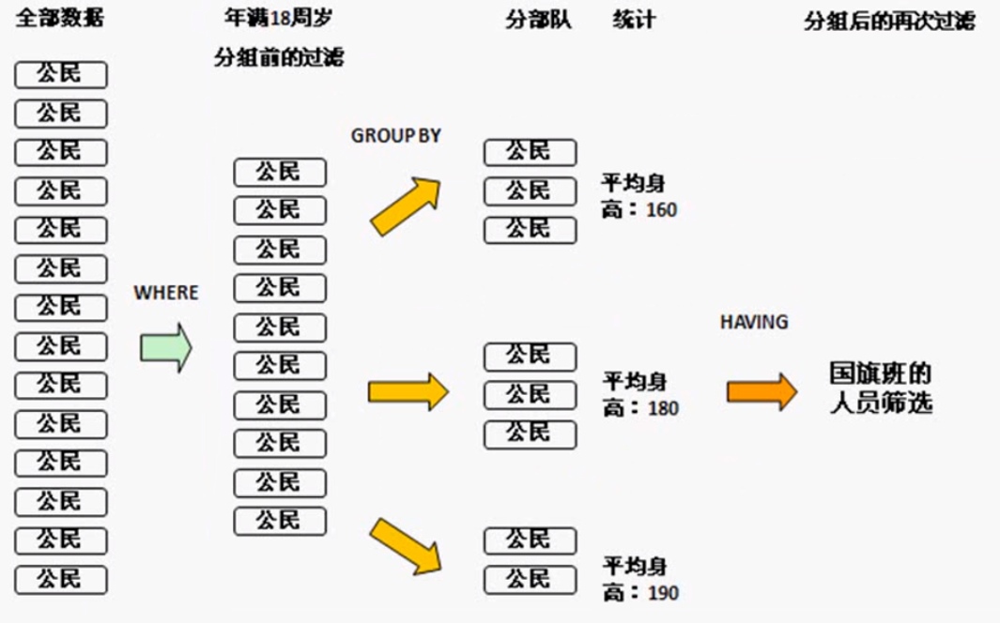

## 基本查询

> MySQL 数据库使用SELECT语句来查询数据。

**1. 查询多个字段**

以下为在MySQL数据库中查询数据通用的 SELECT 语法：

```mysql
SELECT 字段名,字段名... FROM 表名;
SELECT * FROM 表名;					#查询所有字段
```

- 查询语句中可以使用一个或者多个表，表之间使用逗号(,)分割，并使用WHERE语句来设定查询条件。
- SELECT 命令可以读取一条或者多条记录。
- 你可以使用星号（*）来代替其他字段，SELECT语句会返回表的所有字段数据


**2.设置别名**

```mysql
SELECT 字段1 [AS 别名],字段2 [AS 别名]... FROM 表名;
```


**3.去除重复记录**

```mysql
SELECT DISTINCT 字段列表 FROM 表名;
```


**4.四则运算查询**

| 运算符   | 描述 |
| -------- | ---- |
| +        | 加法 |
| -        | 减法 |
| *        | 乘法 |
| /（DIV） | 除法 |
| %（MOD） | 求余 |


#### 查询需求

1. 查询指定字段 ename，job，sal的数据

```mysql

```

2. 查询所有字段

```mysql

```

3. 查询所有员工的职位，并起别名

```mysql

```

4. 查询员工的的职位有哪些(不要重复)

```mysql

```

5. 查询员工年薪 即 sal* 12

```mysql

```


## 条件查询

> 我们知道从 MySQL 表中使用 SELECT 语句来查询数据，如需有条件地从表中选取数据，可将 WHERE 子句添加到 SELECT 语句中。

**语法**

```mysql
SELECT 字段名 FROM 表名 WHERE 条件;
```

#### **运算符表**

| 关系运算符 | 功能     |
| ---------- | -------- |
| >          | 大于     |
| \>=        | 大于等于 |
| <          | 小于     |
| <=         | 小于等于 |
| =          | 等于     |
| <> 或 !=   | 不等于   |

| 逻辑运算符   | 功能                         |
| ------------ | ---------------------------- |
| AND 或 &&    | 并且（多个条件同时成立）     |
| OR  或  \|\| | 或者（多个条件任意成立一个） |
| NOT 或 ！    | 非，不是                     |

| 其他             | 功能                                       |
| ---------------- | ------------------------------------------ |
| BETWEEN...AND... | 在某个范围之间（含最小、最大值）           |
| IN(...)          | 在in之后的列表中的值，多选一               |
| LIKE             | 模糊匹配（_匹配单个字符，%匹配任意个字符） |
| IS [NOT] NULL    | 是 NULL                                    |

#### 查询需求

1. 查询工资等于3000的员工

```mysql

```

2. 查询工资小于1000的员工

```mysql

```

3. 查询工资小于等于1000的员工

```mysql

```

4. 查询没有奖金的员工

```mysql

```

5. 查询有奖金的员工

```mysql

```

6. 查询工资在1200到1800之间的员工(包含1200和1800岁)

```mysql

```

7. 查询职位为推销员，且工资小于1500的员工

```mysql

```

8. 查询工资为800 或 3000 或 5000的员工

```mysql

```

9. 查询姓名为四个字的员工

```mysql

```

10. 查询姓名最后一位是S的员工

```mysql

```


## 聚合函数(统计函数)

> SQL 允许对表中的数据进行计算，将一列数据作为一个整体，进行纵向计算。

| 函数名        | 作用                               |
| ------------- | ---------------------------------- |
| MAX(column)   | 返回某列的最低值（没有则返回NULL） |
| MIN(column)   | 返回某列的最高值（没有则返回NULL） |
| COUNT(column) | 返回某列的行数（不包括 NULL 值）   |
| COUNT(*)      | 返回被选列行数（包括NULL）         |
| SUM(column)   | 求和                               |
| AVG(column)   | 求平均值                           |

其中 COUNT 函数可用于任何数据类型 (因为它只是计数)，而 SUM 、AVG 函数都只能对数值类型做计算，MAX 和 MIN 可用于数值、字符串或是日期时间数据类型。

1. 统计该企业员工数量

```mysql

```

2. 统计该企业员工的平均工资

```mysql

```

3. 查询该企业员工的最高工资

```mysql

```

4. 查询该企业员工的最低工资

```mysql

```

5. 计算所有销售的工资之和

```mysql

```


## 分组查询

> 上节课学习了聚合函数的使用，聚合函数实际上就是一些统计函数。
>
> 本节课咱们就来学习分组统计查询。

需要声明一点的是，虽然说统计函数一般是搭配分组查询，但是单独使用的情况一定是有的。列如：在做报表显示的时候基本的分页操作，一定要查询出全部的数据。

**那么什么是分组呢？**

分组这个概念在生活中其实是很常见的，比如有以下需求：

+ 1.在一个班级之中，要求男女各一组进行辩论赛
+ 2.在公司中，要求每个部门一组进行拔河比赛

对于第一个需求，假设存在学生表，那么在学生表之中一定会存在一个性别字段，性别只可能是男或者女。

而在公司之中，如果要进行部门分组，肯定需要一个部门列的内容存在重复。

分组只对数据有重复的字段才有意义，我们可以查看emp表，找到可以分组的字段job 和 deptno。


**语法**

```mysql
SELECT 分组字段/聚合函数 FROM 表名 [WHERE 条件] GROUP BY 分组字段 [HAVING 分组后条件];
```

**查询需求**

1. 统计出每个工作岗位的人数

```mysql

```


2. 统计出每种职位的最低和最高工资

```mysql

```

以上两个查询就实现了分组的基本操作，而且这些代码都按照标准格式进行了编写。可是在分组之中，个人认为最麻烦的地方就是在于分组操作的若干限制。


**注意事项**

1. 如果一个查询之中不存在`GROUP BY`子句，那么在`SELECT`子句之中只允许出现统计函数，其他任何字段都不允许出现。

```mysql
#错误的语句
SELECT ename,COUNT(job) FROM emp;
#正确的语句
SELECT COUNT(job) FROM emp;
```

2. 在统计查询之中(存在`GROUP BY`子句)，`SELECT`子句之中只允许出现分组字段(`GROUP BY`之后定义的字段)和统计函数，其他的任何字段都不允许出现。

```mysql
#错误的语句
SELECT ename,COUNT(job) FROM emp GROUP BY job;
#正确的语句
SELECT deptno,COUNT(job) FROM emp GROUP BY job;
```

在以后进行分组操作的时候，本着一个原则：`GROUP BY`子句之中允许出现的字段才是`SELECT`子句中允许出现的字段。


**查询需求**

1. 显示不同职位薪资少于1500的人数

```mysql

```


1. 显示非销售人员(salesman)工作名称以及从事同一工作的员工的月工资的总和，并且要满足从事同一工作的员工的月工资合计大于等于**5000**。

```mysql

```

#### WHERE和HAVING区别

+ WHERE：是在分组之前使用(可以没有GROUP BY)，不允许使用统计函数；
+ HAVING：是在分组之后使用(必须结合GROUP BY)，允许使用统计函数。



## 排序查询

> 通过条件查询语句可以查询到符合用户需求的数据，但是查询到的数据一般都是按照数据最初被添加到表中的顺序来显示。为了使查询结果的顺序满足用户的要求，MySQL 提供了 ORDER BY 关键字来对查询结果进行排序。

在实际应用中经常需要对查询结果进行排序，比如，在网上购物时，可以将商品按照价格进行排序；在医院的挂号系统中，可以按照挂号的先后顺序进行排序等。

**语法**

```mysql
SELECT 字段名 FROM 表名 ... ORDER BY 排序字段名 [ASC|DESC],[排序字段名 [ASC|DESC]];
```

语法说明：

- 排序字段名：表示需要排序的字段名称，多个字段时用逗号隔开。
- ASC|DESC：`ASC`表示字段按升序排序；`DESC`表示字段按降序排序。其中`ASC`为默认值。

**特点**

+ ORDER BY子句一般放到查询语句的最后面，LIMIT字句除外。

- 当排序的字段中存在空值时，ORDER BY 会将该空值作为最小值来对待。
- ORDER BY 指定多个字段进行排序时，MySQL 会按照字段的顺序从左到右依次进行排序。
- **注意**：在对多个字段进行排序时，排序的第一个字段必须有相同的值，才会对第二个字段进行排序。如果第一个字段数据中所有的值都是唯一的，MySQL 将不再对第二个字段进行排序。


### 查询需求

1. 根据姓名对员工进行排序(升序)

```mysql

```

2. 查询入职时间大于1981年6月6日的员工信息，并按照入职时间升序排列

```mysql

```

3. 根据工作职位，进行升序排列，职位相同的情况下，再根据入职时间降序排列

```mysql

```

4. 查询工资不在1000到2000之间的员工的姓名和工资，工资按降序排列

```mysql

```

5. 按工作职位进行分组，查看每个工作职位的人数，工作职位按升序排列

```mysql

```


## 分页查询

> 对于比较多的数据，如果在一个页面全部显示，查看起来会眼花缭乱。如果能进行分页显示，将更加快捷、清新的浏览！


**语法**

```mysql
SELECT 字段名 FROM 表名 LIMIT 起始索引,查询记录数;
```

**特点**

+ 起始索引从0开始，起始索引 = (查询页码 - 1) * 每页显示记录数;
+ 如果查询的是第一页数据，起始索引可以省略，直接简写为LIMIT 10。

**查询需求**

1. 查询第一页员工数据，每页展示10条记录

```mysql

```

2. 查询工资大于1500的员工数据，按工资升序排列，并分页，每页展示5条数据

```mysql

```

