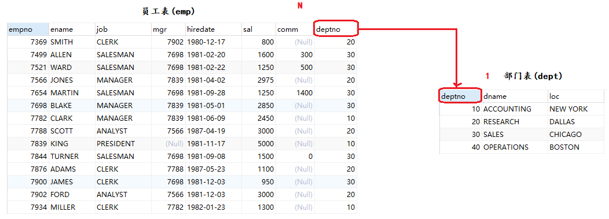
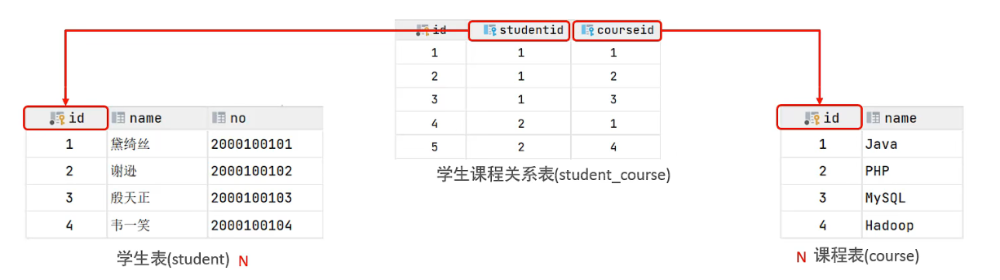
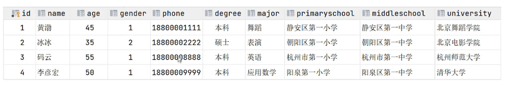
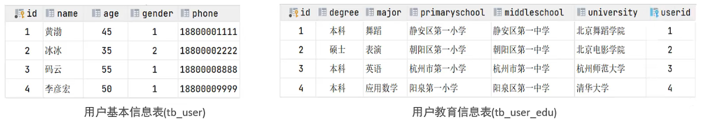
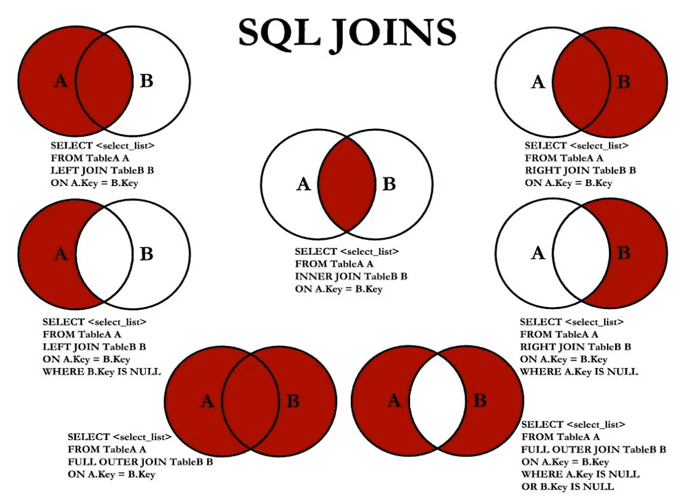
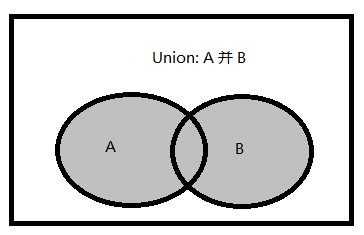

## 多表关系

项目开发中，在进行数据库表结构设计时，会根据业务需求及业务模块之间的关系，分析并设计表结构，由于业务之间相互关联，所以各个表结构之间也存在着各种联系，基本上分为三种：

+ 一对多（多对一）
+ 多对多
+ 一对一


### 一对多(多对一)

案例：部门与员工的关系

关系：一个部门对应多个员工，一个员工对应一个部门

实现：在多的一方建立外键，关联另一方的主键



### 多对多

案例：学生与课程的关系

关系：一个学生可以选修多门课程，一门课程也可以供多个学生选择

实现：建立第三张中间表，中间表至少包含两个外键，分别关联两方主键




### 一对一

案例：用户与用户详细的关系

关系：一对一关系，多用于单表拆分，将一张表的基础字段放在一张表中，其他详情字段放在另一张表中，以提升操作效率。



实现：在任意一方加入一个外键，关联另一方的主键，并且设置外键为唯一约束




## 多表查询

前面我们使用的查询，只是对单表进行查询，在具体的应用中，经常需要实现在一个查询语句中显示多张数据表的数据，这就是所谓的多表联合查询。

在具体实现连接操作时，首先将两个或两个以上的表按照某个条件连接起来，然后再查询到所要求的数据记录。

连接查询分为**交叉连接**、**内连接**、**外连接**查询三种方式。

### 交叉连接

> 交叉连接不带WHERE子句，它返回被连接的两个表所有数据行的笛卡尔积

+ 查询员工及员工所在的部门信息

```mysql
SELECT * FROM emp,dept;　
SELECT * FROM emp CROSS JOIN dept;　
```

如果不加条件直接进行查询，则数据条数是两个表记录条数的乘积，这种结果我们称之为 **笛卡尔乘积**。

> 笛卡尔乘积公式 : A表中数据条数  * B表中数据条数 = 笛卡尔乘积

如果两张表的数据量都很大，那么这种庞大时很可怕的，所以现在必须想办法消除掉笛卡尔积的无效记录。

想要消除笛卡尔积的无效记录，需要使用关联字段。

**范例：**利用等值条件来处理笛卡尔积

```mysql
SELECT * FROM emp,dept WHERE emp.deptno=dept.deptno;
```


### 内连接

> 在表关系的笛卡尔积数据记录中，保留表关系中所有匹配的数据记录，舍弃不匹配的数据记录。按匹配的条件可以分成等值连接和不等值连接。

有两种，显式的和隐式的，返回连接表中符合连接条件和查询条件的数据行。（所谓的链接表就是数据库在做查询形成的中间表）。

+ 隐式内连接

```mysql
SELECT * FROM 表1，表2 WHERE 条件;
```

+ 显示内连接（使用关键字INNER  JOIN）

```mysql
SELECT * FROM 表1 [INNER] JOIN 表2 ON 条件; 
```


#### 等值连接

> 在连接条件中使用等于号(=)运算符比较被连接列的列值，

+ 查询员工及员工部门信息

```mysql
#隐式连接
SELECT * FROM emp e,dept d WHERE e.deptno=d.deptno;
#显示连接
SELECT * FROM emp e INNER JOIN dept d ON e.deptno=d.deptno;
```

+ 等值连接可以使用USING来自动关联两表中相同的列

```mysql
SELECT * FROM emp INNER JOIN dept USING(deptno);
```


#### 非等值连接

>  在连接条件使用除等于运算符以外的其它比较运算符比较被连接的 列的列值。这些运算符包括>、>=、<=、<、!>、!<和<>等。 

+ 查询员工工资级别

```mysql
#隐式连接
SELECT * FROM emp e,salgrade s WHERE e.sal BETWEEN s.losal AND s.hisal;
#显示连接
SELECT * FROM emp e INNER JOIN salgrade s ON  e.sal BETWEEN s.losal AND s.hisal;
```


### 外连接

> 在表关系的笛卡尔积中，不仅保留表关系中所有匹配的数据记录，而且还保留部分不匹配的记录。按照保留不匹配条件数据记录来源可以分为左外连接(LEFT OUTER JOIN)、右外连接(RIGHT OUTER JOIN)和全外连接(FULL OUTER JOIN)。

外连接使用语法如下：

```mysql
SELECT * FROM 表1 LEFT|RIGHT|FULL [OUTER] JOIN 表2 ON 条件; 
```


#### 左外连接

> 在表关系的笛卡尔积中，出了选择相匹配的数据记录，还包含关联**左边表**中不匹配的数据记录。

插入一条部门编号为NULL的数据(关于插入后面会讲)

```mysql
INSERT INTO emp(empno,ename,job,mgr,hiredate,sal,comm,deptno) VALUES(6666,'顽石','teacher',7369,CURDATE(),800,100,NULL);
```

查询员工及对应的部门信息（没有部门的员工也**显示**出来，没有员工的部门**不显示**）

```mysql
SELECT * FROM emp e LEFT OUTER JOIN dept d ON e.deptno=d.deptno;
```


#### 右外连接

> 在表关系的笛卡尔积中，出了选择相匹配的数据记录，还包含关联**右边表**中不匹配的数据记录。

查询员工及对应的部门信息（没有部门的员工**不显示**，没有员工的部门**显示**）

```mysql
SELECT * FROM emp e RIGHT OUTER JOIN dept d ON e.deptno=d.deptno;
```


#### 全连接

> 在表关系的笛卡尔积中，出了选择相匹配的数据记录，还包含关联**左右两边表**中不匹配的数据记录。

查询员工及对应的部门信息（没有部门的员工**显示**，没有员工的部门**显示**）

```mysql
#mysql不支持全连接，但是可以用过集合运算来实现
#SELECT * FROM emp e RIGHT OUTER JOIN dept d ON e.deptno=d.deptno;
```


### 自连接

> 自连接就是指表与其自身进行连接

查询每个员工对应的领导姓名。

```mysql
SELECT e.ename,e.mgr,me.ename 领导 FROM emp e,emp me WHERE e.mgr=me.empno;
```

## 七种JOINS实现



## 集合运算

MySQL支持并集运算。


> 并集即两个集合所有部分



**UNION DISTINCT** 

1. UNION ALL 会删除重复行
2. 相同的行在结果中只出现一次。

```mysql
SELECT * FROM emp
UNION
SELECT * FROM emp WHERE deptno=10;
```


**UNION ALL**

1. UNION 不会会删除重复行
2. 相同的行在结果中可能出现多次

```mysql
SELECT * FROM emp
UNION ALL
SELECT * FROM emp WHERE deptno=10;
```

**要求**

(1)输入的查询不能包含ORDER BY字句，可以为整个集合运算结果选择性地增加一个ORDER BY字句；

(2)两个查询必须包含相同的列数；

(3)相应列必须具有兼容的数据类型。兼容个的数据类型：优先级较低的数据类型必须能隐式地转换为较高级的数据类型。比如输入的查询1的第一列为int类型，输入的查询2的第一列为float类型，则较低的数据类型int类型可以隐式地转换为较高级float类型。如果输入的查询1的第一列为char类型，输入的查询2的第一列为datetime类型，则会提示转换失败：从字符串转换日期和/或时间时，转换失败；

(4)集合运算结果中列名由输入的查询1决定，如果要为结果分配结果列，应该在输入的查询1中分配相应的别名；

(5)集合运算时，对行进行比较时，集合运算认为两个NULL相等；


## 多表查询练习

1. 查询出雇佣日期在1981年的所有员工的编号、姓名、雇佣日期、工作、领导姓名、雇佣月工资、雇佣年工资(基本工资+奖金)，工资等级、部门编号、部门名称、部门位置，并且求这些员工的月基本工资在1500~3500之间，将最后的结果按照年工资的降序排列，如果年工资相等，则按照工作进行排序。

**需求很多，逐步分析**

+ 确定所需要的数据表
  + emp：编号、姓名、雇佣日期，工作、月工资、年薪
  + emp：领导姓名
  + dept：部门编号、名称、位置
  + salgrade：工资等级
+ 确定一致的关联字段
  + 员工和领导：e.mgr=e1.empno
  + 员工和部门：e.deptno=dept.deptno
  + 员工和工资等级：e.sal BETWEEN s.losal AND s.hisal

**步骤一：**查询出所有在1981年雇佣的雇员编号、姓名、御用日期、工作、月工资、年工资，并且月薪在1500~3500之间。只需要emp单张表即可。

```mysql
SELECT e.empno,e.ename,e.hiredate,e.sal,(e.sal+IFNULL(e.comm,0))*12 年薪
FROM emp e
WHERE DATE_FORMAT(e.hiredate,'%Y')='1981' AND e.sal BETWEEN  1500 AND 3500;
```

**步骤二：**加入领导信息，使用自身关联。

```mysql
SELECT e.empno,e.ename,e.hiredate,e.sal,(e.sal+IFNULL(e.comm,0))*12 年薪,m.ename 领导
FROM emp e,emp m
WHERE DATE_FORMAT(e.hiredate,'%Y')='1981' AND e.sal BETWEEN  1500 AND 3500
AND e.mgr=m.empno;
```

**步骤三：**加入部门信息。

```mysql
SELECT e.empno,e.ename,e.hiredate,e.sal,(e.sal+IFNULL(e.comm,0))*12 年薪,m.ename 领导,d.deptno,d.dname,d.loc
FROM emp e,emp m,dept d
WHERE DATE_FORMAT(e.hiredate,'%Y')='1981' AND e.sal BETWEEN  1500 AND 3500
AND e.mgr=m.empno AND e.deptno=d.deptno;
```

**步骤四：**加入工资等级

```mysql
SELECT e.empno,e.ename,e.hiredate,e.sal,(e.sal+IFNULL(e.comm,0))*12 年薪,m.ename 领导,d.deptno,d.dname,d.loc,
s.grade
FROM emp e,emp m,dept d,salgrade s
WHERE DATE_FORMAT(e.hiredate,'%Y')='1981' AND e.sal BETWEEN  1500 AND 3500
AND e.mgr=m.empno AND e.deptno=d.deptno
AND e.sal BETWEEN s.losal AND s.hisal;
```

**步骤五：**排序

```mysql
SELECT e.empno,e.ename,e.hiredate,e.sal,(e.sal+IFNULL(e.comm,0))*12 年薪,m.ename 领导,d.deptno,d.dname,d.loc,
s.grade
FROM emp e,emp m,dept d,salgrade s
WHERE DATE_FORMAT(e.hiredate,'%Y')='1981' AND e.sal BETWEEN  1500 AND 3500
AND e.mgr=m.empno AND e.deptno=d.deptno
AND e.sal BETWEEN s.losal AND s.hisal
ORDER BY 年薪 DESC;
```


