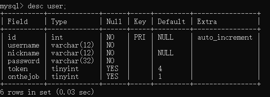

# 创建和管理表

## 1. 基础知识

### 1.1 表的基本概念

在MySQL数据库中，表是一种很重要的数据库对象，是组成数据库的基本元素，由若干个字段组成，主要用来实现存储数据记录。表的操作包含创建表、查看表、删除表和修改表，这些操作是数据库对象的表管理中最基本、最重要的操作。
通过本节的学习，可以掌握在数据库中操作表，内容包含:

+ 表的相关概念;
+ 表的基本操作:创建、查看、更新和删除; 
+ 表的使用策略。

表是包含数据库中所有数据的数据库对象。数据在表中的组织方式与在电子表格中相似，都是按行和列的格式组织的。其中每一行代表一条唯一的记录，每一列代表记录中的一个字段，如下图所示。


## 2. 创建和管理数据库

### 2.1 创建数据库

+ 方式1：创建数据库

  ```mysql
  CREATE DATABASE 数据库名;
  ```

+ 方式2：创建数据库并指定字符集

  ```mysql
  CREATE DATABASE 数据库名 CHARACTER SET "uft8";
  ```

+ 方式3：判断数据库是否已经存在，不存在则创建（推荐）

  ```mysql
  CREATE DATABASE IF NOT EXISTS 数据库名;
  ```
  > 注意：数据库不能改名。一些可视化工具可以改名，它是创建新库，然后把所有表复制到新库，再把旧库删掉完成的。

数据库创建完成之后，可以通过`SHOW CREATE DATABASE 数据库名;`查看创建数据库时使用的语句。

### 2.2 使用数据库

+ 查看当前连接中有哪些数据库

```mysql
SHOW DATABASES;
```

+  切换数据库

在多个数据库之间切换

```mysql
USE 数据库名;
```

+ 查看当前使用的数据库

```mysql
SHOW DATABASE();
```

+ 查看指定数据库所有表

```mysql
SHOW TABLES FROM 数据库名;
```

### 2.3 修改数据库

修改数据库字符集

```mysql
ALTER DATABASE 数据库名 CHARACTER SET 字符集;	#比如 gbk、utf8
#查看默认字符集
SHOW VARIABLES LIKE '%character%';
#查看所有字符集
SHOW CHARSET;
```

### 2.4 删除数据库

+ 直接删除

  ```mysql
  DROP DATABASE 数据库名;
  ```

+ 如果数据库存在则删除，否则报一个警告(不会报错)

  ```mysql
  DROP DATABASE IF EXISTS 数据库名;
  ```

  


## 3.创建表

>  在 MySQL数据库管理系统中创建表通过SQL语句CREATE TABLE 来实现

### 3.1 创建方式1

> 自己指定字段和数据类型

**语法：**

```mysql
CREATE TABLE [IF NOT EXISTS] 表名(
	字段名 数据类型，
    字段名 数据类型，
    ...
    字段名 数据类型，
);
```

### 3.2 创建方式2

> 基于现有表创建新表

+ 基于现有表创建新表,同时导入数据

  ```mysql
  #单个表
  CREATE TABLE myemp1
  AS
  SELECT empno,ename,sal FROM emp;
  
  #多个表
  CREATE TABLE myemp2
  AS
  SELECT e.empno,e.ename,e.sal,d.dname 
  FROM emp e JOIN dept d
  ON e.deptno=d.deptno;
  ```

+ 基于现有表创建新表，只复制表结构，不导入数据

  ```mysql
  CREATE TABLE myemp
  AS
  SELECT empno,ename,sal FROM emp WHERE 1 = 2;
  ```

  


## 查看表结构

创建完表，如果需要查看一下表的结构，可以通过执行SQL语句 DESCRIBE来实现，其语法形式如下:

```mysql
DESC/DESCRIBE table_name;
```

DESC为DESCRIBE的简写形式，更为方便。



还有一种更详细查看表结构的语句：

```mysql
SHOW CREATE TABLE table_name;
```


## 删除表

```mysql
DROP TABLE table_name;
```


## 修改表

### 修改表名

old_table_name为要修改的表名，new_table_name为修改之后的新名字。

```mysql
ALTER TABLE old_table_name RENAME [TO] new_table_name;
```

### 增加字段

#### 在最后添加字段

对于表，可以看成是由列和行来构成的，其中“列”经常被称为字段。在创建表之后如果要增加一列，需要使用下面的语句。

```mysql
ALTER TABLE table_name ADD 字段名 数据类型;
```

#### 在第一个位置添加字段

```mysql
ALTER TABLE table_name ADD 字段名 数据类型 FIRST;
```

#### 在指定位置添加字段

把字段1 添加到字段2之后

```mysql
ALTER TABLE table_name ADD 字段名1 数据类型 AFTER 字段名2;
```

### 删除字段

```mysql
ALTER TABLE table_name DROP 字段名;
```

### 修改字段

#### 修改字段的数据类型

```mysql
ALTER TABLE table_name MODIFY 字段名 数据类型;
```

#### 修改字段名

```mysql
ALTER TABLE table_name CHANGE 旧字段名 新字段名 数据类型;
```

如果数据类型和原来的数据类型一样，则只会修改字段名，如果数据类型不同，则同时会修改数据类型。

#### 修改字段的顺序

```mysql
ALTER TABLE table_name MODIFY	字段名 数据类型 FIRST;
ALTER TABLE table_name MODIFY	字段名1 数据类型 AFTER 字段名2;	#把
```

+ 第一个语句：把字段移动到第一个
+ 第二个语句：把字段1 移动到字段2之后


# 完整性约束

对于已经创建好的表，虽然字段的数据类型决定了所能存储的数据类型，但是表中所存储的数据是否合法并没有进行检查。在具体使用MySQL 软件时，如果想针对表中的数据做一些完整性检查操作，可以通过表的约束来完成。

## MySQL支持的完整性约束

所谓完整性是指数据的准确性和一致性，而完整性检查就是指检查数据的准确性和一致性。MySQL 数据库管理系统提供了一致机制来检查数据库表中的数据是否满足规定的条件，以保证数据库表中数据的准确性和一致性，这种机制就是约束。

MySQL数据库管理系统除了支持标准SQL的完整性约束外，还进行了相应扩展。扩展后增加AUTO_INCREMENT约束。

下表为MySQL软件所支持的完整性约束。

| 完整性约束关键字 | 说明                                           |
| ---------------- | ---------------------------------------------- |
| NOT NULL(NK)     | 约束字段的值不能为空                           |
| DEFAULT          | 设置字段的默认值                               |
| UNIQUE KEY(UK)   | 约束字段的值是唯一(同一列不能出现相同的值)     |
| PRIMARAY KEY(PK) | 约束字段为表的主键，可以作为该表记录的唯一标识 |
| AUTO_INCREMENT   | 约束字段的值为自动增加                         |
| FOREIGN KEY(FK)  | 约束字段为表的外键                             |


## 设置非空约束(NK)

当数据库表中的某个字段上的内容不希望设置为NULL时，则可以使用NK约束进行设置。即NK约束在创建数据库表时为某些字段加上“NOT NULL”约束条件，保证所有记录中该字段都有值。如果用户插入的记录中，该字段为空值，则数据库管理系统会报错。

设置表中某字段的NK约束非常简单，其语法形式如下:

```mysql
CREATE TABLE table_name(
	字段名 数据类型 NOT NULL,
    ...
);
```

## 设置默认值(DEFAULT)

当为数据库表中插入一条新记录时，如果没有为某个字段赋值，那么数据库系统会自动为这个字段插入默认值。为了达到这种效果，可以通过SQL语句关键字DEFAULT来设置。

设置数据库表中某字段的默认值非常简单，其语法形式如下:

```mysql
CREATE TABLE table_name(
	字段名 数据类型 DEFAULT 默认值,
    ...
);
```

## 设置唯一约束(UK)

当数据库表中的某个字段上的内容不允许重复时，则可以使用UK约束进行设置。即UK约束在创建数据库表时为某些字段加上“UNIQUE”约束条件，保证所有记录中该字段上的值不重复。如果用户插入的记录中，该字段上的值与其他记录里该字段上的值重复，则数据库管理系统会报错。

设置表中某字段的UK约束非常简单，其语法形式如下:

```mysql
CREATE TABLE table_name(
	字段名 数据类型 UNIQUE KEY,
    ...
);
```

## 设置主键约束(PK)

当想用数据库表中的某个字段来唯一标识所有记录时，则可以使用PK约束进行设置。即 PK约束在创建数据库表时为某些字段加上“PRIMARY KEY”约束条件，则该字段可以唯一地标示所有记录。

在数据库表中之所以设置主键，是为了便于数据库管理系统快速地查找到表中的记录。在具体设置主键约束时，必须要满足主键字段的值是唯一、非空的。由于主键可以是单一字段，也可以是多个字段，因此分为单字段主键和多字段主键。

### 1. 单字段主键

语法形式如下：

```mysql
CREATE TABLE table_name(
	字段名 数据类型 PRIMARY KEY,
    ...
);
```

### 2. 多字段主键(复合主键)

当主键有多个字段组合而成时，需要通过SQL语句`CONSTRAINT`来实现，语法形式如下：

```mysql
CREATE TABLE table_name(
	字段名 数据类型，
    ...
    [CONSTRAINT 约束名] PRIMARY KEY(字段1，字段2...)
);
```

在上述语句中，在字段定义完之后统一设置主键，PRIMARY KEY关键字括号中的字段可以有多个，需要通过逗号分割，用来实现设置多字段主键。

### 3. 设置字段值自动增加(AUTO_INCREMENT)

AUTO_INCREMENT是 MySQL 唯一扩展的完整性约束，当为数据库表中插入新记录时，字段上的值会自动生成唯一的ID。在具体设置AUTO_INCREMENT约束时，一个数据库表中只能有一个字段使用该约束，该字段的数据类型必须是整数类型。由于设置AUTO_INCREMENT约束后的字段会生成唯一的ID，所以该字段也经常会设置成PK主键。

设置表中某字段值的自动增加约束非常简单，其语法形式如下:

```mysql
CREATE TABLE table_name(
	字段名 数据类型 AUTO_INCREMENT,
    ...
);
```

在上述语句中，属性名参数表示所要设置自动增加约束的字段名字，默认情况下，该字段的值是从1开始增加，每增加一条记录，记录中该字段的值就会在前一条记录的基础上加1。

## 设置外键约束(FOREIGN KEY,FK)

前面介绍的完整性约束都是在单表中进行设置，而外键约束则保证多个表(通常为两个表）之间的参照完整性，即构建于两个表的两个字段之间的参照关系。

设置外键约束的两个表之间会具有父子关系，即子表中某个字段的取值范围由父表所决定。例如，表示一种部门和雇员关系，即每个部门有多个雇员。首先应该有两个表：部门表和雇员表，然后雇员表中有一个表示部门编号的字段deptno，其依赖于部门表的主键，这样字段deptno就是雇员表的外键，通过该字段部门表和雇员表建立了关系。

在具体设置FK约束时，设置FK约束的字段必须依赖于数据库中已经存在的父表的主键，同时外键可以为NULL。

设置表中某字段的FK 约束非常简单，其语法形式如下:

```mysql
CREATE TABLE table_name(
	字段名 数据类型，
    字段名 数据类型，
    ...
    CONSTRAINT 外键约束名 FOREIGN KEY (字段名1)
    	REFERENCES 父表名 (字段名2)
);
```

在上述语句中，“外键约束名”用来标识约束名，“字段名1”参数是子表中设置外键的字段名，“字段2”参数是父表中设置主键约束的字段名。

