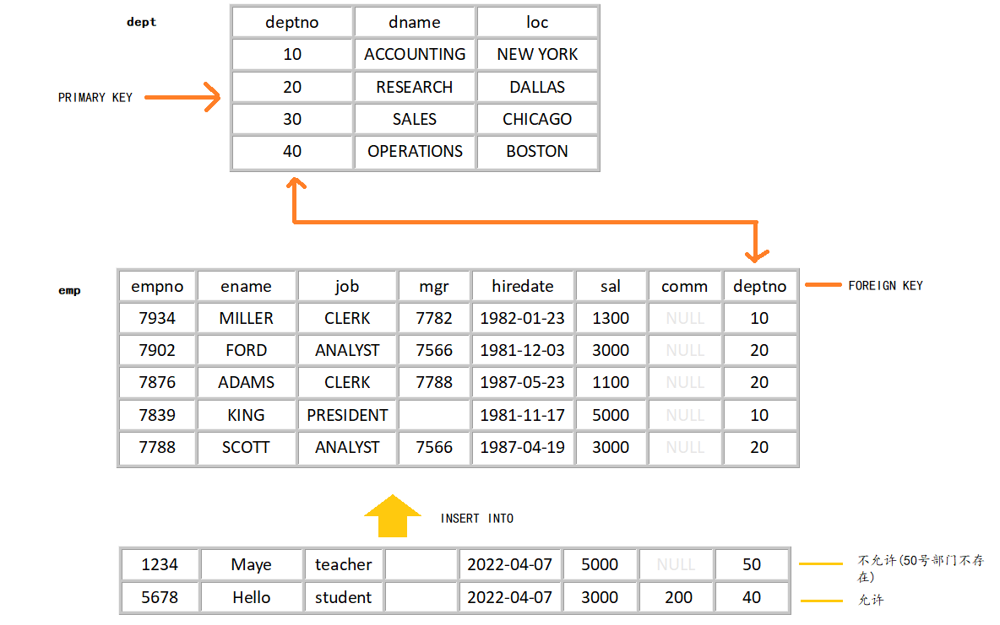
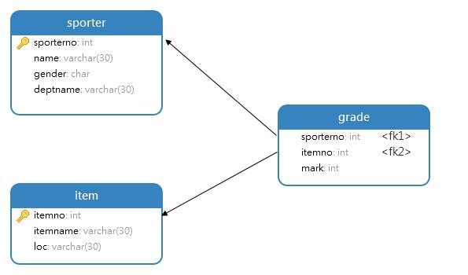
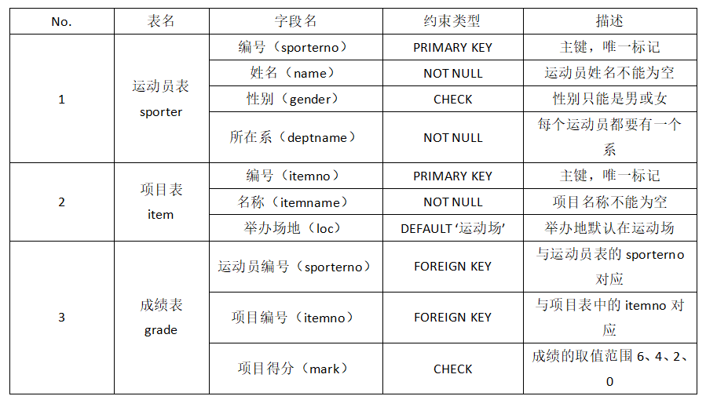

# 约束

## 1. 约束(Constraint)概念

### 1.1 为什么需要约束 

对于已经创建好的表，虽然字段的数据类型决定了所能存储的数据类型，但是表中所存储的数据是否合法并没有进行检查。在具体使用MySQL 软件时，如果想针对表中的数据做一些完整性检查操作，可以通过表的约束来完成。

数据完整性（Data Intergrity）是指数据的精确性（Accuracy）和可靠性（Reliability）。他是防止数据库中存在不符合语义规定的数据和防止因错误信息的输入输出造成无效操作或错误信息而提出来的。

为了保证数据的完整性，SQL规范以约束的方式**对表数据进行额外的条件限制**，主要从以下四个方面考虑：

+ <font style="color:rgb(200,132,75)">实体完整性（Entity Integrity）</font>如：同一张表中，不能存在两条完全相同无法区分的记录
+ <font style="color:rgb(200,132,75)">域完整性（Domain Integrity）</font>如：年龄范围0-120，性别范围 “男/女”
+ <font style="color:rgb(200,132,75)">引用完整性（Referential Integrity）</font>如：员工所在部门，必须要在部门表中存在
+ <font style="color:rgb(200,132,75)">用户自定义完整性（User-defined Integrity）</font>如：用户名唯一、密码不能为空等


### 1.2 什么是约束

约束是表级的强制规定。

可以在创建表时规定约束（通过CREATE TABLE语句），或者在表创建之后通过ALTER T ABLE语句规定约束。

### 1.3 约束分类

#### 1.3.1 根据约束的字段分类

+ 单列约束
+ 多列约束

#### 1.3.2 根据约束的作用范围分类

+ 列级约束
+ 表级约束

**区别**

① 位置不同 ：列级约束是写在列的后面，标记约束时写在所有字段的最后面

② 支持的约束类型不同：列级约束可以支持所有的约束类型，表级约束不能支持非空和默认

③ 列级约束不可以起约束名，表记约束可以起约束名（主键除外，主键使用的PRIMARY KEY）

#### 1.3.3 根据约束的作用分类

| 完整性约束关键字 | 说明                                           |
| ---------------- | ---------------------------------------------- |
| NOT NULL(NK)     | 约束字段的值不能为空                           |
| DEFAULT          | 设置字段的默认值                               |
| UNIQUE KEY(UK)   | 约束字段的值是唯一(同一列不能出现相同的值)     |
| PRIMARAY KEY(PK) | 约束字段为表的主键，可以作为该表记录的唯一标识 |
| AUTO_INCREMENT   | 约束字段的值为自动增加                         |
| FOREIGN KEY(FK)  | 约束字段为表的外键                             |
| CHECK()          |                                                |

+ 查看某个表已有的约束

  ```mysql
  SELECT  * FROM information_schema.TABLE_CONSTRAINTS
  WHERE table_name='emp';
  ```

  

## 2. 非空约束(NK)

### 2.1 概念

当数据库表中的某个字段上的内容不希望设置为NULL时，则可以使用NK约束进行设置。即NK约束在创建数据库表时为某些字段加上“NOT NULL”约束条件，保证所有记录中该字段都有值。如果用户插入的记录中，该字段为空值，则数据库管理系统会报错。

### **2.2 特点**

+ 默认情况下，所有类型的值都可以是NULL
+ 一个表可以有很多字段指定非空约束
+ 空串" "不等于NULL，0也不等于NULL，NULL也不等于NULL


### 2.3 添加非空约束

1. 创建表时

```mysql
CREATE TABLE table_name(
	字段名 数据类型 NOT NULL,
    ...
);
```

2. 创建之后添加

```mysql
ALTER TABLE <表名> MODIFY 字段名 数据类型 约束;
```

### 2.4 删除非空约束

```mysql
ALTER TABLE 表名 MODIFY 字段名 数据类型 NULL;
#或
ALTER TABLE 表名 MODIFY 字段名 数据类型;
```


## 3. 唯一约束(UK)

### 3.1 概念

当数据库表中的某个字段上的内容不允许重复时，则可以使用UK约束进行设置。即UK约束在创建数据库表时为某些字段加上“UNIQUE”约束条件，保证所有记录中该字段上的值不重复。如果用户插入的记录中，该字段上的值与其他记录里该字段上的值重复，则数据库管理系统会报错。

### 3.2 特点

+ 同一个表可以有多个唯一约束
+ 唯一约束允许值为NULL
+ 在创建唯一约束的时候，如果不给唯一约束命名，那么约束名就和字段名相同

### 3.3 添加唯一约束

1. 创建表时添加

```mysql
CREATE TABLE table_name(
	字段名 数据类型 UNIQUE KEY,
    ...
);
```

2. 创建表后添加

+ 方法一

```mysql
ALTER TABLE <表名> MODIFY 字段名 数据类型 UNIQUE;
```

+ 方法二

```mysql
ALTER TABLE <表名> ADD [CONSTRAINT 约束名] UNIQUE [KEY](字段名)；
```

### 3.4 删除唯一约束

+ 添加唯一约束的列上会自动创建唯一索引
+ 删除唯一约束只能通过删除唯一索引的方式删除
+ 删除时需要指定唯一索引名，唯一收益名和唯一约束名相同。
+ 如果创建唯一约束时未指定名称，如果是单列，就默认和列名相同；如果是组合列，那么默认和（）中第一个列名相同。

```mysql
ALTER TABLE <表名> DROP INDEX <索引名>;
```

> ​	可以通过`SHOW INDEX FROM 表名;`查看表的所有


## 4. 主键约束(PK)

### 4.1 概念

当想用数据库表中的某个字段来唯一标识所有记录时，则可以使用PK约束进行设置。即 PK约束在创建数据库表时为某些字段加上“PRIMARY KEY”约束条件，则该字段可以唯一地标示所有记录。

在数据库表中之所以设置主键，是为了便于数据库管理系统快速地查找到表中的记录。在具体设置主键约束时，必须要满足主键字段的值是唯一、非空的。由于主键可以是单一字段，也可以是多个字段，因此分为单字段主键和多字段主键。

### 4.2 特点

+ 主键约束相当于 **唯一约束+非空约束**，意味着不允许重复和NULL值

+ 主键约束对应着表中的一列或者多列(复合主键)
+ 如果是多列组合的复合主键约束，那么这些列都不允许为NULL值，并且组合的值不允许重复
+ MySQL的主键名总是PRIMARY，就算自己命名了主键约束名也没用
+ 当创建主键约束时，系统默认会在所在的列或组合上建立对应的主键索引（能够根据主键查询的，就根据主键查询，效率更高），如果删除主键约束，主键约束对应的索引就自动删除了
+ 需要注意一点的是，不要修改主键字段的值。因为主键是数据记录的唯一标识，如果修改了主键的值，就有可能会破坏数据的完整性。

### 4.3 单字段主键

+ 创建表时指定主键约束

```mysql
CREATE TABLE table_name(
	字段名 数据类型  PRIMARY KEY,
    ...
);
```

+ ALTER TABLE添加主键约束

```mysql
ALTER TABLE <表名> ADD PRIMARY KEY(字段名);
```


### 4.4 多字段主键(复合主键)

当主键有多个字段组合而成时，需要通过SQL语句`CONSTRAINT`来实现，语法形式如下：

```mysql
CREATE TABLE table_name(
	字段名 数据类型，
    ...
    [CONSTRAINT 约束名] PRIMARY KEY(字段1，字段2...)
);
```

在上述语句中，在字段定义完之后统一设置主键，PRIMARY KEY关键字括号中的字段可以有多个，需要通过逗号分割，用来实现设置多字段主键。

### 4.5 删除主键

```mysql
ALTER TABLE <表名> DROP PRIMARY KEY;
```


### 4.5  设置字段值自动增加(AUTO_INCREMENT)

#### 4.5.1 概念

AUTO_INCREMENT是 MySQL 唯一扩展的完整性约束，当为数据库表中插入新记录时，字段上的值会自动生成唯一的ID。在具体设置AUTO_INCREMENT约束时，一个数据库表中只能有一个字段使用该约束，该字段的数据类型必须是整数类型。由于设置AUTO_INCREMENT约束后的字段会生成唯一的ID，所以该字段也经常会设置成PK主键。

#### 4.5.2 特点

+ 一个表最多只能有一个自增长列
+ 当需要产生唯一标识符或者顺序值时，可设置自增长
+ 自增长列约束的列必须是键列(主键列，唯一键列)
+ 自增约束的列的数据类型必须是整数类型
+ 如果自增列制定了0或NULL，会在当前最大值的基础上自增；如果自增列手动指定了具体值，直接付志伟具体值。

#### 4.5.3 指定自增约束

1. 方法一：创建表是指定

```mysql
CREATE TABLE table_name(
	字段名 数据类型 PRIMARY KEY|UNIQUE AUTO_INCREMENT,
    ...
);
```

2. 方法二：通过ALTER TABLE添加

```mysql
ALTER TABLE <表名> MODIFY 字段名 数据类型 AUTO_INCREMENT;
```

#### 4.5.3 删除自增约束

```mysql
ALTER TABLE <表名> MODIFY 字段名 数据类型;
```


## 5. 外键约束(FOREIGN KEY,FK)

前面介绍的完整性约束都是在单表中进行设置，而外键约束则保证多个表(通常为两个表）之间的参照完整性，即构建于两个表的两个字段之间的参照关系。

### 5.1 概念

设置外键约束的两个表之间会具有父子关系，即子表中某个字段的取值范围由父表所决定。例如，表示一种部门和雇员关系，即每个部门有多个雇员。首先应该有两个表：部门表和雇员表，然后雇员表中有一个表示部门编号的字段deptno，其依赖于部门表的主键，这样字段deptno就是雇员表的外键，通过该字段部门表和雇员表建立了关系。

对于两个具有关联关系的表而言，相关联字段中主键所在的表就是主表（父表），外键所在的表就是从表（子表）。

在具体设置FK约束时，设置FK约束的字段必须依赖于数据库中已经存在的父表的主键，同时外键可以为NULL。



### 5.2 特点

+ 从表的外键列必须引用(参考)主表的主键或唯一约束的列：因为参考的值必须是唯一的
+ 在创建外键约束时，如果不给外键约束命名，默认名不是列名，而是自动产生一个外键名，如emp11_ibfk_1，也可以指定外键约束名
+ 创建表时必须先创建主表，再创建从表
+ 删除表是必须先删除从表(或先删除外键约束)，再删除主表
+ 当主表的记录被从表参照时，主表的记录将不允许删除，如果要删除数据，需要先删除从表中依赖该字段的记录，然后才可以删除主表中的记录
+ 当创建外键约束时，系统默认会在所在的列上建立对应的普通索引；删除外键约束之后，必须`手动`删除对应的索引

### 5.3 添加外键约束

设置表中某字段的FK 约束非常简单，其语法形式如下:

```mysql
CREATE TABLE table_name(
	字段名 数据类型，
    字段名 数据类型，
    ...
    CONSTRAINT 外键约束名 FOREIGN KEY (字段名1)
    	REFERENCES 主表名 (字段名2)
);
```

在上述语句中，“外键约束名”用来标识约束名，“字段名1”是子表中设置外键的字段名，“字段2”是子表参照的父表中字段名。

**（1）建表时添加**

```mysql
CREATE TABLE 主表名
(
	字段名 数据类型 PRIMARY KEY,
    字段名 数据类型，
    ...
);

CREATE TABLE 从表名
(
    字段名 数据类型 PRIMARY KEY,
    字段名 数据类型，
    ...
    CONSTRAINT 约束名 FOREIGN KEY(外键约束字段名)
    REFERENCES 主表(参考字段名)
);
```

**（1）建表后添加**

一般情况下，表与表的关联都是提前设计好的，因此，会在创建表的时候就把外键约束定义好。不过，如果需要修改表的设计（比如添加新的字段，增加新的关联关系），但是没有预先定义外键约束，那么，就要用修改表的方式来补充定义。

格式：

```mysql
ALTER TABLE 从表名 ADD [CONSTRAINT 约束名] FOREIGN KEY(从表字段名) REFERENCES 主表名(被参考字段) [ON UPDATE XX][ON DELETE XX];
```

范例：

```mysql
ALTER TABLE emp ADD [CONSTRAINT fk_emp_deptno] FOREIGN KEY(deptno) REFERENCES dept(deptno);
```

### 5.4 演示

#### 5.4.1 创建表

```mysql
#新建数据库
CREATE DATABASE db_maye;
USE db_maye;

#创建表
CREATE TABLE dept
(
	deptno INT PRIMARY KEY COMMENT '部门编号',
	dname VARCHAR(20) NOT NULL  COMMENT '部门名称',
	loc   VARCHAR(20)  COMMENT '部门所在位置'
);

CREATE TABLE emp
(
	empno INT PRIMARY KEY  COMMENT '员工编号',
	ename VARCHAR(10) NOT NULL  COMMENT '员工姓名',
	deptno INT  COMMENT '员工所在部门编号',	#外键必须使用表级约束
	CONSTRAINT fk_emp_deptno FOREIGN KEY(deptno) REFERENCES dept(deptno)
);
#必须先创建dept表，再创建emp表，如果没有指定外键，那么随便先创建哪个都行
```

#### 5.4.2 操作表

+ 添加记录

```mysql
#给员工表添加一条记录
INSERT INTO emp(empno,ename,deptno) VALUES(1234,'顽石',10);
-- 在dept表中不存在10号部门，所以错误->error:无法添加或更新子行:外键约束失败(' db_maye ')。 外键约束:fk_emp_deptno (' deptno ')

#先给dept添加记录，再执行上面的插入语句即可
INSERT INTO dept(deptno,dname,loc) VALUES(10,'C/C++','长沙');
```

+ 删除记录

```mysql
#删除主表dept中的记录
DELETE FROM dept WHERE deptno=10;
-- 在从表emp中有部门编号为10的，所以错误->Cannot delete or update a parent row: a foreign key constraint fails...

#先删除从表emp中参考指定值的记录,再执行上面的删除语句即可
DELETE FROM emp WHERE deptno=10;
```

+ 修改记录

```mysql
#修改主表dept中的部门编号(把部门编号为10的改为20)
UPDATE dept SET deptno=20 WHERE deptno=10;
-- 在emp表中有参考dept表的deptno的外键，所以不能修改-> Cannot delete or update a parent row: a foreign key constraint fails...

#可以先删除从表emp中参考指定值的记录，再执行上面的语句
DELETE FROM emp WHERE deptno=10;
```

+ 创建完表后添加外键约束

```mysql
ALTER TABLE emp ADD [CONSTRAINT fk_emp_deptno] FOREIGN KEY(deptno) REFERENCES dept(deptno);
```

+ 删除约束和索引

```mysql
#先查看约束名
SELECT * FROM information_schema.TABLE_CONSTRAINTS
WHERE table_name='emp1';

#删除外键约束
ALTER TABLE emp1 DROP FOREIGN KEY fk_emp1_deptno;

#查看指定表的索引
SHOW INDEX FROM emp1;
#最后手动删除索引
ALTER TABLE emp1 DROP INDEX fk_emp1_deptno;
```


### 5.5 开发场景

**<font style='color:rgb(86,23,21)'>Ques 1：如果两个表之间有关系(一对一，一对多)，比如员工表和部门表（一对多），他们之间是否一定要建立外键约束？</font>**

Answer：不是的，前面我们学习的emp和dept表就没有外键约束，照样用的好好的！！


**<font style='color:rgb(86,23,21)'>Ques 2：建不建外键约束有什么区别？</font>**

Answer：

+ 建立外键约束，你的操作（创建表、删除表，添加、修改、删除数据）会受到限制。
  + 例如：在员工表中不可能添加一个员工信息，如果他的部门的编号在部门表找不到。

+ 不建立外键约束，你的操作（创建表、删除表，添加、修改、删除数据）不会受到限制，但也要保证数据的引用完整性，只能依靠`程序员的自觉`或者`在访问的时候进行限定`。
  + 列如在员工表中，可以添加一个员工信息，即使他的部门不在部门表中

**<font style='color:rgb(86,23,21)'>Ques 3：那么建不建外键约束和查询有没有关系？</font>**

Answer：没有

> 在MySQL里，外键约束是有成本的，需要消耗系统资源。对于大并发的SQL操作，有可能会不适合。比如大型网站的中央数据库，可能会`因为外键约束的系统开销而变得非常慢`。所以，MySQL允许你不使用系统自带的外键约束，在`应用层面`完成检查数据一致性的逻辑。也就是说，即使你不用外键约束，也要想办法通过应用层免得附加逻辑来实现外键约束的功能，确保数据的一致性。

### 5.6 阿里开发规范

【强制】不得使用外键与级联，一切外键概念必须在应用层解决。

> 说明：部门表dept中的deptno是主键，那么员工表emp中的empno则为外键。如果更新部门表中的deptno，同时触发员工表中的deptno更新，即为级联更新。外键与级联更新适用于`单机低并发`，不适合`分布式、高并发集群`；级联更新是强阻塞，存在数据库`更新风暴`的风险；外键影响数据库的插入速度。

### 5.7 级联操作

当我们需要删除部门表(主表)信息时，必须先删除员工表(从表)中关联的数据，很麻烦！！！

这时候我们就可以用到级联操作：级联操作指的就是，当你操作主表时，自动的操作从表

**两种级联操作**

+ 级联删除：当删除主表数据是时自动删除从表中相关数据
+ 级联更新：当主表外键约束字段(一般是主键)更新时，自动更新从表的数据

**五种级联方式**

定义从表的外键时指定的ON UPDATE/ON DELETE子句, InnoDB支持５种方式，分列如下 ：

+ CASCADE 级联方式
  + 在主表上update/delete记录时，同步update/delete掉从表的匹配记录 

+ SET NULL 设置为NULL
  + 在主表上update/delete记录时，将从表上匹配记录的列为NULL
+ NO ACTION 不允许更新和删除
  + 如果从表中有匹配的记录，则不允许对主表的关联字段更新
+ RESTRICT 限制
  + 同NO ACTION
+ SET DEFAULT
  + 主表有变更时，子表将外键列设置成一个默认的值，但Innodb不能识别...

**范例：**

```mysql
CREATE TABLE emp
(
	empno INT PRIMARY KEY  COMMENT '员工编号',
	ename VARCHAR(10) NOT NULL  COMMENT '员工姓名',
	deptno INT  COMMENT '员工所在部门编号',	#外键必须使用表级约束
	CONSTRAINT fk_emp_deptno FOREIGN KEY(deptno) REFERENCES dept(deptno)
    ON UPDATE CASCADE ON DELETE RESTRICT
);
```


## 6. 默认值约束和检查约束

### 6.1 检查约束（Check）

检查某个字段的值是否符合xx要求，一般指的是值的范围

MySQL5.7可以使用check约束，但check约束不生效~

MySQL8.0开始使用check约束，就生效了，可以正确进行检查

+ 创建表时添加检查约束

```mysql
#1
CREATE TABLE stu
(
	 id INT PRIMARY KEY AUTO_INCREMENT,
	 name VARCHAR(10),
	 gender CHAR CHECK(gender IN('男','女'))
);

#2
CREATE TABLE stu
(
	 id INT PRIMARY KEY AUTO_INCREMENT,
	 name VARCHAR(10),
	 gender CHAR CHECK(gender IN('男','女')),
	 age TINYINT,
	 sal DECIMAL(10,2),
	 CONSTRAINT ck_stu_sal CHECK(sal>200),
	 CONSTRAINT ck_stu_age CHECK(age BETWEEN 18 AND 120)
);
```

+ 再举例

```mysql
age TINYINT check(age>20) 
或
age TINYINT check(age BETWEEN 18 AND 120) 
```

+ 创建表后添加检查约束

```mysql
ALTER TABLE stu ADD CONSTRAINT ck_stu_sal CHECK(sal>2000);
```


**删除检查约束**

```mysql
ALTER TABLE stu DROP CHECK ck_stu_sal;
```


### 6.2 默认值约束(Default)

当为数据库表中插入一条新记录时，如果没有为某个字段赋值，那么数据库系统会自动为这个字段插入默认值。为了达到这种效果，可以通过SQL语句关键字DEFAULT来设置。

设置数据库表中某字段的默认值非常简单，其语法形式如下:

+ 创建表时添加

```mysql
CREATE TABLE df
(
		id INT PRIMARY KEY,
		name VARCHAR(10) DEFAULT 'maye'
);
```

+ 创建表后添加

```mysql
ALTER TABLE df MODIFY name VARCHAR(10) DEFAULT 'hello';
```

+ 删除默认约束

```mysql
ALTER TABLE df MODIFY name VARCHAR(10);
```

## 7. 综合实战

### 7.1 建立数据表

#### 7.1.1 表字段描述

到了秋天，为了让同学们增加体育锻炼，所以学校开始筹备学生运动会的活动，为了方便保存比赛成绩信息，所以定义了如下的几张数据表。

+ 运动员表（sporter）：
  + 运动员编号sporterno、运动员姓名name、运动员性别gender、所属系号deptno
+ 体育项目表（item）：
  + 项目编号itemno、项目名称iname、比赛地点loc
+ 成绩表（grade）：
  + 运动员编号sporterno、项目编号itemno、得分mark



#### 7.1.2 表中的约束




#### 7.1.3 SQL语句

```mysql

```


## 7.2 数据操作

**第一题：**求出目前总积分最高的系名及其积分。


**第二题：**找出在一操场进行比赛的各项目名称极其冠军的姓名


**第三题：**找出参加了张三所参加过的项目的其他同学的姓名


**第四题：**经查张三因为使用了违禁药品，其成绩都记为0分，请在数据库中做出相应的修改


**第五题：**经组委会协商，需要删除女子调高比赛项目

