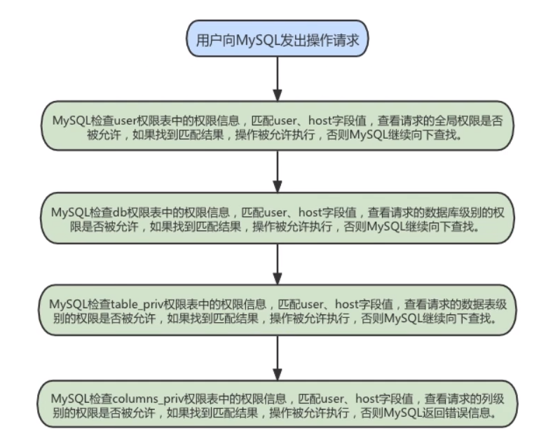

# 第17章_用户与权限管理

## 1. 用户管理

MySQL用户可以分为普通用户和root用户。root用户是超级管理员，拥有所有权限，包括创建用户、删除用户和修改用户的密码等管理权限；普通用户只拥有被授权的各种权限。

MySQL提供了许多语句来管理用户账户，这些语句可以用来管理包括登录和退出MySQL服务器、创建用户、删除用户、密码管理和权限管理等内容。

MySQL数据库的安全性需要通过账户管理来保证。

### 1.1登录MySQL服务器

启动MySQL服务后，可以通过mysql命令来登录MySQL服务器，命令如下：

```sh
mysql [-h hostname|hostIP -P port] -u username -p databaseName -e "SQL语句"
```

参数详解：

+ <font style="color:rgb(232,105,0)">`-h参数`</font>：指定MySQL服务所在的主机名或者主机IP，若不指定则自动连接本地的MySQL
+ <font style="color:rgb(232,105,0)">`-P参数`</font>：指定MySQL服务的端口，默认端口是3306，若不指定则自动连接到3306端口
+ <font style="color:rgb(232,105,0)">`-u参数`</font>：指定登录MySQL的用户名
+ <font style="color:rgb(232,105,0)">`-p参数`</font>：会提示输入密码
+ <font style="color:rgb(232,105,0)">`databaseName`</font>：登录之后选择的数据库
+ <font style="color:rgb(232,105,0)">`-e参数`</font>：指定成功登录MySQL之后要执行的SQL语句，而且执行完毕会退出MySQL登录

**范例：**

```sh
mysql -uroot -p -hlocalhost -P3306 test -e "select * from emp";
```

### 1.2 创建用户

使用`CREATE USER`语句创建用户，语法如下：

```mysql
CREATE USER 'username'[@'登录主机名'] [IDENTIFIED BY   '密码'];
```

参数详解：
+ <font style="color:rgb(232,105,0)">`username`</font>：指定创建的用户账户，格式为’username‘@'hostname'。username是用户名，hostname为主机名，，即用户连接 MySQL 时所在主机的名字。若在创建的过程中，只给出了账户的用户名，而没指定主机名，则主机名默认为“%”，表示一组主机。
+ <font style="color:rgb(232,105,0)">`IDENTIFIED BY`</font>：用于指定用户账号对应的口令，若该用户账号无口令，则可省略此子句。
+ <font style="color:rgb(232,105,0)">`密码`</font>：指定用户账号的口令

**使用注意事项：**

- 如果使用 CREATE USER 语句时没有为用户指定口令，那么 MySQL 允许该用户可以不使用口令登录系统，然而从安全的角度而言，不推荐这种做法。
- 使用 CREATE USER 语句必须拥有 MySQL 中 MySQL 数据库的 INSERT 权限或全局 CREATE USER 权限。
- 使用 CREATE USER 语句创建一个用户账号后，会在系统自身的 MySQL 数据库的 user 表中添加一条新记录。若创建的账户已经存在，则语句执行时会出现错误。
- 新创建的用户拥有的权限很少。他们可以登录 MySQL，只允许进行不需要权限的操作，如使用 SHOW 语句查询所有存储引擎和字符集的列表等。
- 如果两个用户具有相同的用户名和不同的主机名，MySQL 会将他们视为不同的用户，并允许为这两个用户分配不同的权限集合。

**范例：**

+ 使用 CREATE USER 创建一个用户，用户名是 maye，密码是 maye，主机是 localhost。

```mysql
CREATE USER 'myae'@'localhost' IDENTIFIED BY '123456' 
```

+ 不指定主机名

```mysql
CREATE USER 'maye' IDENTIFIED BY '123456';	#默认hostname为%
```

### 1.3 查看用户

在Mysql中有一个内置且名为**mysql**的数据库，这个数据库中存储的是Mysql的一些数据，比如用户、权限信息、存储过程等，所以呢，我们可以通过如下**简单的查询语句**来显示所有的用户。

```mysql
SELECT User,Host FROM mysql.`user`;
```

如果你想增加或减少一些列的显示，那么你只需要编辑这条sql语句即可，比如你只需要显示用户的用户名，那么你就可以这样使用**SELECT User FROM mysql.user;**

### 1.4 删除用户

**方式一：使用`DROP USER`语句删除(推荐)**

```mysql
DROP USER user;	
```

**范例：**

```mysql
DROP USER 'zc';					#删除的是maye@'%'
DROP USER 'maye'@'localhost';	
```

**方式二：使用`DELETE FROM`方式删除**

```mysql
DELETE FROM mysql.user WHERE Host='hostname' AND User='username';
```

执行完DELETE命令后，需要使用FLUSH命令来使用户生效：

```mysql
FLUSH PRIVILEGES;	#不刷新的话，还可以登录哦
```

**范例：**

```mysql
DELETE FROM mysql.user WHERE Host='localhost' AND User='maye';
FLUSH PRIVILEGES;
```

> 注意：不推荐通过 DELETE FROM USER u WHERE USER='li4' 进行删除，系统会有残留信息保留。而drop   user命令会删除用户以及对应的权限，执行命令后你会发现mysql.user表和mysql.db表的相应记录都消失了。


### 1.5 修改用户

#### 1.5.1 修改用户名

使用`UPDATA`语句修改用户名：

```mysql
UPDATE mysql.user SET USER='maye666' WHERE USER='maye';
FLUSH PRIVILEGES;
```

#### 1.5.2 修改当前用户密码

适用于root用户修改自己的密码以及普通用户登录之后修改自己的密码。

<font style="color:rgb(135,0,0);font:bold 13pt '微软雅黑;'">1,使用ALTER USER语句来修改当前用户密码</font>，如下语句代表修改当前登录用户的密码。基本语法如下：

```mysql
ALTER USER USER() IDENTIFIED BY '新密码';
```

<font style="color:rgb(135,0,0);font:bold 13pt '微软雅黑;'">2,使用SET语句来修改当前用户密码</font>，使用root用户登录MySQL后，可以使用SET语句来修改密码：

```mysql
SET PASSWORD='新密码'
```

#### 1.5.3 修改其他用户密码

root用户不仅可以修改自己的密码，还可以修改其他普通用户的密码。

<font style="color:rgb(135,0,0);font:bold 12pt '微软雅黑;'">1,使用ALTER语句来修改普通用户密码</font>

```mysql
ALTER USER user [IDENTIFIED BY '新密码'];
```

<font style="color:rgb(135,0,0);font:bold 13pt '微软雅黑;'">2,使用SET语句来修改普通用户密码</font>

```
SET PASSWORD FOR 'username'@'hostname'='新密码';
```

<font style="color:rgb(135,0,0);font:bold 13pt '微软雅黑;'">3,使用UPDATE语句来修改普通用户密码（不推荐）</font>

```mysql
UPDATE mysql.user SET authentication_string=PASSWORD("123456")
WHERE User='usrname' AND Host='hostname';
```

### 1.6 密码管理

MySQL中记录使用过的历史密码，目前包含如下密码管理功能：

(1) 密码过期：要求定期修改密码

(2) 密码重用限制：不允许使用旧密码

(3) 密码强度评估：要求使用高强度的密码

#### 1.6.1 密码过期策略

+ 在MySQL中，数据库管理员可以手动设置账号密码过期，也可以建立一个自动密码过期策略。
+ 过期策略可以是全局的，也可以为每个账号单独设置过期策略。

**1. 设置密码立即过期**

```mysql
ALTER USER user PASSWORD EXPLRE;
```

**范例：**

```mysql
ALTER USER 'maye'@'localhost' PASSWORD EXPIRE;
```

该语句将用户maye的密码设置为过期，maye用户任然可以登录进入数据库，但无法进行查询。只有重新设置了密码，才能正常使用。

```mysql
#不可以show数据库
mysql> show databases;
ERROR 1820 (HY000): You must reset your password using ALTER USER statement before executing this statement.
#必须先修改密码
mysql> ALTER USER USER() IDENTIFIED BY '123456';
Query OK, 0 rows affected (0.01 sec)
#修改之后可以show数据库
mysql> show databases;
+--------------------+
| Database           |
+--------------------+
| information_schema |
+--------------------+
1 row in set (0.00 sec)
```

**2. 设置指定时间过期**

如果密码使用的时间大于允许的时间，服务器会自动设置为过期，不需要手动设置。

MySQL使用`default_password_lifetime`系统变量建立全局密码过期策略。

+ 它的默认值是0，表示禁用密码自动过期
+ 它允许的值是正整数N，表示允许的密码生存期，密码必须每隔N天进行修改

**全局设置**

+ 方式①：使用SQL语句更改该变量的值并持久化

```mysql
SET PERSIST default_password_lifetime = 180;	#建立全局策略，设置密码每隔180天过期一次
```

+ 方式②：把变量添加到配置文件`my.ini`中

```css
[mysqld]
default_password_lifetime = 180
```

**指定用户过期**

每个账号既可以沿用全局密码过期策略，也可以单独设置。在`CREATE USER`和`ALTER USER`语句上加入`PASSWORD EXPIRE`选项并指定时长即可。

+ 设置密码每90天过期一次

```mysql
CREATE USER 'maye'@'localhost' PASSWORD EXPIRE INTERVAL 90 DAY;
ALTER USER 'maye'@'localhost' PASSWORD EXPIRE INTERVAL 90 DAY;
```

+ 设置密码永不过期

```mysql
CREATE USER 'maye'@'localhost' PASSWORD EXPIRE NERVER;
ALTER USER 'maye'@'localhost' PASSWORD EXPIRE NERVER;
```

+ 沿用全局密码过期策略

```MYSQL
CREATE USER 'maye'@'localhost' PASSWORD EXPIRE DEFAULT;
ALTER USER 'maye'@'localhost' PASSWORD EXPIRE DEFAULT;
```

#### 1.6.2 密码重用策略

MySQL限制使用已用过的密码。重用限制策略基础密码更改的数量和使用时间。重用策略可以是全局的，也可以为每个账号单独设置。

+ 账号的历史密码包含过去该账号所使用的密码。MySQL基于以下规则来限制密码重用：
  + 如果账号的密码限制基于密码更改的数量，那么新的密码不能从最近限制的密码数量中选择。列如：如果密码更改的最小值为3，那么新密码不能与最近3个密码中任何一个相同。
  + 如果账号密码限制基于时间，那么新密码不能从规定时间内选择。例如，如果密码重用周期为60天，那么新密码不能从最近60天内使用的密码中选择。
+ MySQL使用password_history和password_reuse_interval系统变量设置密码重用策略。
  + password_history：规定密码重用的数量
  + password_reuse_interval：对应密码重用的周期
+ 这两个变量在服务器的配置文件中进行维护，也可以在运行期间使用SQL语句更改该变量的值并持久化。

**全局设置**

方式①：使用SQL

```mysql
SET PERSIST password_history = 6; #设置不能选择最近使用过的6个密码
SET PERSIST password_reuse_interval = 365; #设置不能选择最近一年内的密码
```

方式②：把变量添加到配置文件`my.ini`中

```css
[mysqld]
password_history=6
password_reuse_interval=365
```

**单独设置**

```mysql
#不能使用最近5个密码：
CREATE USER 'maye'@'localhost' PASSWORD HISTORY 5; 
ALTER USER 'maye'@'localhost' PASSWORD HISTORY 5;

#不能使用最近365天内的密码：
CREATE USER 'maye'@'localhost' PASSWORD REUSE INTERVAL 365 DAY; 
ALTER USER 'maye'@'localhost' PASSWORD REUSE INTERVAL 365 DAY;

#既不能使用最近5个密码，也不能使用365天内的密码
CREATE USER 'maye'@'localhost' 
PASSWORD HISTORY 5 
PASSWORD REUSE INTERVAL 365 DAY;

ALTER USER 'maye'@'localhost'
PASSWORD HISTORY 5
PASSWORD REUSE INTERVAL 365 DAY;
```

## 2. 权限管理

关于MySQL的权限简单的理解就是MySQL允许你做你权力以内的事情，不可以越界。比如只允许你执行SELECT语句，那么你就不能执行UPDATE语句；只允许你从某台机器上连接MySQL，那么你就不能从除那台极其以外的其他机器上连接MySQL。

### **2.1** **权限列表**

MySQL到底都有哪些权限呢？

```mysql
show privileges;
```

| 权限                                                         | 含义和可授予级别                                             |
| :----------------------------------------------------------- | :----------------------------------------------------------- |
| [`ALL [PRIVILEGES]`](https://dev.mysql.com/doc/refman/8.0/en/privileges-provided.html#priv_all) | 授予除 GRANT OPTION 和 PROXY 之外的指定访问级别的所有权限。  |
| [`ALTER`](https://dev.mysql.com/doc/refman/8.0/en/privileges-provided.html#priv_alter) | 启用修改表权限；Levels: Global, database, table.             |
| [`ALTER ROUTINE`](https://dev.mysql.com/doc/refman/8.0/en/privileges-provided.html#priv_alter-routine) | 允许更改或删除存储的例程(过程和函数)。. Levels: Global, database, routine. |
| [`CREATE`](https://dev.mysql.com/doc/refman/8.0/en/privileges-provided.html#priv_create) | 允许创建数据库和表. Levels: Global, database, table.         |
| [`CREATE ROLE`](https://dev.mysql.com/doc/refman/8.0/en/privileges-provided.html#priv_create-role) | 允许创建角色. Level: Global.                                 |
| [`CREATE ROUTINE`](https://dev.mysql.com/doc/refman/8.0/en/privileges-provided.html#priv_create-routine) | 允许创建存储例程。 Levels: Global, database.                 |
| [`CREATE TABLESPACE`](https://dev.mysql.com/doc/refman/8.0/en/privileges-provided.html#priv_create-tablespace) | 允许创建、更改或删除表空间和日志文件组。Level: Global.       |
| [`CREATE TEMPORARY TABLES`](https://dev.mysql.com/doc/refman/8.0/en/privileges-provided.html#priv_create-temporary-tables) | 允许使用`CREATE TEMPORARY TABLE`创建临时表。 Levels: Global, database. |
| [`CREATE USER`](https://dev.mysql.com/doc/refman/8.0/en/privileges-provided.html#priv_create-user) | 允许 [`CREATE USER`](https://dev.mysql.com/doc/refman/8.0/en/create-user.html), [`DROP USER`](https://dev.mysql.com/doc/refman/8.0/en/drop-user.html), [`RENAME USER`](https://dev.mysql.com/doc/refman/8.0/en/rename-user.html)and [`REVOKE ALL PRIVILEGES`](https://dev.mysql.com/doc/refman/8.0/en/revoke.html). Level: Global. |
| [`CREATE VIEW`](https://dev.mysql.com/doc/refman/8.0/en/privileges-provided.html#priv_create-view) | 允许创建和修改视图. Levels: Global, database, table.         |
| [`DELETE`](https://dev.mysql.com/doc/refman/8.0/en/privileges-provided.html#priv_delete) | 允许使用 [`DELETE`](https://dev.mysql.com/doc/refman/8.0/en/delete.html). Level: Global, database, table. |
| [`DROP`](https://dev.mysql.com/doc/refman/8.0/en/privileges-provided.html#priv_drop) | 允许删除数据库、表和视图。 Levels: Global, database, table.  |
| [`DROP ROLE`](https://dev.mysql.com/doc/refman/8.0/en/privileges-provided.html#priv_drop-role) | 允许删除角色。Level: Global.                                 |
| [`EVENT`](https://dev.mysql.com/doc/refman/8.0/en/privileges-provided.html#priv_event) | 为 Event Scheduler 启用事件。Levels: Global, database.       |
| [`EXECUTE`](https://dev.mysql.com/doc/refman/8.0/en/privileges-provided.html#priv_execute) | 允许用户执行存储的例程。 Levels: Global, database, routine.  |
| [`FILE`](https://dev.mysql.com/doc/refman/8.0/en/privileges-provided.html#priv_file) | 允许用户通过服务器读取或写入文件. Level: Global.             |
| [`GRANT OPTION`](https://dev.mysql.com/doc/refman/8.0/en/privileges-provided.html#priv_grant-option) | 允许向其他帐户授予或删除权限。 Levels: Global, database, table, routine, proxy. |
| [`INDEX`](https://dev.mysql.com/doc/refman/8.0/en/privileges-provided.html#priv_index) | 允许创建或删除索引。。Levels: Global, database, table.       |
| [`INSERT`](https://dev.mysql.com/doc/refman/8.0/en/privileges-provided.html#priv_insert) | 允许使用 [`INSERT`](https://dev.mysql.com/doc/refman/8.0/en/insert.html). Levels: Global, database, table, column. |
| [`LOCK TABLES`](https://dev.mysql.com/doc/refman/8.0/en/privileges-provided.html#priv_lock-tables) | 允许在拥有 SELECT 权限的表上启用 LOCK TABLES。。Levels: Global, database. |
| [`PROCESS`](https://dev.mysql.com/doc/refman/8.0/en/privileges-provided.html#priv_process) | 允许用户使用SHOW PROCESSLIST查看所有进程。Level: Global.     |
| [`PROXY`](https://dev.mysql.com/doc/refman/8.0/en/privileges-provided.html#priv_proxy) | 允许使用代理。 Level: From user to user.                     |
| [`REFERENCES`](https://dev.mysql.com/doc/refman/8.0/en/privileges-provided.html#priv_references) | 允许创建外键。 Levels: Global, database, table, column.      |
| [`RELOAD`](https://dev.mysql.com/doc/refman/8.0/en/privileges-provided.html#priv_reload) | 允许 [`FLUSH`](https://dev.mysql.com/doc/refman/8.0/en/flush.html) 操作. Level: Global. |
| [`REPLICATION CLIENT`](https://dev.mysql.com/doc/refman/8.0/en/privileges-provided.html#priv_replication-client) | 使用户能够询问源或副本服务器在哪里。 Level: Global.          |
| [`REPLICATION SLAVE`](https://dev.mysql.com/doc/refman/8.0/en/privileges-provided.html#priv_replication-slave) | 使副本能够从源读取二进制日志事件。Level: Global.             |
| [`SELECT`](https://dev.mysql.com/doc/refman/8.0/en/privileges-provided.html#priv_select) | 允许使用 [`SELECT`](https://dev.mysql.com/doc/refman/8.0/en/select.html). Levels: Global, database, table, column. |
| [`SHOW DATABASES`](https://dev.mysql.com/doc/refman/8.0/en/privileges-provided.html#priv_show-databases) | 允许 [`SHOW DATABASES`](https://dev.mysql.com/doc/refman/8.0/en/show-databases.html) 显示所有数据库. Level: Global. |
| [`SHOW VIEW`](https://dev.mysql.com/doc/refman/8.0/en/privileges-provided.html#priv_show-view) | 允许使用 [`SHOW CREATE VIEW`](https://dev.mysql.com/doc/refman/8.0/en/show-create-view.html). Levels: Global, database, table. |
| [`SHUTDOWN`](https://dev.mysql.com/doc/refman/8.0/en/privileges-provided.html#priv_shutdown) | 允许使用 [**mysqladmin shutdown**](https://dev.mysql.com/doc/refman/8.0/en/mysqladmin.html). Level: Global. |
| [`SUPER`](https://dev.mysql.com/doc/refman/8.0/en/privileges-provided.html#priv_super) | 启用其他管理操作，例如 [`CHANGE REPLICATION SOURCE TO`](https://dev.mysql.com/doc/refman/8.0/en/change-replication-source-to.html), [`CHANGE MASTER TO`](https://dev.mysql.com/doc/refman/8.0/en/change-master-to.html), [`KILL`](https://dev.mysql.com/doc/refman/8.0/en/kill.html), [`PURGE BINARY LOGS`](https://dev.mysql.com/doc/refman/8.0/en/purge-binary-logs.html), [`SET GLOBAL`](https://dev.mysql.com/doc/refman/8.0/en/set-variable.html), and [**mysqladmin debug**](https://dev.mysql.com/doc/refman/8.0/en/mysqladmin.html) command. Level: Global. |
| [`TRIGGER`](https://dev.mysql.com/doc/refman/8.0/en/privileges-provided.html#priv_trigger) | 启用触发器操作. Levels: Global, database, table.             |
| [`UPDATE`](https://dev.mysql.com/doc/refman/8.0/en/privileges-provided.html#priv_update) | 允许使用 [`UPDATE`](https://dev.mysql.com/doc/refman/8.0/en/update.html). Levels: Global, database, table, column. |
| [`USAGE`](https://dev.mysql.com/doc/refman/8.0/en/privileges-provided.html#priv_usage) | 和 “no privileges”一样，意为没有权限                         |

（1） CREATE和DROP权限 ，可以创建新的数据库和表，或删除（移掉）已有的数据库和表。如果将MySQL数据库中的DROP权限授予某用户，用户就可以删除MySQL访问权限保存的数据库。  

（2） SELECT、INSERT、UPDATE和DELETE权限 允许在一个数据库现有的表上实施操作。 

（3） SELECT权限只有在它们真正从一个表中检索行时才被用到。 

（4） INDEX权限 允许创建或删除索引，INDEX适用于已有的表。如果具有某个表的CREATE权限，就可以在CREATE TABLE语句中包括索引定义。

 （5） ALTER权限 可以使用ALTER TABLE来更改表的结构和重新命名表。 

（6） CREATE ROUTINE权限 用来创建保存的程序（函数和程序），ALTER ROUTINE权限用来更改和删除保存的程序， EXECUTE权限 用来执行保存的程序。

 （7） GRANT权限 允许授权给其他用户，可用于数据库、表和保存的程序。

 （8） FILE权限 使用户可以使用LOAD DATA INFILE和SELECT ... INTO OUTFILE语句读或写服务器上的文件，任何被授予FILE权限的用户都能读或写MySQL服务器上的任何文件（说明用户可以读任何数据库目录下的文件，因为服务  器可以访问这些文件）。


### **2.2** **授予权限的原则**

权限控制主要是出于安全因素，因此需要遵循以下几个 经验原则 ：

1、只授予能`满足需要的最小权限 `，防止用户干坏事。比如用户只是需要查询，那就只给select权限就可以了，不要给用户赋予update、insert或者delete权限。

2、创建用户的时候`限制用户的登录主机` ，一般是限制成指定IP或者内网IP段。

3、为每个用户`设置满足密码复杂度的密码 `。

4、 `定期清理不需要的用户` ，回收权限或者删除用户。

### 2.3 授予权限

给用户授权的方式有 2 种，分别是通过把`角色赋予用户给用户授权`和`直接给用户授权`。用户是数据库的使用者，我们可以通过给用户授予访问数据库中资源的权限，来控制使用者对数据库的访问，消除安全隐患。

授权命令： 

```mysql
GRANT priv_type[,priv_type1...] ON databasename.tablename TO username@hostname;
```

**范例：**

+ 给li4用户用本地命令行方式，授予atguigudb这个库下的所有表的插删改查的权限。

  ```mysql
  GRANT SELECT,INSERT,DELETE,UPDATE ON test.* TO 'maye'@'localhost';
  ```

+ 授予通过网络方式登录的tom用户  ，对所有库所有表的全部权限。注意这里唯独不包括grant的权限

  ```mysql
  GRANT ALL PRIVILEGES ON *.* TO 'tom'@'%';
  ```

  + ALL PRIVILEGES 是表示所有权限，你也可以使用SELECET、UPDATE等权限。
  + ON用来指定权限针对哪些数据库和表
  + \*.\* 前面的\*用来指定数据库名，后面的\*用来指定表名；在这里表示所有数据库的所有表
  + TO表示将权限赋予某个用户。
  + maye@'localhost'表示maye用户，@后面接限制的主机，可以是IP、IP段、域名以及%
  
+ 如果需要赋予包括GRANT的权限，添加参数`WITH GRANT OPTION`选项即可，表示该用户可以将自己拥有的权限授予给别人。经常有人在创建操作用户的时候不指定`WITH GRANT OPTION`选项导致后来该用户不能使用GRANT命令创建用户或者给其他用户授权。


 **MySQL 的 权限，分别可以作用在多个层次上**

- 所有库的所有表
- 单库下的所有表（最常用的授权级别）
- 单表下的所有列
- 单列权限：企业里称单列授权为 脱敏，即脱离敏感信息，涉及到敏感信息一定要脱敏
  + 例如：
  + 授予vip账号对某一表下所有列的查询权限
  + 而授予非vip账号对某一表下的某一列的查询权限
- 针对存储过程的权限
- 针对函数的权限

```mysql
#（1）针对所有库的所有表：*.* 
grant select on *.* to maye@'localhost'; 

#（2）针对某一数据库：test.*
grant select on test.* to maye@'localhost'; 

#（3）针对某一个表：test.t1
grant select on db1.t1 to maye@'localhost';  

#（4）针对某一个字段：
grant select(empno,ename,job),update (comm) on test.emp to maye@'localhost'; 

#（5）作用在存储过程上：

DELIMITER //
CREATE PROCEDURE pro_show()
BEGIN
	SELECT * FROM test.emp;
END //

show procedure status; -- 查看到db1下有一个名为p1的存储过程 

grant execute on procedure test.emp to maye@'localhost';

#（6）作用在函数上：
delimiter //
create function f1(i1 int,i2 int)
returns int
BEGIN
    declare num int;
    set num = i1 + i2;
    return(num);
END //
delimiter ;

show function status; -- 查看到db1下有一个名为f1的函数

grant execute on function test.f1 to maye@'localhost';
```


 


>我们在开发应用的时候，经常会遇到一种需求，就是要根据用户的不同，对数据进行横向和纵向的  分组。
>
>所谓横向的分组，就是指用户可以接触到的数据的范围，比如可以看到哪些表的数据；
>
>所谓纵向的分组，就是指用户对接触到的数据能访问到什么程度，比如能看、能改，甚至是 删除。

  

### **2.4** **查看权限**

+ 查看当前用户权限 

```mysql
SHOW GRANTS;
#or
SHOW GRANTS FOR CURRENT_USER;
#or
SHOW GRANTS FOR CURRENT_USER();
```

+ 查看某用户的全局权限（root用户）

```mysql
SHOW GRANTS FOR 'user'@'hostname';
```


### 2.5 收回权限

收回权限就是取消已经赋予用户的某些权限。**收回用户不必要的权限可以在一定程度上保证系统的安全**  性。MySQL中使用 REVOKE语句取消用户的某些权限。使用REVOKE收回权限之后，用户账户的记录将从db、host、tables_priv和columns_priv表中删除，但是用户账户记录仍然在user表中保存（删除user表中   的账户记录使用DROP USER语句）。

**注意：在将用户账户从use表删除之前，应该收回相应用户的所有权限。**

+ 收回权限语法

```mysql
REVOKE  priv_type[,priv_type1...] ON databasename.tablename FROM 'username'@'hostname';
```

**范例：**

```mysql
#收回指定用户的全库全表的所有权限
REVOKE ALL PRIVILEGES ON *.* FROM 'tom'@'%';

#收回指定用户mysql库下的所有表的增删改查权限
REVOKE SELECT,INSERT,UPDATE,DELETE ON mysql.* FROM 'tom'@'localhost';
```

用户重启登录后才生效。


## **3.** 权限表

MySQL服务器通过`权限表来控制用户对数据库的访问`，权限表存放在mysql数据库中。MySQL数据库系统会根据这些权限表的内容为每个用户授予相应的权限。这些权限表中最重要的是`user表`、`db表`。除此之外，还有`table_priv表`、`column_priv表`和`proc_priv表`等。在MySQL启动时，服务器将这些数据库表中权限信息的内容读入内存。

| 表名          | 描述               |
| ------------- | ------------------ |
| user          | 用户账号及权限信息 |
| global_grants | 动态全局授权       |
| db            | 数据库层级的权限   |
| tables_priv   | 表层级的权限       |
| columns_priv  | 列层级的权限       |

### 3.1 user表

user表是MySQL中最重要的一个权限表， 记录用户账号和权限信息 。需要注意的是，在 user 表里启用的所有权限都是全局级的，适用于所有数据库。

user表中的字段可以分成4类，分别是`用户列`、`权限列`、`安全列`和`资源控制列`。

#### 用户列

用户列存储了用户连接 MySQL 数据库时需要输入的信息。需要注意的是 MySQL 5.7 版本不再使用 Password 来作为密码的字段，而改成了 authentication_string。

| 字段                  | 类型      | 是否为Null | 默认值 | 说明   |
| --------------------- | --------- | ---------- | ------ | ------ |
| Host                  | char(255) | NO         |     | 主机名 |
| User                  | char(32)  | NO         |     | 用户名 |
| authentication_string    | text                              | YES  | NULL | 密码            |

#### 权限列

权限列的字段决定了用户的权限，用来描述在全局范围内允许对数据和数据库进行的操作。

权限大致分为两大类，分别是高级管理权限和普通权限：

- 高级管理权限主要对数据库进行管理，例如关闭服务的权限、超级权限和加载用户等；
- 普通权限主要操作数据库，例如查询权限、修改权限等。

user 表的权限列包括 Select_priv、Insert_ priv 等以 priv 结尾的字段，这些字段值的数据类型为 ENUM，可取的值只有 Y 和 N：Y 表示该用户有对应的权限，N 表示该用户没有对应的权限。从安全角度考虑，这些字段的默认值都为 N。

| 字段 | 类型 | 是否为Null | 默认值 |  |
| ---- | ---- | ---------- | ---- | ---- |
| Select_priv              | enum('N','Y')                     | NO   | N                     | 是否可以通过SELECT 命令查询数据  |
| Insert_priv              | enum('N','Y')                     | NO   | N                     | 是否可以通过 INSERT 命令插入数据 |
| Update_priv              | enum('N','Y')                     | NO   | N                     | 是否可以通过UPDATE 命令修改现有数据 |
| Delete_priv              | enum('N','Y')                     | NO   | N                     | 是否可以通过DELETE 命令删除现有数据 |
| Create_priv              | enum('N','Y')                     | NO   | N                     | 是否可以创建新的数据库和表        |
| Drop_priv                | enum('N','Y')                     | NO   | N                     | 是否可以删除现有数据库和表        |
| Reload_priv              | enum('N','Y')                     | NO   | N                     | 是否可以执行刷新和重新加载MySQL所用的各种内部缓存的特定命令，包括日志、权限、主机、查询和表 |
| Shutdown_priv            | enum('N','Y')                     | NO   | N                     | 是否可以关闭MySQL服务器。将此权限提供给root账户之外的任何用户时，都应当非常谨慎 |
| Process_priv             | enum('N','Y')                     | NO   | N                     | 是否可以通过SHOW PROCESSLIST命令查看其他用户的进程 |
| File_priv                | enum('N','Y')                     | NO   | N                     | 是否可以执行SELECT INTO OUTFILE和LOAD DATA INFILE命令 |
| Grant_priv               | enum('N','Y')                     | NO   | N                     | 是否可以将自己的权限再授予其他用户    |
| References_priv          | enum('N','Y')                     | NO   | N                     | 是否可以创建外键约束           |
| Index_priv               | enum('N','Y')                     | NO   | N                     | 是否可以对索引进行增删查         |
| Alter_priv               | enum('N','Y')                     | NO   | N                     | 是否可以重命名和修改表结构        |
| Show_db_priv             | enum('N','Y')                     | NO   | N                     | 是否可以查看服务器上所有数据库的名字，包括用户拥有足够访问权限的数据库 |
| Super_priv               | enum('N','Y')                     | NO   | N                     | 是否可以执行某些强大的管理功能，例如通过KILL命令删除用户进程；使用SET GLOBAL命令修改全局MySQL变量，执行关于复制和日志的各种命令。（超级权限） |
| Create_tmp_table_priv    | enum('N','Y')                     | NO   | N                     | 是否可以创建临时表            |
| Lock_tables_priv         | enum('N','Y')                     | NO   | N                     | 是否可以使用LOCK TABLES命令阻止对表的访问/修改 |
| Execute_priv             | enum('N','Y')                     | NO   | N                     | 是否可以执行存储过程           |
| Repl_slave_priv          | enum('N','Y')                     | NO   | N                     | 是否可以读取用于维护复制数据库环境的二进制日志文件 |
| Repl_client_priv         | enum('N','Y')                     | NO   | N                     | 是否可以确定复制从服务器和主服务器的位置 |
| Create_view_priv         | enum('N','Y')                     | NO   | N                     | 是否可以创建视图             |
| Show_view_priv           | enum('N','Y')                     | NO   | N                     | 是否可以查看视图             |
| Create_routine_priv      | enum('N','Y')                     | NO   | N                     | 是否可以更改或放弃存储过程和函数     |
| Alter_routine_priv       | enum('N','Y')                     | NO   | N                     | 是否可以修改或删除存储函数及函数     |
| Create_user_priv         | enum('N','Y')                     | NO   | N                     | 是否可以执行CREATE USER命令，这个命令用于创建新的MySQL账户 |
| Event_priv               | enum('N','Y')                     | NO   | N                     | 是否可以创建、修改和删除事件       |
| Trigger_priv             | enum('N','Y')                     | NO   | N                     | 是否可以创建和删除触发器         |
| Create_tablespace_priv   | enum('N','Y')                     | NO   | N                     | 是否可以创建表空间            |

#### 安全列

安全列主要用来判断用户是否能够登录成功。

|字段|类型|是否为Null|默认值|说明|
|---|---|---|---|---|
| ssl_type                 | enum('','ANY','X509','SPECIFIED') | NO   |                       | 支持ssl标准加密安全字段 |
| ssl_cipher               | blob                              | NO   | NULL                  | 支持ssl标准安全字段       |
| x509_issuer              | blob                              | NO   | NULL                  | 支持x509字段     |
| x509_subject             | blob                              | NO   | NULL                  | 支持x509字段          |
| plugin                   | char(64)                          | NO   | caching_sha2_password | 引入plugins以进行用户连接时的密码验证，plugin创建外部/代理用户 |
| password_expired         | enum('N','Y')                     | NO   | N                     | 密码是否过期               |
| password_last_changed    | timestamp                         | YES  | NULL                  | 记录密码最近修改时间        |
| password_lifetime        | smallint unsigned                 | YES  | NULL                  | 设计密码的有效时间，单位为天数   |
| account_locked           | enum('N','Y')                     | NO   | N                     | 用户是否被锁定              |
> 注意：即使 password_expired 为“Y”，用户也可以使用密码登录 MySQL，但是不允许做任何操作。

通常标准的发行版不支持 ssl，可以使用 SHOW VARIABLES LIKE "have_openssl" 语句来查看是否具有 ssl 功能。如果 have_openssl 的值为 DISABLED，那么则不支持 ssl 加密功能。

#### 资源控制列

资源控制列的字段用来限制用户使用的资源 ，包含4个字段，分别为：

| 字段名               | 字段类型         | 是否为空 | 默认值 | 说明                             |
| -------------------- | ---------------- | -------- | ------ | -------------------------------- |
| max_questions        | int(11) unsigned | NO       | 0      | 规定每小时允许执行查询的操作次数 |
| max_updates          | int(11) unsigned | NO       | 0      | 规定每小时允许执行更新的操作次数 |
| max_connections      | int(11) unsigned | NO       | 0      | 规定每小时允许执行的连接操作次数 |
| max_user_connections | int(11) unsigned | NO       | 0      | 规定允许同时建立的连接次数       |


### **3.2** db表

db 表比较常用，是 MySQL 数据库中非常重要的权限表，表中存储了用户对某个数据库的操作权限。表中的字段大致可以分为两类，分别是用户列和权限列。

#### 用户列

db 表用户列有 3 个字段，分别是 Host、User、Db，标识从某个主机连接某个用户对某个数据库的操作权限，这 3 个字段的组合构成了 db 表的主键。

| 字段名 | 字段类型 | 为空 | 默认值 | 说明     |
| ------ | -------- | ---- | ------ | -------- |
| Host   | char(60) | NO   | 无     | 主机名   |
| Db     | char(64) | NO   | 无     | 数据库名 |
| User   | char(32) | NO   | 无     | 用户名   |

#### 权限列

db 表中的权限列和 user 表中的权限列大致相同，只是user 表中的权限是针对所有数据库的，而 db 表中的权限只针对指定的数据库。如果希望用户只对某个数据库有操作权限，可以先将 user 表中对应的权限设置为 N，然后在 db 表中设置对应数据库的操作权限。

### 3.3 tables_priv表和columns_priv表

tables_priv 表用来对单个表进行权限设置，columns_priv 表用来对单个数据列进行权限设置。

tables_priv 表结构如下表：

| 字段名      | 字段类型                                                     | 为空 | 默认值            | 说明                                                         |
| ----------- | ------------------------------------------------------------ | ---- | ----------------- | ------------------------------------------------------------ |
| Host        | char(60)                                                     | NO   | 无                | 主机                                                         |
| Db          | char(64)                                                     | NO   | 无                | 数据库名                                                     |
| User        | char(32)                                                     | NO   | 无                | 用户名                                                       |
| Table_name  | char(64)                                                     | NO   | 无                | 表名                                                         |
| Grantor     | char(93)                                                     | NO   | 无                | 修改该记录的用户                                             |
| Timestamp   | timestamp                                                    | NO   | CURRENT_TIMESTAMP | 修改该记录的时间                                             |
| Table_priv  | set('Select','Insert','Update','Delete',' Create','Drop','Grant','References', 'Index','Alter','Create View','Show view','Trigger') | NO   | 无                | 表示对表的操作权限，包括 Select、Insert、Update、Delete、Create、Drop、Grant、References、Index 和 Alter 等 |
| Column_priv | set('Select','Insert','Update','References')                 | NO   | 无                | 表示对表中的列的操作权限，包括 Select、Insert、Update 和 References |

columns_priv表的结构:

| 字段名      | 字段类型                                     | 为空 | 默认值            | 说明                                                         |
| ----------- | -------------------------------------------- | ---- | ----------------- | ------------------------------------------------------------ |
| Host        | char(60)                                     | NO   | 无                | 主机                                                         |
| Db          | char(64)                                     | NO   | 无                | 数据库名                                                     |
| User        | char(32)                                     | NO   | 无                | 用户名                                                       |
| Table_name  | char(64)                                     | NO   | 无                | 表名                                                         |
| Column_name | char(64)                                     | NO   | 无                | 数据列名称，用来指定对哪些数据列具有操作权限                 |
| Timestamp   | timestamp                                    | NO   | CURRENT_TIMESTAMP | 修改该记录的时间                                             |
| Column_priv | set('Select','Insert','Update','References') | NO   | 无                | 表示对表中的列的操作权限，包括 Select、Insert、Update 和 References |

### 3.4 procs_priv表

procs_priv表可以对 存储过程和存储函数设置操作权限 ，表结构如下表：

| 字段名       | 字段类型                               | 为空 | 默认值            | 说明                                                         |
| ------------ | -------------------------------------- | ---- | ----------------- | ------------------------------------------------------------ |
| Host         | char(60)                               | NO   | 无                | 主机名                                                       |
| Db           | char(64)                               | NO   | 无                | 数据库名                                                     |
| User         | char(32)                               | NO   | 无                | 用户名                                                       |
| Routine_name | char(64)                               | NO   | 无                | 表示存储过程或函数的名称                                     |
| Routine_type | enum('FUNCTION','PROCEDURE')           | NO   | 无                | 表示存储过程或函数的类型，Routine_type 字段有两个值，分别是 FUNCTION 和 PROCEDURE。FUNCTION 表示这是一个函数；PROCEDURE 表示这是一个 存储过程。 |
| Grantor      | char(93)                               | NO   | 无                | 插入或修改该记录的用户                                       |
| Proc_priv    | set('Execute','Alter Routine','Grant') | NO   | 无                | 表示拥有的权限，包括 Execute、Alter Routine、Grant 3种       |
| Timestamp    | timestamp                              | NO   | CURRENT_TIMESTAMP | 表示记录更新时间                                             |

## 4. 访问控制（了解一下）

正常情况下，并不希望每个用户都可以指向所有的数据库权限。当MySQL允许一个用户执行各种操作时，它首先核实该用户向MySQL服务器发送的连接请求，然后确认用户的操作请求是否被允许。这个过程称为MySQL中的访问控制过程。MySQL的访问控制分为两个阶段：`连接核实阶段`和`请求核实阶段`。

### 4.1 连接核实阶段

当用户试图连接MySQL服务器时，服务器基于用户的身份以及用户是否能提供正确的密码验证身份来确定接受或者拒绝连接。即客户端用户会在连接请求中提供用户名、主机地址、用户密码，MySQL服务器  接收到用户请求后，会**使用user表中的host、user和authentication_string这3个字段匹配客户端提供信息**。

服务器只有在user表记录的Host和User字段匹配客户端主机名和用户名，并且提供正确的密码时才接受连接。**如果连接核实没有通过，服务器就完全拒绝访问**；**否则，服务器接受连接，然后进入阶段2等待用户请求。**

### 4.2 请求核实阶段

一旦建立了连接，服务器就进入了访问控制的阶段2，也就是请求核实阶段。对此连接上进来的每个请求，服务器检查该请求要执行什么操作、是否有足够的权限来执行它，这正是需要授权表中的权限列发挥作用的地方。这些权限可以来自user、db、table_priv和column_priv表。

确认权限时，MySQL首先 检查user表 ，如果指定的权限没有在user表中被授予，那么MySQL就会继续

查db表 ，db表是下一安全层级，其中的权限限定于数据库层级，在该层级的SELECT权限允许用户查看指定数据库的所有表中的数据；如果在该层级没有找到限定的权限，则MySQL继续 检查tables_priv表 以及 columns_priv表 ，如果所有权限表都检查完毕，但还是没有找到允许的权限操作，MySQL将 返回错误信息 ，用户请求的操作不能执行，操作失败。请求核实的过程如图所示:



 >提示：  MySQL通过向下层级的顺序（从user表到columns_priv表）检查权限表，但并不是所有的权限都要执行该过程。例如，一个用户登录到MySQL服务器之后只执行对MySQL的管理操作，此时只  涉及管理权限，因此MySQL只检查user表。另外，如果请求的权限操作不被允许，MySQL也不会继  续检查下一层级的表。


## 5. 角色管理

### 5.1 角色的理解

角色是`权限的集合`，可以为角色添加或移除权限。用户可以被赋予角色，同时也被授予角色包含的权限。对角色进行操作需要较高的权限。并且像用户账户一样，角色可以有用授予和撤销的权限。

引入角色的目的是 方便管理拥有相同权限的用户 。**恰当的权限设定，可以确保数据的安全性，这是至关重要的**。


### 5.2 创建角色

创建角色使用 CREATE ROLE 语句，语法如下：

```mysql
CREATE ROLE 'role_name'[@'host_name'];
```

角色名称的命名规则和用户名类似。如果`host_name省略，默认为%，role_name不可省略`，不可为空。

练习：我们现在需要创建一个经理的角色，就可以用下面的代码：

```mysql
CREATE ROLE 'manager'@'localhost';
```


### 5.3 给角色赋予权限

创建角色之后，默认这个角色是没有任何权限的，我们需要给角色授权。给角色授权的语法结构是：

```mysql
GRANT priv_type[,priv_type1...] ON table_name TO 'role_name'[@'host_name'];
```

上述语句中privileges代表权限的名称，多个权限以逗号隔开。可使用SHOW语句查询权限名称.

```MYSQL
SHOW PRIVILEGES;
```

**范例：**我们现在想给经理角色授予商品信息表、盘点表和应付账款表的只读权限，就可以用下面的代码来实现：

```mysql
GRANT SELECT ON demo.settlement TO 'manager'; 
GRANT SELECT ON demo.goodsmaster TO 'manager';
GRANT SELECT ON demo.invcount TO 'manager';
```

### 5.4 查看角色的权限

赋予角色权限之后，我们可以通过SHOW GRANTS语句来查看权限是否创建成功了:

```mysql
mysql> SHOW GRANTS FOR 'manager';
+-------------------------------------------------------+
| Grants for manager@% |
+-------------------------------------------------------+
| GRANT USAGE ON *.* TO `manager`@`%` |
| GRANT SELECT ON `demo`.`goodsmaster` TO `manager`@`%` |
| GRANT SELECT ON `demo`.`invcount` TO `manager`@`%` |
| GRANT SELECT ON `demo`.`settlement` TO `manager`@`%` |
+-------------------------------------------------------+
```

只要你创建了一个角色，系统就会自动给你一个“ USAGE ”权限，意思是连接登录数据库的权限 。代码的最后三行代表了我们给角色“manager”赋予的权限，也就是对商品信息表、盘点表和应付账款表的只读权限。

结果显示，库管角色拥有商品信息表的只读权限和盘点表的增删改查权限。

### 5.5 回收角色的权限

角色授权后，可以对角色的权限进行维护，对权限进行添加或撤销。添加权限使用GRANT语句，与角色  授权相同。撤销角色或角色权限使用REVOKE语句。

修改了角色的权限，会影响拥有该角色的账户的权限。

撤销角色权限的SQL语法如下：

```mysql
REVOKE priv_type[,priv_type1...] ON table_name FROM 'role_name';
```

练习1：撤销school_write角色的权限。 

（1）使用如下语句撤销school_write角色的权限。

```mysql
REVOKE INSERT,UPDATE,DELETE ON shool.* FROM 'school_write';
```

（2） 撤销后使用SHOW语句查看school_write对应的权限，语句如下。

```mysql
SHOW GRANTS FOR 'school_write';
```


### 5.6 删除角色

当我们需要对业务重新整合的时候，可能就需要对之前创建的角色进行清理，删除一些不会再使用的角  色。删除角色的操作很简单，你只要掌握语法结构就行了。

```mysql
DROP ROLE role[,role1...];
```

注意，如果你删除了角色，那么用户也就失去了通过这个角色所获得的所有权限。

练习：执行如下SQL删除角色school_read。

```mysql
DROP ROLE 'school_read';
```

### 5.7 给用户赋予角色

角色创建并授权后，要赋给用户并处于 激活状态 才能发挥作用。给用户添加角色可使用GRANT语句，语法形式如下：

 ```mysql
GRANT role[,role1...] TO user_or_role[,user_or_role];
 ```

在上述语句中，role代表角色，user代表用户。可将多个角色同时赋予多个用户，用逗号隔开即可。

练习：给kangshifu用户添加角色school_read权限。   

（1）使用GRANT语句给kangshifu添加school_read权限，SQL语句如下。 

```mysql
GRANT 'school_read' TO 'maye'@'localhost';
```

（2） 添加完成后使用SHOW语句查看是否添加成功，SQL语句如下。

```mysql
SHOW GRANTS FOR 'maye'@'localhost';
```

（3） 使用kangshifu用户登录，然后查询当前角色，如果角色未激活，结果将显示NONE。SQL语句如  下。

```mysql
SELECT CURRENT_ROLE();
```

### 5.8 激活角色

**方式1：使用set default role 命令激活角色**

```mysql
SET DEFAULT ROLE ALL TO 'user_name'@'localhost';
```

**范例：**为用户激活所有拥有的角色：

```mysql
SET DEFAULT ROLE ALL TO
	'dev1'@'localhost',
	'read_user1'@'localhost',
	'read_user2'@'localhost',
	'rw_user'@'localhost';
```

**方式2：将activate_all_roles_on_login设置为ON**

默认情况：

```mysql
mysql> show variables like 'activate_all_roles_on_login';
+-----------------------------+-------+
| Variable_name	| Value |
+-----------------------------+-------+
| activate_all_roles_on_login | OFF	|
+-----------------------------+-------+
1 row in set (0.00 sec)
```

设置：

 ```mysql
SET GLOBAL activate_all_roles_on_login=ON;
 ```

这条 SQL 语句的意思是，对所有角色永久激活 。运行这条语句之后，用户才真正拥有了赋予角色的所有权限。

### 5.9 撤销用户的角色

撤销用户角色的SQL语法如下：

```mysql
REVOKE role_name FROM user_name;
```

 **范例：**撤销maye用户的school_read角色。

 （1）撤销的SQL语句如下

```mysql
REVOKE 'school_read' FROM 'maye'@'localhost';
```

（2）撤销后，执行如下查询语句，查看maye用户的角色信息

```mysql
SHOW GRANTS FOR 'maye'@'localhost';
```

执行发现，用户maye之前的school_read角色已被撤销。

### 5.10 设置强制角色(mandatory **role)**

方式1：服务启动前设置

```mysql
[mysqld]
mandatory_roles='role1,role2@localhost,role3@%.maye.com'
```

方式2：运行时设置

```mysql
SET PERSIST mandatory_roles='role1,role2@localhost,role3@%.maye.com';	#重启后依然有效
SET GLOBAL mandatory_roles='role1,role2@localhost,role3@%.maye.com';	#重启后失效
```


##  6 配置文件的使用

**_`hello`_**

