# 第17章_事务

讲师：顿开教育-顽石老师

-----

# 1.数据库事务概述

## **1.1** 存储引擎支持情况

命令来查看当前 MySQL 支持的存储引擎都有哪些，以及这些存储引擎是否支持事务。

|      |                         |
| ---- | ----------------------- |
|      | 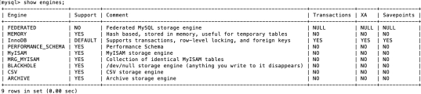 |

 

能看出在 MySQL 中，只有InnoDB 是支持事务的。

## **1.2** ***\*基本概念\****

**事务：**一组逻辑操作单元，使数据从一种状态变换到另一种状态。

**事务处理的原则：**保证所有事务都作为 一个工作单元 来执行，即使出现了故障，都不能改变这种执行方式。当在一个事务中执行多个操作时，要么所有的事务都被提交( commit )，那么这些修改就 永久 地保存下来；要么数据库管理系统将 放弃 所作的所有 修改 ，整个事务回滚( rollback )到最初状态。

 

## **1.3** ***\*事务的\*******\*ACID\*******\*特性\****

### ***\*原子性（\*******\*atomicity\*******\*）：\****

原子性是指事务是一个不可分割的工作单位，要么全部提交，要么全部失败回滚。

### ***\*一致性（\*******\*consistency\*******\*）：\****

（国内很多网站上对一致性的阐述有误，具体你可以参考 Wikipedia 对[**Consistency** ](https://en.wikipedia.org/wiki/ACID)的阐述）

根据定义，一致性是指事务执行前后，数据从一个 合法性状态 变换到另外一个 合法性状态 。这种状态是 语义上 的而不是语法上的，跟具体的业务有关。

那什么是合法的数据状态呢？满足 预定的约束 的状态就叫做合法的状态。通俗一点，这状态是由你自己来定义的（比如满足现实世界中的约束）。满足这个状态，数据就是一致的，不满足这个状态，数据就  是不一致的！如果事务中的某个操作失败了，系统就会自动撤销当前正在执行的事务，返回到事务操作  之前的状态。

### ***\*隔离型（\*******\*isolation\*******\*）：\****

事务的隔离性是指一个事务的执行 不能被其他事务干扰 ，即一个事务内部的操作及使用的数据对 并发 的其他事务是隔离的，并发执行的各个事务之间不能互相干扰。

如果无法保证隔离性会怎么样？假设A账户有200元，B账户0元。A账户往B账户转账两次，每次金额为50  元，分别在两个事务中执行。如果无法保证隔离性，会出现下面的情形：

|      |                          |
| ---- | ------------------------ |
|      | 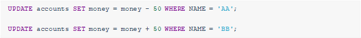 |

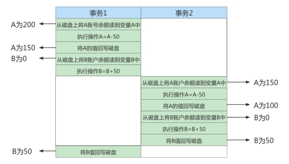 

 

### ***\*持久性（\*******\*durability\*******\*）：\****

持久性是指一个事务一旦被提交，它对数据库中数据的改变就是 永久性的 ，接下来的其他操作和数据库故障不应该对其有任何影响。

持久性是通过 事务日志 来保证的。日志包括了 重做日志 和 回滚日志 。当我们通过事务对数据进行修改的时候，首先会将数据库的变化信息记录到重做日志中，然后再对数据库中对应的行进行修改。这样做  的好处是，即使数据库系统崩溃，数据库重启后也能找到没有更新到数据库系统中的重做日志，重新执  行，从而使事务具有持久性。

 

## **1.4** ***\*事务的状态\****

我们现在知道 事务 是一个抽象的概念，它其实对应着一个或多个数据库操作，MySQL根据这些操作所执行的不同阶段把 事务 大致划分成几个状态：

### ***\*活动的（\*******\*active\*******\*）\****

事务对应的数据库操作正在执行过程中时，我们就说该事务处在 活动的 状态。

### ***\*部分提交的（\*******\*partially committed\*******\*）\****

当事务中的最后一个操作执行完成，但由于操作都在内存中执行，所造成的影响并 时，我们就说该事务处在 部分提交的 状态。

### ***\*失败的（\*******\*failed\*******\*）\****

当事务处在 活动的 或者 部分提交的 状态时，可能遇到了某些错误（数据库自身的错误、操作系统错误或者直接断电等）而无法继续执行，或者人为的停止当前事务的执行，我们就说该事务处在  败的 状态。

**
**

### ***\*中止的（\*******\*aborted\*******\*）\****

如果事务执行了一部分而变为  失败的 状态，那么就需要把已经修改的事务中的操作还原到事务执行前的状态。换句话说，就是要撤销失败事务对当前数据库造成的影响。我们把这个撤销的过程称  之为 回滚 。当 回滚 操作执行完毕时，也就是数据库恢复到了执行事务之前的状态，我们就说该事务处在了 中止的 状态。

举例：

|      |                          |
| ---- | ------------------------ |
|      | 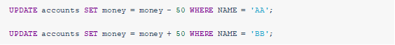 |

 

### ***\*提交的（\*******\*committed\*******\*）\****

当一个处在 部分提交的 状态的事务将修改过的数据都 同步到磁盘 上之后，我们就可以说该事务处在了 提交的 状态。

一个基本的状态转换图如下所示：

|      |                          |
| ---- | ------------------------ |
|      | 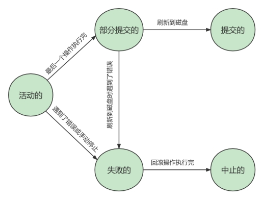 |

 

 

# **2.** ***\*如何使用事务\****

使用事务有两种方式，分别为 显式事务 和 隐式事务 。

## **2.1** ***\*显式事务\****

**步骤****1****：**	或者 BEGIN ，作用是显式开启一个事务。

|      |                          |
| ---- | ------------------------ |
|      | 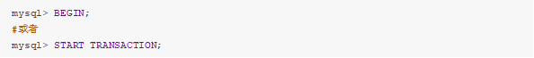 |

 

START TRANSACTION 语句相较于 BEGIN 特别之处在于，后边能跟随几个 修饰符 ：

① READ ONLY ：标识当前事务是一个 只读事务 ，也就是属于该事务的数据库操作只能读取数据，而不能修改数据。

② READ WRITE ：标识当前事务是一个 读写事务 ，也就是属于该事务的数据库操作既可以读取数据， 也可以修改数据。

③ WITH CONSISTENT SNAPSHOT ：启动一致性读。

**步骤****2****：**一系列事务中的操作（主要是DML，不含DDL）

**步骤****3****：**提交事务 或 中止事务（即回滚事务）

|      |                          |
| ---- | ------------------------ |
|      |  |

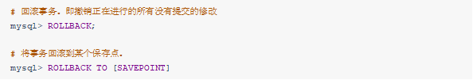 

 

 

## **2.2** ***\*隐式事务\****

MySQL中有一个系统变量 autocommit ：

|      |                          |
| ---- | ------------------------ |
|      | 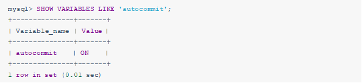 |

 

 

当然，如果我们想关闭这种 自动提交 的功能，可以使用下边两种方法之一：

显式的的使用 START TRANSACTION 或者 BEGIN 语句开启一个事务。这样在本次事务提交或者回滚前会暂时关闭掉自动提交的功能。

把系统变量 autocommit 的值设置为	，就像这样：

|      |                          |
| ---- | ------------------------ |
|      | 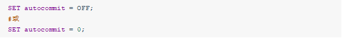 |

 

 

## **2.3** ***\*隐式提交数据的情况\****

### ***\*数据定义语言（\*******\*Data definition language\*******\*，缩写为：\*******\*DDL\*******\*）\****

 

**隐式使用或修改****mysql****数据库中的表****事务控制或关于锁定的语句**

① 当我们在一个事务还没提交或者回滚时就又使用 START TRANSACTION 或者 BEGIN 语句开启了另一个事务时，会 隐式的提交 上一个事务。即：

② 当前的 autocommit 系统变量的值为句所属的事务。

，我们手动把它调为 ON 时，也会 隐式的提交 前边语

③ 使用 LOCK TABLES 、 UNLOCK TABLES 等关于锁定的语句也会 隐式的提交 前边语句所属的事务。

### ***\*加载数据的语句\****

**关于****MySQL****复制的一些语句****其它的一些语句**

**2.4** **使用举例****1****：提交与回滚**

我们看下在 MySQL 的默认状态下，下面这个事务最后的处理结果是什么。

### ***\*情况\*******\*1\*******\*：\****

|      |                          |
| ---- | ------------------------ |
|      | 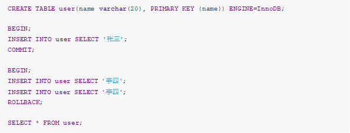 |

 

运行结果（1 行数据）：

|      |                          |
| ---- | ------------------------ |
|      | 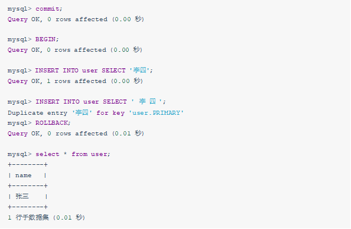 |

 

### ***\*情况\*******\*2\*******\*：\****

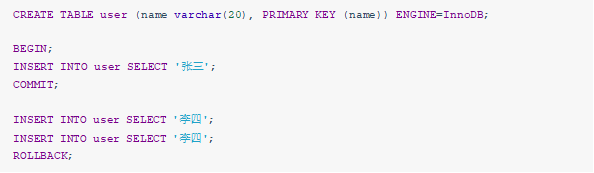

运行结果（2 行数据）：

|      |                          |
| ---- | ------------------------ |
|      | 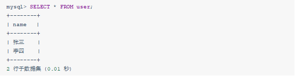 |

 

### ***\*情况\*******\*3\*******\*：\****

|      |                          |
| ---- | ------------------------ |
|      | 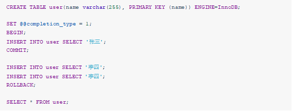 |

 

运行结果（1 行数据）：

|      |                          |
| ---- | ------------------------ |
|      | 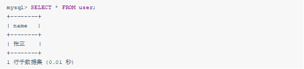 |

 

 

|      |                          |
| ---- | ------------------------ |
|      | 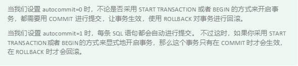 |

 

**
**

## **2.5** ***\*使用举例\*******\*2\*******\*：测试不支持事务的\*******\*engine\****

[见视频讲解（ **https://www.bilibili.com/video/BV1iq4y1u7vj?from=search&seid=4297501441472622157&s** **pm_id_from=333.337.0.0** ）](https://www.bilibili.com/video/BV1iq4y1u7vj?from=search&seid=4297501441472622157&spm_id_from=333.337.0.0)

**2.6** **使用举例****3****：****SAVEPOINT**

[见视频讲解（ **https://www.bilibili.com/video/BV1iq4y1u7vj?from=search&seid=4297501441472622157&s** **pm_id_from=333.337.0.0** ）](https://www.bilibili.com/video/BV1iq4y1u7vj?from=search&seid=4297501441472622157&spm_id_from=333.337.0.0)

 

**3.** 

|      |                          |
| ---- | ------------------------ |
|      |  |

**事务隔离级别**

MySQL是一个  客户端／服务器 架构的软件，对于同一个服务器来说，可以有若干个客户端与之连接，每个客户端与服务器连接上之后，就可以称为一个会话（ Session ）。每个客户端都可以在自己的会话中向服务器发出请求语句，一个请求语句可能是某个事务的一部分，也就是对于服务器来说可能同时处理  多个事务。事务有 隔离性 的特性，理论上在某个事务 对某个数据进行访问 时，其他事务应该进行

队 ，当该事务提交之后，其他事务才可以继续访问这个数据。但是这样对 性能影响太大 ，我们既想保持事务的隔离性，又想让服务器在处理访问同一数据的多个事务时 性能尽量高些 ，那就看二者如何权衡取舍了。

## **3.1** ***\*数据准备\****

我们需要创建一个表：

|      |                           |
| ---- | ------------------------- |
|      | 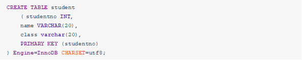 |

 

然后向这个表里插入一条数据：

|      |                           |
| ---- | ------------------------- |
|      |  |

 

现在表里的数据就是这样的：

|      |                           |
| ---- | ------------------------- |
|      | 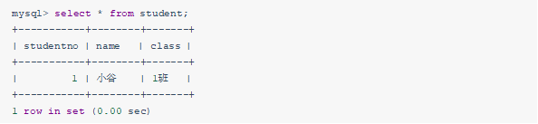 |

 

 

## **3.2** ***\*数据并发问题\****

针对事务的隔离性和并发性，我们怎么做取舍呢？先看一下访问相同数据的事务在	（也就是执行完一个再执行另一个）的情况下可能会出现哪些问题：

**1.** 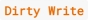**脏写（** Dirty Write **）**

对于两个事务 Session A、Session B，如果事务Session A 修改了 另一个 未提交 事务Session B 修改过 的数据，那就意味着发生了

**2.** **脏读（** Dirty Read **）**

对于两个事务 Session A、Session B，Session A 读取 了已经被 Session B 更新 但还 没有被提交 的字段。之后若 Session B 回滚 ，Session A 读取 的内容就是 临时且无效 的。

Session A和Session B各开启了一个事务，Session B中的事务先将studentno列为1的记录的name列更新为'张三'，然后Session A中的事务再去查询这条studentno为1的记录，如果读到列name的值为'张三'，而Session  B中的事务稍后进行了回滚，那么Session  A中的事务相当于读到了一个不存在的数据，这种现象就称之为 脏读 。

**3.** **不可重复读（** Non**-**Repeatable Read **）**

对于两个事务Session A、Session B，Session A 读取 了一个字段，然后 Session B 更新 了该字段。 之后

Session A 再次读取 同一个字段， 值就不同 了。那就意味着发生了不可重复读。

我们在Session B中提交了几个 隐式事务 （注意是隐式事务，意味着语句结束事务就提交了），这些事务都修改了studentno列为1的记录的列name的值，每次事务提交之后，如果Session   A中的事务都可以查看到最新的值，这种现象也被称之为 不可重复读 。

**4.** **幻读（** Phantom **）**

对于两个事务Session A、Session B, Session A 从一个表中 读取 了一个字段, 然后 Session B 在该表中 插入 了一些新的行。 之后, 如果 Session A 再次读取 同一个表, 就会多出几行。那就意味着发生了幻读。

Session A中的事务先根据条件 studentno > 0这个条件查询表student，得到了name列值为'张三'的记录； 之后Session B中提交了一个 隐式事务 ，该事务向表student中插入了一条新记录；之后Session A中的事务再根据相同的条件 studentno > 0查询表student，得到的结果集中包含Session B中的事务新插入的那条记录，这种现象也被称之为 幻读 。我们把新插入的那些记录称之为 幻影记录 。

## **3.3** ***\*SQL\*******\*中的四种隔离级别\****

上面介绍了几种并发事务执行过程中可能遇到的一些问题，这些问题有轻重缓急之分，我们给这些问题  按照严重性来排一下序：

|      |                           |
| ---- | ------------------------- |
|      |  |

 

我们愿意舍弃一部分隔离性来换取一部分性能在这里就体现在：设立一些隔离级别，隔离级别越低，并  发问题发生的就越多。 SQL标准 中设立了4个 隔离级别 ：

READ UNCOMMITTED ：读未提交，在该隔离级别，所有事务都可以看到其他未提交事务的执行结果。不能避免脏读、不可重复读、幻读。

READ COMMITTED ：读已提交，它满足了隔离的简单定义：一个事务只能看见已经提交事务所做的改变。这是大多数数据库系统的默认隔离级别（但不是MySQL默认的）。可以避免脏读，但不可  重复读、幻读问题仍然存在。

：可重复读，事务A在读到一条数据之后，此时事务B对该数据进行了修改并提 交，那么事务A再读该数据，读到的还是原来的内容。可以避免脏读、不可重复读，但幻读问题仍  然存在。这是MySQL的默认隔离级别。

：可串行化，确保事务可以从一个表中读取相同的行。在这个事务持续期间，禁止 其他事务对该表执行插入、更新和删除操作。所有的并发问题都可以避免，但性能十分低下。能避  免脏读、不可重复读和幻读。

SQL标准 中规定，针对不同的隔离级别，并发事务可以发生不同严重程度的问题，具体情况如下：

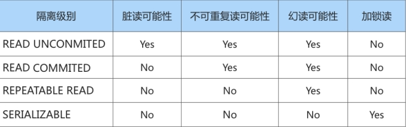 

 

脏写 怎么没涉及到？因为脏写这个问题太严重了，不论是哪种隔离级别，都不允许脏写的情况发生。

不同的隔离级别有不同的现象，并有不同的锁和并发机制，隔离级别越高，数据库的并发性能就越差，4  种事务隔离级别与并发性能的关系如下：

|      |                           |
| ---- | ------------------------- |
|      | 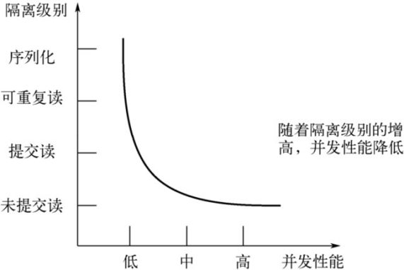 |

 

 

## **3.4** ***\*MySQL\*******\*支持的四种隔离级别\****

MySQL的默认隔离级别为REPEATABLE READ，我们可以手动修改一下事务的隔离级别。

|      |                           |
| ---- | ------------------------- |
|      | 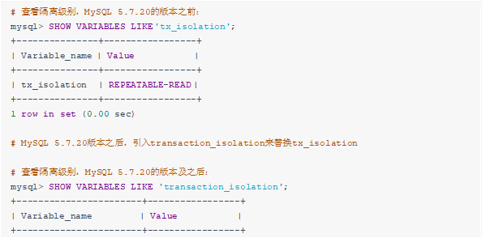 |

 

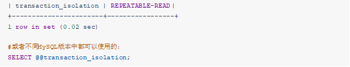

 

## **3.5** ***\*如何设置事务的隔离级别\****

### ***\*通过下面的语句修改事务的隔离级别：\****

|      |                           |
| ---- | ------------------------- |
|      | 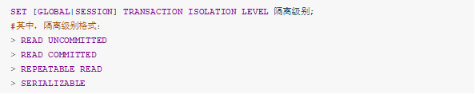 |

 

或者：

|      |                           |
| ---- | ------------------------- |
|      | 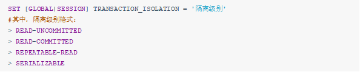 |

 

### ***\*关于设置时使用\*******\*GLOBAL\*******\*或\*******\*SESSION\*******\*的影响：\****

使用	关键字（在全局范围影响）：

|      |                           |
| ---- | ------------------------- |
|      |  |

 

则：

当前已经存在的会话无效

只对执行完该语句之后产生的会话起作用

使用 SESSION 关键字（在会话范围影响）：

|      |                           |
| ---- | ------------------------- |
|      | 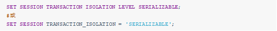 |

 

则：

对当前会话的所有后续的事务有效

如果在事务之间执行，则对后续的事务有效

该语句可以在已经开启的事务中间执行，但不会影响当前正在执行的事务

|      |                           |
| ---- | ------------------------- |
|      |  |

 

**
**

## **3.6** ***\*不同隔离级别举例\****

**演示*****1.\*** **读未提交之脏读**

设置隔离级别为未提交读：

|      |                           |
| ---- | ------------------------- |
|      | 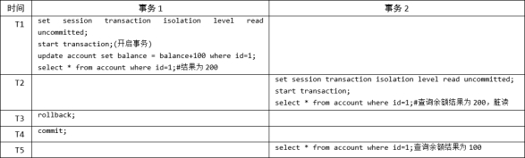 |

 

事务1和事务2的执行流程如下：

|      |                           |
| ---- | ------------------------- |
|      | 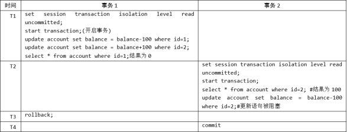 |

 

### ***\*演示\*******\**2\**\******\*：读已提交\****

|      |                           |
| ---- | ------------------------- |
|      | 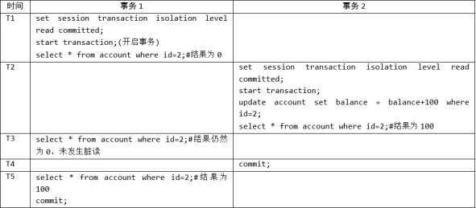 |

 

 

设置隔离级别为可重复读，事务的执行流程如下：

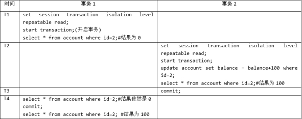 

 

### ***\*演示\*******\*4\*******\*：幻读\****

|      |                           |
| ---- | ------------------------- |
|      | 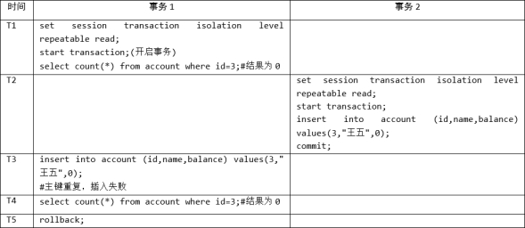 |

 

 

|      |                           |
| ---- | ------------------------- |
|      |  |

**4.** **事务的常见分类**

从事务理论的角度来看，可以把事务分为以下几种类型： 扁平事务（Flat Transactions）

带有保存点的扁平事务（Flat Transactions with Savepoints） 链事务（Chained Transactions）

嵌套事务（Nested Transactions）

分布式事务（Distributed Transactions）