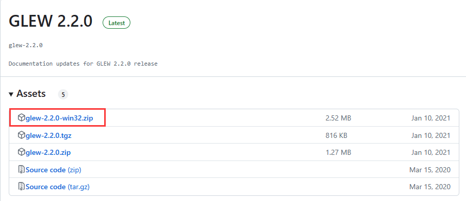
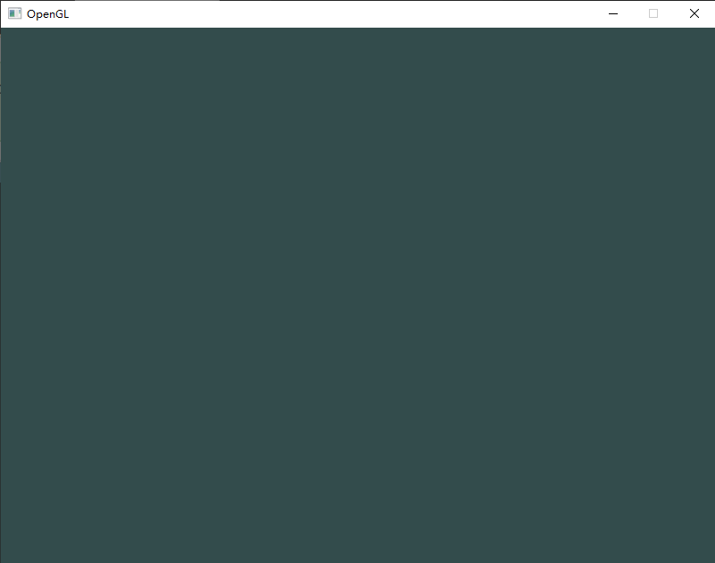

[OpenGL - LearnOpenGL CN (learnopengl-cn.github.io)](https://learnopengl-cn.github.io/01 Getting started/01 OpenGL/)

[opengl-tutorial](http://www.opengl-tutorial.org/cn/)

[GLSL版本的区别和对比 - Zoctopus_Zhang - 博客园 (cnblogs.com)](https://www.cnblogs.com/OctoptusLian/p/9909170.html)

[OpenGL文档](https://docs.gl)

# OpenGL

OpenGL只有框架没有实现，换句话说就是OpenGL只有函数声明没有源文件实现，类似于接口和虚函数。所有的实现是显卡生产商提供。比如NVIDIA或者AMD就要自己实现OpenGL函数内容，所以不同的生产商可以对自己的产品提供优化，毕竟代码是自己写的。

OpenGL函数库相关的API有核心库(gl)，实用库(glu)，辅助库(aux)、实用工具库(glut)，窗口库(glx、agl、wgl)和扩展函数库等。gl是核心，glu是对gl的部分封装。glx、agl、wgl 是针对不同窗口系统的函数。glut是为跨平台的OpenGL程序的工具包，比aux功能强大（aux很大程度上已经被glut库取代）。扩展函数库是硬件厂商为实现硬件更新利用OpenGL的扩展机制开发的函数。

## glew

glew是使用OpenGL 2.0之后的一个工具函数。

不同的显卡公司，也会发布一些只有自家显卡才支持的扩展函数，你要想用这数涵数，不得不去寻找最新的glext.h,有了GLEW扩展库，你就再也不用为找不到函数的接口而烦恼，因为GLEW能自动识别你的平台所支持的全部OpenGL高级扩展函数。也就是说，只要包含一个glew.h头文件，你就能使用gl,glu,glext,wgl,glx的全部函数。

glew包含了OpenGL所需的核心。前面已经说过openGL的实现是显卡生产商，那么系统如何才能找到这些实现好的函数呢？而且不同的平台函数存放地方还不同，文件结构也不同。有没有一种方式能够自动找到OpenGL的函数？这就是glew的作用：用来找openGL的函数，并初始化，这样我们就能直接调用OpenGL的函数了。

### 下载

在[Git hub](https://github.com/nigels-com/glew/releases)下载glew，并配置。



### 配置

```cmake
cmake_minimum_required(VERSION 3.10.0)

project(gl_test VERSION 0.1.0 LANGUAGES C)
#使用GLEW静态库，必须定义此宏
add_compile_definitions(GLEW_STATIC)	

include_directories("F:/Tools/OpenGL/glew-2.2.0/include")
link_directories("F:/Tools/OpenGL/glew-2.2.0/lib/Release/x64")

set(CMAKE_PREFIX_PATH "F:/Tools/SDL2/SDL2-2.26.5")

find_package(SDL2 REQUIRED)


add_executable(gl_test main.c)

target_link_libraries(gl_test glew32s SDL2::SDL2main SDL2::SDL2 opengl32)
```

`main.c`

```c
#include <stdio.h>
#include <SDL.h>
#include <gl/glew.h>
#include <stdbool.h>

int main(int argc, char**argv){
	//初始化SDL
    if(SDL_Init(SDL_INIT_VIDEO) != 0) {
        SDL_Log("Error initializing SDL: %s\n", SDL_GetError());
    }
	//创建窗口
    SDL_Window* window = SDL_CreateWindow("OpenGL", 100, 100, 800, 600, SDL_WINDOW_OPENGL);
    if(window == NULL) {
        SDL_Log("Error creating window: %s\n", SDL_GetError());
    }
	//设置SDL的GL属性
    SDL_GL_SetAttribute(SDL_GL_CONTEXT_MAJOR_VERSION, 3);
    SDL_GL_SetAttribute(SDL_GL_CONTEXT_MINOR_VERSION, 1);
    SDL_GL_SetAttribute(SDL_GL_DEPTH_SIZE, 32);        
    SDL_GL_SetAttribute(SDL_GL_CONTEXT_PROFILE_MASK, SDL_GL_CONTEXT_PROFILE_COMPATIBILITY);
    //SDL_GL_SetAttribute(SDL_GL_CONTEXT_PROFILE_MASK, SDL_GL_CONTEXT_PROFILE_CORE);
    //创建opengl上下文
    SDL_GLContext glCtx =  SDL_GL_CreateContext(window);
    //初始化glew
    GLenum ret = glewInit();
    if (ret != GLEW_OK)
    {
        SDL_Log("Error initializing GLEW: %s\n", glewGetErrorString(ret));
    }

    SDL_Event  event;
    bool running = true;
    while (running)
    {
        if(SDL_PollEvent(&event)) {
            if(event.type == SDL_QUIT)
                running = false;
        }
		// 你的渲染代码

        // 用OpenGL渲染更新窗口。
        SDL_GL_SwapWindow(window);
    }
    //删除opengl上下文
    SDL_GL_DeleteContext(glCtx);
    SDL_Quit();
    return 0;
}
```

为了测试是否正常，我们设置一个颜色，然后用该颜色清空屏幕看一下。(加在上面的渲染代码处。)

```c
        //设置清空颜色并清空屏幕
        glClearColor(0.2f, 0.3f, 0.3f, 1.0f);
        glClear(GL_COLOR_BUFFER_BIT);
```

效果如下，表示成功啦！



## 你好，三角形

想要绘制一个三角形，就必须知道三角形的三个顶点（顶点是空间中的一个点，一般由它的坐标表示）数据。

### 顶点输入

OpenGL是一个3D图形库，所以在OpenGL中我们指定的所有坐标都是3D坐标（x、y和z）。OpenGL不是简单地把**所有的**3D坐标变换为屏幕上的2D像素；OpenGL仅当3D坐标在3个轴（x、y和z）上-1.0到1.0的范围内时才处理它。所有在这个范围内的坐标叫做标准化设备坐标(Normalized Device Coordinates)，此范围内的坐标最终显示在屏幕上（在这个范围以外的坐标则不会显示）。

由于我们希望渲染一个三角形，我们一共要指定三个顶点，每个顶点都有一个3D位置。我们会将它们以标准化设备坐标的形式（OpenGL的可见区域）定义为一个`float`数组。

```cpp
float vertices[]={
  	-0.5f,-0.5f,
     0.5f,-0.5f,
     0.0f, 0.5f
};
```

接下来需要把，顶点数据传递给显卡。

```cpp
    GLuint vbo;
    glGenBuffers(1, &vbo);
    glBindBuffer(GL_ARRAY_BUFFER, vbo);
    glBufferData(GL_ARRAY_BUFFER, 6 * sizeof(float), vertices, GL_STATIC_DRAW);
```

> VBO：Vertex Buffer Object（顶点缓冲对象）

现在有了顶点数据，接着应该就可以绘制出来了。

```cpp
    glDrawArrays(GL_TRIANGLES,0,3);
```

> 把这行代码放到循环中的渲染代码处。

但是当我们运行程序时，什么都没有，为啥呢？因为此时GPU不知道如何解析我们传递顶点数据。所以需要使用`glVertexAttribPointer`将当前的顶点属性与顶点缓冲对象（VBO）关联起来。

```cpp
    glEnableVertexAttribArray(0);
    glVertexAttribPointer(0, 2, GL_FLOAT, GL_FALSE, 2 * sizeof(float), 0);
```

此时，再运行，能看到一个白色的三角形(也不一定会出现三角形，这个取决于显卡的实现)。至于为何是白色，因为如果你没有使用着色器，那么显卡会自动帮你生成一个，自动给你生成的着色器就是白色的。


### 着色器

着色器是一个运行在GPU上的程序，可以编写着色器代码。

```cpp
GLuint CreateShader(GLenum shaderType,const std::string& source)
{
    GLuint shader = glCreateShader(shaderType);
    const char* src = source.c_str();
    glShaderSource(shader, 1, &src, NULL);
    glCompileShader(shader);

    GLint result;
    glGetShaderiv(shader, GL_COMPILE_STATUS, &result);
    if(result != GL_TRUE)
    {
        GLint infoLogLength;
        glGetShaderiv(shader, GL_INFO_LOG_LENGTH, &infoLogLength);
        char* infoLog = (char*)alloca(infoLogLength);
        glGetShaderInfoLog(shader, infoLogLength,&infoLogLength, infoLog); 
        std::cout<<"Failed to compile "<<(shaderType == GL_VERTEX_SHADER ? "vertex" : "fragment")<<" shader!"<<std::endl;
        std::cout<<infoLog<<std::endl;
        glDeleteShader(shader);
    }
    return shader;
}

GLuint CreateProgram(const std::string& vertexShader,const std::string& fragmentShader)
{
    GLuint program = glCreateProgram();
    GLuint vs = CreateShader(GL_VERTEX_SHADER,vertexShader);
    GLuint fs = CreateShader(GL_FRAGMENT_SHADER,fragmentShader);

    glAttachShader(program,vs);
    glAttachShader(program,fs);
    glLinkProgram(program);
    glValidateProgram(program);

    glDeleteShader(vs);
    glDeleteShader(fs);

    return program;
}
```

`main()`

```cpp
    GLuint vbo;
    glGenBuffers(1, &vbo);
    glBindBuffer(GL_ARRAY_BUFFER, vbo);
    glBufferData(GL_ARRAY_BUFFER, 6 * sizeof(float), vertices, GL_STATIC_DRAW);

    glEnableVertexAttribArray(0);
    glVertexAttribPointer(0, 2, GL_FLOAT, GL_FALSE, 2 * sizeof(float), 0);

    const std::string vertexShader = R"(
        #version 330 core
        layout (location = 0) in vec2 position;
        void main()
        {
            gl_Position = vec4(position.x, position.y, 0.0, 1.0);
        }
    )";

    const std::string fragmentShader = R"(
        #version 330 core
        out vec4 color;
        void main()
        {
            color = vec4(1.0f, 0.5f, 0.2f, 1.0f);
        }
    )";

    auto program = CreateProgram(vertexShader,fragmentShader);
    glUseProgram(program);
```

### 矩形

三角形是OpenGL的基础元素之一，三角形在OpenGL中如此重要，主要是因为它们是构建更复杂形状的基本单元。通过组合多个三角形，你可以创建出各种多边形、曲面、甚至是整个3D模型。此外，OpenGL的渲染管线也是基于三角形的，这使得三角形成为其图形处理的基础。

那么我们要绘制一个矩形，就需要两个三角形进行拼接。

```cpp
    float vertices[] = {
        -0.5f, -0.5f,
        0.5f, -0.5f,
        0.5f, 0.5f,


        0.5f, 0.5f,
        -0.5f, 0.5f,
        -0.5f, -0.5f,
        };
  glBufferData(GL_ARRAY_BUFFER, 6*2 * sizeof(float), vertices, GL_STATIC_DRAW);

  glDrawArrays(GL_TRIANGLES,0,3*2);
```

只需要对前面的代码，做三处修改即可，如上代码所示。

可以看到，有几个顶点叠加了。我们指定了`右下角`和`左上角`两次！一个矩形只有4个而不是6个顶点，这样就产生50%的额外开销。当我们有包括上千个三角形的模型之后这个问题会更糟糕，这会产生一大堆浪费。更好的解决方案是只储存不同的顶点，并设定绘制这些顶点的顺序。这样子我们只要储存4个顶点就能绘制矩形了，之后只要指定绘制的顺序就行了。如果OpenGL提供这个功能就好了，对吧？

值得庆幸的是，元素缓冲区对象的工作方式正是如此。 EBO是一个缓冲区，就像一个顶点缓冲区对象一样，它存储 OpenGL 用来决定要绘制哪些顶点的索引。这种所谓的索引绘制(Indexed Drawing)正是我们问题的解决方案。首先，我们先要定义（不重复的）顶点，和绘制出矩形所需的索引：

```cpp
    float vertices[] = {
        -0.5f, -0.5f,
        0.5f, -0.5f,
        0.5f, 0.5f,
        -0.5f, 0.5f,
        };
    GLuint indexes[] = {
        0,1,2,
        2,3,0
    };
```

你可以看到，当使用索引的时候，我们只定义了4个顶点，而不是6个。下一步我们需要创建元素缓冲对象：

```cpp
    GLuint vbo;
	...
    GLuint ebo;
    glGenBuffers(1, &ebo);
```

与VBO类似，我们先绑定EBO然后用glBufferData把索引复制到缓冲里。同样，和VBO类似，我们会把这些函数调用放在绑定和解绑函数调用之间，只不过这次我们把缓冲的类型定义为GL_ELEMENT_ARRAY_BUFFER。

```cpp
    glBindBuffer(GL_ELEMENT_ARRAY_BUFFER, ebo);
    glBufferData(GL_ELEMENT_ARRAY_BUFFER, 6 * sizeof(GLuint),indexes, GL_STATIC_DRAW);
```

最后一件要做的事是用glDrawElements来替换glDrawArrays函数，表示我们要从索引缓冲区渲染三角形。使用glDrawElements时，我们会使用当前绑定的索引缓冲对象中的索引进行绘制：

```cpp
      glDrawElements(GL_TRIANGLES,6,GL_UNSIGNED_INT,0);
```

## OpenGL的Context（Profile）

OpenGL在渲染的时候需要一个Context，这个Context记录了OpenGL渲染需要的所有信息，可以把它理解成一个大的结构体，它里面记录了当前绘制使用的颜色、是否有光照计算以及开启的光源等非常多我们使用OpenGL函数调用设置的状态和状态属性。在OpenGL 3.0版本之前，OpenGL创建Context都是一致的，随着升级会新增一些内容（例如从OpenGL1.1升级到1.5，会新增一些状态变量或者属性，并添加一些设置这些内容的函数），整体上来说没有什么大的变化。但是从OpenGL 3.0开始，OpenGL为了摆脱历史的“包袱”，想要彻底的废弃掉之前的许多特性，但是无奈市面上已经有大量依赖OpenGL之前版本的代码，导致OpenGL维护小组的这一想法难以付诸实施，于是在OpenGL 3.1开始引入了OpenGL Context的一些分类，比如引入了CoreProfile等概念，之后随着版本发展到3.3，一切算是确定下来。

正是由于OpenGL的这一变化过程以及其间引入的各种概念，导致初学者学习OpenGL时非常的痛苦，本来OpenGL API对于一般开发者来说就是晦涩难懂，如今还引入这些内容真的是令开发者压力山大。反正我在看OpenGL Spec的时候查阅了很多资料，对这些内容还是一头雾水。本文主要论述一下这些内容，有可能我理解的并不完全正确，有错误的地方希望读者在评论中指正。

1. Context的种类
在OpenGL 3.0版本之前，所有的OpenGL Context是统一的，都是一种兼容之前版本的模式（例如使用OpenGL 1.1编写的代码，在支持OpenGL 2.1的设备上可以正常的运行）。这些版本的OpenGL API也被称之为固定管线（相比较之后引入shader的可编程管线来说）， 但是从3.0开始有了变化：

1、 OpenGL 3.0 引入了废弃机制，标记了许多OpenGL的函数是废弃的（但是3.0并没有真正移除它们，也就是说3.0版本仍然是一个可以向后兼容的Context）
2、 OpenGL 3.1发布删除了之前3.0标记的过时函数（固定管线相关的函数），但是为了之前的OpenGL代码可用， 引入了一个扩展ARB_compatibility，这个扩展可以让OpenGL 3.1支持之前的OpenGL固定管线的内容。
但是ARB_compatibility有许多问题：它将OpenGL的核心函数core profile和之前的固定管线函数绑定在了一个合集内，也就是说实现core profile函数集不能包含compatibility中不存在的函数，用户不能够要求一种Context只包含core profile的内容，这个扩展定义的函数是一个合集，core profile只是它的一个子集。两个关系类似于：（也就是说类似于一个套餐，你不能只想要你需要的那部分）


3、 正是由于这个问题，在OpenGL 3.2中正式引入了模式的概念（Profile），模式就将二者分离开来了。OpenGL 3.2 中模式包括：
（1） Core Profile 只包含最新的Shader相关的函数，程序必须使用Shader编写
（2）compatibility Profile 可以兼容之前的OpenGL固定管线的内容，也可以使用Core Profile中的内容

这样分开之后，开发者可以显式的要求创建某一种Profile来使用

4、 3.2以后的版本直到OpenGL目前最新的版本（OpenGL 4.6）都是按照这种模式来做的。
另外还有一个模式的称之为：Forward compatibility

这个是什么意思呢？第一眼看好像是向前兼容的感觉（有点类似于compatibility的意思），实际上并不是，它的真正含义是向“未来”兼容，什么是面向“未来”呢？说白了就是把所有OpenGL API中标记有deprecated标签的函数都禁用。（只对OpenGL 3.0及其以上版本有作用），具体来说是：

（1） OpenGL 3.0（3.0中标记了一些函数是deprecated），如果设置该标记，那么这些函数都不可用；
（2） OpenGL 3.1 （所有3.0和3.1中标记为deprecated的函数都不可用）；
（3） OpenGL 3.2+ compatibility Profile Context： 没有任何作用，毕竟人家是compatibility的(向后兼容）；
（4） OpenGL 3.2+ core Profile Context: 凡是标记为deprecated的函数都不可用；

OpenGL中有几个特殊的版本号，在查询API的时候非常有用：
1. OpenGL 2.1 （是所有固定管线API的合集，不包含任何coreprofile的新增的API，也称之为Legecy OpenGL）
2. OpenGL 3.3 （第一个core profile的版本，虽然3.2就有，但是一般以3.3版本作为core profile代表）
3. OpenGL最新版本（目前是OpenGL 4.6），定义了最新的特性

一般查询这几个版本的API就可以了，有一个查询OpenGL API非常实用的网站：http://docs.gl/ ，比OpenGL官网的API手册更加实用。里面提供了 gl2、gl3、gl4 的查询，对应的就是上文所说的 OpenGL 2.1、 OpenGL 3.3、 OpenGL最新版本。

2. OpenGL Core Profile Only
在某些情况下，特别是学习现代OpenGL编程的过程中，我们需要OpenGL完全废弃掉之前的固定管线的调用，也就是说我们调用了固定管线的内容，OpenGL可以给我们一个编译或者是链接运行错误，让我们了解到使用了Legecy的内容，这样方便我们集中精力到CoreProfile的内容上，知道自己调错了函数。

问题是：怎么做到这一点呢？

2.1 FreeGLUT
首先是FreeGlut中提供的解决方案：在GLUT中并没有相关的内容，毕竟GLUT出现在OpenGL 1.1版本，之后也鲜有维护升级，于是继承它的FreeGLUT开始引入Context选择的内容，在FreeGLUT中提供了下面三个函数：

    glutInitContextVersion( int majorVersion, int minorVersion );
    glutInitContextFlags( int flags );
    glutInitContextProfile( int profile );
1
2
3
4
在阅读API手册之后，我查看了自己的显卡，提示已经支持到OpenGL 4.5，于是在代码中这样调用

    glutInitContextVersion(4, 5);
    glutInitContextProfile(GLUT_CORE_PROFILE);
    glutInitContextFlags(GLUT_FORWARD_COMPATIBLE);
1
2
3
4
以期望获得OpenGL CoreProfile 4.5的特性，但是不要引入LegecyOpenGL。但是结果是”然并卵“，并不会影响我调用glVertex这样的函数，还是可以正常的渲染glVertex这样的调用。

2.2 GLFW
GLFW是一个相对较新的OpenGL图形界面框架，目前最新的版本是3.2.1。作用类似于GLUT，但是功能更加强大，支持OpenGL ES和Vulkan等特性，GLFW的更详细介绍可以参考网站 glfw

在GLFW中也提供了函数用来设置OpenGL的Contex，函数如下：

void glfwWindowHint(int hint, int value);
1
2
如果想创建一个只有CoreProfile的Context，可以设置：

    glfwWindowHint(GLFW_CONTEXT_VERSION_MAJOR, 3);
    glfwWindowHint(GLFW_CONTEXT_VERSION_MINOR, 3);
    glfwWindowHint(GLFW_OPENGL_PROFILE, GLFW_OPENGL_CORE_PROFILE);
1
2
3
上面的调用创建了一个OpenGL 3.3 版本的Profile，经过测试，发现GLFW提供了函数是有效果的，在使用CoreProfile创建的Context调用OpenGL Legecy中的函数并不起作用。如果需要使用Legecy OpenGL，可以用兼容模式（Compatibility Profile）的方式创建OpenGL Context，需要修改为：

    glfwWindowHint(GLFW_CONTEXT_VERSION_MAJOR, 3);
    glfwWindowHint(GLFW_CONTEXT_VERSION_MINOR, 3);
    //glfwWindowHint(GLFW_OPENGL_PROFILE, GLFW_OPENGL_CORE_PROFILE);
    glfwWindowHint(GLFW_OPENGL_PROFILE, GLFW_OPENGL_COMPAT_PROFILE);
1
2
3
4
使用下面的测试程序可以看到，当使用Coreprofile时，场景什么也没有，改用兼容模式后，场景可以正确渲染出三角形。

#pragma comment(lib, "glfw3dll.lib")
#pragma comment(lib, "glew32.lib")
#pragma comment(lib, "opengl32.lib")

#include <GL/glew.h>
#include <GLFW/glfw3.h>


#include <iostream>

void framebuffer_size_callback(GLFWwindow* window, int width, int height);
void processInput(GLFWwindow *window);

// settings
const unsigned int SCR_WIDTH = 800;
const unsigned int SCR_HEIGHT = 600;

int main()
{
    // glfw: initialize and configure
    // ------------------------------
    glfwInit();
    glfwWindowHint(GLFW_CONTEXT_VERSION_MAJOR, 3);
    glfwWindowHint(GLFW_CONTEXT_VERSION_MINOR, 3);
    //glfwWindowHint(GLFW_OPENGL_PROFILE, GLFW_OPENGL_CORE_PROFILE);
    glfwWindowHint(GLFW_OPENGL_PROFILE, GLFW_OPENGL_COMPAT_PROFILE);

    GLFWwindow* window = glfwCreateWindow(SCR_WIDTH, SCR_HEIGHT, "LearnOpenGL", NULL, NULL);
    if (window == NULL)
    {
        std::cout << "Failed to create GLFW window" << std::endl;
        glfwTerminate();
        return -1;
    }
    
    glfwMakeContextCurrent(window);
    glfwSetFramebufferSizeCallback(window, framebuffer_size_callback);
    
    // ---------------------------------------
    GLenum err = glewInit();
    if (GLEW_OK != err) {
        fprintf(stderr, "GLEW Error: %s\n", glewGetErrorString(err));
        return 1;
    }
    
    // render loop
    // -----------
    while (!glfwWindowShouldClose(window))
    {
        // input
        // -----
        processInput(window);
    
        glLoadIdentity();
        glTranslated(0, 0, -1);
        glBegin(GL_TRIANGLES);
        glVertex2f(0.0, 0.0);
        glVertex2f(0.5, 0.5);
        glVertex2f(0.0, 0.5);
        glEnd();


        // glfw: swap buffers and poll IO events (keys pressed/released, mouse moved etc.)
        // -------------------------------------------------------------------------------
        glfwSwapBuffers(window);
        glfwPollEvents();
    }
    
    // glfw: terminate, clearing all previously allocated GLFW resources.
    // ------------------------------------------------------------------
    glfwTerminate();
    return 0;
}

// process all input: query GLFW whether relevant keys are pressed/released this frame and react accordingly
// ---------------------------------------------------------------------------------------------------------
void processInput(GLFWwindow *window)
{
    if (glfwGetKey(window, GLFW_KEY_ESCAPE) == GLFW_PRESS)
        glfwSetWindowShouldClose(window, true);
}

// glfw: whenever the window size changed (by OS or user resize) this callback function executes
// ---------------------------------------------------------------------------------------------
void framebuffer_size_callback(GLFWwindow* window, int width, int height)
{
    // make sure the viewport matches the new window dimensions; note that width and 
    // height will be significantly larger than specified on retina displays.
    glViewport(0, 0, width, height);
}

1
2
3
4
5
6
7
8
9
10
11
12
13
14
15
16
17
18
19
20
21
22
23
24
25
26
27
28
29
30
31
32
33
34
35
36
37
38
39
40
41
42
43
44
45
46
47
48
49
50
51
52
53
54
55
56
57
58
59
60
61
62
63
64
65
66
67
68
69
70
71
72
73
74
75
76
77
78
79
80
81
82
83
84
85
86
87
88
89
90
也就是说GLFW是可以做到这一点的，推荐新手在学习OpenGL Core Profile时使用这个框架。

3. OpenGL扩展引入方式
OpenGL只是一个标准/规范，具体的实现是由驱动开发商针对特定显卡实现的。由于OpenGL驱动版本众多，它大多数函数的位置都无法在编译时确定下来，需要在运行时查询。所以任务就落在了开发者身上，开发者需要在运行时获取函数地址并将其保存在一个函数指针中供以后使用。取得地址的方法因平台而异，在Windows上会是类似这样：

// 定义函数原型
typedef void (*GL_GENBUFFERS) (GLsizei, GLuint*);
// 找到正确的函数并赋值给函数指针
GL_GENBUFFERS glGenBuffers  = (GL_GENBUFFERS)wglGetProcAddress("glGenBuffers");
// 现在函数可以被正常调用了
GLuint buffer;
glGenBuffers(1, &buffer);
1
2
3
4
5
6
7
你可以看到代码非常复杂，而且很繁琐，我们需要对每个可能使用的函数都要重复这个过程。幸运的是，有些库能简化此过程，下文提到的这两个库就提供了这种功能

3.1 GLEW
GLEW（The OpenGL Extension Wrangler Library）是一个跨平台C/C++库，用来提供导出OpenGL函数的功能，使用方式非常简单，在OpenGL渲染的Context（一般是窗口）创建好后，调用glewInit即可，代码如下：

GLenum err = glewInit();
if (GLEW_OK != err)
{
  /* Problem: glewInit failed, something is seriously wrong. */
  fprintf(stderr, "Error: %s\n", glewGetErrorString(err));
  ...
}
fprintf(stdout, "Status: Using GLEW %s\n", glewGetString(GLEW_VERSION));
1
2
3
4
5
6
7
8
之后就可以直接调用OpenGL的扩展函数了，glew除此之外还提供了查询某种OpenGL扩展在显卡中是否支持，查询的方式是使用某种扩展的枚举变量，例如，查询是否支持顶点shader，代码如下：

if (GLEW_ARB_vertex_program)
{
  /* It is safe to use the ARB_vertex_program extension here. */
  glGenProgramsARB(...);
}
1
2
3
4
5
上文中使用GLFW的示例使用了GLEW，GLEW有一个缺陷是它并没有提供一种方式可以屏蔽OpenGL Legecy函数的调用，上文中测试的代码尽管我们使用Core profile的方式，但是代码中仍然存在 glVetex、glBegin这样固定管线OpenGL的函数调用（虽然它们在Core Profile模式下没有任何作用），看起来不那么统一。要做到这一点可以使用下面的库GLAD

3.2 GLAD
GLAD并不是一个OpenGL的库，它是一个网络服务，提供了根据我们选择的OpenGL要求生成OpenGL的导出库的源码，可以访问它的网站：GLAD Service，进入之后想根据里面提供的选项，像选菜单一样选择需要的OpenGL 版本和Profile，之后点击生成便可生成对应版本OpenGL，GLAD应该提供给你了一个zip压缩文件，包含两个头文件目录，和一个glad.c文件。将两个头文件目录（glad和KHR）复制到你的Include文件夹中（或者增加一个额外的项目指向这些目录），并添加glad.c文件到你的工程中。


使用方法也很简单，在产生OpenGL Context之后，调用下面的初始化代码：

//glfw中的使用方式
    if (!gladLoadGLLoader((GLADloadproc)glfwGetProcAddress))
    {
        std::cout << "Failed to initialize GLAD" << std::endl;
        return -1;
    }
之后就可以正常调用OpenGL扩展函数了。

这样做让glad.h中仅仅只包含我们想要扩展的头文件，例如在设置3.3 + CoreProfile版本之后，可以严格控制头文件中只有这些内容，所以凡是代码中有LegecyOpenGL的调用都会在编译的时候给出错误提示。

3.3 其他
除了上面两个库之外，还有其他的一些三方库，包括Glee、glext等类似的库，提供的都是类似的功能，在此不再赘述。

