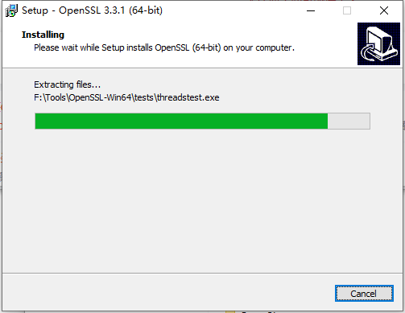

## OpenSSL

  OpenSSL是一个功能丰富且开源的安全工具箱，它提供的主要功能有：SSL协议实现(包括SSLv2、SSLv3和TLSv1)、大量软算法(对称/非对称/摘要)、大数运算、非对称算法密钥生成、ASN.1编解码库、证书请求(PKCS10)编解码、数字证书编解码、CRL编解码、OCSP协议、数字证书验证、PKCS7标准实现和PKCS12个人数字证书格式实现等功能。

### 库下载

自己编译openssl很麻烦，所以我们直接下载编译好的库，方便省事。

1. 下载地址：[Win32/Win64 OpenSSL Installer for Windows](https://slproweb.com/products/Win32OpenSSL.html)


2. 下载完毕，直接双击安装


3. 接受协议，下一步

   

   

4. 选择库安装目录


5. 询问你安装时，openssl的dll库的拷贝位置。`建议，不要拷贝到系统目录下，如果其他软件使用的OpenSSL版本与你安装这个版本不同，可能导致该软件无法使用。所以让这些dll待在OpenSSL安装目录下即可。`


6. 点击下一步，然后等待安装完成即可！



7. 找到安装目录，就可以看到库的include、lib、bin目录了。


8. 必须把`F:\Tools\OpenSSL-Win64\bin`(替换为你自己的目录)目录配置到环境变量`Path`中。

   

### 开发环境配置

#### CMake

+ CMakeLists.txt

```cmake
cmake_minimum_required(VERSION 3.20)

project(demo_1)
#指定openssl头文件目录
include_directories("F:/Tools/OpenSSL-Win64/include")
#指定openssl库目录
link_directories("F:/Tools/OpenSSL-Win64/lib/VC/x64/MT")

add_executable(demo_1 main.c)
#链接必要的库
target_link_libraries(demo_1 libcrypto libssl)
```

+ main.c

```c
#include "openssl/ssl.h"

int main(int argc, char* argv[])
{
	printf("version : %s\n",SSLeay_version(SSLEAY_VERSION));
	return 0;
}
```

#### Visual Studio

+ 创建项目，进入属性页配置。如下图所示。


依赖项


+ 运行成功

