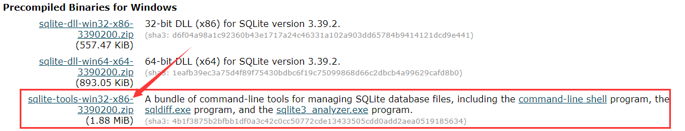

# SQLite 教程

## SQLite 介绍

### 什么是 SQLite？

SQLite 是一个软件库，实现了自给自足的、无服务器的、零配置的、事务性的 SQL 数据库引擎。SQLite 是在世界上最广泛部署的 SQL 数据库引擎。SQLite 源代码不受版权限制。

它是一个零配置的数据库，这意味着与其他数据库不一样，您不需要在系统中配置。SQLite 引擎不是一个独立的进程，可以按应用程序需求进行静态或动态连接。SQLite 直接访问其存储文件。

### 为什么要用 SQLite？

- 不需要一个单独的服务器进程或操作的系统（无服务器的）。
- SQLite 不需要配置，这意味着不需要安装或管理。
- 一个完整的 SQLite 数据库是存储在一个单一的跨平台的磁盘文件。
- SQLite 是非常小的，是轻量级的，完全配置时小于 400KiB，省略可选功能配置时小于250KiB。
- SQLite 是自给自足的，这意味着不需要任何外部的依赖。
- SQLite 事务是完全兼容 ACID 的，允许从多个进程或线程安全访问。
- SQLite 支持 SQL92（SQL2）标准的大多数查询语言的功能。
- SQLite 使用 ANSI-C 编写的，并提供了简单和易于使用的 API。
- SQLite 可在 UNIX（Linux, Mac OS-X, Android, iOS）和 Windows（Win32, WinCE, WinRT）中运行。

### SQLite 局限性

在 SQLite 中，SQL92 不支持的特性如下所示：

| 特性             | 描述                                                         |
| :--------------- | :----------------------------------------------------------- |
| RIGHT OUTER JOIN | 只实现了 LEFT OUTER JOIN。                                   |
| FULL OUTER JOIN  | 只实现了 LEFT OUTER JOIN。                                   |
| ALTER TABLE      | 支持 RENAME TABLE 和 ALTER TABLE 的 ADD COLUMN variants 命令，不支持 DROP COLUMN、ALTER COLUMN、ADD CONSTRAINT。 |
| Trigger 支持     | 支持 FOR EACH ROW 触发器，但不支持 FOR EACH STATEMENT 触发器。 |
| VIEWs            | 在 SQLite 中，视图是只读的。您不可以在视图上执行 DELETE、INSERT 或 UPDATE 语句。 |
| GRANT 和 REVOKE  | 可以应用的唯一的访问权限是底层操作系统的正常文件访问权限。   |

### SQLite 命令

与关系数据库进行交互的标准 SQLite 命令类似于 SQL。命令包括 CREATE、SELECT、INSERT、UPDATE、DELETE 和 DROP。这些命令基于它们的操作性质可分为以下几种：

#### DDL - 数据定义语言

| 命令   | 描述                                                   |
| :----- | :----------------------------------------------------- |
| CREATE | 创建一个新的表，一个表的视图，或者数据库中的其他对象。 |
| ALTER  | 修改数据库中的某个已有的数据库对象，比如一个表。       |
| DROP   | 删除整个表，或者表的视图，或者数据库中的其他对象。     |

#### DML - 数据操作语言

| 命令   | 描述           |
| :----- | :------------- |
| INSERT | 创建一条记录。 |
| UPDATE | 修改记录。     |
| DELETE | 删除记录。     |

#### DQL - 数据查询语言

| 命令   | 描述                           |
| :----- | :----------------------------- |
| SELECT | 从一个或多个表中检索某些记录。 |

## SQLite安装

SQLite 的一个重要的特性是零配置的，这意味着不需要复杂的安装或管理。

- 请访问 [SQLite 下载页面](http://www.sqlite.org/download.html)，从 Windows 区下载预编译的二进制文件。

  

- 创建文件夹 `F:\Tools\SQLite`，并在此文件夹下解压下载的压缩文件，将得到 sqldiff.exe、sqlite3.exe 和 sqlite3_analyzer.exe 文件。

- 添加  `F:\Tools\SQLite` 到 PATH 环境变量，最后在命令提示符下，使用 **sqlite3** 命令，将显示如下结果。

```sh
C:\Users\Maye>sqlite3
SQLite version 3.39.2 2022-07-21 15:24:47
Enter ".help" for usage hints.
Connected to a transient in-memory database.
Use ".open FILENAME" to reopen on a persistent database.
sqlite>
```

## 数据库管理

### 创建数据库

+ 使用`sqlite3`命令创建数据库

```sh
sqlite3 <database_name>
```

+ 另外我们也可以使用 **.open** 来建立新的数据库文件

```sh
sqlite>.open <database_name>
```

**示例：**

```sh
sqlite>.open test.db
```

上面的命令创建了数据库文件 test.db，位于 sqlite3 命令同一目录下。

打开已存在数据库也是用 **.open** 命令，以上命令如果 **test.db** 存在则直接会打开，不存在就创建它。