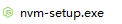
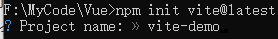
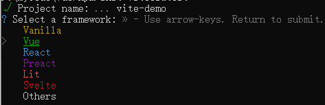
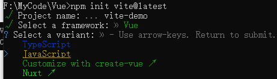
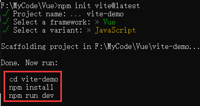

## Vue环境搭建

### nvm

nvm是node.js管理工具，安装node很方便，只需要一条命令；可以轻松切换node版本；可以多版本node并存。

#### 下载

+ [Linux&Mac](https://github.com/nvm-sh/nvm)

+ [Windows](https://github.com/coreybutler/nvm-windows)



下载之后，傻瓜式安装即可，记得修改安装路径哟~

#### 使用

使用如下命令查看node.js的所有可用版本：

```css
nvm list available
```

使用如下命令安装指定版本的node.js：

```css
nvm install 18.16.0
```

使用如下命令查看已经安装的node.js版本：

```css
 nvm list
```

### npm

安装好node.js时会自动安装npm，不过需要配置一下环境变量才能才cmd使用命令。

找到你的nvm安装目录，进入node.js版本目录，把他配置到环境变量PATH中，重启cmd即可！

```css
D:\MySoftWare\nvm\v18.16.0
```

#### 换源

如果npm下载包太慢可以切换到淘宝源：

```css
// npm设置新淘宝源
npm config set registry https://registry.npmmirror.com
// npm设置回本源
npm config set registry https://registry.npmjs.org
```


### vite

使用vite作为vue的构建工具。

```css
npm init vite@latest
```

执行命令之后，需要输入项目名称：



接着选择Vue：



选择JavaScript：



成功！运行提示的三条指令，即可成功运行：

