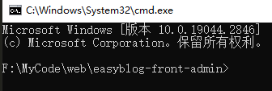
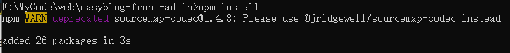
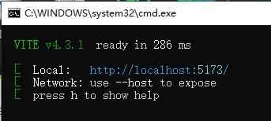
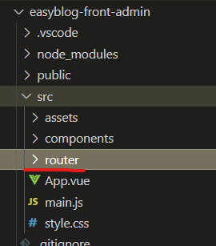
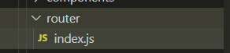

## Vue环境搭建

### nvm

nvm是node.js管理工具，安装node很方便，只需要一条命令；可以轻松切换node版本；可以多版本node并存。

#### 下载

+ [Linux&Mac](https://github.com/nvm-sh/nvm)

+ [Windows](https://github.com/coreybutler/nvm-windows)


下载之后，傻瓜式安装即可，记得修改安装路径哟~

#### 使用

使用如下命令查看node.js的所有可用版本：

```css
nvm list available
```

使用如下命令安装指定版本的node.js：

```css
nvm install 18.16.0
```

使用如下命令查看已经安装的node.js版本：

```css
 nvm list
```

### npm

安装好node.js时会自动安装npm，不过需要配置一下环境变量才能才cmd使用命令。

找到你的nvm安装目录，进入node.js版本目录，把他配置到环境变量PATH中，重启cmd即可！

```css
D:\MySoftWare\nvm\v18.16.0
```

#### 换源

如果npm下载包太慢可以切换到淘宝源：

```css
// npm设置新淘宝源
npm config set registry https://registry.npmmirror.com
// npm设置回本源
npm config set registry https://registry.npmjs.org
```

### cnpm

使用npm安装包时，需要去npm仓库获取，而npm仓库在国外，很不稳定，有时获取会失败。

- npm默认仓库地址：http://registry.npmjs.org

为了解决这个问题，淘宝搭建了一个国内npm服务器，会定时拉取国外npm仓库内容，就是把国外的搬运到国内

> 这是一个完整 `npmjs.org` 镜像，你可以用此代替官方版本(只读)，同步频率目前为 **10分钟** 一次以保证尽量与官方服务同步。

###### **使用方法**

第一种方法：安装cnpm，之后下载仓库内容时使用`cnpm`命令即可

```javascript
npm install -g cnpm --registry=https://registry.npmmirror.com
```

第二种方法：替换npm默认仓库地址，执行下面命令，后续下载仓库内容时，继续使用`npm`命令

```javascript
npm config set registry https://registry.npmmirror.com
```

### vite

使用vite作为vue的构建工具。

```css
npm init vite@latest
```

执行命令之后，需要输入项目名称：


接着选择Vue：


选择JavaScript：


成功！运行提示的三条指令，即可成功运行：


### 运行项目

找到项目目录，并进入：



执行如下命令下载依赖到当前项目：

```css
npm install
```



执行如下命令运行项目：

```css
npm run dev
```

然后点击出现的Local 后面的[链接](http://localhost:5173/)，访问即可！



### 构建路由

在src目录，创建一个router目录：



然后执行如下命令安装路由：

```css
npm install vue-router@4 --save
```

然后再router目录中创建`index.js`:



写入以下代码：


## 常见错误

+ **`failed to load config from D\...\...vite.config.js`**

这是由于当前vite版本和项目依赖的vite版本不一致导致的，在项目中找到`package.json`，并在文件中找到如下所示位置：

```json
  "devDependencies": {
    "@vitejs/plugin-vue": "5.0.5",			
    "sass": "1.77.5",
    "unplugin-auto-import": "0.17.6",
    "unplugin-vue-setup-extend-plus": "1.0.1",
    "vite": "^5.0.5",							//依赖vite版本
    "vite-plugin-compression": "0.5.1",
    "vite-plugin-svg-icons": "^0.1.0"
  }
```

使用如下命令来安装指定版本的vite:

```shell
npm install -D vite@^5.0.5
```

