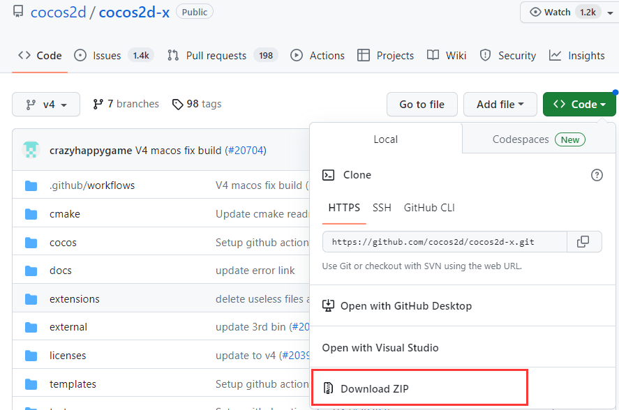
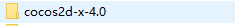
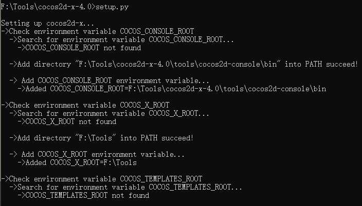
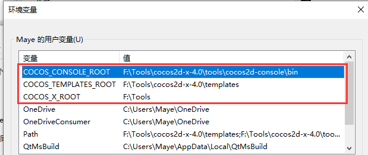
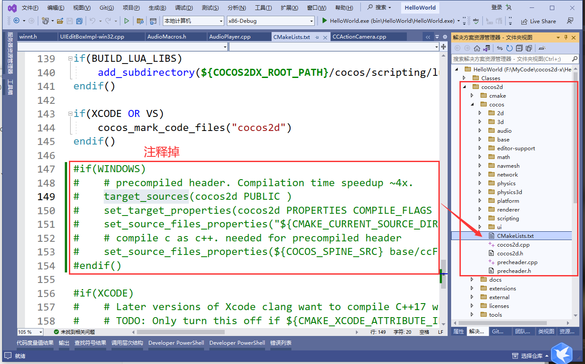
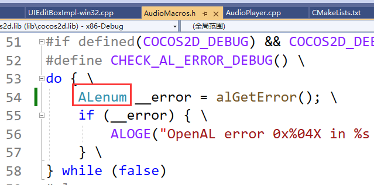
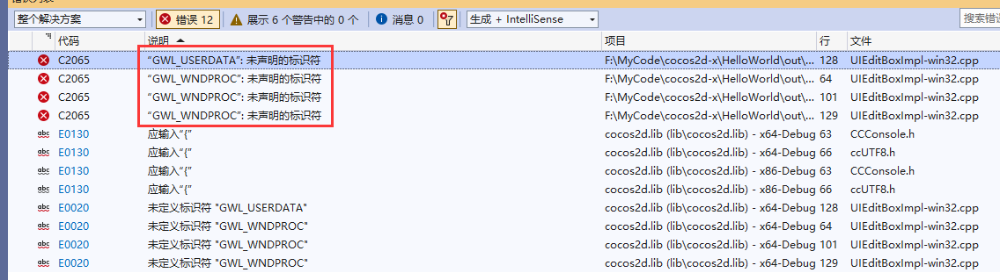
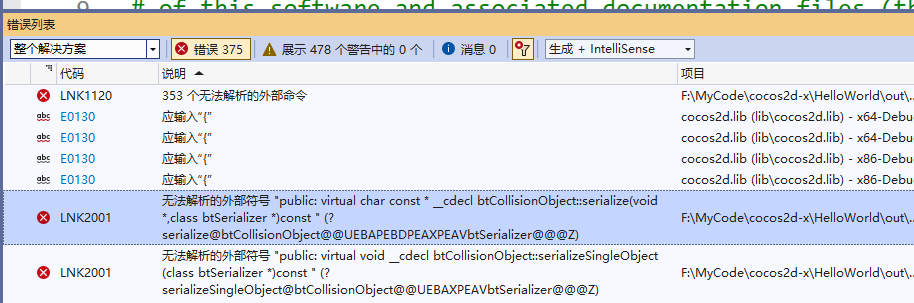

# cocos2d-x下载与配置

搭建所需软件

+ Python2.7.x
+ Visual studio 2019 +
+ CMake

## 下载与配置

+ 进入[cocos官网](https://www.cocos.com/)


+ 进入[Github](https://github.com/cocos2d/cocos2d-x)下载



+ 下载之后，解压出来



+ 进入cocos2d-x-4.0 目录下，打开命令行，执行.\setup.py（中途需要你选择ndk路径，直接回车即可！）



+ 执行完毕，会自动创建cocos环境变量



## 创建项目

+ 执行命令`cocos new <projectName> -l cpp -p <packageName>`
  + projectName为项目名称
  + packageName为包ID

```cpp
cocos new HelloWorld -l cpp -p com.HelloWorld.game
```

> 注意：如果你安装了多个版本的Python环境，请把Python2.7.x的环境配置到最前面！


## 直接用CMake

### 错误

#### perheader.pch找不到



#### __error未定义的标识符

转到错误位置，然后把`GLenum`改为`ALenum`



#### x64编译GWL_USERDATA找不到



转到错误处，把这四个宏的GWL后面都加上一个P,如：`GWLP_USERDATA`。

#### x64编译，找不到链接库(未解决)




### 显示控制台

```cpp
#ifdef USE_WIN32_CONSOLE  
    AllocConsole();
    freopen("CONIN$", "r", stdin);
    freopen("CONOUT$", "w", stdout);
    freopen("CONOUT$", "w", stderr);
#endif
```

