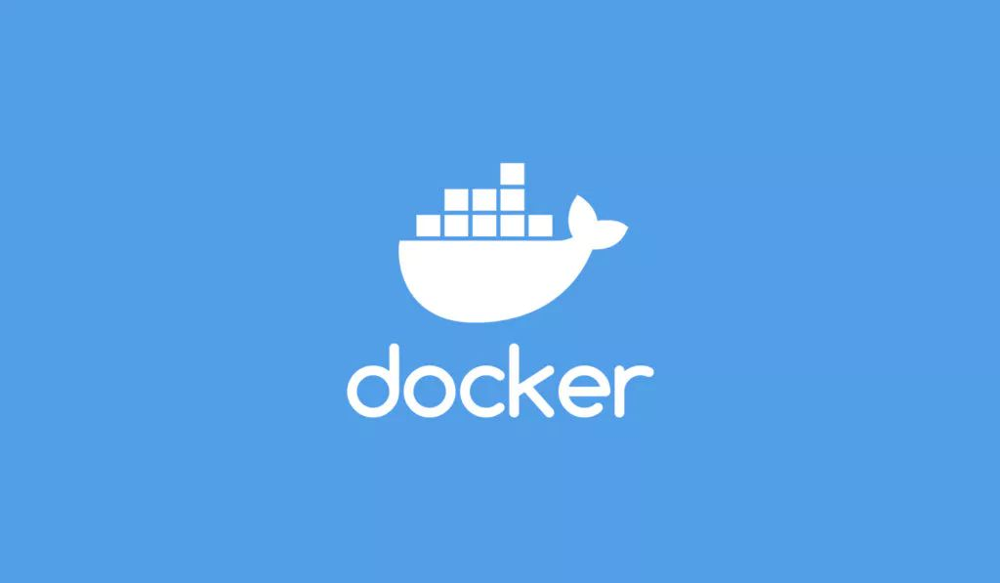
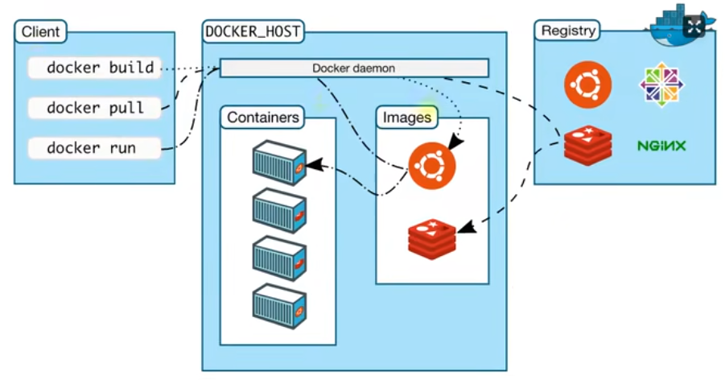

# Docker 概述



## 为什么需要Docker

### 部署程序面临的问题

部署引用程序可能会面临着如下一些问题。

#### 1. 环境一致性问题

**开发场景**：

- 开发环境："在我电脑上是好的啊！"
- 测试环境：测试人员发现 bug
- 生产环境：运维部署时各种报错

**根本原因**：操作系统版本、依赖库版本、环境变量等差异

#### 2. 依赖冲突

- 应用 A 需要 Python 2.7
- 应用 B 需要 Python 3.8
- 应用 C 需要特定版本的 Node.js，在同一台服务器上部署时会产生冲突

#### 3. 资源隔离

传统部署方式难以实现：

- 精确的资源限制（CPU、内存）
- 完全的文件系统隔离
- 网络端口管理

### 没有Docker之前部署

在没有docker之前，我们需要手动解决上述所有问题，主要有两个方式。

**1. 物理机直接部署**

直接在物理机上部署，面临着环境污染、依赖冲突、难以迁移等问题。

**2. 虚拟机部署**

也可以通过虚拟机来部署，同一台物理机可以安装多态虚拟机，以实现隔离，不同的引用程序可以有不同的依赖。

> VMware/VirtualBox -> 安装完整OS -> 部署应用

**优点**：

- 环境隔离性好
- 可以打包成镜像

**缺点**：

- 资源占用大（每个VM包含完整OS）
- 启动慢（分钟级）
- 性能开销大

### 拥有Docker之后部署

1.标准化：通过dockerfile脚本文件可以用统一的方式描述、构建、分发和运行应用程序。

2.一次构建到处运行：在任何支持 Docker 的环境都能运行

3.轻量级：与传统VM对比：

- **VM**：GB级，启动分钟级
- **Docker**：MB级，启动秒级

4.完整的生态系统：丰富的工具链和社区支持

## Docker 简介

**[Docker](https://www.docker.com/) 是一个开源的容器化平台**，允许开发者将应用程序及其所有依赖项打包到一个标准化的单元中，这个单元称为"容器"。

Docker提供了一个轻量级的虚拟化解决方案。由于运行在同一计算机上的所有容器共享同一个操作系统内核，避免了启动与维护虚拟机的开销。因此相比于传统的虚拟机，Docker容器更加轻便、快速、容易部署。使用Docker，开发者可以避免在两台计算机上运行效果不一致的问题，容器提供了一致的行为，进而使得应用程序在不同环境的计算机上有相同的运行效果。

## Docker原理




Client：操作Docker主机的客户端(命令行、Ui)

Docker Host：安装Docker的主机

+ Docker Daemon：**Docker 守护进程（dockerd）** 是 Docker 架构中的核心组件，是一个常驻后台的系统服务，负责管理 Docker 的所有核心操作。
+ Containers：**容器是镜像的运行实例**，包含运行中的应用程序及其运行环境。
+ Images：镜像，**镜像是只读的模板**，包含创建 Docker 容器所需的所有文件和配置信息。

Registry：镜像仓库，**镜像仓库是存储和分发 Docker 镜像的中心化服务**，类似于代码仓库（如 GitHub）但对于 Docker 镜像

+ 公共仓库：
  + Docker Hub(官方的)国内访问不了。
  + 可以使用国内其他镜像仓库(后面会介绍)。
+ 私有仓库：
  + 自建私有仓库
  + 云提供商仓库

# 安装Docker

## ubuntu

### 设置apt存储库

```shell
# 更新软件包索引（软件源列表）
sudo apt-get update
# 添加Docker的官方GPG密钥
sudo apt-get install ca-certificates curl
# 以 root 权限创建一个目录 /etc/apt/keyrings，并设置其权限为 0755
sudo install -m 0755 -d /etc/apt/keyrings
# 使用curl下载docker官方GPG秘钥
sudo curl -fsSL https://download.docker.com/linux/ubuntu/gpg -o /etc/apt/keyrings/docker.asc
# 给秘钥添加所有用户可读权限
sudo chmod a+r /etc/apt/keyrings/docker.asc

# 将存储库添加到Apt源：
echo \
  "deb [arch=$(dpkg --print-architecture) signed-by=/etc/apt/keyrings/docker.asc] https://mirrors.ustc.edu.cn/docker-ce/linux/ubuntu/ \
  $(. /etc/os-release && echo "${UBUNTU_CODENAME:-$VERSION_CODENAME}") stable" | \
  sudo tee /etc/apt/sources.list.d/docker.list > /dev/null  
# 再次更新软件包索引（软件源列表）
sudo apt-get update
```

### 安装Docker包

```shell
sudo apt-get install docker-ce docker-ce-cli containerd.io docker-buildx-plugin docker-compose-plugin
```

### 运行hello-world镜像来验证Docker是否安装成功

```shell
sudo docker run hello-world
```

> docker: Error response from daemon: Get "https://registry-1.docker.io/v2/": context deadline exceeded

本地是没有`hello-world`镜像的，docker会尝试从docker官方镜像仓库拉取，但是国内是访问不了的，所以需要配置国内镜像源。

```shell
sudo mkdir -p /etc/docker
sudo tee /etc/docker/daemon.json << 'EOF'
{
	"registry-mirrors":[
		"https://docker.1ms.run",
		"https://docker.m.daocloud.io",
		"https://docker-0.unsee.tech",
		"https://docker.1panel.live",
		"https://func.ink",
		"https://lispy.org",
		"https://docker.xiaogenban1993.com"
	]
}
EOF
sudo systemctl daemon-reload
sudo systemctl restart docker
```

使用如下命令，查看所有镜像源：

```shell
docker info | grep -A 5 "Registry Mirrors"
```

**停止docker服务**

```shell
sudo systemctl stop docker
```

**开启docker服务并保持开机自启**

```shell
sudo systemctl enable docker --now
```


> 如果使用命令`sudo systemctl stop docker`停止docker，出现如下提示：`Stopping 'docker.service', but its triggering units are still active:docker.socket`。
>
> 1. 先使用命令`sudo systemctl stop docker.socket`停止socket服务
> 2. 再使用命令`sudo systemctl stop docker.service`停止docker服务
> 3. 最后运行命令`docker images`，出现这个提示`Cannot connect to the Docker daemon at unix:///var/run/docker.sock. Is the docker daemon running?`说明服务器已经停止！


# 镜像操作

> 启动一个nginx，并将他的首页改为自己的页面，发布出去。

## 搜索镜像

搜索Docker镜像是日常使用Docker时一项基础且重要的操作。接下来我们来学习搜索镜像的命令、技巧以及一些注意事项。

`docker search`命令允许你从仓库(默认为Docker Hub)查找镜像。其基本语法如下：

```shell
sudo docker search [nginx]
```

**值得注意的是**，国内访问不了Docker的官方镜像仓库，所以搜索会出现如下错误：

```css
Error response from daemon: Get "https://index.docker.io/v1/search?q=nginx&n=25": dial tcp 108.160.165.139:443: connect: connection refused   
```

此时，我们可以在搜索时加上国内镜像仓库域名：

```shell
sudo docker search docker.1ms.run/nginx
```

搜索结果如下：

```css
NAME                                     DESCRIPTION                                      STARS     OFFICIAL
nginx                                    Official build of Nginx.                         21015     [OK]
nginx/nginx-ingress                      NGINX and  NGINX Plus Ingress Controllers fo…   110       
nginx/nginx-prometheus-exporter          NGINX Prometheus Exporter for NGINX and NGIN…   50        
nginx/unit                               This repository is retired, use the Docker o…   66  
```

搜索结果通常会包含镜像的**NAME（名称）**、**DESCRIPTION（描述）**、**STARS（星数）**、**OFFICIAL（是否官方）** 以及 **AUTOMATED（是否自动构建）**。

> + **优先选择官方镜像**：在搜索结果的`OFFICIAL`列标记为`[OK]`的为官方镜像。**优先选择官方镜像**，因为它们通常更安全、稳定。对于非官方镜像，务必谨慎使用，注意潜在的安全风险。
>
> - **留意镜像星数和描述**：`STARS`数可以作为社区认可度的参考。仔细阅读`DESCRIPTION`，判断镜像是否符合需求。

除了通过命令行搜索，还可以直接访问<https://docker.1ms.run>，通过web界面搜索和浏览惊喜那个，通常更直观。

## 下载镜像

当在镜像仓库找到所需镜像之后，可以使用`docker pull`命令进行拉取。

```shell
sudo docker pull [nginx]				#下载latest版本
sudo docker pull [nginx:1.27.4]			#下载1.27.4版本
sudo docker pull docker.1ms.run/nginx 	#从指定仓库拉取
```

> 如果配置的docker镜像源没有问题，但是还是拉取失败，可以尝试重启一下网络
>
> `sudo systemctl restart NetworkManager`

## 本地镜像列表

当镜像拉取完成后，可以使用`docker images`命令查看本地所有镜像列表。

```shell
sudo docker images
```

列表如下：

```css
REPOSITORY             TAG       IMAGE ID       CREATED        SIZE
docker.1ms.run/nginx   latest    07ccdb783875   41 hours ago   160MB
mysql                  8.4       69cf2b3f8428   2 weeks ago    785MB
hello-world            latest    1b44b5a3e06a   2 months ago   10.1kB
```

搜索结果通常会包含镜像的**REPOSITORY（镜像名称）**、**TAG（标签，镜像版本）**、**IMAGE ID（镜像唯一ID）**、**CREATED（创建时间）** 以及 **SIZE（镜像大小）**。

## 镜像别名

在上面的镜像列表中，`docker.1ms.run/nginx`名字带仓库名，用起来很别扭，所以我们可以使用`docker tag`来给镜像取别名。

```shell
sudo docker tag SOURCE_IMAGE[:TAG] TARGET_IMAGE[:TAG]
```

- **`SOURCE_IMAGE[:TAG]`**: 源镜像名称和标签，标签默认为 `latest`。
- **`TARGET_IMAGE[:TAG]`**: 目标镜像名称和标签，标签默认为 `latest`。

比如给`docker.1ms.run/nginx`取个`nginx`别名，如下：

```shell
sudo docker tag docker.1ms.run/nginx nginx
```

>+ 标签只是镜像的别名，不会创建新的镜像层，因此不会占用额外的存储空间。
>
>- 标签应该简洁且具有描述性，以便于识别和管理镜像版本。

## 删除镜像

如果某个镜像不需要再使用了，或者有多个别名，想要删除，可以使用`docker rmi`来删除镜像。

```shell
sudo docker rmi [nginx:1.27.4] | [nginx:latest]		#按名称删除
sudo docker rmi [IMAGE ID]							#按ID删除
```

比如删除`docker.1ms.run/nginx`镜像，只保留别名。

```
sudo docker rmi docker.1ms.run/nginx
```

**删除镜像出现错误**

> 当我们执行命令sudo docker rmi hello-world删除`hello-world`镜像时，出现了报错：Error response from daemon: conflict: unable to remove repository reference "hello-world" (must force) - container 25d9ad03eb4d is using its referenced image 74cc54e27dc4
>
> 问题原因：该错误表明你尝试删除的 Docker 镜像（ID: `74cc54e27dc4`）被一个已停止的容器（ID: `25d9ad03eb4d`）引用，因此 Docker 阻止了删除操作以保护数据完整性。

+ 查看所有容器，包括已经停止的

  ```shell
  sudo docker ps -a
  ```

  > CONTAINER ID   IMAGE         COMMAND    CREATED          STATUS                      PORTS     NAMES
  > 7ea1d875bff5   hello-world   "/hello"   25 minutes ago   Exited (0) 25 minutes ago             gracious_jackson

我们发现hello-world存在一个已经退出的容器，我们需要把这个容器删掉，才能删除镜像！

+ 删除关联的已停止的容器

  ```shell
  # 删除指定容器（替换为你的容器ID）
  sudo docker rm 7ea1d875bff5
  
  # 如果容器较多，可批量删除所有已停止的容器（谨慎操作！）
  docker container prune
  ```

+ 再次尝试删除镜像

  ```shell
  sudo docker rmi hello-world
  ```

+ **如果删除了容器依然无法删除镜像，则使用以下命令强制删除**

  ```shell
  sudo docker rmi -f hello-world
  ```

  > **注意**：强制删除可能导致数据不一致，仅在其他方法无效时使用。

# 容器操作

容器就是运行中的镜像，从一个镜像可以运行多个容器。

> 镜像的一个可运行实例。你可以创建、启动、停止、移动或删除容器。它是轻量级和可隔离的。

## 基本操作

### 运行容器

当有了一个可用镜像之后，就可以运行容器了。

```shell
sudo docker run nginx 		#运行容器,会阻塞终端
```

启动容器之后，会阻塞终端，重新打开一个终端进行操作。

### 查看容器

想要查看当前启动了哪些容器，可以使用`docker ps`命令。

```shell
sudo docker ps
```

输出如下：

```css
CONTAINER ID   IMAGE     COMMAND                   CREATED         STATUS         PORTS     NAMES
f4479d7b7eda   nginx     "/docker-entrypoint.…"   2 minutes ago   Up 2 minutes   80/tcp    loving_franklin
```

结果通常会包含容器的**CONTAINER ID（容器ID）**、**IMAGE（镜像名）**、**COMMAND（运行容器使用的命令）**、**CREATED（容器创建时间）** 、**STATUS（容器状态）**、**PORT（容器端口）**以及**NAMES（容器名-没有指定会随机生成一个）**。

> 容器状态：
>
> + UP 表示容器正在运行
> + Exited 表示容器已停止

然后在启动容器的终端中键入`Ctrl+C`中断掉容器，会发现没有运行中的容器！可以使用`docker ps -a`查看包含已停止的容器。

```shell
sudo docker ps -a
```

输入如下：

```css
CONTAINER ID   IMAGE       COMMAND                   CREATED         STATUS                      PORTS     NAMES
f4479d7b7eda   nginx       "/docker-entrypoint.…"   9 minutes ago   Exited (0) 51 seconds ago             loving_franklin
```

### 启动容器

对于已经停止的容器(处于Exited状态)，可以使用`docker start`重新启动。

```shell
sudo docker start [ID | NAME]
```

> 可以根据容器ID或者容器名称进行启动。
>
> + 容器ID可以只写前几个字符，只需要保证能识别唯一容器即可。
> + 名称必须是全称。

重新启动nginx：

```shell
sudo docker start f44
sudo docker start loving_franklin
```

> 还可以使用`docker restart`命令进行重启。

### 停止容器

当需要停止运行容器时，可以使用`docker stop`命令。

```shell
sudo docker stop f44
sudo docker start loving_franklin
```

### 运行状态

有时候我们想实时监控容器的资源使用情况，那么我们需要使用`docker stats`命令。

```shell
sudoc docker stats [ID | NAME]
```

查看nginx的运行状态：

```shell
sudo docker stats f44
```

输出如下：

```css
CONTAINER ID   NAME              CPU %     MEM USAGE / LIMIT     MEM %     NET I/O         BLOCK I/O    PIDS 
f4479d7b7eda   loving_franklin   0.00%     3.367MiB / 3.777GiB   0.09%     3.47kB / 126B   0B / 4.1kB   3 
```

结果通常会包含容器的**CONTAINER ID（容器ID）**、**NAME（容器名）**、**CPU %（CPU占用率）**、**MEM USAGE / LIMIT（内存使用量 / 内存限制）** 、**MEM %（内容使用率）**、**NET I/O（网络输入/输出流量）**、**BLOCK I/O （磁盘块设备输入/输出）**以及**PIDS（进程数）**。

> 要退出 `docker stats` 的实时监控模式，只需按Ctrl+C即可。

### 容器日志

要获取 Docker 容器的日志信息，需要使用`docker logs` 命令。这些日志主要来自容器的标准输出（STDOUT）和标准错误输出（STDERR）。

```shell
sudo docker logs [OPTIONS] CONTAINER
```

常用选项（OPTIONS）包括：

| 选项                 | 说明                                           |
| :------------------- | :--------------------------------------------- |
| `-f`, `--follow`     | 实时跟踪（跟随）日志输出                       |
| `--tail <数字>`      | 仅显示日志末尾的指定行数（例如 `--tail 100`）  |
| `-t`, `--timestamps` | 在日志行前显示时间戳                           |
| `--since <时间>`     | 显示自指定时间之后的日志（例如 `--since 30m`） |
| `--until <时间>`     | 显示自指定时间之前的日志                       |
| `--details`          | 显示更详细的信息                               |

> 日志默认以JSON格式存放在 `/var/lib/docker/containers` 目录下，其生命周期与容器相同，删除容器时对应日志文件也会被删除。

### 删除容器

如果想要把容器删掉，可以使用`docker rm`命令。

```shell
docker rm loving_franklin	#根据容器名删除容器
docker rm f44				#根据容器ID删除容器
```

当删除的容器正在运行时，则会报如下错误：意思是，不能删除正在运行的容器，你可以先停止容器再删除或者使用**强制删除**。

> Error response from daemon: cannot remove container "f44": container is running: stop the container before removing or force remove   

强制删除容器加上`-f`选项即可！

```shell
docker rm -f 152			#强制删除容器，即使容器正在运行
```

## 启动和执行

### 启动容器细节

#### 指定容器名

如果不指定容器名称，则会自动随机生成容器名，使用起来非常不方便，在运行容器时可以使用`--name 容器名`给容器取名字。

```shell
sudo docker run --name mynginx nginx
```

#### 后台启动

在上面我们使用run启动容器，容器会阻塞终端，当我们需要在启动时直接在后台运行容器，可以加上`-d`选项。

```shell
docker run -d nginx		#运行容器,不会阻塞终端，在后台运行
```

#### 自动重启

在创建新的容器时，可以通过添加*--restart=always*参数来设置容器为自动重启。

```shell
docker run -d --restart=always nginx	
```

Docker提供了多种重启策略，可以根据需要选择合适的策略：

- `no`：默认策略，容器退出时不重启容器。
- `on-failure`：在容器非正常退出时（退出状态非0）才重新启动容器。
- `on-failure:3`：在容器非正常退出时重启容器，最多重启3次。
- `always`：无论退出状态如何，都重启容器。
- `unless-stopped`：在容器退出时总是重启容器，但不考虑在Docker守护进程启动时就已经停止了的容器。

通过以上设置，可以确保Docker容器在服务或服务器重启时自动启动，从而提高系统的可靠性和可用性。

```shell
docker run -d --name mynginx nginx 	#运行容器并给终端取个名字
docker run -d --name mynginx -p 88:80 nginx 	#加入端口映射，在外部才能访问80是容器中nginx的默认端口号，88是映射到的主机端口号
```

#### 端口映射

Docker 端口映射是将主机的端口与容器的端口进行绑定，使得外部网络能够通过访问主机的端口来访问容器内运行的服务。这是 Docker 中最核心的网络功能之一。

##### 端口映射核心概念

- **容器**：拥有自己独立的网络命名空间和端口（如容器内 Nginx 运行在 80 端口）。
- **主机**：宿主机有自己独立的 IP 和端口。
- **端口映射**：在主机和容器之间建立一条网络通路。

> 外部请求 → 主机IP:主机端口 → 映射 → 容器IP:容器端口

##### 实现端口映射

端口映射主要通过 `docker run` 命令的 `-p` 或 `-P` 参数实现。

###### 随机端口映射 `-P`（大写）

Docker 会随机选择一个主机上的**空闲端口**（通常范围在 32768-60999），映射到容器暴露的端口。

```shell
# 将容器暴露的端口（EXPOSE）随机映射到主机的高端口
docker run -d -P --name my-nginx nginx

# 查看映射关系
docker port my-nginx
# 输出示例：80/tcp -> 0.0.0.0:32768
```

**说明**：此时，访问 `http://主机IP:32768` 就能访问到容器的 80 端口。

###### 指定端口映射 `-p`（小写）

这是最常用、最灵活的方式，可以精确控制映射关系。

```shell
-p [主机IP:][主机端口:]容器端口[/协议]
```

比如将主机的8080端口映射到容器的80端口。

```shell
# 将主机的 8080 端口映射到容器的 80 端口
docker run -d -p 8080:80 --name mynginx nginx
```

### 进入容器内部

有时候我们需要进入容器进行操作，那么就可以使用`docker exec`命令。

```shell
docker exec -it mynginx /bin/bash #进入容器内部，使用bash进行交互
#使用exit退出容器
```

进入后就可以执行基本的Linux命令：

+ ls查看文件

  ```shell
  root@7451848a83d5:/# ls
  ```

  会发现和Linux目录结构一样，因为容器就可以理解为一台linux机器。

  > bin  boot  dev  docker-entrypoint.d  docker-entrypoint.sh  etc  home  lib  lib64  media  mnt  opt  proc  root  run  sbin  srv  sys  tmp  usr  var   

+ 修改nginx主页文件，进入`/usr/share/nginx/html/`目录，仓库<https://1ms.run/r/library/nginx>首页有介绍。

+ 修改`index.html`文件。

  + 注意不能使用vi命令，因为容器中的系统为了保持轻量级，只系统了核心功能。

  + 直接使用echo命令把内容重定向到文件中

    ```html
    echo "<h1>Hello! I'm Docker nginx</h1>" > index.html
    ```

# 保存/加载镜像

咱们上面进入docker容器内部，修改了主页，那么如果想要将修改后的容器打包成镜像，怎么办呢?

## 提交镜像

当修改了容器之后，可以使用`docker commit`命令提交修改，并创建一个新镜像。

```shell
docker commit -m "update index.html" mynginx mynginx:1.0
```

保存之后可以使用`docker images`命令查看镜像。

> ```
> REPOSITORY    TAG       IMAGE ID       CREATED         SIZE
> mynginx       1.0       3bc2b8aa022e   6 seconds ago   160MB 
> ```

## 保存镜像

`docker save` 命令用于将一个或多个Docker镜像打包成tar归档文件，非常适合用于镜像的备份、迁移或离线分发。

```shell
docker save -o mynginx.tar mynginx:1.0
```

保存之后执行`ls`命令，会在当前目录看到一个名为`mynginx.tar`的包。

> 保存并压缩：sudo docker save mynginx:1.0 | gzip > mynginx.tar.gz

## 加载镜像

`docker load` 命令用于从通过 `docker save` 命令生成的 `.tar` 归档文件中将镜像加载到本地 Docker 环境。这个命令在**离线环境部署**、**镜像备份恢复**和**批量迁移镜像**时非常有用。

```shell
docker load -i mynginx.tar
```

> 解压并加载：gunzip -c mynginx.tar.gz |  sudo docker load

# 分享镜像

# 目录挂载

# 卷映射

# 自定义网络