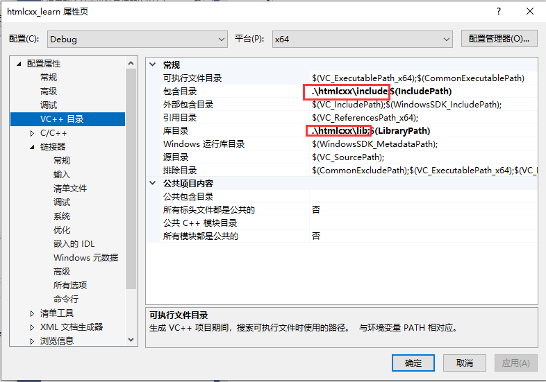

# htmlcxx

HtmlCxx是一款简洁的，非验证式的，用C++编写的css1和html解析器。使用由KasperPeeters编写的强大的tree.h库文件，可以实现类似STL的DOM树遍历和导航。

可以通过解析后生成的树，逐字节地重新生成原始文档。

## 库下载编译

1. 进入[htmlcxx官方](https://htmlcxx.sourceforge.net/)下载htmlcxx


2. 进入页面后，点击Files，点击v0.87


然后回进入一个目录，点击`htmlcss-0.87.zip`即可下载


3. 下载完之后，解压出来，并进入解压目录。能看到如下图所示文件即表示成功。


4. 上图中可以看到有一个`htmlcxx.vcproj`文件，这说明此项目支持Vs编译，直接双击打开即可。


5. 用vs打开时会有如下提示，点击确定即可！


6. 打开之后，运行项目可能会报如下错误。


而当找到报错代码处时，发现并没有什么问题。


这时候我们看一下另外一个错误提示。


这个错误是告诉我们，源代码编码问题，这是我们需要把这个报错的文件的编码改为utf8编码。

打开项目目录，找到`util.cc`文件，用记事本打开。


点击左上角文件-另存为-右下角选择`带有bom的utf-8`然后点击保存即可


还要找到`Node.cc`文件，加入如下代码

```cpp
#define isspace _isspace
#define isalnum _isalnum
#define isalpha _isalpha

bool _isspace(int c)
{
	if (c == ' ' || c == '\t'|| c=='\v' || c=='\r' || c=='\n' ||
		c == '\f')
	{
		return true;
	}
	return false;
}

bool _isalnum(int c)
{
	if (c >= 'A' && c <= 'Z' || c >= 'a' && c <= 'z' || c >= '0' && c <= '9') {
		return true;
	}
	return false;
}

bool _isalpha(int c)
{
	return c >= 'A' && c <= 'Z' || c >= 'a' && c <= 'z';
}
```


然后运行代码，即可得到lib库(注意库默认是32位 MTd版本的)


我们需要改为x64 MD版本。


最后创建htmlcxx目录，在里面创建include和lib目录。

把下载的库目录中的html中的所有头文件以及`ParserSax.tcc`文件拷贝到include目录中。

把vs生成的htmlcxx.lib拷贝到lib中

最终目录结构如下。


## Vs环境配置

1. 在vs中添加头文件和库文件目录。



2. 在附加依赖项中添加库文件`htmlcxx.lib`


3. 随便写点代码测试一下，能正常运行则表示配置成功。如果提示未定义的符号，则是版本或者运行库设置错误。上面有讲

```cpp
#include "ParserDom.h"

int main()
{
	htmlcxx::HTML::ParserDom parser;

	return 0;
}
```

## 库使用

1. 先准备一个html字符串(也可以从html文件中读取出来)

```cpp
const char* html = R"(<!DOCTYPE html>
<html lang="en">  
  <head>
    <meta charset="UTF-8">
    <meta http-equiv="X-UA-Compatible" content="IE=edge">
    <meta name="viewport" content="width=device-width, initial-scale=1.0">
    <title>图搜首页</title>
    <link rel="stylesheet" href="图搜首页.css">
</head>
<body>
  
  
  
  
  
  <a href="www.baidu.com">百度一下</a>
</html>)";
```

2. 解析html

```cpp
int main()
{
    //创建解析文档对象
    htmlcxx::HTML::ParserDom parser;
    //把html文档解析成一棵树
    auto tree = parser.parseTree(html);
    //输出dom树，树里面存储的是html标签信息
    std::cout << tree << std::endl;
    return 0;
}
```

输出内容如下所示:

```css
0@[0;592)				
  1@[0;15) <!DOCTYPE html>
  2@[15;16)

  3@[16;592) html
    4@[32;37)
```

第一行`0@[0;592)`：

+ 0是标签序号(按照标签的出现顺序编号) 
+ @是一个分隔符
+ [0;592)表示此标签出现的位置和长度，这里的592表示的是整个文档的长度

第二行`1@[0;15) <!DOCTYPE html>`：

+ \<!DOCTYPE html> 是标签名

第三行`2@[15;16)`:

+ 这个标签长度为1，是个什么东西呢？没错就是换行

**接下来，我们来遍历这棵树：**

tree提供了begin和end函数，所以可以通过迭代器或者基于范围的for循环进行遍历。

```cpp
for(auto& v : tree)	//v是树的每个节点，节点里面存储着html中的每个标签信息
{
    if(v.isTag())	//判断是不是标签
    {
        std::cout<<v.tagName()<<std::endl;	//输出标签名称，比如a img 
        std::cout<<v.text()<<std::endl;		//输出标签内容，比如a标签里面的文本
        
        //如果是img标签
        if(v.tagName() == "img")
        {
            //解析img标签的属性
            v.parseAttributes();
            //获取img标签的src属性,attribute函数返回的是std::pair<bool,std::string>类型，first表示是否存在此属性，second表示属性值
            std::cout << "attr img src:" << v.attribute("src").second << std::endl;
		}
    }
}
```

