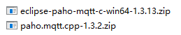
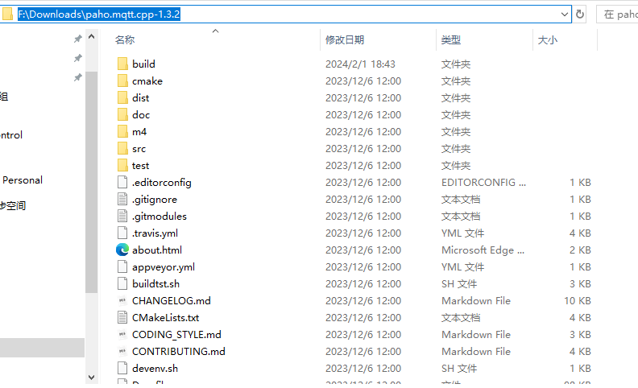
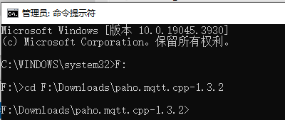
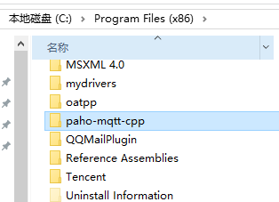

# MQTT

## MQTT简介

**MQTT**(**消息队列遥测传输**)是[ISO](https://baike.baidu.com/item/ISO/10400?fromModule=lemma_inlink) 标准(ISO/IEC PRF 20922)下基于发布/订阅范式的消息协议。它工作在 TCP/IP协议族上，是为硬件性能]低下的远程设备以及网络状况糟糕的情况下而设计的发布/订阅型消息协议，为此，它需要一个[消息中间件 ](https://baike.baidu.com/item/消息中间件 /5899771?fromModule=lemma_inlink)。

MQTT是一个基于[客户端](https://baike.baidu.com/item/客户端/101081?fromModule=lemma_inlink)-[服务器](https://baike.baidu.com/item/服务器/100571?fromModule=lemma_inlink)的消息发布/订阅传输协议。MQTT协议是轻量、简单、开放和易于实现的，这些特点使它适用范围非常广泛。在很多情况下，包括受限的环境中，如：机器与机器（M2M）通信和物联网（IoT）。其在，通过卫星链路通信传感器、偶尔拨号的医疗设备、智能家居、及一些小型化设备中已广泛使用。

## MQTT特点

MQTT协议是为大量计算能力有限，且工作在低带宽、不可靠的网络的远程传感器和控制设备通讯而设计的协议，它具有以下主要的几项特性：

1、使用发布/订阅消息模式，提供一对多的消息发布，解除应用程序耦合；

2、对负载内容屏蔽的消息传输；

3、使用 TCP/IP 提供网络连接；

4、有三种消息发布服务质量：

5、小型传输，开销很小（固定长度的头部是 2 字节），协议交换最小化，以降低网络流量；

6、使用 Last Will 和 Testament 特性通知有关各方客户端异常中断的机制。

## MQTT C/C++库下载

+ C语言库 [eclipse/paho.mqtt.c](https://github.com/eclipse/paho.mqtt.c/releases)

+ C++库 [eclipse/paho.mqtt.cpp](https://github.com/eclipse/paho.mqtt.cpp/releases)

C语言版本直接提供了编译好的库，而C++版本依赖于C库，需要自己编译(也就是说使用C++库，也需要先下载C语言库)。



如上图所示，下载完[两个库](./assets/库)，然后全部解压！

## 编译

+ 首先，进入解压后的cpp库目录！



+ 然后，以管理员身份启动终端，并进入上面的目录。



+ 最后，执行如下cmake命令，构建项目

  ```cmake
  cmake -Bbuild -H. -DPAHO_BUILD_STATIC=ON \
      -DPAHO_BUILD_DOCUMENTATION=OFF -DPAHO_BUILD_SAMPLES=ON \
      -DCMAKE_PREFIX_PATH=$HOME/install
  ```

  > 注意：$HOME/install 表示你的C库安装的根目录，如：F:\Downloads\eclipse-paho-mqtt-c-win64-1.3.13
  >
  > 

+ 构建完成之后，执行如下命令编译

  ```cmake
   cmake --build build
  ```

+ 然后，执行如下命令安装

  ```cmake
  cmake --build build --target INSTALL
  ```

  会自动安装到C盘，具体目录如下图：
  
  


[MQTT简介+安装+使用](https://blog.csdn.net/bandaoyu/article/details/104311367)

