## 简介

[WebAssembly](https://developer.mozilla.org/zh-CN/docs/WebAssembly)，前身技术来自Mozilla和Google Native Client的asm.js，首次发布于2017年3月。并于2019年12月5日正式成为W3C recommendation，至此成为与HTML、CSS以及js 并列的web领域第四类编程语言。


**WebAssembly的前世今生**

1.1 一家伟大的互联网企业

说起WebAssembly，那就必须从一家没落而又伟大的互联网公司说起，它就是火狐浏览器的开发者Mozilla。Mozilla的前身是大名鼎鼎的网景公司(Netscape)，也就是JavaScriptScript的开发者。从做浏览器起家一路坎坷至今，Mozilla最近更是频频传出裁员风波，其根源依然是没有找到太好的盈利点。作为互联网开源社区的领跑者，Mozilla在技术上的成就远高于其在商业领域。除了JavaScript和Filefox，Mozilla还留下了Rust、HTML5、MDN（Mozilla Developer Network）以及asm.js这些引领互联网行业发展的重要基石。

1.2 脑洞大开的想法：浏览器里跑C++

2012年Mozilla的工程师在研究LLVM时，突然脑洞大开提出了一个想法：类似游戏引擎这样的高性能应用大多都是C/C++语言写的，如果能将C/C++转换成 JavaScript ，那岂不是就能在浏览器里跑起来了吗？如果可以实现，那么浏览器是不是也就可以直接跑3D游戏之类的C/C++应用？于是Mozilla成立了一个叫做Emen的编译器研发项目， **Emen可以将C/C++代码编译成JavaScriptScript，但不是普通的JS，而是一种被特殊改造的JS，其被命名为asm.js**。

Emen 的官方描述是：

> Emen is a toolchain for compiling to asm.js and WebAssembly, built using LLVM, that lets you run C and C++ on the web at near-native speed without plugins.

中文译文：

> Emen是一个基于LLVM的将C/C++编译到asm.js和WebAssembly的工具链，它可以让你在web上以接近原生的速度运行C/C++而不需要任何插件。

如下图所示：实际上，不只是C/C++代码，只要能转换成LLVM IR的语言，都可以通过Emen转换成asm.js。

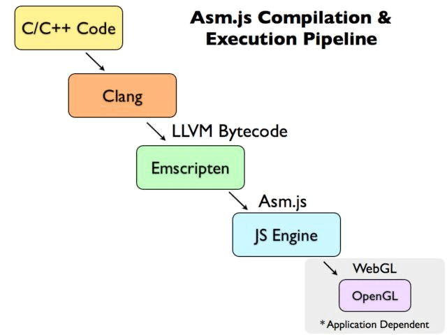

## Emscripten

Emscripten 是一个 开源的编译器 ，该编译器可以将 C/C++ 的代码编译成 JavaScript 胶水代码。 Emscripten 可以将 C/C++ 代码编译为 WebAssembly 编程语言的代码。

Emscripten 的底层是基于 LLVM 编译器的，可以查看其开源的 [emscripten llvm](https://github.com/emscripten-core/emscripten-fastcomp) 和 [emscripten clang](https://github.com/emscripten-core/emscripten-fastcomp-clang) 。

下图是其编译 C/C++ 的代码的流程图：

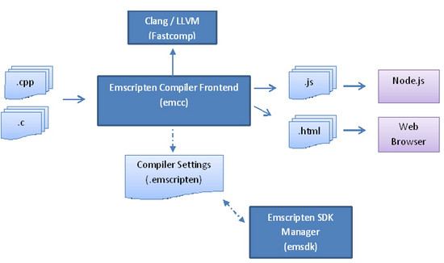

安装 Emscripten 可以通过安装 [emscripten SDK](https://github.com/emscripten-core/emsdk) 来完成， emscripten SDK 可以简单的理解为是 Emscripten 的一套 [工具](https://www.codercto.com/tool.html) 链。

### 下载emsdk

1. 进入[emsdk github](https://github.com/emscripten-core/emsdk)，下载zip压缩包

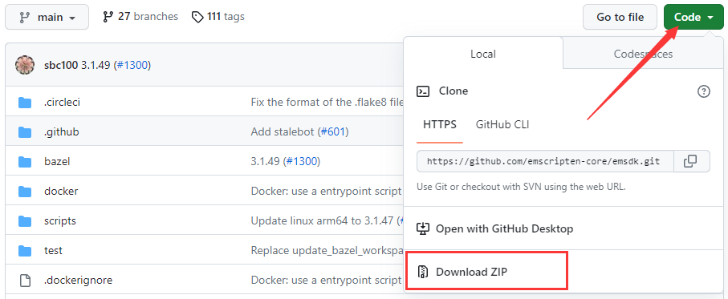

2. 解压，并进入emsdk目录

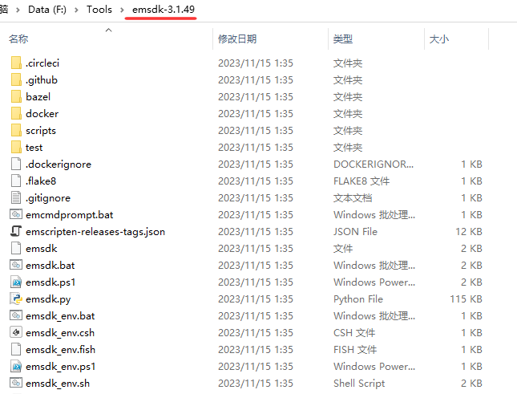

3. 开始安装，首先在当前目录打开cmd，然后运行如下命令。

```powershell
#下载并安装最新的SDK工具
emsdk install latest
#为当前用户激活“latest”SDK。(写入 .emscripten文件)
emsdk activate latest --permanent
#激活当前终端中的PATH和其他环境变量
emsdk_env.bat
```

4. 完成后运行`emcc --version`查看环境是否配置完成。

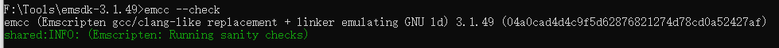

## [样例代码](https://developer.mozilla.org/zh-CN/docs/WebAssembly/C_to_wasm)

现在环境配置完毕，让我们看看如何使用它把 C 代码编译到 Emscripten。当使用 Emscripten 来编译的时候有很多种不同的选择，我们介绍其中主要的 2 种：

- 编译到 wasm 并且生成一个用来运行我们代码的 HTML，将所有 wasm 在 web 环境下运行所需要的“胶水”JavaScript 代码都添加进去。
- 编译到 wasm 然后仅仅生成 JavaScript。

### 生成 HTML 和 JavaScript

1. 首先写一个简单的Hello World代码。

```c
#include<stdio.h>

int main()
{
    printf("Hello World\n");
    return 0;
}
```

2. 然后，转到一个已经配置过 Emscripten 编译环境的终端窗口中，进入刚刚保存 hello.c 文件的文件夹中，然后运行命令：

```powershell
emcc hello.c -s WASN=1 -o hello.html
```

**注意：**如果出现如下错误：

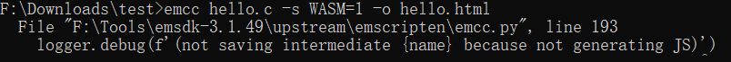

表示你使用的是python2，检查你的环境变量path，改用python3的环境变量。

emsdk配置好之后，会自动下载python环境，直接配置到环境变量即可！

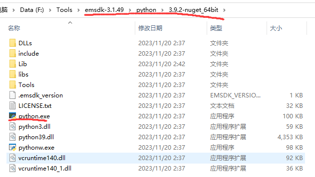

下面列出了我们命令中选项的细节：

- `-s WASM=1` — 指定我们想要的 wasm 输出形式。如果我们不指定这个选项，Emscripten 默认将只会生成 [asm.js](http://asmjs.org/)。
- `-o hello.html` — 指定这个选项将会生成 HTML 页面来运行我们的代码，并且会生成 wasm 模块，以及编译和实例化 wasm 模块所需要的“胶水”js 代码，这样我们就可以直接在 web 环境中使用了。

这个时候在你的源码文件夹应该有下列文件：

- `hello.wasm` 二进制的 wasm 模块代码
- `hello.js` 一个包含了用来在原生 C 函数和 JavaScript/wasm 之间转换的胶水代码的 JavaScript 文件
- `hello.html` 一个用来加载，编译，实例化你的 wasm 代码并且将它输出在浏览器显示上的一个 HTML 文件

### 运行案例

现在使用一个支持 WebAssembly 的浏览器，加载生成的 `hello.html`。自从 Firefox 版本 52、Chrome 版本 57 和 Opera 版本 44 开始，已经默认启用了 WebAssembly。

> 如果你试图直接从本地硬盘打开生成的 HTML 文件（`hello.html`），你会得到一个错误信息，大意是 *`both async and sync fetching of the wasm failed`*。你需要通过 HTTP 服务器（`http://`）运行你的 HTML 文件。

使用[`emrun`](https://emscripten.org/docs/compiling/Running-html-files-with-emrun.html)命令，来开启一个http服务器：

```powershell
emrun --no_browser --port 8080 hello.html
```

`--no_browser`：不启动浏览器，只启动服务器，不指定则启动服务器同时用浏览器打开hello.html

然后，在浏览器输入`http://localhost:8080/`即可看到服务器目录包含的所有文件。

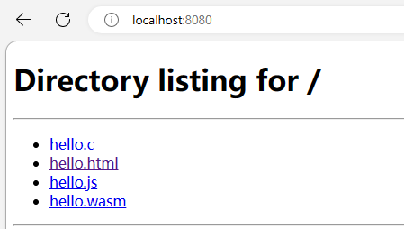

点击html，即可看到如下图所示结果：

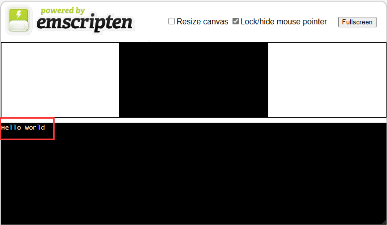

### CMake构建WebAssembly项目

如果项目很大，自己运行命令编译就不方便了，接下来讲解如何将基于 CMakeLists 配置的 C++ 项目编译成 WebAssembly 库来供 Web 前端使用。编译结果会生成 .wasm、.js，测试代码会生成 .wasm、.js、.html。

在上面测试的hello.c目录创建CMakeLists.txt文件，写入如下脚本：

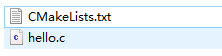

```cmake
cmake_minimum_required(VERSION 3.5)

project(hello)

set(CMAKE_EXECUTABLE_SUFFIX ".html") #编译生成.html

add_executable(${PROJECT_NAME} "hello.c")
```

#### MinGW

MinGW，是*Minimalist* GNU *for Windows*的缩写。它是一个可自由使用和自由发布的Windows特定头文件和使用GNU工具集导入库的集合，允许你在GNU/Linux和Windows平台生成本地的Windows程序而不需要第三方C运行时（C Runtime）库。

> 请确保已经安装了mingw工具集，Qt安装了mingw编译套件就有，只需找到所在目录，然后配置到环境变量即可。

在项目目录运行命令行，并输入如下命令：

```powershell
#使用cmake生成MinGW Makefile项目
emcmake cmake -H./ -G "MinGW Makefiles" -B build -DCMAKE_BUILD_TYPE="Release"
cd build
#使用make编译生成
emmake mingw32-make
#使用emrun直接运行项目
emrun hello.html
```

#### Ninja

Ninja 是一个轻量级的构建系统，它使用类似于 Makefile 的文本文件描述构建过程，并通过 ninja 命令来执行构建。Ninja 与 Make 的区别在于，Ninja 会更快地执行构建，因为它使用了一些优化技术来减少构建过程中的 IO 操作。

> 请确保已经安装了ninja工具，vs和Qt都有自带安装，找到所在目录，然后配置到环境变量即可。

```powershell
#使用cmake生成ninja项目
emcmake cmake -H./ -G "Ninja" -B build -DCMAKE_BUILD_TYPE="Release"
cd build
#使用ninja编程生成
ninja
#使用emrun直接运行项目
emrun hello.html
```

#### VS+CMake+Ninja

前面的两种方式，都需要自己手动的执行命令，来编译项目，比较麻烦。通过Vs来处理就比较方便了~

1. 用VS打开前面创建的cmake项目

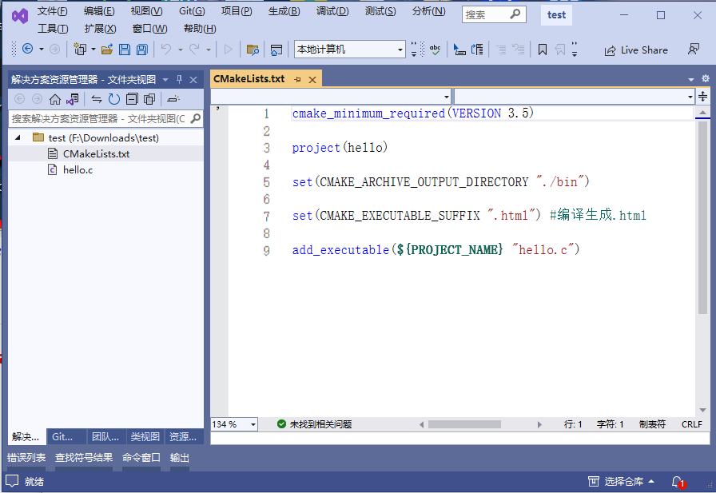

2. 选择配置/管理配置

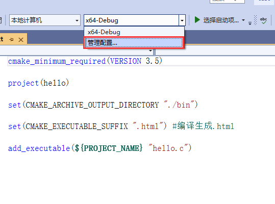

3. 编辑json

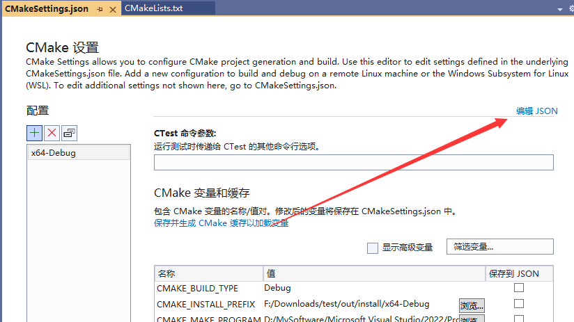

4. 在配置中加上如下json

> CMAKE_TOOLCHAIN_FILE 为工具链变量，配置为Emscripten.cmake
>
> CMAKE_CROSSCOMPILING_EMULATOR 为交叉编译器，指定为node.exe

```json
      "variables": [
        {
          "name": "CMAKE_TOOLCHAIN_FILE",
          "value": "F:\\Tools\\emsdk-3.1.49\\upstream\\emscripten\\cmake\\Modules\\Platform\\Emscripten.cmake"
        },
        {
          "name": "CMAKE_CROSSCOMPILING_EMULATOR",
          "value": "F:/Tools/emsdk-3.1.49/node/16.20.0_64bit/bin/node.exe"
        }
      ]
```

最终json文件如下：

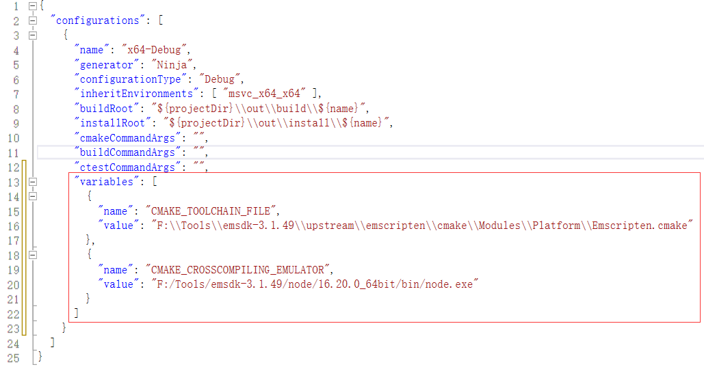

[Emscripten + CMakeLists.txt 将 C++ 项目编译成 WebAssembly(.wasm)/js，并编译 Html 测试](https://blog.csdn.net/u011520181/article/details/134146832)

[C/C++面向WebAssembly编程](https://www.cntofu.com/book/150/zh/ch4-techniques/ch4-07-forget-about-fs.md)

