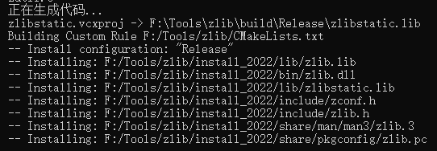
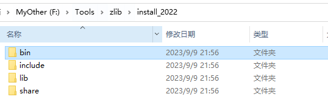
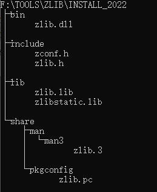

## zlib

### 下载和编译

从[github](https://github.com/madler/zlib)拉取源码！

```cpp
git clone https://github.com/madler/zlib.git
```

拉去完毕进入zlib目录。

```cpp
cd zlib
```

创建build目录并进入

```sh
mkdir build
cd build
```

然后执行cmake，同时设置安装路径

```sh
cmake .. -DCMAKE_INSTALL_PREFIX="../install_2022"
```

编译并安装

```cmake
cmake --build . --target INSTALL --config Release
```



打开install_2022目录，可以看到一下文件。



所有文件内容如下图所示：



### 环境配置

### 库使用