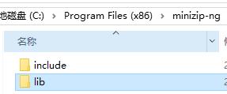

## zlib

### 简介

lib是一套通用的解压缩开源库，提供了内存（in-memory）压缩和解压函数，能检测解压出来的数据完整性，zlib 也支持读写 gzip (.gz) 格式的文件，可以阅读：zlib库介绍三：gzip(.gz格式)文件读写。

默认且目前仅使用deflate算法压缩data部分；deflate是一种压缩算法,是huffman编码的一种加强。
### zlib库的应用

数以万计的应用程序直接或间接依靠zlib压缩函式库，包括：

FFmpeg：以zlib读写Matroska等以DEFLATE算法压缩的多媒体串流格式。

OpenSSH、OpenSSL：以zlib达到最佳化加密网络传输。

Linux核心：使用zlib以实作网络协定的压缩、档案系统的压缩以及开机时解压缩自身的核心。

libpng，用于PNG图形格式的一个实现，对bitmap数据规定了DEFLATE作为流压缩方法。

...

### 下载和编译

从[github](https://github.com/madler/zlib)拉取源码！

```cpp
git clone https://github.com/madler/zlib.git
```

拉去完毕进入zlib目录。

```cpp
cd zlib
```

创建build目录并进入

```sh
mkdir build
cd build
```

然后执行cmake，同时设置安装路径

```sh
cmake .. -DCMAKE_INSTALL_PREFIX="../install_2022"
```

编译并安装

```cmake
cmake --build . --target INSTALL --config Release
```


打开install_2022目录，可以看到一下文件。


所有文件内容如下图所示：


### 库使用

#### compress/uncompress

ompress和uncompress是zlib最基本的两个函数了。他们分别用于压缩和解压数据。 原型如下：

```c
int  compress(Bytef *dest,   			
              uLongf *destLen,			
              const Bytef *source, 		
              uLong sourceLen);			

int compress2(unsigned char* dest, 
			 unsigned long*destLen, 
			 const unsigned char* source,
			 unsigned long sourceLen, 
			 int level);				

int uncompress(unsigned char* dest, 
				unsigned long* destLen,
				unsigned char* source, 
				unsigned long sourceLen);
				
int uncompress2(unsigned char* dest,
				unsigned long* destLen,
				unsigned char* source, 
				unsigned long* sourceLen);
```

**参数：**

+ dest：目标缓冲区(存放解/压缩之后的数据)

+ destLen：解/压缩缓冲区长度(解/压缩之前必须传入缓冲区实际大小，解/压缩之后返回实际使用大小)

+ source：源缓冲区(待解/压缩的数据)

+ sourceLen：源缓冲区长度(待解/压缩的数据的长度)
+ level：压缩比例，压缩级别取值：0 - 9。0压缩速度最快，9压缩速度最慢，压缩率最大。0表示不进行压缩。`compress2才有`

**返回值：**

- Z_OK：成功。
- Z_MEM_ERROR：没有足够的内存。
- Z_BUF_ERROR：输出的缓冲区没有足够的空间。
- Z_STREAM_ERROR：level参数设置不正确。`compress2才有`

> uncompress2与uncompress相同，除了sourceLen是一个指针，其中源的长度是*sourceLen。返回时，*sourceLen是消耗的源字节数。

**测试：**

```c
int main()
{
	char de_text[128];
	size_t de_len = 128;

	//char text[] = "zlib compress and uncompress test\nzcmayeo@gmail.com\n2023-10-30\n";
	char text[] = "1111111111111111111111111111111111111111111111111111";
	size_t src_len = strlen(text) + 1;

	char* dst = NULL;
    //compressBound()返回对sourceLen字节进行compress()或compress2()后压缩大小的上界。它将在compress()或compress2()调用之前使用，以分配目标缓冲区。
	size_t dst_len = compressBound(src_len);
	if ((dst = malloc(sizeof(char) * dst_len)) == NULL)
	{
		printf("no enough memory!\n");
		return -1;
	}
	//压缩
	int ret = compress(dst, &dst_len, text, src_len);
	if (ret != Z_OK)
	{
		printf("compress failed! %d\n",ret);
		return -1;
	}

	//查看压缩之后的数据和长度
	printf("%llu %s\n",dst_len,dst);
	//解压
	if (uncompress(de_text, &de_len, dst, dst_len) != Z_OK)
	{
		printf("uncompress failed!\n");
		return -1;
	}

	//打印解压结果
	printf("%s\n", de_text);
	free(dst);

	return 0;
}
```

#### gzip(.gz)文件解压缩

如果你经常接触到 linux 系统，你会发现你经常会见到各种各样以`gz`结尾的压缩文件。

> gz格式文件大体上分为头部、数据部和尾部。
>
> 头部和尾部主要是一些文档属性和校验信息（rfc1952），数据部主要是用deflate方法压缩得到的数据。

为便于gzip文件的读写，在zlib库中提供一组用于gzip读写的函数：

##### 打开/关闭

| 函数                                                         | 描述                                                         |
| ------------------------------------------------------------ | ------------------------------------------------------------ |
| <span style = "font-size:18px;color:rgb(0,102,0)">gzFile gzopen(const char* file,const char\*mode)<br>gzFile gzdopen(int fd,const char\* mode)</span> | 打开.gz文件（类似于fopen）                                   |
| <span style = "font-size:18px;color:rgb(0,102,0)">int gzclose(gzFile file)<br>int gzclose_r(gzFile file)<br>int gzclose_w(gzFile file)</span> | 关闭文件<br>关闭以只读方式打开的文件<br>关闭以只写或追加方式打开的文件 |

##### 读/写

| 函数                                                         | 描述                                                         |
| ------------------------------------------------------------ | ------------------------------------------------------------ |
| <span style = "font-size:18px;color:rgb(0,102,0)">int gzread(gzFile file, voidp buf, unsigned len)<br>z_size_t gzfread(voidp buf, z_size_t size, z_size_t nitems,<br/>                                 gzFile file)</span> | 读取数据（类似于fread）                                      |
| <span style = "font-size:18px;color:rgb(0,102,0)">int gzwrite(gzFile file, voidpc buf, unsigned len)<br/>z_size_t gzfwrite(voidpc buf, z_size_t size,z_size_t nitems, gzFile file)</span> | 写数据（类似于fwrite）                                       |
| <span style = "font-size:18px;color:rgb(0,102,0)">char * gzgets(gzFile file, char *buf, int len)</span> | 读取字符串                                                   |
| <span style = "font-size:18px;color:rgb(0,102,0)">int gzputs(gzFile file, const char *s)</span> | 写入字符串                                                   |
| <span style = "font-size:18px;color:rgb(0,102,0)">int gzgetc(gzFile file)</span> | 读取字符                                                     |
| <span style = "font-size:18px;color:rgb(0,102,0)">int gzputc(gzFile file, int c)<br>int gzungetc(int c, gzFile file)</span> | 写入字符<br>将字符推回要读取的文件流，作为下次读取的字符(在只读模式下有用) |
| <span style = "font-size:18px;color:rgb(0,102,0)">int gzprintf(gzFile file, const char *format, ...)</span> | 格式化写入数据                                               |

##### **文件位置指针**

| 函数                                                         | 描述                                                         |
| ------------------------------------------------------------ | ------------------------------------------------------------ |
| <span style = "font-size:18px;color:rgb(0,102,0)">z_off_t gztell(gzFile file)</span> | 返回文件流当前位置，值得注意的是返回的是未<br>压缩数据的位置(也就是说获取的是解压后的位置指针) |
| <span style = "font-size:18px;color:rgb(0,102,0)">int gzrewind(gzFile file)</span> | 重置文件流位置到开头                                         |
| <span style = "font-size:18px;color:rgb(0,102,0)">z_off64_t gzseek(gzFile, z_off64_t, int)</span> | 移动文件留位置(注意：不支持SEEK_END)                         |

##### 其他

| 函数                                                         | 描述                                      |
| ------------------------------------------------------------ | ----------------------------------------- |
| <span style = "font-size:18px;color:rgb(0,102,0)">const char * gzerror(gzFile file, int *errnum)</span> | 返回错误字符串，errnum被设置为错误码。    |
| <span style = "font-size:18px;color:rgb(0,102,0)">void gzclearerr(gzFile file)</span> | 清除错误                                  |
| <span style = "font-size:18px;color:rgb(0,102,0)">int gzeof(gzFile file)</span> | 移动文件留位置(注意：不支持SEEK_END)      |
| <span style = "font-size:18px;color:rgb(0,102,0)">int gzdirect(gzFile file)</span> | 如果打开的是.gz格式文件则返回1，否则返回0 |


```c
void gz_write(){
    gzFile fp = gzopen("hello.gz", "wb");
    if(!fp) {
        return;
    }
    gzwrite(fp, "Hello, World!", 13); // 写入13个字节
    for (size_t i = 0; i < 1024 * 1024; i++) // 写入1M的数据
    {
        gzputc(fp, 'A' + (i % 26)); // 写入1024*1024个'A'到'Z'
    }
    gzclose(fp);
}

void gz_read(){
    gzFile fp = gzopen("hello.gz", "rb");
    if(!fp) {
        return;
    }
    gzseek(fp, 6, SEEK_SET); // 从第7个字节开始读取

    char buffer[BUFSIZ];
    int len = gzread(fp, buffer, 13); // 读取13个字节
    printf("Read %d bytes: %.*s\n", len, len, buffer);
    
    gzclose(fp);
}
```

输出结果为：`Read 13 bytes:  World!ABCDEF`

#### infate/deflate/z_stream

这里infate 和defate 其实是指两组函数.

- deflateInit2() + deflate() + deflateEnd()用于完成流的压缩
- inflateInit2() + inflate() + inflateEnd()用于完成解压缩功能

```c
//压缩
int deflateInit2(strm, level, method, windowBits, memLevel, strategy)
int deflate(z_streamp strm, int flush);
int deflateEnd(z_streamp strm);
//解压
int inflateInit2(strm, windowBits)
int inflate(z_streamp strm, int flush);
int inflateEnd(z_streamp strm);
```

z_stream是上面两组函数中用到的，用来表示流的数据结构。

```c
typedef struct z_stream_s {
    //输入的数据
    z_const Bytef *next_in;     /* 要压缩/解压数据的首地址 */
    uInt     avail_in;  /*  要压缩/解压的数据的长度 */
    uLong    total_in;  /*  到目前为止已经处理的总字节数 */
	//输出的数据
    Bytef    *next_out; /* 压缩/解压之后输出的缓冲区地址 */
    uInt     avail_out; /* 解压/压缩缓冲区长度 */
    uLong    total_out; /* 到目前为止输出的总字节数 */

    z_const char *msg;  /* 最后一个错误消息，如果没有错误，则为NULL */
    struct internal_state FAR *state; /* 内部状态，应用程序不可见 */

    alloc_func zalloc;  /* 用于分配内部状态 */
    free_func  zfree;   /* 用来释放内部状态 */
    voidpf     opaque;  /* 传递给zalloc和zfree的私有数据对象 */

    int     data_type;  /* 关于数据类型的最佳猜测:用于deflate的二进制或文本，或用于膨胀的解码状态 */
    uLong   adler;      /* 未压缩数据的Adler-32或CRC-32值 */
    uLong   reserved;   /* 保留成员供将来使用 */
} z_stream;
```

在内存中压缩解压gzip格式文件。

```cpp
/**
 * @brief 压缩数据为gzip格式
 * 
 * @param data 待压缩的数据
 * @param len 待压缩的数据长度
 * @param out_data          压缩后的数据
 * @param in_out_len        压缩后的数据长度(调用时传入缓冲区大小，调用后传出实际写入大小)
 * @return int              0 成功 -1 失败 (如果输出缓冲区太小，没有压缩完毕，则返回未压缩数据地址)
 */
int gzcompress(Bytef *data, uLong len,
               Bytef *out_data, uLong *in_out_len)
{
    z_stream c_stream;
    int err = 0;

    if (out_data == NULL || in_out_len == NULL)
        return -1;

    if (data == NULL || len == 0)
        return -1;

    c_stream.zalloc = NULL;
    c_stream.zfree = NULL;
    c_stream.opaque = NULL;
    // 只有设置为MAX_WBITS + 16才能在在压缩文本中带header和trailer
    if (deflateInit2(&c_stream, Z_DEFAULT_COMPRESSION, Z_DEFLATED,
                     MAX_WBITS + 16, 8, Z_DEFAULT_STRATEGY) != Z_OK)
        return -1;

    c_stream.next_in = data;
    c_stream.avail_in = len;
    c_stream.next_out = out_data;
    c_stream.avail_out = *in_out_len;

    while (c_stream.avail_in != 0 && c_stream.total_out < *in_out_len)
    {
        if (deflate(&c_stream, Z_NO_FLUSH) != Z_OK)
            return -1;
    }
    if (c_stream.avail_in != 0)
        return c_stream.avail_in;
    for (;;)
    {
        if ((err = deflate(&c_stream, Z_FINISH)) == Z_STREAM_END)
            break;
        if (err != Z_OK)
            return -1;
    }
    if (deflateEnd(&c_stream) != Z_OK)
        return -1;
    *in_out_len = c_stream.total_out;
    return 0;
}

/**
 * @brief 解压gzip数据
 *
 * @param gzdata gzip数据
 * @param gzlen gzip数据长度
 * @param out_data 解压后的数据
 * @param in_out_len 解压后的数据长度(调用时传入缓冲区大小，调用后传出实际写入大小)
 * @return int  0 成功 -1 失败 
 */
int gzdecompress(Byte *gzdata, uLong gzlen,
                 Byte *out_data, uLong *in_out_len)
{
    int err = 0;
    z_stream d_stream = {0}; /* decompression stream */
    // 有些服务器(特别是带有mod_deflate的Apache)不生成zlib头文件。插入一个模拟头，然后再试一次
    static char dummy_head[2] = {
        0x8 + 0x7 * 0x10,
        (((0x8 + 0x7 * 0x10) * 0x100 + 30) / 31 * 31) & 0xFF,
    };
    if(gzdata == NULL || gzlen == 0 || out_data == NULL || in_out_len == NULL)
        return -1;

    d_stream.zalloc = NULL;
    d_stream.zfree = NULL;
    d_stream.opaque = NULL;
    d_stream.next_in = gzdata;
    d_stream.avail_in = 0;
    d_stream.next_out = out_data;
    // 只有设置为MAX_WBITS + 16才能在解压带header和trailer的文本
    if (inflateInit2(&d_stream, MAX_WBITS + 16) != Z_OK)
        return -1;
    // if(inflateInit2(&d_stream, 47) != Z_OK) return -1;
    while (d_stream.total_out < *in_out_len && d_stream.total_in < gzlen)
    {
        d_stream.avail_in = d_stream.avail_out = 1; /* force small buffers */
        if ((err = inflate(&d_stream, Z_NO_FLUSH)) == Z_STREAM_END)
            break;
        if (err != Z_OK)
        {
            // 如果数据错误，插入模拟头重试一次
            if (err == Z_DATA_ERROR)
            {
                d_stream.next_in = (Bytef *)dummy_head;
                d_stream.avail_in = sizeof(dummy_head);
                if ((err = inflate(&d_stream, Z_NO_FLUSH)) != Z_OK)
                {
                    return -1;
                }
            }
            else
                return -1;
        }
    }
    if (inflateEnd(&d_stream) != Z_OK)
        return -1;
    *in_out_len = d_stream.total_out;
    return 0;
}

void test_gz()
{
    char srcData[] = "123456 hello wrold 你好啊 @#￥%...";
    char *gzData = malloc(1024);
    uLong gzLen = 1024;
    gzcompress(srcData, strlen(srcData), gzData, &gzLen);

    printf("%lu gzData:%.*s\n", gzLen, gzLen, gzData);

    char *deData = malloc(1024);
    uLong deLen = 1024;
    gzdecompress(gzData, gzLen, deData, &deLen);

    printf("%lu deData:%.*s\n", deLen, deLen, deData);

    FILE *fp = fopen("test.gz", "wb");
    if (!fp)
    {
        printf("open file error\n");
        return;
    }
    fwrite(gzData, gzLen, 1, fp);
    fclose(fp);
}
```

[上面解压代码有可能的改进？](https://zhuanlan.zhihu.com/p/141025826)

## minizip

MiniZip是一个用C编写的zip操作库，它在Windows、macOS和Linux上均受支持。MiniZip是zlib官方认可的一个第三方库，依托于zlib软件包。

MiniZip的主要功能包括：

1. 创建ZIP文件：MiniZip可以用于创建包含一个或多个文件的ZIP归档。
2. 压缩：MiniZip支持使用不同的压缩算法对文件进行压缩，例如DEFLATE。
3. 解压缩：你可以使用MiniZip来解压缩ZIP文件，将其中的文件还原到原始状态。
4. 目录操作：MiniZip可以处理ZIP文件中的目录结构，保留文件的层次结构。

MiniZip的优点在于它是一个轻量级的库，适用于对ZIP文件进行基本操作的场景。同时，由于它是zlib的一部分，MiniZip易于与其他zlib库集成，使得整个压缩解压缩过程更为灵活。

### 下载和编译

从[github](https://github.com/madler/zlib)拉取源码！

```cpp
https://github.com/zlib-ng/minizip-ng.git
```

拉去完毕进入zlib目录。

```cpp
cd minizip-ng
```

创建build目录并进入

```sh
mkdir build
```

然后执行cmake，同时设置安装路径

```sh
cmake -B build -DMZ_BZIP2=OFF -DMZ_LZMA=OFF -DMZ_ZSTD=OFF -DMZ_PKCRYPT=OFF -DMZ_WZAES=OFF -DMZ_ICONV=OFF -DCMAKE_PREFIX_PATH="F:\Tools\zlib"
#指定ZLIB查找前缀：-DCMAKE_PREFIX_PATH="F:\Tools\zlib"
#还可以指定安装前缀：-DCMAKE_INSTALL_PREFIX="F:\Tools\minizip"
```

编译并安装(必须以管理员身份打开终端)

```cmake
cmake --build build --target INSTALL --config Release
```


打开`C:\Program Files (x86)\minizip-ng`目录，可以看到以下文件。



所有文件内容如下图所示：


### 库使用

```cpp
#include <iostream>
#include <filesystem>
#include <fstream>
#include "zip.h"

using namespace std;

// 压缩文件夹
bool zipCompress(const std::string &path, const std::string &dstZipfile)
{
    if (!std::filesystem::exists(path))
        return false;

    // 创建zip文件
    zipFile zf = zipOpen(dstZipfile.c_str(), APPEND_STATUS_CREATE);
    if (!zf) {
        printf("zip open error");
        return false;
    }
    // 遍历文件夹
    std::filesystem::path p(path);
    for (const auto &entry : std::filesystem::recursive_directory_iterator(p))
    {
        // 获取文件信息
        zip_fileinfo file_info;
        std::string file_path = entry.path().string();
        std::string file_name = entry.path().filename().string();
        auto file_size = entry.file_size();

        //std::cout << "file_path:" << file_path<<"     "
        //    <<entry.path().parent_path()<<" "
        //    <<entry.path().filename()<< std::endl;

        //如果不是文件(不处理目录)，则跳过
        if(!entry.is_regular_file()) {
            continue;
        }
        // 获取文件状态
        zip_fileinfo *file_info_ptr = &file_info;
        zipOpenNewFileInZip(zf,file_path.c_str(), file_info_ptr, NULL, 0, NULL, 0, NULL, MZ_COMPRESS_METHOD_DEFLATE, MZ_COMPRESS_LEVEL_DEFAULT);
        // 写入文件内容
        std::ifstream file(file_path, std::ios::binary);
        if (!file) {
            std::cerr <<file_path<< " open failed" << std::endl;
			zipCloseFileInZip(zf);
            continue;
        }
        std::string buffer;
        buffer.resize(file_size);

        file.read(buffer.data(), buffer.size());
        zipWriteInFileInZip(zf, buffer.data(), buffer.size());

        // 关闭文件
        zipCloseFileInZip(zf);
    }
    // 关闭zip
    zipClose(zf, NULL);
    return true;
}

// 解压文件夹
bool zipDecompress(const std::string &zipfile, const std::string &path)
{
    unzFile uf = unzOpen(zipfile.data());
    if (!uf) {
        printf("open filed\n");
        return false;
    }

    //创建目录
    //if (!std::filesystem::exists(path) &&
    //    !std::filesystem::create_directories(path)) {
    //    printf("create directory failed\n");
    //    return false;
    //}

    unz_file_info file_info;
    char filename[128];
    do {
        if (UNZ_OK != unzGetCurrentFileInfo(uf, &file_info, filename, 128, nullptr, 0, nullptr, 0)) {
            printf("unzGetCurrentFileInfo failed\n");
            unzClose(uf);
            return false;
        }

        if (UNZ_OK != unzOpenCurrentFile(uf)) {
            printf("unzOpenCurrentFile failed\n");
            unzClose(uf);
            return false;
        }
        std::string buffer;
        buffer.resize(file_info.uncompressed_size);
        //std::cout << "uncompressed_size:" << file_info.uncompressed_size << std::endl;
        //printf("filename:%s filesize:%lu\n", filename, file_info.uncompressed_size);
        if (0 > unzReadCurrentFile(uf, buffer.data(), buffer.size())) {
            printf("unzReadCurrentFile failed\n");
            
            unzCloseCurrentFile(uf);
            unzClose(uf);
            return false;
        }

        //打开文件
        std::filesystem::path ph(path + "/" + filename);
        if (!std::filesystem::exists(ph.parent_path()) &&
            !std::filesystem::create_directories(ph.parent_path())) {
            printf("create dir failed\n");
            return false;
        }
		std::cout << "path ==>" << ph.parent_path()<<"   " << ph.relative_path() << std::endl;
        //std::filesystem::create_directories(filename);
        std::cout << "file:::" << ph.filename() << std::endl;
		std::ofstream file(ph.string(), ios::binary);
        if (!file) {
            printf("file open failed\n");
            return false;
        }
        file.write(buffer.data(), buffer.size());

    } while (unzGoToNextFile(uf) == UNZ_OK);

    unzClose(uf);
    return true;
}
//添加密码
//https://blog.csdn.net/weixin_44120785/article/details/128668476

int main(int argc, char const *argv[])
{
    //zipCompress("xxx", "xxx.zip");
    zipDecompress("xxx.zip", "vvv/xxx");
    return 0;
}

```


## quazip

### 下载和编译

从[github](https://github.com/stachenov/quazip/)拉取源码！

**注意：**

+ quazip 需要QTextCode，在Qt6中需要Qt5 Compct兼容模块。
+ 如果不想用兼容模块，请使用我的修改版

```cpp
git clone https://github.com/stachenov/quazip.git
```

拉去完毕进入zlib目录。

```cpp
cd quazip
```

创建build目录并进入

```sh
mkdir build
```

然后执行cmake，同时设置安装路径

```sh
cmake -B build -DZLIB_LIBRARY="F:\Tools\zlib\lib\zlibstatic.lib" -DZLIB_INCLUDE_DIR="F:\Tools\zlib\include" -DZCONF_INCLUDE="F:\Tools\zlib\include" -DQUAZIP_BZIP2=OFF -DQUAZIP_FETCH_LIBS=OFF -DCMAKE_PREFIX_PATH="E:\MySoftware\Qt\Qt6.5.2\6.5.2\msvc2019_64"
```

编译并安装(必须以管理员身份打开终端)

```cmake
cmake --build build --target INSTALL --config Release
```

### 库使用

[QuaZIP: 官方文档](https://quazip.sourceforge.net/classJlCompress.html#a365a153baa4c11812d93cbca60b6a293)