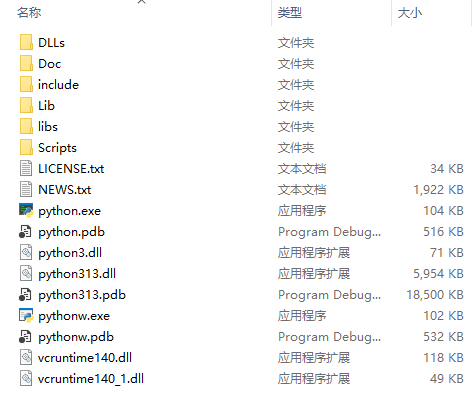
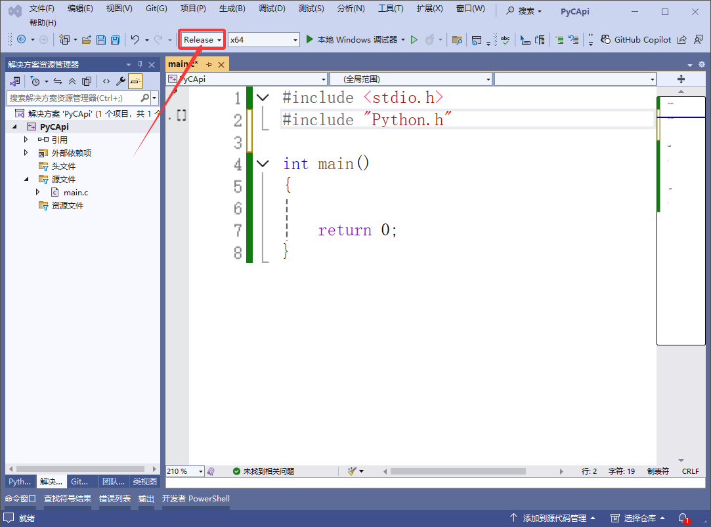
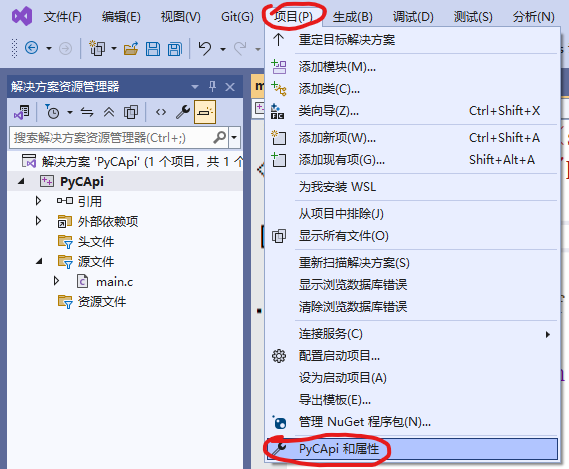
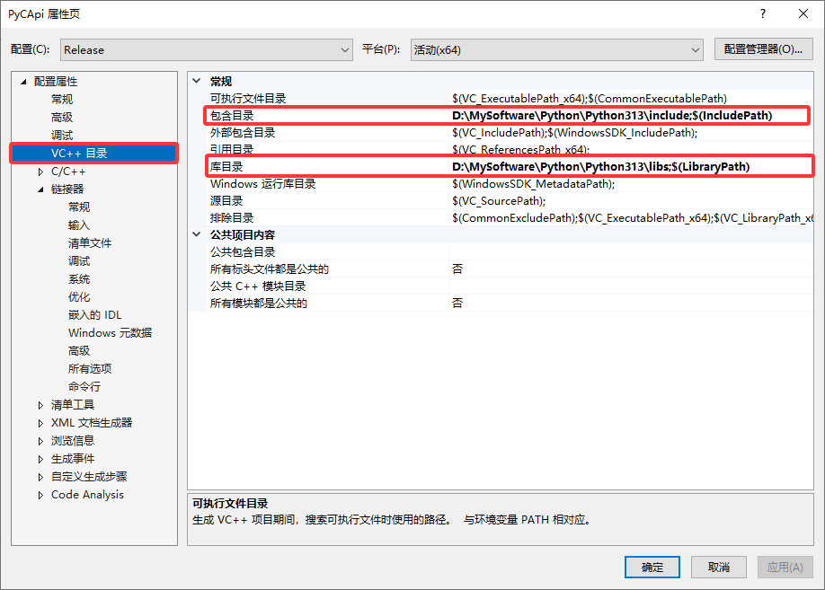
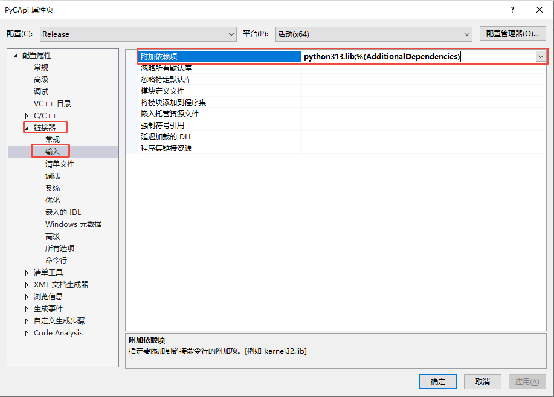

# Python/C API

在 C++ 中调用 Python 脚本可以通过 Python/C API 实现，只要安装好了Python就会自带C API开发库！

先找到Python安装路径，我的安装路径是`D:\MySoftware\Python\Python313`，目录里面的内容如下图：



+ include：C语言头文件所在目录
+ libs：库文件所在目录
+ lib：python包/模块目录

## 开发环境配置

### VS

#### 1. 创建一个空项目

创建好项目后，新建一个`main.c`文件。**注意：**把模式改成Release哟，python的库只有Release版本，没有Debug版本



#### 2.配置包含目录和库目录

+ 打开项目的属性页



+ 把头文件目录`D:\MySoftware\Python\Python313\include`配置到包含目录中
+ 把库文件目录`D:\MySoftware\Python\Python313\libs`配置掉库目录中



#### 3.配置库

把库目录`D:\MySoftware\Python\Python313\libs`下面的`python313.lib`配置到，`链接器/输入/附加依赖项`中。



### CMake

### 验证环境

在`main.c`中输入如下代码，用来查看python版本信息。

```c
#include <stdio.h>
#include "Python.h"

int main()
{
	printf("%s\n", Py_GetVersion());

	return 0;
}
```

如果正常运行，则会输出如下信息:

```css
3.13.2 (tags/v3.13.2:4f8bb39, Feb  4 2025, 15:23:48) [MSC v.1942 64 bit (AMD64)]
```

如果有报错，并且报错信息为`LNK1104无法打开文件“python313_d.lib”`，则表示项目模式为Debug，必须修改为Release模式！！！

## 开始使用

### 执行简单python语句

以下代码用python打印了一个`Hello from Python!`字符串。

```c
#include <Python.h>
#include <iostream>

int main() {
    // 初始化 Python 解释器
    Py_Initialize();

    // 执行 Python 语句
    PyRun_SimpleString("print('Hello from Python!')");

    // 释放 Python 解释器资源
    Py_Finalize();

    return 0;
}
```

`Py_Initialize()`用来初始化python解释器，必须调用，否则调用其他函数会导致程序中断；

` Py_Finalize()`用来释放python解释器，主要是用来做清理工作，比如释放内存，防止内存泄漏；

`PyRun_SimpleString()`用来执行简单的python脚本。

### 执行python文件

要想执行python文件，必须使用fopen打开，然后传入`PyRun_AnyFile`函数！

```c
#include <Python.h>

int main() {
    // 初始化 Python 解释器
    Py_Initialize();

    // 执行 Python 文件
    FILE* fp = fopen("main.py", "r");
    if (fp) {
        // 执行成功返回0
       int ret =  PyRun_AnyFile(fp, "main.py");
       printf("ret %d\n", ret);
       fclose(fp);
    }

    // 释放 Python 解释器资源
    Py_Finalize();

    return 0;
}
```

### 定义对象

> 如果只需要打印对象，可以通过 `PyObject_Print(obj, stdout, 0);`函数打印！！！

#### int

```c
 	// 创建 Python 整型对象
	PyObject* int_obj = PyLong_FromLong(123);
	if (!int_obj) {
		PyErr_Print();
        Py_Finalize();
        return -1;
    }

    // 把Python整型对象转成C语言long long 类型
    printf("int_obj as long is %ld\n", PyLong_AsLong(int_obj));

    // 减少引用计数
    Py_DECREF(int_obj);

```

#### float

```c
	// 创建 Python 浮点型对象
	PyObject* float_obj = PyFloat_FromDouble(520.1314);
	if (!float_obj) {
		PyErr_Print();
        Py_Finalize();
        return -1;
    }

    // 把Python整型对象转成C语言double类型
    printf("float_obj as long is %lf\n", PyFloat_AsDouble(float_obj));

    // 减少引用计数
    Py_DECREF(float_obj);
```

#### str

```c
	// 创建 Python 字符串对象
	PyObject* uni_obj = PyUnicode_FromString("hello world");
	//PyObject* uni_obj = PyUnicode_FromString(u8"hello world 顽石"); //中文必须使用u8作为前缀，因为只支持unicode编码
    //PyObject *unicode_obj = PyUnicode_DecodeFSDefault(c_str);		 //或者用这个把 C 风格的字符串（以 const char* 表示）按照文件系统默认编码解码为 Python 的 Unicode 字符串对象（PyUnicodeObject）
    const char* str = "你好hello";
    //PyObject* uni_obj = PyUnicode_Decode(str,strlen(str),"gbk","strict");
    //PyObject* uni_obj = PyUnicode_DecodeLocale("你好hello","strict");
	if (!uni_obj) {
		PyErr_Print();
        Py_Finalize();
        return -1;
    }

    // 把Python整型对象转成C语言const char*类型
    printf("uni_obj as const char* is %s\n", PyUnicode_AsUTF8(uni_obj));

    // 减少引用计数
    Py_DECREF(uni_obj);
```

在 Python 的 C API 里，`PyUnicode_DecodeLocale` 这类解码函数在调用时会有一个错误处理模式参数，像 `"strict"`、`"replace"` 和 `"ignore"` 等，这些参数决定了在解码过程中遇到无法解码的字节时该如何处理。

```c
PyObject* PyUnicode_DecodeLocale(const char *str,const char *errors);
```

+ **str**：待解码的字符串

+ **errors**：

  - **"strict"模式：** 属于严格的错误处理模式。当在解码过程中碰到无法解码的字节时，函数会抛出 `UnicodeDecodeError` 异常，并且返回 `NULL`。这就要求输入的字节序列必须完全符合指定的编码格式，否则解码操作会失败

  -  **"replace" 模式：**若在解码过程中遇到无法解码的字节，这些字节会被替换成特定的替换字符，通常是 `U+FFFD`（�）。这样解码操作可以继续进行，不会因为个别无法解码的字节而失败。
  - **"ignore" 模式：**在解码过程中遇到无法解码的字节会直接被忽略，不会对其进行任何处理，解码操作同样会继续进行。

#### tuple

一些辅助函数:

```c
// 辅助函数：获取对象的类型字符串
const char* get_type_string(PyObject* obj) {
    if (obj == NULL) {
        return "NULL";
    }
    PyTypeObject* type_obj = Py_TYPE(obj);
    if (type_obj == NULL) {
        return "Error getting type";
    }
    Py_DECREF(type_obj);
    return type_obj->tp_name;
}

void print_object(PyObject* obj, const char* delimeter)
{
	if (!obj) {
		printf("obj is nullptr\n");
		return;
	}

	if (PyLong_Check(obj)) {
		printf("%ld%s", PyLong_AsLong(obj), delimeter);
	}
	else if (PyFloat_Check(obj)) {
		printf("%lf%s", PyFloat_AsDouble(obj), delimeter);
	}
	else if (PyUnicode_Check(obj)) {
		printf("%s%s", PyUnicode_AsUTF8(obj), delimeter);
	}
	else if (PyTuple_Check(obj)) {
		for (size_t i = 0; i < PyTuple_Size(obj); i++) {
			PyObject* item = PyTuple_GetItem(obj, i);
			print_object(item, delimeter);
		}
	}
	else {
		printf("Type(%s)%s", get_type_string(obj), delimeter);
	}
}
```

创建tuple。

```c

	// 创建 Python 元组对象
	PyObject* tuple_obj = PyTuple_New(5);
	if (!tuple_obj) {
		PyErr_Print();
        Py_Finalize();
        return -1;
    }

    //设置元组数据
    PyObject* int_obj = PyLong_FromLong(5280620);
    PyObject* float_obj = PyFloat_FromDouble(1314.520);
    PyObject* str_obj = PyUnicode_FromString("hello python");
        
	PyTuple_SetItem(tuple_obj, 0, int_obj);
	PyTuple_SetItem(tuple_obj, 1, float_obj);
	PyTuple_SetItem(tuple_obj, 2, str_obj);
    for (size_t i = 3; i < PyTuple_Size(tuple_obj); i++) {
        PyObject* obj = PyLong_FromLong(111+i);
		PyTuple_SetItem(tuple_obj, i, obj);
    }

    //获取元组元素
    for (size_t i = 0; i < PyTuple_Size(tuple_obj); i++) {
        PyObject* item =  PyTuple_GetItem(tuple_obj, i);
        print_object(item, ", ");
    }

    // 减少引用计数
    Py_DECREF(tuple_obj);
```

#### list

```c
	// 创建 Python 列表对象
	PyObject* list_obj = PyList_New(3);
	if (!list_obj) {
		PyErr_Print();
        Py_Finalize();
        return -1;
    }

    //设置列表数据
	PyList_SetItem(list_obj, 0, PyLong_FromLong(5280620));
	PyList_SetItem(list_obj, 1, PyFloat_FromDouble(1314.520));
	PyList_SetItem(list_obj, 2, PyUnicode_FromString("hello python"));
    for (size_t i = 0; i < 5; i++) {
		PyList_Append(list_obj, PyUnicode_FromFormat("number_%d",i));
    }

    //获取列表元素
    for (size_t i = 0; i < PyList_Size(list_obj); i++) {
        PyObject* item =  PyList_GetItem(list_obj, i);
        print_object(item, ", ");
    }

    // 减少引用计数
    Py_DECREF(list_obj);
```

#### set

获取set的迭代器，并迭代set！

```c
void iterate_set(PyObject* set) {
	PyObject* iterator = PyObject_GetIter(set);
	if (!iterator) {
		PyErr_Print();
		return;
	}

	PyObject* item;
	while ((item = PyIter_Next(iterator))) {
		// 处理每个元素
		printf("Item: ");
		PyObject_Print(item, stdout, 0);
		printf("\n");

		Py_DECREF(item);  // 必须减少引用计数
	}

	Py_DECREF(iterator);

	// 检查是否有异常发生
	if (PyErr_Occurred() && !PyErr_ExceptionMatches(PyExc_StopIteration)) {
		PyErr_Print();
	}
}
```

创建set。

```c
	// 创建 Python 集合对象
	PyObject* set_obj = PySet_New(NULL);
	if (!set_obj) {
		PyErr_Print();
        Py_Finalize();
        return -1;
    }

    //设置集合数据
	PySet_Add(set_obj, PyLong_FromLong(5280620));
	PySet_Add(set_obj,PyFloat_FromDouble(1314.520));
	PySet_Add(set_obj, PyUnicode_FromString("hello python"));

   //打印集合元素
	iterate_set(set_obj);

    // 减少引用计数
    Py_DECREF(set_obj);
```

#### dict

修改一下辅助函数`print_object`。

```c
void print_object(PyObject* obj, const char* delimeter)
{
	if (!obj) {
		printf("obj is nullptr\n");
		return;
	}

	if (PyLong_Check(obj)) {
		printf("%ld%s", PyLong_AsLong(obj), delimeter);
	}
	else if (PyFloat_Check(obj)) {
		printf("%lf%s", PyFloat_AsDouble(obj), delimeter);
	}
	else if (PyUnicode_Check(obj)) {
		printf("%s%s", PyUnicode_AsUTF8(obj), delimeter);
	}
	else if (PyTuple_Check(obj)) {
		for (size_t i = 0; i < PyTuple_Size(obj); i++) {
			PyObject* item = PyTuple_GetItem(obj, i);
			print_object(item, delimeter);
		}
	}
	else if (PyList_Check(obj)) {
		for (size_t i = 0; i < PyList_Size(obj); i++) {
			PyObject* item = PyList_GetItem(obj, i);
			print_object(item, delimeter);
		}
	}
	else if (PySet_Check(obj)) {
		iterate_set(obj);
	}
	else if (PyDict_Check(obj)) {
		PyObject* item_list = PyDict_Items(obj);
		if (item_list) {
			print_object(item_list,delimeter);
		}
	}
	else {
		printf("Type(%s)%s", get_type_string(obj), delimeter);
	}
}
```

创建字典。

```c
	// 创建 Python 字典对象
	PyObject* dict_obj = PyDict_New();
	if (!dict_obj) {
		PyErr_Print();
		Py_Finalize();
		return -1;
	}

	//设置字典数据
	PyDict_SetItem(dict_obj, PyUnicode_FromString("host"), PyUnicode_FromString("localhost"));
	PyDict_SetItem(dict_obj, PyUnicode_FromString("port"), PyLong_FromLong(3306));
	PyDict_SetItemString(dict_obj,"user",PyUnicode_FromString("root"));
	PyDict_SetItemString(dict_obj,"user",PyUnicode_FromString("123456"));

	//获取所有键
	printf("%s\n", get_type_string(PyDict_Keys(dict_obj)));
	print_object(PyDict_Keys(dict_obj), ", ");

	printf("%s\n", get_type_string(PyDict_Values(dict_obj)));
	print_object(PyDict_Values(dict_obj), ", ");

	//获取字典元素
	printf("%s\n", get_type_string(PyDict_Items(dict_obj)));
	print_object(dict_obj, ", ");

	// 减少引用计数
	Py_DECREF(dict_obj);
```


### 调用函数

#### 全局函数

**main.py**

```python
def show():
    print('hello I\'m main.py!')
```

**main.c**

```c
#include <Python.h>
#include <stdio.h>

//添加模块查找目录
int add_module_path(const char* path)
{
    // 获取 sys 模块
    PyObject *pSysModule = PyImport_ImportModule("sys");
    if (pSysModule == NULL) {
        PyErr_Print();
        return 1;
    }

    // 获取 sys.path 列表
    PyObject *pPathList = PyObject_GetAttrString(pSysModule, "path");
    if (pPathList == NULL) {
        PyErr_Print();
        Py_DECREF(pSysModule);
        return 1;
    }

    // 创建要添加的路径的 Unicode 对象
    PyObject *pNewPath = PyUnicode_DecodeFSDefault(path);
    if (pNewPath == NULL) {
        PyErr_Print();
        Py_DECREF(pPathList);
        Py_DECREF(pSysModule);
        return 1;
    }

    // 向 sys.path 列表中添加新路径
    if (PyList_Append(pPathList, pNewPath) == -1) {
        PyErr_Print();
        return 1;
    }

    // 释放对象
    Py_DECREF(pNewPath);
    Py_DECREF(pPathList);
    Py_DECREF(pSysModule);
    return 0;
}

int add_module_path_list(const char* paths[],int size)
{
    // 获取 sys 模块
    PyObject *pSysModule = PyImport_ImportModule("sys");
    if (pSysModule == NULL) {
        PyErr_Print();
        return 1;
    }

    // 获取 sys.path 列表
    PyObject *pPathList = PyObject_GetAttrString(pSysModule, "path");
    if (pPathList == NULL) {
        PyErr_Print();
        Py_DECREF(pSysModule);
        return 1;
    }

    // 创建要添加的路径的 Unicode 对象
    for (int i = 0; i < size; i++) {
		PyObject* pNewPath = PyUnicode_DecodeFSDefault(paths[i]);
		 if (pNewPath == NULL) {
			 PyErr_Print();
             continue;
		 }

		 // 向 sys.path 列表中添加新路径
		 if (PyList_Append(pPathList, pNewPath) == -1) {
			 PyErr_Print();
		 }
	}

    // 释放对象
    Py_DECREF(pPathList);
    Py_DECREF(pSysModule);

    return 0;
}

//调用全局函数
int call_python_function() {
    PyObject *pModule, *pFunc,*pValue;

    //add_module_path(".");
    const char* path_list[] = {".","C:/hello/maye"};
    add_module_path_list(path_list,2);

    // 导入模块
    pModule = PyImport_ImportModule("main");
    if (!pModule) {
        PyErr_Print();
        return 1;
    }
    
    // 获取函数
    pFunc = PyObject_GetAttrString(pModule, "show");
    if (!pFunc || !PyCallable_Check(pFunc)) {
        if (PyErr_Occurred())
            PyErr_Print();
        fprintf(stderr, "Cannot find function show\n");
        Py_XDECREF(pModule);
        return 1;
    }
    
    // 调用函数
    pValue = PyObject_CallObject(pFunc, NULL);
    
    // 处理结果
    if (pValue) {
        PyObject_Print(pValue,stdout,0);
        Py_DECREF(pValue);
    } else {
        PyErr_Print();
    }
    
    // 清理
    Py_DECREF(pFunc);
    Py_DECREF(pModule);
    return 0;
}

int main() {
    Py_Initialize();
    
    int ret = call_python_function();
    
    Py_Finalize();
    return ret;
}
```

#### 静态/类方法

**main.py**

```python
class Student:
    @staticmethod
    def static_method():
        print('I\'m Student static_method')
        
    @classmethod
    def class_method(cls):
        print('I\'m Student class_method',cls)
```

**main.c**

```c
int call_static_method() {
    PyObject *pModule, *pFunc,*pResult;

    //添加模块查找路径
    add_module_path(".");

    // 导入模块
    pModule = PyImport_ImportModule("main");
    if (!pModule) {
        PyErr_Print();
        return 1;
    }

    //从模块中获取Student类对象(类也是一个特殊对象)
    PyObject* pClass =  PyObject_GetAttrString(pModule, "Student");
    if (pClass == NULL) {
		Py_DECREF(pModule);
        PyErr_Print();
        return 1;
    }

    //检查获取的对象是否为类对象
    if (!PyType_Check(pClass)) {
		Py_DECREF(pModule);
        fprintf(stderr, "Student not Class object\n");
        return 1;
    }

    //从类对象中获取静态方法
    pFunc =  PyObject_GetAttrString(pClass, "static_method");
    //pFunc =  PyObject_GetAttrString(pClass, "class_method");
    if (pFunc == NULL) {
		Py_DECREF(pClass);
		Py_DECREF(pModule);
        PyErr_Print();
        return 1;
    }

    //检查是否是可以调用对象
    if (!PyCallable_Check(pFunc)) {
		Py_DECREF(pClass);
		Py_DECREF(pModule);
		Py_DECREF(pFunc);
        PyErr_Print();
        return 1;
    }

    //调用静态方法
     pResult = PyObject_CallObject(pFunc, NULL);
    if (!pResult) {
		Py_DECREF(pClass);
		Py_DECREF(pModule);
		Py_DECREF(pFunc);
        PyErr_Print();
        return 1;
    }
     
    // 处理结果
    if (pResult) {
        PyObject_Print(pResult,stdout,0);
        Py_DECREF(pResult);
    } else {
        PyErr_Print();
    }
    
    // 清理
    Py_DECREF(pFunc);
    Py_DECREF(pModule);
    return 0;
}
```

#### 实例方法

**main.py**

```python
import random

class Student:
    def __init__(self):
        self.names=['maye','顽石','莫影','微笑']

    def get_name(self):
        return random.choice(self.names)
```

**main.c**

```c
int call_static_method() {
    PyObject *pModule, *pFunc,*pResult;

    //添加模块查找路径
    add_module_path(".");

    // 导入模块
    pModule = PyImport_ImportModule("main");
    if (!pModule) {
        PyErr_Print();
        return 1;
    }

    //从模块中获取Student类对象(类也是一个特殊对象)
    PyObject* pClass =  PyObject_GetAttrString(pModule, "Student");
    if (pClass == NULL) {
		Py_DECREF(pModule);
        PyErr_Print();
        return 1;
    }

    //检查获取的对象是否为类对象
    if (!PyType_Check(pClass)) {
		Py_DECREF(pModule);
        fprintf(stderr, "Student not Class object\n");
        return 1;
    }

    //创建类的实例(参数会传递给构造函数，没有就传递NULL)
    PyObject* pInstance = PyObject_CallObject(pClass, NULL);
    if (pInstance == NULL) {
		Py_DECREF(pClass);
		Py_DECREF(pModule);
        PyErr_Print();
        return 1;
    }

    //从类的实例对象中获取实例方法
    pFunc =  PyObject_GetAttrString(pInstance, "get_name");
    if (pFunc == NULL) {
		Py_DECREF(pInstance);
		Py_DECREF(pClass);
		Py_DECREF(pModule);
        PyErr_Print();
        return 1;
    }

    //检查是否是可以调用对象
    if (!PyCallable_Check(pFunc)) {
		Py_DECREF(pClass);
		Py_DECREF(pModule);
		Py_DECREF(pFunc);
        PyErr_Print();
        return 1;
    }

    //调用实例方法
	pResult = PyObject_CallObject(pFunc, NULL);
    if (!pResult) {
		Py_DECREF(pClass);
		Py_DECREF(pModule);
		Py_DECREF(pFunc);
        PyErr_Print();
        return 1;
    }
     
    // 处理结果
    if (pResult) {
        //PyObject* encoded = PyUnicode_AsEncodedString(pResult,Py_FileSystemDefaultEncoding, "strict");
        PyObject* encoded = PyUnicode_AsEncodedString(pResult,"gb2312", "strict");
        printf("name is : %s\n",PyBytes_AsString(encoded));
        PyObject_Print(pResult,stdout,0);
        Py_DECREF(pResult);
    } else {
        PyErr_Print();
    }
    
    // 清理
    Py_DECREF(pFunc);
    Py_DECREF(pModule);
    return 0;
}
```

#### 函数传参

##### 位置参数

传递位置参数必须传递元组，把多个参数打包成元组批量传递即可！

```c
//获取set_name方法
pFunc = PyObject_GetAttrString(pInstance, "set_name");
if (pFunc == NULL) {
	Py_DECREF(pInstance);
	Py_DECREF(pClass);
	Py_DECREF(pModule);
    PyErr_Print();
    return 1;
}

//创建参数
PyObject* arg_name = PyUnicode_DecodeLocale("你好hello","strict");
if (arg_name == NULL) {
    PyErr_Print();
    Py_DECREF(pFunc);
    return 1;
}

//创建元组(位置参数必须放到元组中)
PyObject* args = PyTuple_New(1);

// 将字符串对象设置到元组中
if (PyTuple_SetItem(args, 0, arg_name) != 0) {
    PyErr_Print();
    Py_DECREF(arg_name);
    Py_DECREF(args);
    Py_DECREF(pFunc);
    return 1;
}

//调用set_name函数
pResult = PyObject_CallObject(pFunc, args);
if (!pResult) {
	Py_DECREF(pClass);
	Py_DECREF(pModule);
	Py_DECREF(pFunc);
    PyErr_Print();
    return 1;
}

//减少引用
Py_DECREF(args);
Py_DECREF(pFunc);
```

##### 关键字参数

关键字参数必须打包成字典进行传递！

```c
int call_static_method() {
    PyObject *pModule, *pFunc,*pResult;

    //添加模块查找路径
    add_module_path(".");

    // 导入模块
    pModule = PyImport_ImportModule("main");
    if (!pModule) {
        PyErr_Print();
        return 1;
    }

    //获取print_info方法
    pFunc = PyObject_GetAttrString(pModule, "print_info");
    if (pFunc == NULL) {
		Py_DECREF(pModule);
        PyErr_Print();
        return 1;
    }

    //创建参数
    PyObject* arg_name = PyUnicode_DecodeLocale("maye","strict");
    if (arg_name == NULL) {
        PyErr_Print();
        Py_DECREF(pFunc);
        return 1;
    }

    PyObject* arg_age= PyLong_FromLong(18);
    if (arg_name == NULL) {
        PyErr_Print();
        Py_DECREF(pFunc);
        return 1;
    }


    //创建元组(位置参数必须放到元组中)
    PyObject* args = PyDict_New();

    // 将字符串对象设置到元组中
    if (PyDict_SetItemString(args,"name", arg_name) != 0) {
        PyErr_Print();
        Py_DECREF(arg_name);
        Py_DECREF(args);
        Py_DECREF(pFunc);
        return 1;
    }

    if (PyDict_SetItemString(args,"age", arg_age) != 0) {
        PyErr_Print();
        Py_DECREF(arg_age);
        Py_DECREF(args);
        Py_DECREF(pFunc);
        return 1;
    }


    //调用print_info函数
	pResult = PyObject_Call(pFunc, PyTuple_New(0), args);
    if (!pResult) {
		Py_DECREF(pModule);
		Py_DECREF(pFunc);
        PyErr_Print();
        return 1;
    }

    //减少引用
    Py_DECREF(args);
    // 清理
    Py_DECREF(pFunc);
    Py_DECREF(pModule);
    return 0;
}
```

### 有包的调用

#### 自定义包

目录结构如下：

```
-- project
  -- pkg
     -- __init__.py
     -- hello.py
  -- main.py
  -- main.c
```

**hello.py**

```python
def show():
    print('hello I\'m main.py!')
```

**main.py**

```python
from pkg import hello

def main():
    hello.show()

if __name__ == '__main__':
    main()
```

**main.c**

```c
int call_static_method() {
    PyObject *pModule, *pFunc,*pResult;

    //添加模块查找路径
    add_module_path(".");

    // 导入模块
    pModule = PyImport_ImportModule("main");
    if (!pModule) {
        PyErr_Print();
        return 1;
    }

    //获取print_info方法
    pFunc = PyObject_GetAttrString(pModule, "main");
    if (pFunc == NULL) {
		Py_DECREF(pModule);
        PyErr_Print();
        return 1;
    }

    //调用print_info函数
	pResult = PyObject_CallNoArgs(pFunc);
    if (!pResult) {
		Py_DECREF(pModule);
		Py_DECREF(pFunc);
        PyErr_Print();
        return 1;
    }

    // 清理
    Py_DECREF(pFunc);
    Py_DECREF(pModule);
    return 0;
}
```

上面代码是，先找到`main`模块，然后再调用`main`函数，实际上也可以直接执行`main.py`文件。

```c
int test_call_py() {
    //添加模块查找路径
    add_module_path(".");

    FILE* fp = fopen("main.py", "r");
    if (!fp) {
        perror("main.py open failed");
        return 1;
    }

	if (PyRun_AnyFile(fp, "main.py") != 0) {
        PyErr_Print();
        return 1;
    }
    return 0;
}
```

#### 第三方包

以我写的[飞机大战项目](https://pan.baidu.com/s/1hMo0W5jOQXl8sjhBUHtSZQ?pwd=mr86)为例，此项目使用了`pygame`包。

目录结构如下：

```
-- PlaneWars
  -- .venv				#虚拟环境目录，第三方包安装在这里面
     -- Lib	
	     -- site-packages
	     	-- pygame
	     	-- pip
	     	-- ...
  -- hdygame
  	-- __init__.py
	-- animation.py
	-- game.py
	-- gameobject.py
	-- scene.py
  -- Resource
	-- bullet.py
	-- enemy.py
	-- main.py
	-- PlaneScene.py
	-- player.py
	-- supply.py
	-- TestScene.py
```

**main.py**

```python
import hdygame as hg
import PlaneScene

def main():
    game = hg.game.Game((480,700),'Plane Wars')
    game.run_scene(PlaneScene.PlaneScene())
    game.run()

if __name__ == '__main__':
    main()
```

**main.c**

```c
#include "Python.h"
#include <direct.h>

int add_module_path_list(const char* paths[], int size);

//直接运行main.py文件
void run()
{
    //python项目根目录
    const char* project_path = "C:/Users/Maye/Downloads/PlaneWars";

    //需要指定包查找目录(项目根目录、pygame根目录)
    const char* paths[] = { 
        project_path,
        "C:/Users/Maye/Downloads/PlaneWars/.venv/Lib/site-packages"
    };
    add_module_path_list(paths, sizeof(paths) / sizeof(paths[0]));

    //改变当前工作目录(不设置找不到Resource目录)
    if (chdir(project_path) != 0) {
        perror("chdir failed");
        return;
    }

    //打开py文件
    FILE* fp = fopen("C:/Users/Maye/Downloads/PlaneWars/main.py", "r");
    if (!fp) {
        perror("main.py open failed");
        return;
    }
    //运行文件
    if (PyRun_AnyFile(fp, "main.py") != 0) {
        PyErr_Print();
        return;
    }
    //关闭文件
    fclose(fp);
}

//查找mian.py文件，然后调用mian函数
void run_main()
{
    //python项目根目录
    const char* project_path = "C:/Users/Maye/Downloads/PlaneWars";

    //需要指定包查找目录(项目根目录、pygame根目录)
    const char* paths[] = { 
        project_path,
        "C:/Users/Maye/Downloads/PlaneWars/.venv/Lib/site-packages"
    };
    add_module_path_list(paths, sizeof(paths) / sizeof(paths[0]));

    //改变当前工作目录(不设置找不到Resource目录)
    if (chdir(project_path) != 0) {
        perror("chdir failed");
        return;
    }

    //查找飞机大战main模块(就是main.py)文件
    PyObject* pModule = PyImport_ImportModule("main");
    if (pModule == NULL) {
        PyErr_Print();
        return;
    }

    //查找mian模块中的main函数
    PyObject* mainFunc =  PyObject_GetAttrString(pModule, "main");
	if (mainFunc == NULL) {
        PyErr_Print();
        Py_DECREF(pModule);
        return;
    }

    //调用main函数
	PyObject* pResult = PyObject_CallNoArgs(mainFunc);
	if (pResult == NULL) {
        PyErr_Print();
		Py_DECREF(mainFunc);
        Py_DECREF(pModule);
        return;
    }

	Py_DECREF(mainFunc);
	Py_DECREF(pModule);
    printf("call finished!\n");
}

int main()
{
	Py_Initialize();

    //run();
    run_main();

    Py_Finalize();
	return 0;
}

int add_module_path_list(const char* paths[],int size)
{
    // 获取 sys 模块
    PyObject *pSysModule = PyImport_ImportModule("sys");
    if (pSysModule == NULL) {
        PyErr_Print();
        return 1;
    }

    // 获取 sys.path 列表
    PyObject *pPathList = PyObject_GetAttrString(pSysModule, "path");
    if (pPathList == NULL) {
        PyErr_Print();
        Py_DECREF(pSysModule);
        return 1;
    }

    // 创建要添加的路径的 Unicode 对象
    for (int i = 0; i < size; i++) {
		PyObject* pNewPath = PyUnicode_DecodeFSDefault(paths[i]);
		 if (pNewPath == NULL) {
			 PyErr_Print();
             continue;
		 }

		 // 向 sys.path 列表中添加新路径
		 if (PyList_Append(pPathList, pNewPath) == -1) {
			 PyErr_Print();
		 }
	}

    // 释放对象
    Py_DECREF(pPathList);
    Py_DECREF(pSysModule);

    return 0;
}
```