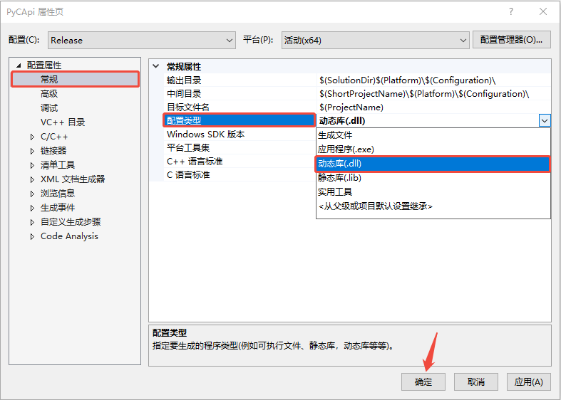
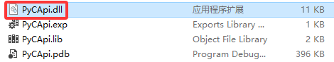

## Python调用C/C++

在Python中调用C/C++代码，我们需要把C/C++编译成动态库，然后使用Python的ctypes模块，打开动态库，然后调用函数！

### 生成DLL

**C语言**

```c
#include <stdio.h>

__declspec(dllexport) void print_version() {
	printf("hdydll version is 1.0.0!\n");
}
```

要将`print_version`函数导出到DLL中，需要再函数前面加上`__declspec(dllexport)`声明，说这个函数要被其他程序调用，即作为DLL的一个对外函数接口。

**C++**

```cpp
#include <stdio.h>

extern "C" __declspec(dllexport) void print_version() {
	printf("hdydll version is 1.0.0!\n");
}
```

在C++代码中，需要再函数前面加上`extern "C"`，表示以C语言的方式编译函数，只有这样Python才能识别到。

#### VS中生成DLL

使用Vs时，需要把项目属性修改一下，如下图所示：



不修改默认就是生成exe可执行文件，但是因为库中是没有main函数的，所以一定会报错；当修改为dll时，就会生成dll文件，不管其中有没有main函数。

生成的文件如下图所示:



#### CMake中生成DLL

**CMakeLists.txt**

```cmake
cmake_minimum_required (VERSION 3.8)

project ("hdy")

set(CMAKE_RUNTIME_OUTPUT_DIRECTORY ${CMAKE_SOURCE_DIR}/py)	#设置dll输出目录
set(CMAKE_ARCHIVE_OUTPUT_DIRECTORY ${CMAKE_SOURCE_DIR}/py)	#设置lib输出目录

# 导出符号到.lib文件
set(CMAKE_WINDOWS_EXPORT_ALL_SYMBOLS ON)

# 生成动态库
add_library(${PROJECT_NAME} SHARED "cdll.cpp")
```


### Python调用DLL

```python
import ctypes

#hdy = ctypes.CDLL('F:/MyCode/test_code/test_python/PyCApi/hdy')
hdy = ctypes.CDLL('./hdy')

hdy.print_version()
```

使用ctypes.CDLL()打开动态库，返回的就是一个CDLL对象，然后使用对象调用动态库中的函数即可！

下面为你提供 Python `ctypes` 类型与 C 语言类型的对照列表，方便你在使用 `ctypes` 模块调用 C 函数时进行类型转换。

### 数据类型对照

#### 基本类型

| C 语言类型       | `ctypes` 类型       | 描述                       |
| ---------------- | ------------------- | -------------------------- |
| `char`           | `ctypes.c_char`     | 单字节字符                 |
| `short`          | `ctypes.c_short`    | 短整型（通常 2 字节）      |
| `int`            | `ctypes.c_int`      | 整型（通常 4 字节）        |
| `long`           | `ctypes.c_long`     | 长整型（通常 4 或 8 字节） |
| `long long`      | `ctypes.c_longlong` | 长长整型（8 字节）         |
| `unsigned char`  | `ctypes.c_ubyte`    | 无符号字节                 |
| `unsigned short` | `ctypes.c_ushort`   | 无符号短整型               |
| `unsigned int`   | `ctypes.c_uint`     | 无符号整型                 |
| `unsigned long`  | `ctypes.c_ulong`    | 无符号长整型               |
| `float`          | `ctypes.c_float`    | 单精度浮点数               |
| `double`         | `ctypes.c_double`   | 双精度浮点数               |
| `char*`          | `ctypes.c_char_p`   | 字符串指针                 |
| `void*`          | `ctypes.c_void_p`   | 通用指针                   |
| `wchar_t`        | `ctypes.c_wchar`    | 宽字符                     |
| `wchar_t*`       | `ctypes.c_wchar_p`  | 宽字符串指针               |

#### 结构体和联合

| C 语言类型 | `ctypes` 实现方式          |
| ---------- | -------------------------- |
| `struct`   | 继承 `ctypes.Structure` 类 |
| `union`    | 继承 `ctypes.Union` 类     |

#### 其他类型

| C 语言类型 | `ctypes` 类型      |
| ---------- | ------------------ |
| `bool`     | `ctypes.c_bool`    |
| `size_t`   | `ctypes.c_size_t`  |
| `ssize_t`  | `ctypes.c_ssize_t` |
| `FILE*`    | `ctypes.c_void_p`  |

#### 平台特定类型

| C 语言类型 | Windows                   | Linux/macOS |
| ---------- | ------------------------- | ----------- |
| `HANDLE`   | `ctypes.wintypes.HANDLE`  | N/A         |
| `HWND`     | `ctypes.wintypes.HWND`    | N/A         |
| `LPCTSTR`  | `ctypes.wintypes.LPCTSTR` | N/A         |
| `DWORD`    | `ctypes.wintypes.DWORD`   | N/A         |

### 给C语言函数传递参数

#### 传递数值类型

**C/C++**

```cpp
#ifdef _WIN32
	#define HDY_API __declspec(dllexport)
#else
	#define HDY_API
#endif // _WIN32

extern "C" HDY_API void print_num(int a, float b, bool c)
{
	printf("%d %f %s\n", a, b, c ? "true" : "false");
}
```

**Python**

```python
hdy.print_num(1,ctypes.c_float(2),True)
```

#### 传递字符串

**C/C++**

```cpp
#ifdef __cplusplus
	#define HDY_EXTERN extern "C"
#else
	#define HDY_EXTERN
#endif // __cplusplus

#ifdef _WIN32
	#define HDY_API HDY_EXTERN __declspec(dllexport)
#else
	#define HDY_API HDY_EXTERN 
#endif // _WIN32

HDY_API void print_string(const char* str, int size)
{
	printf("print_string:%s (%d)\n", str, size);
}

HDY_API void print_wstring(const wchar_t* str, int size)
{
	wprintf(L"print_wstring:%s (%d)\n",str, size);
}
```

**Python**

```python
bs = b'hello wrold'
hdy.print_string(bs,len(bs))

s = 'hello world'
hdy.print_wstring(s,len(s))
```

实际上，在C语言中是可以修改python传递过来的字符串的，但是不推荐直接修改，如果要修改可以在python中通过一个函数创建，可修改的字符串！

```cpp
 HDY_API void print_string_buffer(char* str, int size)
 {
	 str[0] = '@';
     str[1] = 'h';
     str[2] = 'd';
     str[3] = 'y';
	 printf("print_string:%s (%d)\n", str, size);
 }
```

**Python**

```python
buf =  ctypes.create_string_buffer(b'maye')
hdy.print_string_buffer(buf,len(buf))
print(buf.raw,len(buf))
```

也可以传递长度，表示预分配内存：

```python
buf =  ctypes.create_string_buffer(32)
hdy.print_string_buffer(buf,len(buf))
print(buf.raw,len(buf))	#len(buf)是32，而不是字符串实际长度
```

### 返回值

通过python调用C函数时，所有函数默认都是int返回类型！除了返回int类型的函数外，其他函数都要手动指定返回类型！

```python
<lib_name>.<c_function_name>.restype = <ctypes.c_char_p>
```

案例如下：

```python
ret = hdy.get_age()
print(type(ret),ret);

hdy.get_name.restype = ctypes.c_char_p	#指明返回类型为char*
ret = hdy.get_name()
print(type(ret),ret);

hdy.get_say.restype = ctypes.c_wchar_p	#指明返回类型为wchar_t *
ret = hdy.get_say()
print(type(ret),ret);
```

### 传递和返回指针类型