## PyCharm

PyCharm是一款非常好用的Python IDE，由JetBrains开发而成。

### 下载PyCharm

进入PyCharm官网：[PyCharm: The only Python IDE you need](https://www.jetbrains.com.cn/pycharm/)点击下载。

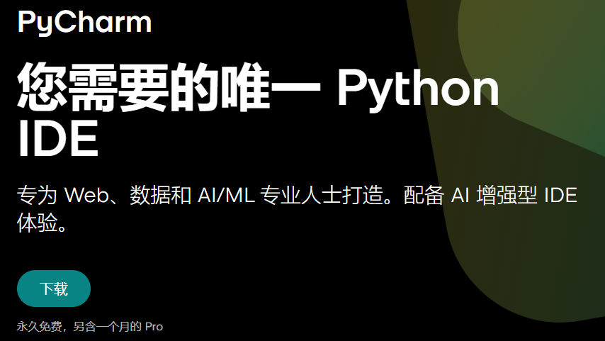

默认就是windows版本，直接点击下载。下载可能会很慢，在此准备了[PyCharm网盘下载](https://pan.baidu.com/s/1N_yl6sQ3kG93On0Any-m3g?pwd=ywbm )。

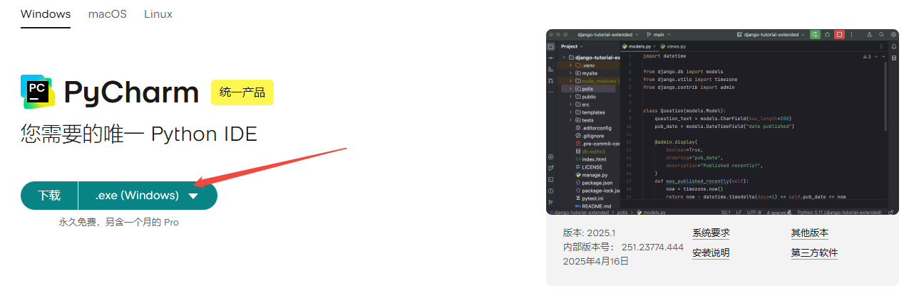

### 安装

+ 下载完成后，双击安装包程序，即可安装！

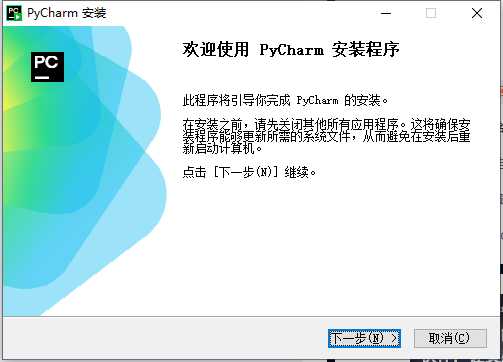

+ 选择安装位置，建议修改一下，不要安装在C盘，因为比较大！

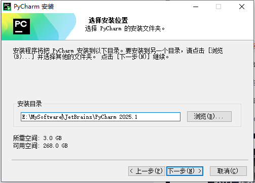

+ 安装选项，可以都勾选上

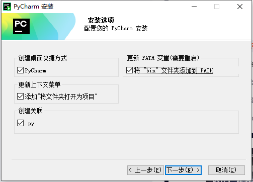

+ 选择"开始菜单文件夹"，直接点击安装即可

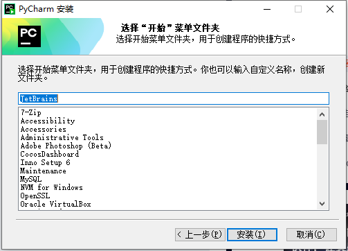

+ 耐心等待安装完成，大约需要1~3分钟！

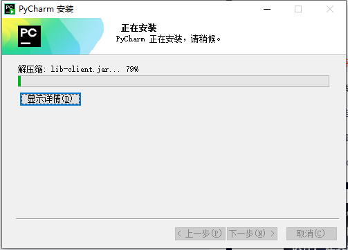

+ 安装完成，还需要重启一下电脑，手动重启即可！

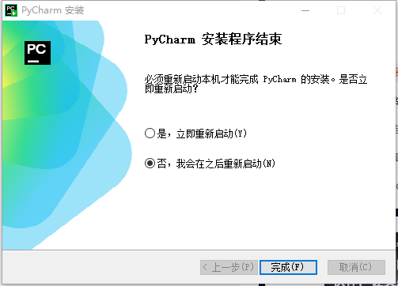

### 破解

#### 下载破解工具

破解脚本我放置在了网盘中，点击即可下载[破解工具下载](https://pan.baidu.com/s/1N_yl6sQ3kG93On0Any-m3g?pwd=ywbm )。


下载成功后，是个压缩包，将它**解压到一个路径中没有 “中文”，“空格” 的位置**，我这里解压到了 `C:\Users\Maye\Downloads\jetbra-pojie`, 注意一定要这么做，不然会导致破解失败！！！

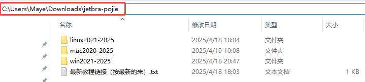

> 可以看到，有三个文件夹：
>
> - **win2021-2015**: 存放的是 Windows 系统对应的破解脚本；
> - **mac2021-2015**: 苹果 Mac 系统对应的破解脚本；
> - **linux2021-2015**: Linux 系统对应的破解脚本；

#### 开始破解

根据你实际的操作系统，进入到对应的文件夹下，我使用的是 Windows 系统，所以，进入到 `/win2020-2025` 文件夹中。

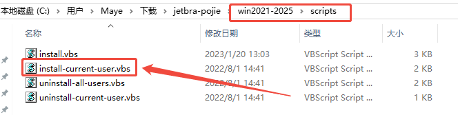

双击 `install-current-user.vbs` 脚本 ，表示为当前系统用户执行破解。然后，点击弹框中的**确定**按钮!

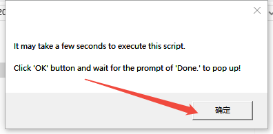

**注意**，破解过程中没有任何提示，只需要等待个 10s - 30s 时间（部分用户可能需要等待好几分钟，本人就是，所以，耐心等待一会就行）。

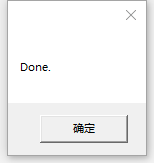

当提示上图所示的 `Done` , 则表示脚本执行成功，继续后面的步骤。

#### 启动PyCharm，输入激活码

激活成功后，打开 Pycharm 。注意，2024.2 之后的版本，若初次安装，会提示选择所在区域，如下图所示，如果选择了 `China Mainland`，会在激活的时候反复跳出激活码并提示激活码无效，原因是新版本会拦截 `.cn` 域名，导致激活许可被吊销，所以，**千万不要指定区域**！！

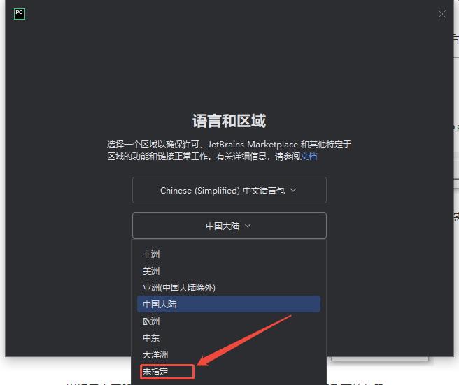

选择未指定区域之后，点击下一个

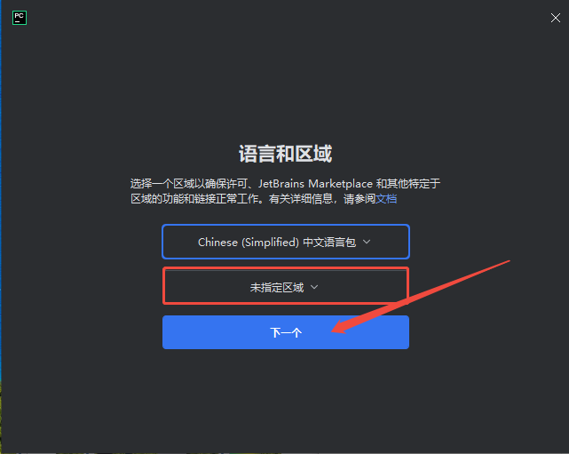

如果是老用户，已经使用过了的，则可以在**设置**中来更改(**一定要修改！！**)

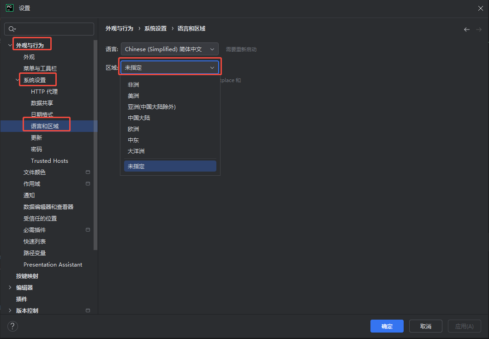

勾选阅读并接受协议，点击继续

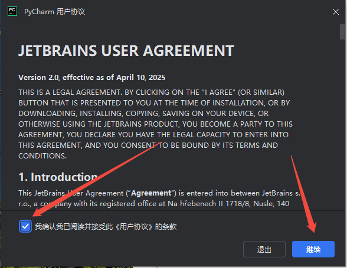

不发送数据共享

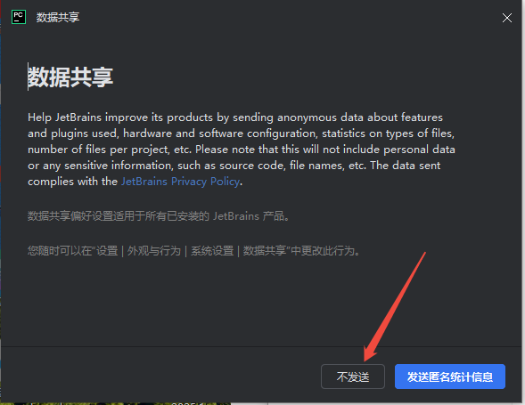

跳过导入设置

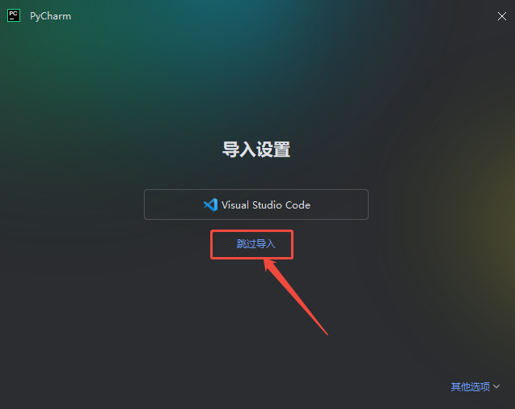

进入PyCharm后，点击左下角小齿轮，然后选择**管理许可证**

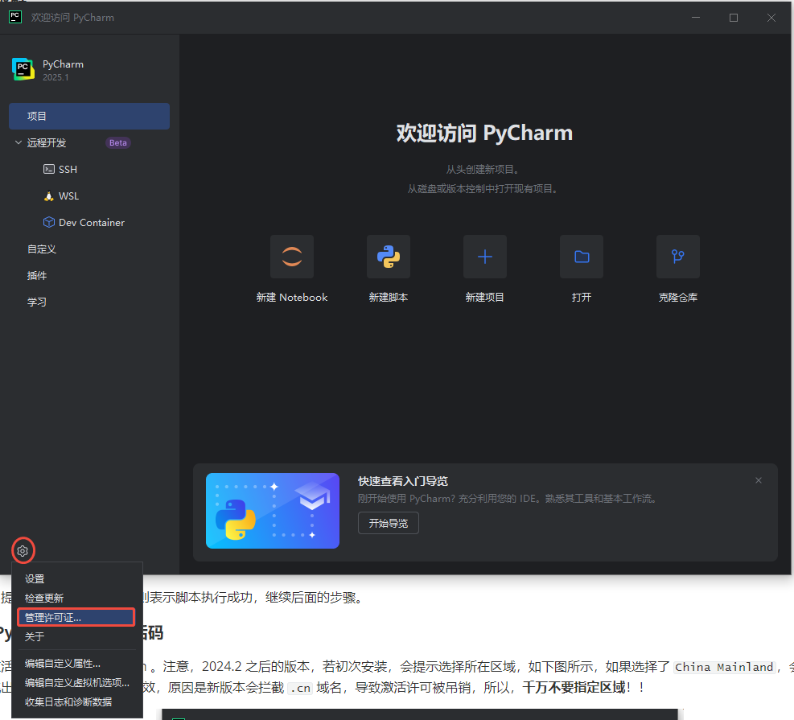

在弹出的窗口中，选择**激活其他订阅**

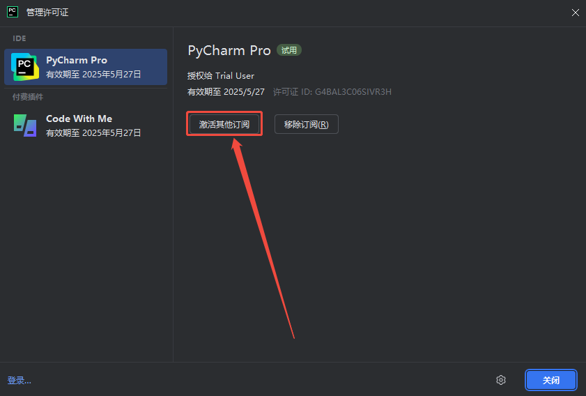

勾选**激活码**，以激活码的方式来激活，然后复制下面的激活码，粘贴之后点击激活！

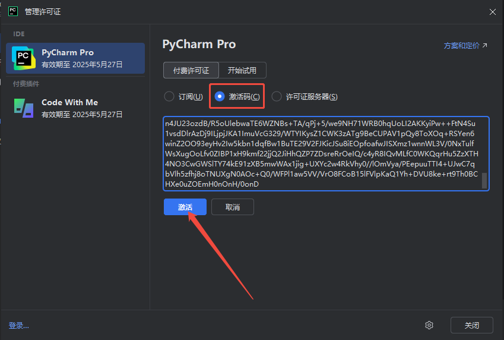

**激活码**

```css
VAE9B0CRYZ-eyJsaWNlbnNlSWQiOiJWQUU5QjBDUllaIiwibGljZW5zZWVOYW1lIjoiZnV6emVzIGFsbHkiLCJhc3NpZ25lZU5hbWUiOiIiLCJhc3NpZ25lZUVtYWlsIjoiIiwibGljZW5zZVJlc3RyaWN0aW9uIjoiIiwiY2hlY2tDb25jdXJyZW50VXNlIjpmYWxzZSwicHJvZHVjdHMiOlt7ImNvZGUiOiJQU0kiLCJmYWxsYmFja0RhdGUiOiIyMDIzLTA3LTAxIiwicGFpZFVwVG8iOiIyMDIzLTA3LTAxIiwiZXh0ZW5kZWQiOnRydWV9LHsiY29kZSI6IlBDIiwiZmFsbGJhY2tEYXRlIjoiMjAyMy0wNy0wMSIsInBhaWRVcFRvIjoiMjAyMy0wNy0wMSIsImV4dGVuZGVkIjpmYWxzZX0seyJjb2RlIjoiUFBDIiwiZmFsbGJhY2tEYXRlIjoiMjAyMy0wNy0wMSIsInBhaWRVcFRvIjoiMjAyMy0wNy0wMSIsImV4dGVuZGVkIjp0cnVlfSx7ImNvZGUiOiJQQ1dNUCIsImZhbGxiYWNrRGF0ZSI6IjIwMjMtMDctMDEiLCJwYWlkVXBUbyI6IjIwMjMtMDctMDEiLCJleHRlbmRlZCI6dHJ1ZX0seyJjb2RlIjoiUFdTIiwiZmFsbGJhY2tEYXRlIjoiMjAyMy0wNy0wMSIsInBhaWRVcFRvIjoiMjAyMy0wNy0wMSIsImV4dGVuZGVkIjp0cnVlfV0sIm1ldGFkYXRhIjoiMDEyMDIyMDcwMVBTQU4wMDAwMDUiLCJoYXNoIjoiVFJJQUw6MTMxNzYyODYxMCIsImdyYWNlUGVyaW9kRGF5cyI6NywiYXV0b1Byb2xvbmdhdGVkIjpmYWxzZSwiaXNBdXRvUHJvbG9uZ2F0ZWQiOmZhbHNlfQ==-YxAJSVk5XIZkkI6vH33zgb/hRmCdqia89zpsVHp2x52PY0XgOOiAlcR3/BVhm0qRYLBYBBHMpPcz0+ZWr2diKy0QexfbtVIVsCRkVaRgl67Tbw9MKb5jVNqpqth2yEoW/gmm2bZC5RS0qiGcPQpjD7AdRo66P78Vb2TrJ5hz055polMwR0hMxm9ECDedLnqKQXyzmcjkucStFNYYHbF0Gnn0I/xrxnVoIDeHMdlsRiBXYPb6TGIVgOIh8ynuGwvP/svLVPCI1dYPYF1V3ndDbOOQskOJaC+7K1/80xVEb3TT7Orb7PJJDX1AiIjg0gsSctPulz3r1xLHIZNcZJcV0A==-MIIETDCCAjSgAwIBAgIBDTANBgkqhkiG9w0BAQsFADAYMRYwFAYDVQQDDA1KZXRQcm9maWxlIENBMB4XDTIwMTAxOTA5MDU1M1oXDTIyMTAyMTA5MDU1M1owHzEdMBsGA1UEAwwUcHJvZDJ5LWZyb20tMjAyMDEwMTkwggEiMA0GCSqGSIb3DQEBAQUAA4IBDwAwggEKAoIBAQCUlaUFc1wf+CfY9wzFWEL2euKQ5nswqb57V8QZG7d7RoR6rwYUIXseTOAFq210oMEe++LCjzKDuqwDfsyhgDNTgZBPAaC4vUU2oy+XR+Fq8nBixWIsH668HeOnRK6RRhsr0rJzRB95aZ3EAPzBuQ2qPaNGm17pAX0Rd6MPRgjp75IWwI9eA6aMEdPQEVN7uyOtM5zSsjoj79Lbu1fjShOnQZuJcsV8tqnayeFkNzv2LTOlofU/Tbx502Ro073gGjoeRzNvrynAP03pL486P3KCAyiNPhDs2z8/COMrxRlZW5mfzo0xsK0dQGNH3UoG/9RVwHG4eS8LFpMTR9oetHZBAgMBAAGjgZkwgZYwCQYDVR0TBAIwADAdBgNVHQ4EFgQUJNoRIpb1hUHAk0foMSNM9MCEAv8wSAYDVR0jBEEwP4AUo562SGdCEjZBvW3gubSgUouX8bOhHKQaMBgxFjAUBgNVBAMMDUpldFByb2ZpbGUgQ0GCCQDSbLGDsoN54TATBgNVHSUEDDAKBggrBgEFBQcDATALBgNVHQ8EBAMCBaAwDQYJKoZIhvcNAQELBQADggIBABqRoNGxAQct9dQUFK8xqhiZaYPd30TlmCmSAaGJ0eBpvkVeqA2jGYhAQRqFiAlFC63JKvWvRZO1iRuWCEfUMkdqQ9VQPXziE/BlsOIgrL6RlJfuFcEZ8TK3syIfIGQZNCxYhLLUuet2HE6LJYPQ5c0jH4kDooRpcVZ4rBxNwddpctUO2te9UU5/FjhioZQsPvd92qOTsV+8Cyl2fvNhNKD1Uu9ff5AkVIQn4JU23ozdB/R5oUlebwaTE6WZNBs+TA/qPj+5/we9NH71WRB0hqUoLI2AKKyiPw++FtN4Su1vsdDlrAzDj9ILjpjJKA1ImuVcG329/WTYIKysZ1CWK3zATg9BeCUPAV1pQy8ToXOq+RSYen6winZ2OO93eyHv2Iw5kbn1dqfBw1BuTE29V2FJKicJSu8iEOpfoafwJISXmz1wnnWL3V/0NxTulfWsXugOoLfv0ZIBP1xH9kmf22jjQ2JiHhQZP7ZDsreRrOeIQ/c4yR8IQvMLfC0WKQqrHu5ZzXTH4NO3CwGWSlTY74kE91zXB5mwWAx1jig+UXYc2w4RkVhy0//lOmVya/PEepuuTTI4+UJwC7qbVlh5zfhj8oTNUXgN0AOc+Q0/WFPl1aw5VV/VrO8FCoB15lFVlpKaQ1Yh+DVU8ke+rt9Th0BCHXe0uZOEmH0nOnH/0onD
```

激活成功啦，有效期至`2099年12月31日`！！nice

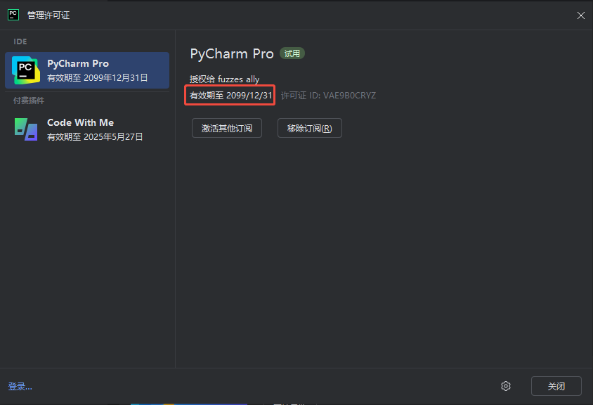