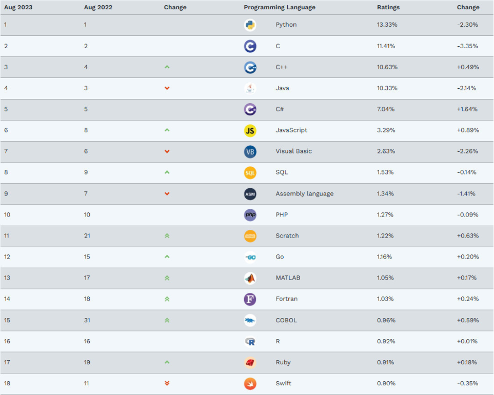

# Python从入门到入土

讲师：顽石老师（江湖人称：蛇哥）

---

## 1. 上课安排

**上课时间：**每周1、3、5 晚上19:30—21:30

**作业布置：**

1. 每节课下课都有作业，在下节课上课之前提交哦~
2. 作业提交到顽石老师QQ邮箱<xxx@qq.com>

**录播、课件、代码：**下课10分钟之内上传到`QQ群文件`和`百度网盘`

**答疑时间：**

1. 周一至周六：12:00-22:00 （正常上班时间，回复一般较快）
2. 周日和法定节假日，另行通知！有问题可以先发给老师，看到就会回复滴~

>PS：上课出Bug很正常，请不要报警！QAQ

## 2. 编程介绍

### 2.1 什么是编程？

编程就是让计算机代码解决某个问题，对某个计算体系规定一定的运算方式，使计算体系按照该计算方式运行，并最终得到相应结果的过程。

为了使计算机能够理解人的意图，人类就必须将需解决的问题的思路、方法和手段通过计算机能够理解的形式告诉计算机，使得计算机能够根据人的指令一步一步去工作，完成某种特定的任务。这种人和计算体系之间交流的过程就是编程。

### 2.2 什么是程序？

程序其实就是编程完成之后的结果，编程编程，编写出程序让计算机去执行。

"程序"一词来源于生活，通常指完成某些事务的既定方式和过程(行事的先后次序；工作步骤)。

比如要把大象放进冰箱：步骤就是，打开冰箱门->放入冰箱->关闭冰箱门

**计算机中的程序：**是为了让计算机执行某些操作或解决某个问题，而编写的一系列按照特定顺序组织的计算机数据和指令的集合。

### 2.3  编程语言

要想写出各种程序，就必须使用编程语言；何为编程语言？一言以蔽之，即人与计算机交流的语言。

那么世界上有多少种编程语言呢？当我查遍网络之后，仍然没有找到准确答案，只知道几千的数量是有的，但是我们常用的也就几十来个，其中最常见的便是C、C++、Java、Python、C#、JavaScript、GO、Swift等这几种，主要是这几种比较流行，使用的人也较多，并且容易找工作。

大家常常看到的[Tiobe编程语言排行榜]([TIOBE Index - TIOBE](https://www.tiobe.com/tiobe-index/))，排在前列的也是这几个。Python不是第一就是第二。

虽然有这么多种语言，但是最开始的语言是什么？如何发展的？

**机器语言**

机器语言是低级语言，也称为二进制代码语言，是一种使用0、1表示的二进制代码编写指令以执行计算机操作的语言。机器语言的特点是计算机可以直接识别，不需要进行任何翻译。

**汇编语言**

汇编语言是面向机器的程序设计语言。为了减轻开发者使用二进制代码编程的痛苦，用英文字母或符号串来替代机器语言的二进制码，这样就把不易理解和使用的机器语言变成了汇编语言。因此，汇编语言要比机器语言更便于阅读和理解

**高级语言**

由于汇编语言依赖于硬件体系，并且助记符号数量比较多，所以其运用起来仍然不够方便。为了使程序语言能更贴近人类的自然语言，同时又不依赖于计算机硬件，于是产生了高级语言。这种语言，其语法形式类似于英文，并且因为不需要对硬件进行直接操作，因此易于被普通人所理解与使用。其中影响较大、使用普遍的高级语言有Fortran、ALGOL、Basic、COBOL、LISP、Pascal、PROLOG、C、C++、VC、VB、Delphi、Java等。

### 2.4 人与程序的交互方式

程序是为了解决问题而出现的，我们需要传递数据给程序，让程序去解决，那么怎么样才能控制或者说和程序交互呢？

+ **自然交互：**语音控制、动作控制

+ **图形化界面：**这种方式简单直观，使用者易于接受，容易上手操作。

+ **命令行方式：**需要有一个控制台，输入特定的指令，让计算机完成一些操作。较为麻烦，需要记录住一些命令。

## 3. Python

### 3.1 Python发展史

Python，读作`['paɪθɑn]`，翻译成汉语是蟒蛇的意思，并且Python的logo也是两条缠绕在一起的蟒蛇的样子，然而Python语言和蟒蛇实际上并没有一毛钱关系。

Python的口号是：“人生苦短，我用Python！”。这条口号已经被Python业界广泛使用，快成了广告词一类的存在了。

Python语言是由荷兰程序员[Guido van Rossum](https://zhida.zhihu.com/search?content_id=125828337&content_type=Article&match_order=1&q=Guido+van+Rossum&zhida_source=entity)，江湖人称“龟叔”，独立开发完成初版的。“龟叔”曾供职于google，现任职于dropbox 。1989年圣诞节期间，在阿姆斯特丹，为了打发圣诞节的无趣，决心开发一个新的脚本解释语言，作为ABC语言的一种继承，然后他就这么做了，并实现了（大神的能力）。之所以选中Python作为该编程语言的名字，是因为他是一个叫Monty Python喜剧团体的爱好者，其本意并不是想选条蟒蛇。

> 巨蟒组是英国六人喜剧团体，他们的“无厘头”搞笑风格在上世纪七八十年代影响甚大。

### 3.2 Python标准的变迁

1. **诞生与早期探索（1989 - 2000 年）**：1989 年，荷兰程序员吉多・范罗苏姆在圣诞节期间开始开发 Python，目标是创建一种简洁易读的替代 ABC 语言。1991 年，Python 0.9.0 正式发布，支持类、异常处理、函数式编程，奠定了语法基础。1994 年，Python 1.0 引入函数式编程工具（`lambda`，`map`，`filter`）。2000 年，Python 2.0 发布，新增垃圾回收、Unicode 支持，社区开始壮大。
2. **2.x 时代的黄金十年（2001 - 2010 年）**：2004 年，Django 框架诞生，推动 Python 成为 Web 开发主流语言。2006 年，NumPy 发布，开启了 Python 在科学计算领域的统治地位。2008 年，Python 2.6 与 3.0 并行开发，3.0 为彻底解决设计缺陷，放弃向后兼容，引发社区争议。同年，Python 首次进入 TIOBE 编程语言排行榜前 5。2010 年，Python 2.7 成为 2.x 系列的最终版本，官方宣布 2020 年停止支持。
3. **3.x 时代的革新与生态爆发（2010 - 2020 年）**：2014 年，Pipenv 和 Anaconda 发布，解决包管理与数据科学环境依赖问题。2015 年，TensorFlow 开源，Python 成为深度学习首选语言，Python 3.5 引入`async/await`语法，支持异步编程。2018 年，Python 首次登顶 TIOBE 年度语言，取代 Java 和 C。
4. **现代 Python：全领域渗透（2020 年至今）**：2020 年，Python 2 正式退役，社区全面转向 Python 3。2021 年，FastAPI 框架崛起，成为高性能 API 开发标杆。2022 年，PyPI 仓库突破 40 万包，生态规模超 Java（Maven）。2023 年，AI 浪潮推动，ChatGPT 等工具依赖 Python 生态，巩固其 AI 基础设施地位；在 Web 开发方面，Django、Flask、FastAPI 形成全场景覆盖；人工智能领域，PyTorch、Keras、Hugging Face 推动模型开发平民化；移动端支持方面，框架如 Kivy、BeeWare 试图突破移动开发瓶颈。

## 4. 工具安装

欲善工事，先利其器。

### 4.1 PyCharm

PyCharm是一款非常好用的Python IDE，由JetBrains开发而成。

#### 4.1.1 下载与安装

### 4.2 ToDesk

在学习的过程中，难免会遇到文字难以描述清楚的问题，那么咱们可以给你远程解答，so 先装上ToDesk！

+ 进入ToDesk[官网](https://www.todesk.com/download.html)，下载Windows版本。

### 4.3 有道翻译

学习基础知识的时候，英语并不重要，但是偶尔报错是英语就尴尬了，所以，我们要使用工具干掉它！！

进入有道翻译[官网](https://fanyi.youdao.com/download-Windows?keyfrom=dict_web_banner)，下载客户端。

### 4.4 Everything

Everything 是速度最快的文件名搜索工具，其速度之快令人震惊，百G硬盘几十万个文件，可以在几秒钟之内完成索引；文件名搜索瞬间呈现结果。它小巧免费，界面简洁，实时跟踪更新，轻松分享文件索引，支持通配符、正则表达式，可以通过HTTP或FTP分享搜索结果。

进入[Everything官网](https://www.voidtools.com/zh-cn/downloads/)，下载64位安装版。

## 5.第一个C程序

## 6. 常见错误

### 常见错误

