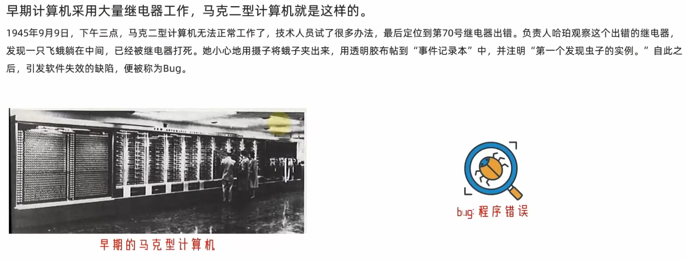
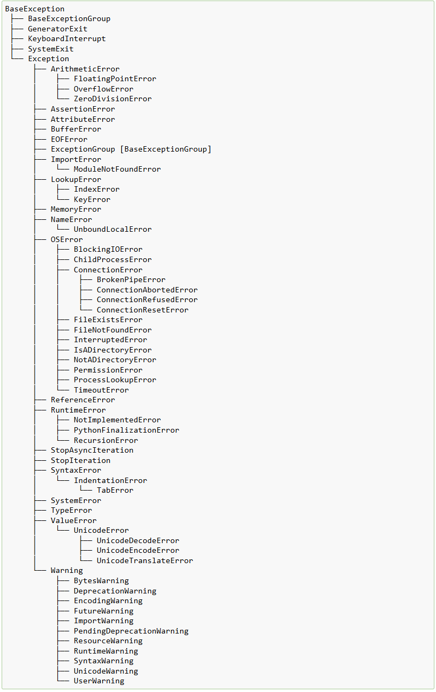

# 异常处理

在编程领域，异常指的是在程序运行期间出现的不正常事件，即Bug，这种事件会干扰程序的正常执行流程。Python 把异常当作对象来处理，一旦程序执行过程中碰到异常状况，就会创建一个异常对象，要是该异常未得到处理，程序便会终止运行。

Bug是臭虫的意思，为啥在计算机中是漏洞、异常的意思呢?



异常处理是一种用于应对程序运行时出现错误的机制。借助异常处理，你可以捕获并处理这些错误，从而避免程序因异常而意外终止。

## 基本语法

Python 运用 `try`、`except`、`else` 和 `finally` 这些关键字来实现异常处理。基本语法如下：

```python
try:
    # 可能会引发异常的代码块
    pass
except [ExceptionType1]:
    # 处理 ExceptionType1 类型的异常
    pass
[except [ExceptionType2]:
    # 处理 ExceptionType2 类型的异常
    pass]
[else:
    # 如果 try 块中没有引发异常，则执行此代码块
    pass]
[finally:
    # 无论是否发生异常，都会执行此代码块
    pass]
```

## 捕获异常

### 捕获所有异常

若要捕获所有类型的异常，可以使用 `except` 语句而不指定异常类型，不过这种做法不太推荐，因为它会掩盖一些潜在的问题(因为不知道具体的异常类型，进而无法处理具体的异常)。示例如下：

```python
try:
    1/0
except:
    print("逮到异常了~")
```

捕获所以异常也可以在`except`后面指定`Exception`异常类型，`Exception`是所有异常类型的基类！

```python
try:
    1/0
except Exception:
    print("逮到异常了~")
```

除此之外还可以打印异常携带的异常信息，获取异常信息，必须定义一个异常对象。

> 将`except Exception `语句改造成`except Exception as e` ，其作用是捕获异常并把捕获到的异常对象赋值给变量 `e`，这样你就能在后续代码里对该异常对象进行处理和分析

```python
try:
    1/0
except Exception as e:
    print("逮到异常了~",e)
```

### 捕获指定类型的异常

要捕获指定类型的异常，需要在`except`后面指定异常类型。以下案例展示了如何捕获并处理 `ZeroDivisionError` 异常：

```python
try:
    result = 1 / 0
except ZeroDivisionError:
    print("错误：除数不能为零！")
```

### 捕获多个异常

你可以在一个 `try` 块中捕获多个不同类型的异常，示例如下：

```python
try:
    num = int("abc")
    result = 1 / num
except ValueError:
    print("错误：输入不是有效的整数！")
except ZeroDivisionError:
    print("错误：除数不能为零！")
```

捕获多个异常还有另一种比较简单的写法:

```python
try:
    num = int("abc")
    result = 1 / num
except (ValueError,ZeroDivisionError) as e:
    print("错误：输入不是有效的整数！",e)
```

### else和finally

以下示例，展示了`else`和`finally`的使用：

```python
try:
    result = 1 / 0
except ZeroDivisionError:
    print("错误：除数不能为零！")
else:
    print("计算结果：", result)
finally:
    print("无论是否发生异常，都会执行此代码块。")
```

**代码解释**

1. **`try` 块**：包含可能会引发异常的代码。在这个示例中，`result = 1 / 0` 会引发 `ZeroDivisionError` 异常。
2. **`except` 块**：用于捕获并处理特定类型的异常。这里捕获 `ZeroDivisionError` 异常，并打印错误信息。
3. **`else` 块**：当 `try` 块中没有引发异常时，会执行 `else` 块中的代码。
4. **`finally` 块**：无论是否发生异常，`finally` 块中的代码都会被执行。

finally通常用来进行清理工作比如文件的关闭，变量的重置等，以下是一个简单的示例：

```python
def print_msg(msg):    
    print(f"msg is {msg}")
    int("aaab")

message = "hello python!"
try:
    print_msg(message)
except Exception as e:
    print(f"Exception:{e}")
else:
    print("没有异常")
finally:
    message = ""

print(f"end message is {message}")
```

在上面的示例中，无论有没有异常，最终`message`变量都会置为空字符串。

## 异常的传播

常传播机制指的是当程序中出现异常却未被处理时，异常会在调用栈中向上层函数传递，直至找到能够处理该异常的代码块，或者传递到程序的最顶层从而导致程序终止。

- **调用栈**：程序运行时，会形成一个调用栈来记录函数的调用顺序。当一个函数调用另一个函数时，新的函数调用会被压入调用栈的顶部；当函数执行完毕后，对应的调用会从栈顶弹出。
- **异常传播**：若在某个函数中发生异常且该函数没有对其进行处理，异常就会被抛到调用该函数的上层函数中。这个过程会不断重复，直到异常被捕获并处理，或者传播到程序的最顶层（通常是主程序）。

示例如下：

```python
def divide(a, b):
    return a / b

try:
    result = divide(1, 0)
except ZeroDivisionError:
    print("错误：除数不能为零！")
```

在这个示例中，`divide` 函数中发生的 `ZeroDivisionError` 异常会传播到调用该函数的 `try` 块中进行处理。

再来一个案例:

```python
def func1():
    print("func1 start!")
    1/0
    print("func1 end!")
    
def func2():
    print("func2 start!")
    func1()
    print("func2 end!")    
    
try:
    func2()
except Exception as e:
    print(f"Exception:{e}")
else:
    print("没有异常")
finally:
    print("异常捕获结束")
```

输出结果为:

```css
func2 start!
func1 start!
Exception:division by zero
```

根据结果可以发现，当异常抛出后，后续代码不会再执行，直接返回到

## 主动抛异常

使用 `raise` 语句主动抛出异常，这在很多场景下非常有用，比如输入验证、业务逻辑检查等。

### 简单异常抛出

当输入不符合要求时，抛出内置异常。

```python
def check_age(age):
    if age < 0:
        raise ValueError("年龄不能为负数")
    return age


try:
    age = check_age(-5)
except ValueError as e:
    print(f"捕获到异常: {e}")
```

在上述代码中，`check_age` 函数会检查传入的 `age` 是否为负数。如果是负数，就会抛出 `ValueError` 异常，并附带相应的错误信息。在 `try-except` 块中捕获该异常并打印错误信息。

### 重新抛出异常

捕获异常后进行一些处理，然后再重新抛出异常。

```python
def check_age(age):
    try:
        if age < 0:
            raise ValueError("年龄不能为负数")
        return age
    except :
        print("有异常产生啦~")
        raise TypeError("age type error")


try:
    age = check_age("666")
except Exception as e:
    print(f"捕获到异常: {e}")
```

### 根据条件抛不同异常

根据不同的条件抛出不同类型的异常。

```python
def divide_numbers(a, b):
    if b == 0:
        raise ZeroDivisionError("除数不能为零")
    if not isinstance(a, (int, float)) or not isinstance(b, (int, float)):
        raise TypeError("输入必须是数字")
    return a / b


try:
    result = divide_numbers(10, 'a')
except ZeroDivisionError as e:
    print(f"除零异常: {e}")
except TypeError as e:
    print(f"类型异常: {e}")
```

`divide_numbers` 函数用于进行除法运算，当除数为 0 时抛出 `ZeroDivisionError` 异常，当输入不是数字时抛出 `TypeError` 异常。在 `try-except` 块中分别捕获不同类型的异常并处理。

> `not isinstance(a, (int, float))` 是一个布尔表达式，其作用是检查变量 `a` 是否不属于 `int`（整数）或 `float`（浮点数）类型。
>
> **语法分析**
>
>   + isinstance()是 Python 的内置函数，其语法为isinstance(object, classinfo)。
>
>       - `object`：需要进行类型检查的对象，也就是这里的 `a`。
>
>       - `classinfo`：可以是单个类型，也可以是由多个类型组成的元组。若传入元组，只要对象属于元组中的任意一种类型，`isinstance()` 就会返回 `True`。
>
>   
>- `not` 是 Python 的逻辑运算符，用于对布尔值取反。因此，`not isinstance(a, (int, float))` 表达的是：若 `a` 既不是整数也不是浮点数，表达式就返回 `True`；反之，则返回 `False`。


## 内置异常类型

Python 有众多内置的异常类型，下面是一些常见的例子，所有异常类型可以查看[python官方文档](https://docs.python.org/3/library/exceptions.html)：

- **`SyntaxError`**：语法错误，通常是代码书写不符合 Python 语法规则。

```python
# 错误示例，缺少冒号
if True
    print("Hello")
```

- **`IndentationError`**：缩进错误，Python 依靠缩进来划分代码块，缩进不规范就会引发此错误。

```python
# 错误示例，缩进不一致
if True:
print("Hello")
```

- **`NameError`**：名称错误，使用了未定义的变量或函数。

```python
# 错误示例，变量未定义
print(unknown_variable)
```

- **`TypeError`**：类型错误，对不兼容的数据类型进行操作。

```python
# 错误示例，字符串和整数相加
result = "abc" + 1
```

- **`ValueError`**：值错误，传入的参数类型正确，但值不符合要求。

```python
# 错误示例，将非数字字符串转换为整数
num = int("abc")
```

- **`ZeroDivisionError`**：除零错误，在除法运算中除数为零。

```python
# 错误示例，除数为零
result = 1 / 0
```

**内置异常的类层次结构**

