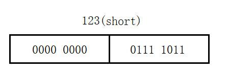
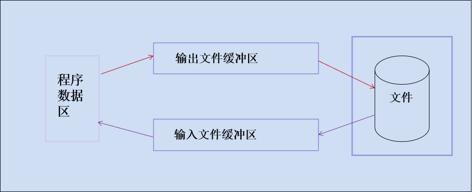

## 文件的概念

### 什么是文件？

所谓文件一般指存储在外部介质(如磁盘磁带)上数据的集合。


### 什么是流？

操作系统是以文件为单位对数据进行管理的，输入输出是数据传送的过程，数据如流水一样从一处流向另一处，因此常将输入输出形象地称为流(stream)，即输入输出流。

C语言把文件看作是一个字节的序列，即由一个一个字节的数据顺序组成。一个输入输出流就是一个字节流或二进制流。

文件名：一个文件要有一个惟一的文件标识，以便用户识别和引用。文件标识包括三部分:

+ (1)文件路径	
+ (2)文件名主干	
+ (3)文件后缀


### 文件的分类

根据数据的组织形式，数据文件可分为ASCII文件和二进制文件：

+ ASCII文件(文本文件)：每一个字节放一个ASCII代码
+ 二进制文件：把内存中的数据按照其在内存中的存储形式原样输出到磁盘上存放

**文本文件和二进制文件的区别**

 **1，文本文件**

> ASCII文件便于对字符进行逐个处理，也便于输出字符。但一般占存储空间较多，而且要花费转换时间。

在文本文件中数据是以字符形式呈现的，每一个字符占用一个字节，而字节在计算机中又是以ASCII码来识别。在存储文本文件时需要先讲ASCII码转为二进制的形式然后进行存储。
例如：在内存中将整数123以文本形式存放，如下


由于文本形式存储都是以字符形式展示的，所以整数123被拆分为三个字符‘1’，‘2’，‘3’。这三个字符所对应的ASCII码值分别为49、50、51，长方形内的数字是该ASCII码对应的二进制。

**2，二进制文件**

> 二进制文件可以节省外部存储空间和转换时间，但是一个字节并不对应一个字符，不能直接输出字符形式。

二进制文件在存储数据时是直接以二进制的方式进行的，这种存储方式与数据在牛才能中的存储方式相同，不需要进行转换，因此不仅可以提高执行效率，还能节省存储空间。
例如：在内存中将整数123以二进制形式存放(假设123为short类型)，如下



整数123在内存中是以二进制数“00000000 01111011”直接存储的，所以将二进制文件从硬盘读到内存是不需要进行数据转换的。

### 文件缓冲区

ANS I C标准采用“缓冲文件系统”处理文件。

+ 缓冲文件系统：系统自动地在内存区为每一个正在使用的文件开辟一个缓冲区。从内存向磁盘输出数据必须先送到内存中的缓冲区，装满缓冲区后才一起送到磁盘去(提高效率)。



### 文件的位置指针

位置指针用来指示当前的读写位置。

一般情况下，在对字符文件进行读写时，文件的位置指针指向文件开头，这时如果对文件进行读的操作，就读第一个字符，然后文件的位置指针顺序向后移一个位置，在下一次执行读的操作时，就将指针指向的第二个字符读入。 依此类推，直到遇文件尾。


有时希望在一个文件的原有数据之后再添加新的数据，应该把文件位置指针移到文件尾，然后再接着写入新的数据，这就是文件的追加。

注意：这个文件内部的位置指针与C语言中的指针不是一回事。位置指针仅仅是一个标志，表示文件读写到的位置，也就是读写到第几个字节，它不表示地址。文件每读写一次，位置指针就会移动一次，它不需要你在程序中定义和赋值，而是由系统自动设置，对用户是隐藏的。

## 文件操作

### 1. 文件的打开与关闭

**打开文件**

使用 `open()` 函数来打开一个文件，该函数返回一个文件对象。

```python
file = open(file_path, mode)
```

- `file_path`：文件的路径，可以是绝对路径或相对路径。

- `mode`：打开文件的模式，常见的模式有：
  - `'r'`：只读模式，默认值。如果文件不存在，会抛出 `FileNotFoundError` 异常。
  - `'w'`：写入模式。如果文件已存在，会清空文件内容；如果文件不存在，会创建一个新文件。
  - `'a'`：追加模式。如果文件已存在，会在文件末尾追加内容；如果文件不存在，会创建一个新文件。
  - `'x'`：创建模式。如果文件不存在，会创建一个新文件；如果文件已存在，会抛出 `FileExistsError` 异常。
  - `'b'`：二进制模式，可与其他模式组合使用，如 `'rb'` 表示以二进制只读模式打开文件。
  - `'t'`：文本模式，默认值，可与其他模式组合使用，如 `'rt'` 表示以文本只读模式打开文件。

**关闭文件**

```c
file.close()
```

文件一旦使用完毕，应该用 close() 函数把文件关闭，以释放相关资源，避免数据丢失。

###  2. 读取文件

打开文件后，可以使用文件对象的方法来读取文件内容。常见的读取方法有：

- `read(size)`：读取指定字节数的内容，如果不指定 `size`，则读取整个文件内容。
- `readline()`：读取文件的一行内容。
- `readlines()`：读取文件的所有行，并返回一个包含每行内容的列表。

```python
# 以只读模式打开文件
file = open('example.txt', 'r')

# 读取整个文件内容
content = file.read()
print(content)

# 读取一行内容
line = file.readline()
print(line)

# 读取所有行
lines = file.readlines()
for line in lines:
    print(line)

# 关闭文件
file.close()
```

### 3. 写入文件

使用文件对象的 `write()` 方法可以向文件中写入内容。如果以 `'w'` 模式打开文件，会覆盖原有内容；如果以 `'a'` 模式打开文件，会在文件末尾追加内容。

```python
# 以写入模式打开文件
file = open('example.txt', 'w')

# 写入内容
file.write('Hello, World!\n')
file.write('This is a test file.\n')

# 关闭文件
file.close
```

写入文件时还可以指定文件编码格式：

```python
file = open("xxx.txt","w",encoding="gbk")
file.write("hello wrold\n我是完事老师")
file.close()
```

以上代码创建的文件，就是gbk编码。

```python
file = open("xxx.txt","w",encoding="utf8")
file.write("hello wrold\n我是完事老师")
file.close()
```

以上代码创建的文件，就是utf8编码。

### 4. 文件指针操作

文件指针表示当前文件读取或写入的位置。可以使用 `seek()` 方法来移动文件指针的位置，使用 `tell()` 方法来获取当前文件指针的位置。

+ **seek()**函数用于修改文件指针位置

  ```python
  def seek(self, offset: int, whence: int = 0, /) -> int:
  ```

  + offset：表示从当前位置开始的偏移量
  + whence：表示从哪里开始偏移（0表示文件开头，1表示当前位置，2表示文件末尾）
  + 返回新的位置

+ **tell()**函数用于获取当前文件指针位置。

**示例：**

```python
# 以只读模式打开文件
file = open('example.txt', 'r')
# 获取当前文件指针的位置
position = file.tell()
print(f'当前文件指针位置: {position}')

# 读取前 5 个字符
content = file.read(5)
print(f'读取的内容: {content}')

# 获取当前文件指针的位置
position = file.tell()
print(f'当前文件指针位置: {position}')

# 移动文件指针到文件开头
file.seek(0)

# 获取当前文件指针的位置
position = file.tell()
print(f'当前文件指针位置: {position}')
```

### 5. 二进制文件操作

除了文本文件，Python 还支持对二进制文件的操作，如图片、音频、视频等。在打开二进制文件时，需要使用 `'b'` 模式。

示例：

```python
# 以二进制只读模式打开图片文件
file = open("img.jpg","rb")
img_data =  file.read()
file.close()
# 以二进制写入模式打开新文件
new_file = open("new_img.jpg","wb")
new_file.write(img_data)
new_file.close()
```

通过以上方法，你可以在 Python 中实现对文件的各种操作。在进行文件操作时，要注意异常处理，以确保程序的健壮性。例如，当文件不存在或无法打开时，会抛出相应的异常，可以使用 `try-except` 语句来捕获并处理这些异常。

### 6. with语句

`with` 语句是一种上下文管理器，在文件操作方面，它能够自动管理文件的打开与关闭，避免因忘记关闭文件而造成资源泄露。

#### 基本语法

```python
with open(file_path, mode) as file:
    # 对文件进行操作的代码块
    # 例如读取或写入文件内容
    pass
```

- `open(file_path, mode)`：打开指定路径 `file_path` 的文件，`mode` 是文件的打开模式，像 `'r'`（只读）、`'w'`（写入）、`'a'`（追加）等。
- `as file`：将打开的文件对象赋值给变量 `file`，之后就能在代码块中使用这个变量对文件进行操作。
- 代码块：在 `with` 语句的缩进块内，可以编写对文件进行读取、写入等操作的代码。当代码块执行完毕后，`with` 语句会自动关闭文件。

**示例**

```python
# 使用 with 语句打开文件
with open('example.txt', 'r') as file:
    # 在 with 语句块内，文件处于打开状态
    print(f"文件是否关闭: {file.closed}")

# 离开 with 语句块后，文件会自动关闭
print(f"文件是否关闭: {file.closed}")
```


## 文件重向

文件重定向指的是把程序原本输出到标准输出（通常是控制台）或者从标准输入（通常是键盘）读取数据的流向，改变为从文件读取数据或者将输出写入文件。下面从标准输出重定向、标准输入重定向和上下文管理器的使用这几个方面详细介绍：

### 标准输出重定向

标准输出默认是控制台，你可以将其重定向到文件，让程序的输出内容保存到文件中。

#### 示例代码

```python
# 打开一个文件用于写入
output_file = open('output.txt', 'w')

# 获取原始的标准输出
import sys
original_stdout = sys.stdout

# 将标准输出重定向到文件
sys.stdout = output_file

# 输出内容，这些内容会被写入文件
print("这是重定向到文件的输出内容。")
print("第二行输出内容。")

# 恢复标准输出
sys.stdout = original_stdout

# 关闭文件
output_file.close()
```

#### 代码解释

1. **打开文件**：使用 `open('output.txt', 'w')` 以写入模式打开一个名为 `output.txt` 的文件。
2. **保存原始标准输出**：使用 `sys.stdout` 获取原始的标准输出对象，并保存到 `original_stdout` 变量中。
3. **重定向标准输出**：将 `sys.stdout` 赋值为文件对象 `output_file`，这样后续的 `print` 语句输出的内容就会被写入文件。
4. **恢复标准输出**：将 `sys.stdout` 重新赋值为 `original_stdout`，恢复到原来的标准输出（控制台）。
5. **关闭文件**：使用 `output_file.close()` 关闭文件。

### 标准输入重定向

标准输入默认是键盘，你可以将其重定向到文件，让程序从文件中读取数据。

#### 示例代码

```python
# 打开一个文件用于读取
input_file = open('input.txt', 'r')

# 获取原始的标准输入
import sys
original_stdin = sys.stdin

# 将标准输入重定向到文件
sys.stdin = input_file

# 从标准输入读取内容，实际上是从文件中读取
line = input()
print(f"从文件中读取的内容是: {line}")

# 恢复标准输入
sys.stdin = original_stdin

# 关闭文件
input_file.close()
```

#### 代码解释

1. **打开文件**：使用 `open('input.txt', 'r')` 以读取模式打开一个名为 `input.txt` 的文件。
2. **保存原始标准输入**：使用 `sys.stdin` 获取原始的标准输入对象，并保存到 `original_stdin` 变量中。
3. **重定向标准输入**：将 `sys.stdin` 赋值为文件对象 `input_file`，这样后续的 `input()` 函数就会从文件中读取数据。
4. **恢复标准输入**：将 `sys.stdin` 重新赋值为 `original_stdin`，恢复到原来的标准输入（键盘）。
5. **关闭文件**：使用 `input_file.close()` 关闭文件。

### 使用 `with` 语句进行重定向

使用 `with` 语句可以更方便地管理文件的打开和关闭，同时也能确保在出现异常时文件会被正确关闭。

#### 示例代码

```python
import sys

# 标准输出重定向
with open('output.txt', 'w') as output_file:
    original_stdout = sys.stdout
    sys.stdout = output_file
    try:
        print("这是使用 with 语句重定向的输出内容。")
    finally:
        sys.stdout = original_stdout

# 标准输入重定向
with open('input.txt', 'r') as input_file:
    original_stdin = sys.stdin
    sys.stdin = input_file
    try:
        line = input()
        print(f"从文件中读取的内容是: {line}")
    finally:
        sys.stdin = original_stdin
```

通过文件重定向，你可以灵活地控制程序的输入和输出，方便进行数据的处理和保存。
