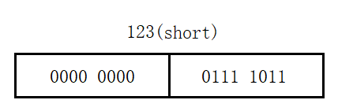
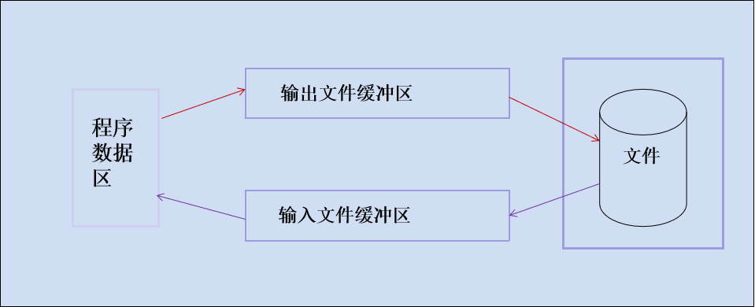
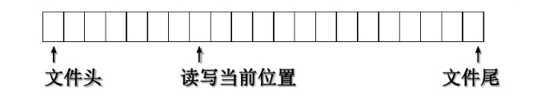
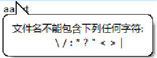
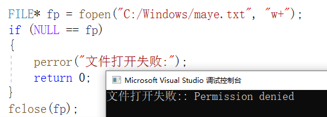

## 文件的概念

### 什么是文件？

所谓文件一般指存储在外部介质(如磁盘磁带)上数据的集合。


### 什么是流？

操作系统是以文件为单位对数据进行管理的，输入输出是数据传送的过程，数据如流水一样从一处流向另一处，因此常将输入输出形象地称为流(stream)，即输入输出流。

C语言把文件看作是一个字节的序列，即由一个一个字节的数据顺序组成。一个输入输出流就是一个字节流或二进制流。

文件名：一个文件要有一个惟一的文件标识，以便用户识别和引用。文件标识包括三部分:

+ (1)文件路径	
+ (2)文件名主干	
+ (3)文件后缀


### 文件的分类

根据数据的组织形式，数据文件可分为ASCII文件和二进制文件：

+ ASCII文件(文本文件)：每一个字节放一个ASCII代码
+ 二进制文件：把内存中的数据按照其在内存中的存储形式原样输出到磁盘上存放

**文本文件和二进制文件的区别**

 **1，文本文件**

> ASCII文件便于对字符进行逐个处理，也便于输出字符。但一般占存储空间较多，而且要花费转换时间。

在文本文件中数据是以字符形式呈现的，每一个字符占用一个字节，而字节在计算机中又是以ASCII码来识别。在存储文本文件时需要先讲ASCII码转为二进制的形式然后进行存储。
例如：在内存中将整数123以文本形式存放，如下


由于文本形式存储都是以字符形式展示的，所以整数123被拆分为三个字符‘1’，‘2’，‘3’。这三个字符所对应的ASCII码值分别为49、50、51，长方形内的数字是该ASCII码对应的二进制。

**2，二进制文件**

> 二进制文件可以节省外部存储空间和转换时间，但是一个字节并不对应一个字符，不能直接输出字符形式。

二进制文件在存储数据时是直接以二进制的方式进行的，这种存储方式与数据在牛才能中的存储方式相同，不需要进行转换，因此不仅可以提高执行效率，还能节省存储空间。
例如：在内存中将整数123以二进制形式存放(假设123为short类型)，如下



整数123在内存中是以二进制数“00000000 01111011”直接存储的，所以将二进制文件从硬盘读到内存是不需要进行数据转换的。

### 文件缓冲区

ANS I C标准采用“缓冲文件系统”处理文件。

+ 缓冲文件系统：系统自动地在内存区为每一个正在使用的文件开辟一个缓冲区。从内存向磁盘输出数据必须先送到内存中的缓冲区，装满缓冲区后才一起送到磁盘去(提高效率)。



### 文件的位置指针

位置指针用来指示当前的读写位置。

一般情况下，在对字符文件进行读写时，文件的位置指针指向文件开头，这时如果对文件进行读的操作，就读第一个字符，然后文件的位置指针顺序向后移一个位置，在下一次执行读的操作时，就将指针指向的第二个字符读入。 依此类推，直到遇文件尾。



有时希望在一个文件的原有数据之后再添加新的数据，应该把文件位置指针移到文件尾，然后再接着写入新的数据，这就是文件的追加。

注意：这个文件内部的位置指针与C语言中的指针不是一回事。位置指针仅仅是一个标志，表示文件读写到的位置，也就是读写到第几个字节，它不表示地址。文件每读写一次，位置指针就会移动一次，它不需要你在程序中定义和赋值，而是由系统自动设置，对用户是隐藏的。

## 文件操作

### 文件的打开与关闭

**打开文件**

```c
FILE*  fopen(char const* _FileName,char const* _Mode);
```

+ fileName：需要打开的文件名，也就是准备访问的文件的名字;
+ mode：文件打开模式(“读”还是“写”等) ;
+ 返回值：指向被打开的文件。

**关闭文件**

```c
int  fclose(FILE* _Stream);
```

文件一旦使用完毕，应该用 fclose() 函数把文件关闭，以释放相关资源，避免数据丢失。

**文件的打开模式**

| 模式 | 含义       | 说明                                                         |
| ---- | ---------- | ------------------------------------------------------------ |
| r    | 只读       | 文件必须存在，否则打开失败                                   |
| w    | 只写       | 若文件存在，则清除原文件内容后写入；否则，创建文件后写入     |
| a    | 追加只写   | 若文件存在，则位置指针移到文件末尾，在文件尾部追加写入，故该方式不删除原文件数据；若文件不存在，则打开失败 |
| r+   | 读写       | 文件必须存在。在只读 r 的基础上加 '+' 表示增加可写的功能。   |
| w+   | 读写       | 在只写 w 的基础上加 '+' 表示增加可读的功能                   |
| a+   | 读写       | 在”a”模式的基础上，增加可读功能                              |
| rb   | 二进制读   | 功能同模式”r”，区别：b表示以二进制模式打开。下同             |
| wb   | 二进制写   | 功能同模式“w”。二进制模式                                    |
| ab   | 二进制追加 | 功能同模式”a”。二进制模式                                    |
| rb+  | 二进制读写 | 功能同模式"r+”。二进制模式                                   |
| wb+  | 二进制读写 | 功能同模式”w+”。二进制模式                                   |
| ab+  | 二进制读写 | 功能同模式”a+”。二进制模式                                   |

### 文件打开失败原因

在文件操作总经常会出现文件打开失败问题,总结主要有以下几点原因。

1. 用”r”只读的方式打开一个不存在的文件
2. 文件路径错误
3. 文件名非法



4. 权限不够:以管理员身份运行该程序即可




###  文件读写

在C语言中，读写文件比较灵活，既可以每次读写一个字符，也可以读写一个字符串，甚至是任意字节的数据（数据块）。

#### 字符形式读写

##### 字符读取函数fgetc

以字符形式读写文件时，每次可以从文件中读取一个字符，或者向文件中写入一个字符。主要使用两个函数，分别是 fgetc() 和 fputc()。

```c
int  fgetc(FILE* _Stream);
```

+ 读取成功时返回读取到的字符，读取到文件末尾或读取失败时返回`EOF`。
  + EOF 是 end of file 的缩写，表示文件末尾，是在 stdio.h 中定义的宏，它的值是一个负数，往往是 -1。

【示例】在屏幕上显示demo.txt文件的内容

```cpp
#include<stdio.h>

int main(int argc,char*argv[])
{
    FILE* fp = fopen("demo.txt","r");
    if(fp == NULL)
    {
        perror("文件打开失败:");
        return -1;
    }

    char ch = '\0';
    while ((ch = fgetc(fp)) != EOF)	//逐字符读取，直到读取完毕
    {
       putchar(ch);
    }
    
    //判断文件是否出错，其实文件很少出错，可以不加
    if(ferror(fp)){
        puts("读取出错");
    }else{
        puts("读取成功");
    }
    
    fclose(fp);
    
    return 0;
}
```

EOF 本来表示文件末尾，意味着读取结束，但是很多函数在读取出错时也返回 EOF，那么当返回 EOF 时，到底是文件读取完毕了还是读取出错了？我们可以借助 stdio.h 中的两个函数来判断，分别是 feof() 和 ferror()。

feof() 函数用来判断文件内部指针是否指向了文件末尾，当指向文件末尾时返回非零值，否则返回零值。

```c
int feof(FILE* _Stream);
```


ferror() 函数用来判断文件操作是否出错，出错时返回非零值，否则返回零值。

```c
int ferror ( FILE *fp );
```


##### 字符写入函数fputc

```c
int  fputc(int   ch, FILE* _Stream);
```

+ ch 为要写入的字符，Stream为文件指针。fputc() 写入成功时返回写入的字符，失败时返回 EOF，返回值类型为 int 也是为了容纳这个负数


#### 字符串形式读写

fgetc() 和 fputc() 函数每次只能读写一个字符，速度较慢；实际开发中往往是每次读写一个字符串或者一个数据块，这样能明显提高效率。

##### 读字符串函数 fgets

fgets() 函数用来从指定的文件中读取一个字符串，并保存到字符数组中，它的用法为：

```c
char*  fgets(char* _Buffer,int  _MaxCount,FILE* _Stream);
```

+ buffer为字符数组
+ maxcount为要读取的字符数量(不要超过buffer字符数组的大小)
+ stream 文件指针
+ 返回值：读取成功时返回字符数组首地址，也就是buffer；读取失败时返回 NULL；如果开始读取时文件内部指针已经指向了文件末尾，那么将读取不到任何字符，也返回 NULL。
+ 需要重点说明的是，在读取到 MaxCount-1 个字符之前如果出现了换行，或者读到了文件末尾，则读取结束。这就意味着，不管 MaxCount的值多大，fgets() 最多只能读取一行数据，不能跨行。在C语言中，没有按行读取文件的函数，我们可以借助 fgets()，将 MaxCount的值设置地足够大，每次就可以读取到一行数据。


##### 写字符串函数 fputs

fputs() 函数用来向指定的文件写入一个字符串，它的用法为：

```c
int  fputs(char const* _Buffer,FILE*  _Stream);
```


#### 格式化读写

fscanf() 和 fprintf() 函数与前面使用的 scanf() 和 printf() 功能相似，都是格式化读写函数，两者的区别在于 fscanf() 和 fprintf() 的读写对象不是键盘和显示器，而是磁盘文件。

```c
int fscanf ( FILE *_Stream, char * format, ... );
int fprintf ( FILE *_Stream, char * format, ... );
```

_Stream为文件指针，format 为格式控制字符串，... 表示参数列表。与 scanf() 和 printf() 相比，它们仅仅多了一个 fp 参数。


#### 二进制读写

fgets() 有局限性，每次最多只能从文件中读取一行内容，因为 fgets() 遇到换行符就结束读取。如果希望读取多行内容，需要使用 fread() 函数；相应地写入函数为 fwrite()。

fread() 函数用来从指定文件中读取块数据。所谓块数据，也就是若干个字节的数据，可以是一个字符，可以是一个字符串，可以是多行数据，并没有什么限制。fread() 的原型为：

```c
size_t fread(void*  Buffer,size_t ElementSize,size_t ElementCount,FILE*  Stream);
```

fwrite() 函数用来向文件中写入块数据，它的原型为：

```c
size_t  fwrite(void const* Buffer,size_t ElementSize,size_t ElementCount,FILE* Stream);
```

对参数的说明：

- Buffer为内存区块的指针，它可以是数组、变量、结构体等。fread() 中的 Buffer用来存放读取到的数据，fwrite() 中的 Buffer用来存放要写入的数据。
- ElementSize：表示每个数据块的字节数。
- ElementCount：表示要读写的数据块的块数。
- Stream：表示文件指针。
- 理论上，每次读写 size*count 个字节的数据。


返回值：返回成功读写的块数，也即 count。如果返回值小于 count：

- 对于 fwrite() 来说，肯定发生了写入错误，可以用 ferror() 函数检测。
- 对于 fread() 来说，可能读到了文件末尾，可能发生了错误，可以用 ferror() 或 feof() 检测。

【示例】从键盘输入一个数组，将数组写入文件再读取出来。

```c
#include<stdio.h>
#define N 5
int main(){
    //从键盘输入的数据放入a，从文件读取的数据放入b
    int a[N], b[N];
    int i, size = sizeof(int);
    FILE *fp;

    if( (fp=fopen("D:\\demo.txt", "rb+")) == NULL ){  //以二进制方式打开
        puts("Fail to open file!");
        exit(0);
    }
  
    //从键盘输入数据 并保存到数组a
    for(i=0; i<N; i++){
        scanf("%d", &a[i]);
    }
    //将数组a的内容写入到文件
    fwrite(a, size, N, fp);
    //将文件中的位置指针重新定位到文件开头
    rewind(fp);
    //从文件读取内容并保存到数组b
    fread(b, size, N, fp);
    //在屏幕上显示数组b的内容
    for(i=0; i<N; i++){
        printf("%d ", b[i]);
    }
    printf("\n");

    fclose(fp);
    return 0;
}
```

打开 demo.txt，发现文件内容根本无法阅读。这是因为我们使用`"rb+"`方式打开文件，数组会原封不动地以二进制形式写入文件，一般无法阅读。

数据写入完毕后，位置指针在文件的末尾，要想读取数据，必须将文件指针移动到文件开头，这就是`rewind(fp);`的作用。


#### 随机读写

前面介绍的文件读写函数都是顺序读写，即读写文件只能从头开始，依次读写各个数据。但在实际开发中经常需要读写文件的中间部分，要解决这个问题，就得先移动文件内部的位置指针，再进行读写。这种读写方式称为随机读写，也就是说从文件的任意位置开始读写。

实现随机读写的关键是要按要求移动位置指针，这称为文件的定位。

##### 文件定位函数rewind和fseek

rewind() 用来将位置指针移动到文件开头，前面已经多次使用过，它的原型为：

```c
void rewind ( FILE *Stream );
```

fseek() 用来将位置指针移动到任意位置，它的原型为：

```c
int fseek ( FILE *Stream, long offset, int origin );
```

参数说明：

+ Stream为文件指针，也就是被移动的文件。
+ offset 为偏移量，也就是要移动的字节数。之所以为 long 类型，是希望移动的范围更大，能处理的文件更大。offset 为正时，向后移动；offset 为负时，向前移动。
+ origin 为起始位置，也就是从何处开始计算偏移量。C语言规定的起始位置有三种，分别为文件开头、当前位置和文件末尾，每个位置都用对应的常量来表示：

| 起始点   | 常量名   | 常量值 |
| -------- | -------- | ------ |
| 文件开头 | SEEK_SET | 0      |
| 当前位置 | SEEK_CUR | 1      |
| 文件末尾 | SEEK_END | 2      |

例如，把位置指针移动到离文件开头100个字节处：

```c
fseek(fp, 100, 0);
```

值得说明的是，fseek() 一般用于二进制文件，在文本文件中由于要进行转换，计算的位置有时会出错。


## 其他文件操作函数

ftell 用于得到文件位置指针当前位置相对于文件首的偏移字节数，ftell一般用于读取文件的长度。

```c
long  ftell(FILE* Stream);
```

remove 用于删除指定的文件，如果文件被成功删除，则返回零值。

```c
int  remove(char const* FileName);
```

rename 用于重名/移动文件，成功返回0，失败返回非零

```c
int  rename(char const* OldFileName,char const* NewFileName);
```

+ 将oldname 指定的文件或目录的名称更改为*newname*。

+ 如果*oldname*和*newname*指定不同的路径并且系统支持，则文件将移动到新位置。

+ 如果*newname*命名现有文件，则该函数可能会失败或覆盖现有文件，具体取决于特定的系统和库实现

## 文件重定向

文件重定向指的是把程序原本输出到标准输出（通常是控制台）或者从标准输入（通常是键盘）读取数据的流向，改变为从文件读取数据或者将输出写入文件。下面从标准输出重定向、标准输入重定向和上下文管理器的使用这几个方面详细介绍：

### 标准输出重定向

标准输出默认是控制台，你可以将其重定向到文件，让程序的输出内容保存到文件中。

#### 示例代码

```python
# 打开一个文件用于写入
output_file = open('output.txt', 'w')

# 获取原始的标准输出
import sys
original_stdout = sys.stdout

# 将标准输出重定向到文件
sys.stdout = output_file

# 输出内容，这些内容会被写入文件
print("这是重定向到文件的输出内容。")
print("第二行输出内容。")

# 恢复标准输出
sys.stdout = original_stdout

# 关闭文件
output_file.close()
```

#### 代码解释

1. **打开文件**：使用 `open('output.txt', 'w')` 以写入模式打开一个名为 `output.txt` 的文件。
2. **保存原始标准输出**：使用 `sys.stdout` 获取原始的标准输出对象，并保存到 `original_stdout` 变量中。
3. **重定向标准输出**：将 `sys.stdout` 赋值为文件对象 `output_file`，这样后续的 `print` 语句输出的内容就会被写入文件。
4. **恢复标准输出**：将 `sys.stdout` 重新赋值为 `original_stdout`，恢复到原来的标准输出（控制台）。
5. **关闭文件**：使用 `output_file.close()` 关闭文件。

### 标准输入重定向

标准输入默认是键盘，你可以将其重定向到文件，让程序从文件中读取数据。

#### 示例代码

```python
# 打开一个文件用于读取
input_file = open('input.txt', 'r')

# 获取原始的标准输入
import sys
original_stdin = sys.stdin

# 将标准输入重定向到文件
sys.stdin = input_file

# 从标准输入读取内容，实际上是从文件中读取
line = input()
print(f"从文件中读取的内容是: {line}")

# 恢复标准输入
sys.stdin = original_stdin

# 关闭文件
input_file.close()
```

#### 代码解释

1. **打开文件**：使用 `open('input.txt', 'r')` 以读取模式打开一个名为 `input.txt` 的文件。
2. **保存原始标准输入**：使用 `sys.stdin` 获取原始的标准输入对象，并保存到 `original_stdin` 变量中。
3. **重定向标准输入**：将 `sys.stdin` 赋值为文件对象 `input_file`，这样后续的 `input()` 函数就会从文件中读取数据。
4. **恢复标准输入**：将 `sys.stdin` 重新赋值为 `original_stdin`，恢复到原来的标准输入（键盘）。
5. **关闭文件**：使用 `input_file.close()` 关闭文件。

### 使用 `with` 语句进行重定向

使用 `with` 语句可以更方便地管理文件的打开和关闭，同时也能确保在出现异常时文件会被正确关闭。

#### 示例代码

```python
import sys

# 标准输出重定向
with open('output.txt', 'w') as output_file:
    original_stdout = sys.stdout
    sys.stdout = output_file
    try:
        print("这是使用 with 语句重定向的输出内容。")
    finally:
        sys.stdout = original_stdout

# 标准输入重定向
with open('input.txt', 'r') as input_file:
    original_stdin = sys.stdin
    sys.stdin = input_file
    try:
        line = input()
        print(f"从文件中读取的内容是: {line}")
    finally:
        sys.stdin = original_stdin
```

通过文件重定向，你可以灵活地控制程序的输入和输出，方便进行数据的处理和保存。
