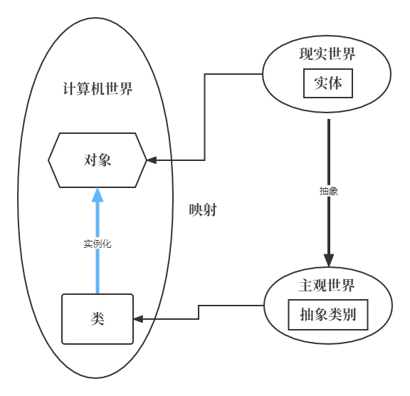

# 类和对象

## 面向对象

### 概念

面向对象(Object Oriented)是软件开发方法，一种编程范式。面向对象是一种对现实世界理解和抽象的方法，是计算机编程技术发展到一定阶段后的产物。

面向对象是相对于面向过程来讲的，面向对象方法`把相关的数据和方法组织为一个整体`来看待，从更高的层次来进行系统建模，更贴近事物的自然运行模式。

+ 面向过程：就是分析出解决问题所需要的步骤，然后用函数把这些步骤一步一步实现，使用的时候一个一个依次调用就可以了。
+ 面向对象：是把构成问题事务分解成各个对象，建立对象的目的不是为了完成一个步骤，而是为了描述某个事物在整个解决问题的步骤中的行为。

### 四大特性

面向对象主要有四大特征：抽象、封装、继承、多态。

#### 1、抽象(abstract)

抽象是将类对象的共同特征总结、提取出来构造类的过程，包括数据抽象和行为抽象两方面，抽象只关注对象的哪些属性和行为，并不关注这此行为的细节是什么。

属性抽象 -->表示世界中一类事物的特征，就是对象的属性。比如鸟有翅膀，羽毛等(类的属性)

行为抽象 -->表示世界中一类事物的行为，就是对象的行为。比如鸟会飞，会叫(类的方法)

#### 2、封装(encapsulation )

通常认为封装是把数据和操作数据的方法绑定起来，对数据的访问只能通过已定义的接口。面向对象的本质就是将现实世界描绘成一系列完全自治，封闭的对象，可以说，封装就是隐藏一切可隐藏的东西，只向外界提供最简单的编程接口。封装给对象提供了隐藏内部特性和行为的能力，对象提供一些能这被其它对象访问的方法来改变它内部的数据。

封装保证了模块具有较好的独立性，使得程序维护修改较为容易。对应用程序的修改仅限于类的内部，因而可以将应用程序修改带来的影响减少到最低限度。

#### 3、继承(inheritance)

继承是从已有类得到继承信息创建新类的过程，继承让变化中的软件系统有了一定的延续性，同时继承也是封装程序中可变因素的重要手段。子类继承父类属性(静态特征)和方法(动态特征)，继承必须遵循封装当中的控制访问

#### 4、多态(Polymorhism)

多态是指允许不同类的对象对同一消息做出响应。多态性包括参数化多态性和包含多态性。多态性语言具有灵活/抽象/行为共享/代码共享的优势，很好的解决了应用程序函数同名问题。总的来说，方法的重写，重载与动态链接构成多态性。

动态链接 -->对于父类中定义的方法，如果子类中重写了该方法，那么父类类型的引用将调用子类中的这个方法，这就是动态链接。

### 类和对象




#### 什么是类？

类，即类别：类是具有相似属性和行为的一组实例集合


#### 什么是对象？

在生活中，像张三，李四，王五，这样真真正正存在人的实体，我们称这些实体为对象。

在计算机中，类的实例就是对象。


## 类的定义和对象的创建

类是创建对象的蓝图，封装了数据和操作这些数据的方法，使用`class`关键字定义类，通常类名采用大驼峰命名规则。

### 空类

以下是一个简单的类的创建：

```python
class Person:
    pass
```

`Person`类是一个空类，但这不代表该类没有任何属性或成员，因为在`Python`中，所有类都继承自`object`。

比如咱们先来定义一个对象：

```python
maye = Person()
```

类名+()即可创建一个对象，这其实是调用了类的构造方法，在后续学习中，我们还可以传递参数给构造方法！

```python
print(maye.__class__)	#打印类名				<class '__main__.Person'>
print(maye.__str__())	#打印对象的字符串表示		<__main__.Person object at 0x00000137E84A6900>
```

### 构造和析构方法

构造方法和析构方法分别用于对象的初始化和清理工作，它们在对象的生命周期中起着重要作用。

+ **构造方法**是类中的一个特殊方法(魔法方法)，在创建类的实例时会自动调用，主要用于初始化对象的属性。

+ **析构方法**也是类中的特殊方法(魔法方法)，在对象被销毁时自动调用，主要用于执行一些清理工作，如关闭文件、释放资源等。
+ **特殊方法(魔法方法)方法名是固定的，不能修改哟！**

#### 构造与析构方法调用时机

下面`Person`类中，定义了`__init__`构造方法和`__del__`析构方法。

```python
class Person:
    def __init__(self):
        print("我是构造方法")

    def __del__(self):
        print("我是析构方法")

maye = Person()
```

运行后输出:

```shell
我是构造方法
我是析构方法
```

在创建对象时，会自动调用构造方法；在对象销毁时，会自动调用析构方法！

**注意事项**

- **`__del__` 方法的调用时机**：`__del__` 方法的调用时机并不总是确定的，因为 Python 使用垃圾回收机制来管理内存，当对象的引用计数为 0 时，垃圾回收器会在合适的时机回收对象并调用 `__del__` 方法。因此，不建议在 `__del__` 方法中执行一些依赖于特定顺序的重要操作。
- **异常处理**：在 `__init__` 和 `__del__` 方法中，都应该进行适当的异常处理，以确保在出现异常时也能正确地初始化或清理对象。

#### self参数解析

`self` 是一个指向实例本身的引用。

##### self

下面案例中，在构造方法和析构方法中，把self对象直接打印一下。

```python
class Person:
    def __init__(self):
        print("我是构造方法",self)

    def __del__(self):
        print("我是析构方法",self)       

maye = Person()
print(maye)
```

输出如下:

```shell
我是构造方法 <__main__.Person object at 0x000001FF76636900>
           <__main__.Person object at 0x000001FF76636900>
我是析构方法 <__main__.Person object at 0x000001FF76636900>
```

发现三个输出对象的地址，都是一样的，也就是说都是对象maye。

##### 原理

在调用类的方法时，Python 会自动把实例对象作为第一个参数传递给方法，而这个参数通常命名为 `self`。

> 注意： `self` 只是一个约定俗成的名称，你可以使用其他名称来替代，但为了代码的可读性和可维护性，建议始终使用 `self` 作为实例方法的第一个参数名。

为了方便理解我们自定义一个`introduce`方法：

```python
class Person:
    def __init__(self):
        print("我是构造方法",self)

    def __del__(self):
        print("我是析构方法",self)
        
    def introduce(self):
        print("我是maye，喜欢唱跳rap")

maye = Person()

maye.introduce()

Person.introduce(maye)
```

当你调用类的实例方法时，Python 会自动把实例对象作为第一个参数传递给方法。例如，调用 `person.introduce()` 时，Python 会将其转换为 `Person.introduce(person)`，这里的 `person` 就是 `self` 所代表的实例对象。

### 实例属性

实例属性是属于类的各个实例的属性，每个实例都能拥有不同的实例属性值。

#### 定义实例属性

通常在类的 `__init__` 方法（构造方法）里定义实例属性，不过也可以在其他实例方法或者类外部定义。

##### 在 `__init__` 方法中定义

```python
class Person:
    def __init__(self, name, age):
        # 定义实例属性
        self.name = name
        self.age = age

# 创建 Person 类的实例
person1 = Person("Alice", 25)
person2 = Person("Bob", 30)

print(person1.name)  # 输出: Alice
print(person2.age)   # 输出: 30
```

在上述代码中，`__init__` 方法接收 `name` 和 `age` 作为参数，然后使用 `self.name` 和 `self.age` 定义了实例属性。每个实例的属性值可以不同。

##### 在其他实例方法中定义

```python
class Dog:
    def __init__(self, name):
        self.name = name

    def set_age(self, age):
        # 在实例方法中定义新的实例属性
        self.age = age

dog = Dog("Buddy")
dog.set_age(3)
print(dog.age)  # 输出: 3
```

这里在 `set_age` 方法中定义了新的实例属性 `age`。

##### 在类外部定义

```python
class Cat:
    pass

cat = Cat()
# 在类外部定义实例属性
cat.name = "Whiskers"
cat.age = 2

print(cat.name)  # 输出: Whiskers
```

可以直接在类外部通过实例对象来定义新的实例属性。

#### 访问实例属性

使用点号（`.`）来访问实例属性，如上述例子中 `person1.name`、`dog.age` 等。

#### 修改实例属性

同样使用点号（`.`）来修改实例属性的值。

```python
class Car:
    def __init__(self, brand):
        self.brand = brand

car = Car("Toyota")
print(car.brand)  # 输出: Toyota

# 修改实例属性
car.brand = "Honda"
print(car.brand)  # 输出: Honda
```

#### 总结

- 实例属性属于类的每个实例，不同实例的属性值可以不同。
- 可以在 `__init__` 方法、其他实例方法或类外部定义实例属性。
- 使用点号（`.`）来访问和修改实例属性。
- Python 支持在运行时动态地为实例添加新的属性。

### 类属性

#### 定义与特点

类属性属于类本身，由该类的所有实例共享。也就是说，所有实例对类属性的修改都会影响到其他实例。类属性通常在类的内部、方法外部进行定义。

#### 示例代码1

```python
class Dog:
    # 定义类属性(物种)
    species = "狗"

    def __init__(self, name, age):
        self.name = name
        self.age = age

# 创建 Dog 类的实例
dog1 = Dog("Buddy", 3)
dog2 = Dog("Max", 2)

# 访问类属性
print(dog1.species)  # 输出: 狗
print(dog2.species)  # 输出: 狗

# 通过类名修改类属性
Dog.species = "犬"
print(dog1.species)  # 输出: 犬
print(dog2.species)  # 输出: 犬
```

在上述代码中，`species` 是类属性，所有 `Dog` 类的实例都可以访问该属性。当通过类名修改 `species` 属性时，所有实例访问该属性时都会得到修改后的值。

#### 示例代码2

假如需要定义一个变量统计一个类定义的对象数量，可以用类属性来实现。

```python
class Student:
    count = 0
    def __init__(self):
        Student.count +=1

stu1 = Student()
stu2 = Student()

print(stu1.count)
print(stu2.count)
print(Student.count)
```

### 访问优先级

当实例访问一个属性时，Python 会先在实例的对象属性中查找，如果找不到，再到类属性中查找。

```python
class Dog:
    species = "狗"

    def __init__(self, name):
        self.name = name

dog = Dog("Buddy")
# 先查找实例属性，找不到再查找类属性
print(dog.species)  # 输出: 狗

# 给实例添加一个同名属性
dog.species = "New species"
# 此时访问的是实例属性
print(dog.species)  # 输出: New species
# 类属性不受影响
print(Dog.species)  # 输出: 狗
```

在上述代码中，一开始 `dog` 实例没有 `species` 属性，所以访问的是类属性。当给 `dog` 实例添加了 `species` 属性后，再访问 `dog.species` 时，就会返回实例属性的值，而类属性的值保持不变。

### 类方法和静态方法

除了实例方法外，还有类方法和静态方法，它们在定义、调用和使用场景上各有不同。下面详细介绍这两种方法。

#### 类方法

##### 定义与语法

类方法是绑定到类而非实例的方法，通过`@classmethod`装饰器来定义，它的第一个参数通常是`cls`，代表类本身。

```python
class MyClass:
    class_variable = 10

    @classmethod
    def class_method(cls):
        return cls.class_variable
```

##### 调用方式

类方法可以通过类名直接调用，也可以通过实例调用，但无论哪种方式，传递给`cls`的都是类本身。

```python
# 通过类名调用
print(MyClass.class_method())

# 通过实例调用
obj = MyClass()
print(obj.class_method())
```

##### 使用场景

- **工厂方法**：用于创建类的实例，特别是当创建实例的逻辑比较复杂时，使用类方法可以封装这些逻辑。

```python
class Person:
    def __init__(self, name, age):
        self.name = name
        self.age = age

    @classmethod
    def from_birth_year(cls, name, birth_year):
        current_year = 2024
        age = current_year - birth_year
        return cls(name, age)

person = Person.from_birth_year("Alice", 1990)
print(person.name, person.age)
```

- **修改类属性**：类方法可以直接访问和修改类属性。

```python
class Counter:
    count = 0

    @classmethod
    def increment(cls):
        cls.count += 1
        return cls.count

print(Counter.increment())
print(Counter.increment())
```

#### 静态方法

##### 定义与语法

静态方法是一种与类和实例都没有直接关联的方法，通过`@staticmethod`装饰器来定义，它不需要传递`self`或`cls`参数。

```python
class MyClass:
    @staticmethod
    def static_method():
        return "This is a static method."
```

##### 调用方式

静态方法可以通过类名直接调用，也可以通过实例调用。

```python
# 通过类名调用
print(MyClass.static_method())

# 通过实例调用
obj = MyClass()
print(obj.static_method())
```

##### 使用场景

- **工具函数**：当一个函数与类的属性和方法没有直接关系，但又属于类的逻辑范畴时，可以将其定义为静态方法。

```python
import math

class Geometry:
    @staticmethod
    def calculate_area(radius):
        return math.pi * radius ** 2

area = Geometry.calculate_area(5)
print(area)
```

#### 类方法、静态方法和实例方法的对比

| 方法类型 | 装饰器          | 第一个参数         | 调用方式       | 使用场景                               |
| -------- | --------------- | ------------------ | -------------- | -------------------------------------- |
| 实例方法 | 无              | `self`（代表实例） | 实例调用       | 操作实例属性，实现与实例相关的业务逻辑 |
| 类方法   | `@classmethod`  | `cls`（代表类）    | 类名或实例调用 | 工厂方法、修改类属性等                 |
| 静态方法 | `@staticmethod` | 无                 | 类名或实例调用 | 与类相关的工具函数                     |

综上所述，类方法和静态方法在 Python 中提供了不同的编程方式，根据具体的需求和场景合理选择使用它们，可以使代码更加清晰和易于维护
