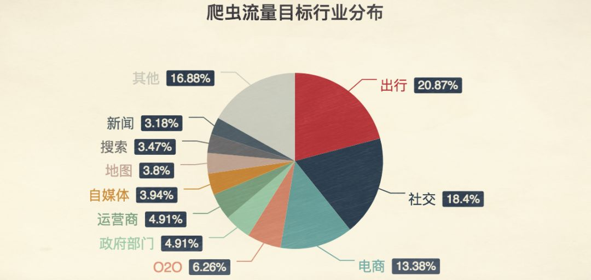

# 爬虫

## 1. 什么是网络爬虫？

如果我们把互联网比作一张大的蜘蛛网 ，那一台计算机上的数据便是蜘蛛网上的一个猎物 ，而爬虫程序就是一只小 蜘蛛 ，沿着蜘蛛网抓取自己想要的数据。

> 解释1：通过一个程序 ，根据Url(http://www.taobao.com)进行爬取网页 ，获取有用信息
>
> 解释2：使用程序模拟浏览器 ，去向服务器发送请求 ，获取响应信息

## 2. 爬虫核心

> 1.爬取网页 ：爬取整个网页  包含了网页中所有得内容 
>
> 2.解析数据：将网页中你得到的数据 进行解析
>
> 3.难点 ：爬虫和反爬虫之间的博弈

## 3.爬虫的用途

+ 数据分析/人工数据集 

+ 社交软件冷启动

+ 舆情监控

+  竞争对手监控

## 4.爬虫分类

### 通用爬虫

- **概念**：通用爬虫也称为广度优先爬虫，它的目标是尽可能广泛地抓取互联网上的网页，以构建一个全面的网页索引。
- **工作原理**：从一组初始的种子 URL 开始，通过解析这些网页中的链接，不断发现新的 URL，并将其加入到待抓取队列中。爬虫会按照一定的策略，如广度优先搜索策略，依次抓取队列中的 URL 对应的网页，直到达到预设的停止条件，如抓取的网页数量达到上限、时间限制等。
- **应用场景**：主要用于搜索引擎的网页抓取和索引构建，以便为用户提供全面的搜索结果。例如，百度、谷歌等搜索引擎使用通用爬虫来收集大量的网页信息，建立索引数据库，从而能够快速准确地响应用户的搜索请求。

### 聚焦爬虫

- **概念**：聚焦爬虫也称为主题爬虫或深度优先爬虫，它是一种面向特定主题的爬虫，旨在有针对性地抓取与特定主题相关的网页。
- **工作原理**：首先确定一个主题或关键词集合，然后从种子 URL 开始，分析网页内容，判断其与主题的相关性。对于与主题相关的网页，进一步提取其中的链接，并继续抓取这些链接对应的网页，同时根据网页与主题的相关程度调整抓取的优先级。而对于与主题不相关的网页，则不进行深入抓取。
- **应用场景**：常用于特定领域的信息收集和分析，如学术研究、市场调研、行业情报监测等。例如，在学术研究中，聚焦爬虫可以用于抓取特定学科领域的学术论文、研究报告等相关文献；在市场调研中，可用于收集特定产品或行业的市场动态、用户评价等信息。

### 两者的区别

- **抓取目标**：通用爬虫追求抓取网页的数量和广度，试图覆盖尽可能多的网页；聚焦爬虫则专注于特定主题的网页，追求抓取内容的准确性和相关性。
- **抓取策略**：通用爬虫通常采用广度优先搜索策略，均匀地遍历网页链接；聚焦爬虫则结合主题相关性判断，采用深度优先搜索或其他更复杂的策略，优先抓取与主题相关度高的网页。
- **应用场景**：通用爬虫适用于需要大规模收集网页信息的场景，如搜索引擎、网页存档等；聚焦爬虫适用于对特定领域或主题有深入信息需求的场景，能够更高效地获取有价值的信息，减少无关数据的抓取和处理。

## 5.反爬手段？

网站采用反爬手段主要是为了防止爬虫过度抓取数据，保障网站的性能、数据安全和用户体验。以下是一些常见的反爬手段：

### 基于请求头的反爬

- **验证请求头字段**：网站会检查请求头中的一些关键字段，如`User-Agent`、`Referer`等。正常的浏览器请求会携带特定格式的`User-Agent`，而爬虫的请求可能会使用默认或者不规范的`User-Agent`。网站可以通过检查这些字段来识别爬虫请求。
- **添加自定义请求头字段**：网站可以在请求头中添加自定义的字段，要求客户端在请求时携带特定的值。如果爬虫没有正确处理这些自定义字段，请求就会被拒绝。

### IP 限制

- **IP 封禁**：当网站检测到某个 IP 地址的请求频率过高时，会将该 IP 列入封禁列表，拒绝该 IP 的后续请求。这种方式可以有效阻止单个 IP 的过度抓取，但也可能会误封正常用户的 IP。
- **IP 访问频率限制**：网站会对每个 IP 地址的访问频率进行监控，设置一个合理的访问阈值。如果某个 IP 的请求频率超过了这个阈值，网站会暂时限制该 IP 的访问，一段时间后再恢复。
- **IP 代理池检测**：一些爬虫会使用代理 IP 来绕过 IP 封禁，但网站可以通过检测 IP 的地理位置、网络特征等信息，判断是否为代理 IP，并对代理 IP 进行限制。

#### 解决方案

**使用代理服务器**

代理服务器是一种位于用户与目标服务器之间的中介服务器，用户通过代理服务器发送请求，目标服务器将响应返回给代理服务器，再由代理服务器转发给用户。根据代理服务器对用户真实 IP 地址的隐藏程度，可分为高匿名代理、匿名代理和透明代理，以下是它们的特点：

+ **高匿名代理**
  + 隐藏程度：高匿名代理会完全隐藏用户的真实 IP 地址，目标服务器无法获取到用户的任何真实信息，认为请求是由代理服务器发出的，而不知道背后还有真实用户。
  + 安全性：安全性最高，能有效防止目标服务器对用户进行追踪，保护用户的隐私和安全。适合用于需要高度保密的网络活动，如网络爬虫、隐私保护浏览、访问被限制的资源等。
  + 使用场景：例如，科研人员在收集一些特定领域的公开数据时，为避免被目标网站识别出爬虫行为而限制访问，可使用高匿名代理来隐藏真实 IP，模拟不同的访问来源。
+ **匿名代理**
  + 隐藏程度：匿名代理也能隐藏用户的真实 IP 地址，但会在请求头中添加一些信息，暗示目标服务器这是一个代理服务器发出的请求。不过，目标服务器无法直接获取用户的真实 IP。
  + 安全性：安全性较高，能满足一般的隐私保护需求。在一些对隐私要求不是极其严格，但又希望隐藏部分信息的场景中较为适用。
  + 使用场景：比如，普通用户在浏览一些可能会收集用户信息的网站时，使用匿名代理可以在一定程度上保护自己的隐私，减少被广告商或网站追踪的可能性。
+ **透明代理**
  + 隐藏程度：透明代理不会隐藏用户的真实 IP 地址，目标服务器可以直接获取到用户的 IP 信息，并且知道请求是通过代理服务器转发的。它主要用于提高网络访问效率、缓存数据等，而不是用于隐藏用户身份。
  + 安全性：安全性较低，几乎起不到隐私保护作用。但在一些企业网络或特定的网络环境中，透明代理可以方便网络管理员对网络流量进行监控和管理。
  + 使用场景：例如，企业内部网络中，通过透明代理可以对员工的网络访问进行审计和控制，限制对某些网站的访问，同时利用代理服务器的缓存功能提高网页访问速度，节省网络带宽。

总的来说，高匿名代理和匿名代理主要用于隐藏用户身份，保护隐私和安全，而透明代理主要用于网络管理和优化。在选择使用哪种代理时，需要根据具体的需求和场景来决定。同时，使用代理服务器时要遵守相关法律法规和道德规范，不得用于非法目的。

### 验证码

- **图形验证码**：要求用户识别图片中的字符或图案，以证明自己是人类。图形验证码的复杂度可以根据需要进行调整，简单的验证码可能只包含数字和字母，复杂的验证码可能会加入干扰线、扭曲字符等元素。
- **滑动验证码**：用户需要通过滑动滑块来完成验证，网站会根据滑块的滑动轨迹、时间等信息来判断是否为人类操作。
- **点选验证码**：用户需要按照提示点击图片中的特定区域，以完成验证。这种验证码的难度相对较高，能够有效防止自动化脚本的破解。

#### 解决方案

爬虫可以通过多种方法来解决各种验证码问题，以下是一些常见的方式：

##### 光学字符识别（OCR）技术

- **原理**：利用 OCR 技术对验证码图片进行分析和识别，将图片中的文字转换为可编辑的文本。
- **实现方式**：使用开源的 OCR 库，如 Tesseract 等，先对验证码图片进行预处理，包括灰度化、降噪、二值化、字符分割等操作，以提高图像质量，然后再将处理后的图片输入到 OCR 引擎中进行识别。
- **适用场景**：适用于简单的数字、字母验证码，或字符规律较为明显的验证码。但对于复杂的验证码，如带有干扰线、扭曲字符、粘连字符的验证码，识别准确率可能较低。

##### 机器学习和深度学习算法

- **原理**：通过收集大量的验证码样本，并进行人工标注，构建训练数据集。然后使用机器学习算法，如支持向量机（SVM）、神经网络（NN）等，或深度学习算法，如卷积神经网络（CNN），对训练数据集进行学习，建立验证码识别模型。在识别新的验证码时，将验证码图片输入到训练好的模型中，模型即可输出识别结果。
- **实现方式**：可以使用 Python 中的深度学习框架，如 PyTorch、Keras 等，来实现基于卷积神经网络的验证码识别模型。首先对验证码图片进行预处理，将其调整为合适的尺寸并归一化，然后将处理后的图片作为模型的输入进行训练和预测。
- **适用场景**：对于各种复杂的验证码，包括带有干扰元素、变形字体的验证码，都有较好的识别效果。随着深度学习技术的不断发展，基于深度学习的验证码识别方法在准确率和泛化能力方面都有很大的提升。

##### 第三方验证码识别平台

- **原理**：将验证码图片发送到第三方验证码识别平台，平台利用其自身的技术和算法进行识别，并返回识别结果。
- **实现方式**：通过调用第三方平台提供的 API，将验证码图片以指定的格式上传到平台，然后接收平台返回的识别结果。一些常见的第三方验证码识别平台有**打码兔**、**超级鹰**等。
- **适用场景**：适用于各种类型的验证码，尤其是对于一些难以通过自行开发算法解决的复杂验证码。使用第三方平台可以节省开发成本和时间，提高识别效率。但需要注意选择正规、可靠的平台，并遵守平台的使用规定和收费标准。

##### 人工识别

- **原理**：通过人工手动识别验证码，通常是将验证码图片展示给人工操作人员，由他们输入验证码内容。
- **实现方式**：可以建立一个人工识别的流程，例如将验证码图片发送到专门的人工识别团队或通过众包平台邀请志愿者进行识别。在一些简单的爬虫场景中，也可以由开发者自己手动输入验证码来绕过验证。
- **适用场景**：适用于验证码数量较少、对识别准确率要求极高的情况。但人工识别效率较低，不适合大规模、自动化的爬虫任务。而且如果涉及到大量的人工操作，可能会违反网站的使用条款，甚至可能涉及到法律风险。

### 动态页面技术

- **JavaScript 渲染**：现代网站越来越多地使用 JavaScript 来动态生成页面内容。爬虫如果不支持 JavaScript 执行，就只能获取到页面的初始 HTML 代码，无法获取到动态加载的内容。网站可以通过这种方式来阻止简单的爬虫抓取。
- **AJAX 请求**：网站使用 AJAX 技术在页面加载后异步获取数据，这些数据不会直接包含在初始的 HTML 代码中。爬虫需要模拟 AJAX 请求，才能获取到完整的页面内容。

#### 解决方案

现代网页大量使用 JavaScript 来实现动态效果，如数据的异步加载、页面内容的动态更新等。传统的爬虫（如使用`requests`库）只能获取到网页的初始 HTML 代码，无法执行页面中的 JavaScript 代码，因此无法获取到那些通过 JavaScript 动态加载的内容。

##### Selenium 解决问题的原理

Selenium 是一个用于自动化浏览器操作的工具，它可以驱动真实的浏览器（如 Chrome、Firefox 等）来打开网页。当浏览器加载网页时，会自动执行页面中的 JavaScript 代码，从而实现动态内容的加载。爬虫通过 Selenium 控制浏览器，就可以获取到完整渲染后的页面内容，包括那些通过 JavaScript 动态生成的元素和数据。

##### 具体优势体现

- **模拟用户行为**：Selenium 可以模拟用户在浏览器中的各种操作，如点击按钮、滚动页面、输入文本等。这些操作可以触发网页中的 JavaScript 事件，从而加载更多的内容。例如，在一个需要点击 “加载更多” 按钮才能显示全部数据的页面上，Selenium 可以自动模拟点击操作，直到获取到所有需要的数据。
- **获取完整页面内容**：由于 Selenium 使用真实的浏览器来加载网页，它可以获取到经过 JavaScript 处理后的完整页面内容。这意味着爬虫可以直接提取那些动态加载的数据，而不需要手动分析和处理 JavaScript 代码。

##### 局限性

虽然 Selenium 可以解决动态加载网页的问题，但它也存在一些局限性：

- **性能问题**：使用真实的浏览器进行网页加载和操作，会消耗大量的系统资源，并且加载速度相对较慢，这可能会影响爬虫的效率。
- **反爬机制**：一些网站会检测到 Selenium 的自动化操作，并采取相应的反爬措施，如封禁 IP、弹出验证码等。
- **维护成本**：随着浏览器和网页技术的不断更新，Selenium 的使用和维护成本也会相应增加。需要不断更新浏览器驱动，以确保其与浏览器版本兼容。

综上所述，Selenium 为解决爬虫动态加载网页的问题提供了有效的解决方案，但在使用时需要考虑其性能、反爬和维护等方面的问题

### 数据加密与混淆

- **数据加密**：网站对敏感数据进行加密处理，只有在用户登录或者满足特定条件下才能解密。爬虫即使获取到了加密的数据，也无法直接解析和使用。
- **代码混淆**：对网页中的 JavaScript 代码进行混淆处理，使其难以阅读和理解。这样可以增加爬虫分析和破解的难度，保护网站的业务逻辑和数据。

### 行为分析

- **用户行为模式分析**：网站会分析用户的行为模式，如鼠标移动轨迹、页面停留时间、点击频率等。正常用户的行为模式具有一定的随机性和规律性，而爬虫的行为模式通常比较单一和机械。通过分析这些行为模式，网站可以识别出爬虫请求。
- **Cookie 和 Session 跟踪**：网站会使用 Cookie 和 Session 来跟踪用户的会话状态。如果某个请求没有携带正确的 Cookie 或 Session 信息，或者 Cookie 和 Session 的使用方式不符合正常用户的行为模式，网站就会怀疑该请求是爬虫发出的。

# URL

URL 即统一资源定位符（Uniform Resource Locator），它是互联网上用于标识和定位资源的字符串，就像是网络资源的 “地址”。

- **组成部分**：以常见的`https://www.example.com:8080/path/to/page.html?query=value#section`为例：
  - `https`是协议，规定数据传输规则；
  - `www.example.com`是域名，代表资源所在服务器的名称；
  - `8080`是端口号（若未写，会用默认端口，如 HTTP 默认 80，HTTPS 默认 443）；
  - `/path/to/page.html`是路径，指定资源在服务器中的位置；
  - `?query=value`是查询参数，用于向服务器传递信息；
  - `#section`是片段标识符，用于定位页面内特定位置。
- **作用**：在网络通信里，URL 让浏览器能精准找到网页、图片、视频等资源。输入网址访问网站，浏览器依据 URL 中的协议、域名等信息，和服务器建立连接，获取并展示资源。分享网页链接时，URL 能完整传达资源位置，他人点击即可访问相同内容。

# 网页
