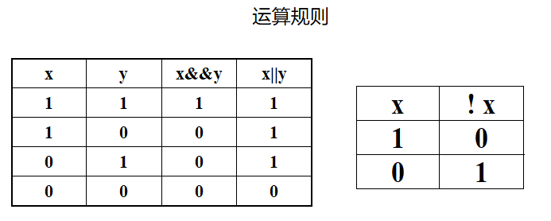

# 运算符和表达式

**运算符**：运算符用于执行程序代码运算，会针对一个以上操作数来进行运算。例如：2+3，其操作数是2和3，而运算符则是“+”

**操作数**：是运算符作用于的实体，操作数指出指令执行的操作所需要数据的来源。

**表达式**：是由数字、运算符、数字分组符号（括号）、自由变量等以能<font color = red>求得数值的</font>有意义排列方法所得的组合。

**表达式书写规则**

+ 1，运算符不能相邻。例a+/b是错误的
+ 2，乘号不能省略。列x乘以y，应写成x*y，而不是xy
+ 3，可用多层括号表示运算次序，括号必须成对出现，均使用小括号。


**运算符优先级和结合性**

所谓优先级就是当一个表达式中有多个运算符时，先计算谁，后计算谁。这个其实我们在小学学算术的时候就学过，如`1+4÷2`

那么“结合性”是什么呢？优先级都是关于优先级不同的运算符参与运算时先计算谁后计算谁。但是如果运算符的优先级相同，那么先计算谁后计算谁呢？这个就是由“结合性”决定的。

比如`1+2×3÷4`，乘和除的优先级相同，但是计算的时候是从左往右，即先计算乘再计算除，所以乘和除的结合性就是从左往右。就是这么简单！

## 算术运算符

| **符号** | **功能**         |
| -------- | ---------------- |
| +        | 单目正           |
| -        | 单目负           |
| +        | 加               |
| -        | 减               |
| *        | 乘               |
| /        | 除(结果为浮点数) |
| //       | 整除(结果为整数) |
| %        | 取模             |
| **       | 幂运算(a**b)     |

+ 单目正负不会改变操作数的值。

  ```python
  num = 10
  -num	#表达式的值为-10  num还是为10
  ```

+ 如果想要结果为整数，小数部分直接舍弃，可以使用`//`

  ```python
  5//2   == 2
  5//2.0 == 2.5
  ```

+ 求模运算只针对整数。

  ```python
  5%2 == 1
  5.2%2		//语法错误
  ```

+ 求模运算的结果的符号，只与被模数(第一个操作数)有关

  ```python
  print(-5 % 2)	#-1
  print(5 % -2)	# 1
  ```

  

## 赋值运算符

| **符号** | **功能**     |
| -------- | ------------ |
| =        | 简单赋值     |
| +=       | 加法赋值     |
| -=       | 减法赋值     |
| *=       | 乘法赋值     |
| /=       | 除法赋值     |
| //=      | 整除赋值     |
| %=       | 取模赋值     |
| <<=      | 左移赋值     |
| >>=      | 右移赋值     |
| **=      | 幂运算符赋值 |

+ 将一个数据(常量或表达式)赋值给一个变量。

  ```python
  age =18
  age +=2			#age = age +2
  age +=5-3		#age = age+(5-3)
  ```


## 关系运算符

| **符号** | **功能** |
| -------- | -------- |
| >        | 大于     |
| <        | 小于     |
| ==       | 等于     |
| >=       | 大于等于 |
| <=       | 小于等于 |
| !=       | 不等于   |

+ 关系表达式的值只有2种，为真(True)，为假(False)。
+ 所谓关系运算，就是做比较，日常生活中经常遇到一些真假判断，比如说，“张三比李四高”、“济南到北京比济南到上海近”，“5大于2”这些问题的答案是真或假。程序设计是对实际问题解决过程的模拟，常常需要做判断，像“如果这样，我就执行动作A，如果那样，我就执行动作B”，那怎么判断这样那样呢，就需要关系运算符和关系表达式。


## 逻辑运算符

| **符号** | **功能**   |
| -------- | ---------- |
| &&       | 逻辑与     |
| \|\|     | 逻辑或     |
| !        | 单目逻辑非 |

+ 逻辑表达式的值只有2种，为真(True)，为假(False)。
+ 一般用来连接关系表达式。



## 位运算符

| **符号** | **功能** | **记忆技巧**     |
| -------- | -------- | ---------------- |
| &        | 按位与   | 有0则0           |
| \|       | 按位或   | 有1则1           |
| ^        | 按位异或 | 相同为0，不同为1 |
| ~        | 单目取反 | 0变1,1变0        |
| <<       | 左移     | 移位右边补0      |
| >>       | 右移     | 右移左边补0      |

+ 位运算只针对**整型**，而且是直接对二进制进行操作


### 按位与&

这个符号其实和逻辑与运算and意思一样，只不过作用在每一位上。

**有0则0：**对于每一位来说，两个数都是真，则为真，否则为假。

```python
3-> 0b 0000 0011
2-> 0b 0000 0010
3&2 ->0b 0000 0010
```


### 按位或|

同理，和逻辑或运算or意思一样，只不过作用在每一位上。

**有1则1：**对于每一位来说，但凡有个真的就是真，否则为假。

```python
3	-> 0b 0000 0011
2	-> 0b 0000 0010
3|2 ->0b 0000 0011
```


### 按位异或^

**相同为0，不同为1：**对于每一位来说，只要相同就为0，不同就为1。

```python
3	-> 0b 0000 0011
2	-> 0b 0000 0010
3^2 ->0b 0000 0001
```


### 按位取反

取反是一个单目运算符，对每一位进行取反，**即0变1，1变0**

```python
6	-> 0b 0000 0110
~6	-> 0b 1111 1001    //补码:最高位变成了符号位，所以结果肯定是一个负数
       0b 1000 0110	  //反码
       0b 1000 0111	  //原码
result: -7
```

思考：~0是多少？有用吗？

### 左移

左移操作就是把这些0啊1啊的整体往左移动 n 位，右边缺的就补充 0。

```python
3		-> 0b 0000 0011
3<<1 	-> 0b 0000 0110 ==6
    
2		-> 0b 0000 0010
2<<2 	->0b 0000 1000 == 8
```

诶，大家发现没有，左移 1 位之后这个数相当于乘2。

但是这只适用于左边溢出的高位中不包含 1 时。

如果把 1 扔了，那就肯定不是 2 倍了嘛。


### 右移

右移操作就是整体往右移动 n 位，左边缺的补充符号位。

```python
3		-> 0b 0000 0011
3>>1 	-> 0b 0000 0001 ==1
    
2		-> 0b 0000 0010
2>>2    -> 0b 0000 0000 == 0
```

同理，正数右移操作的效果是这个数除以 2。

### 位运算案例

1. 判断一个数的最低位是0还是1

   ```python
   num = 1
   if num & 0x1:
   	print("num low bit not zero\n")
   ```
   
2. 判断一个数的最高位是0还是1

   ```python
   num = 0x80000000
   if (num >> 31) & 0x1:
   	print("num low bit not zero\n")
   ```
   
3. 取出整型的每个字节的数

   ```python
   num = 0x12345678
   b1 = num & 0xff
   b2 = num >> 8 & 0xff
   b3 = num >> 16 & 0xff
   b4 = num >> 24 & 0xff
   print(f"{b1:x}, {b2:x}, {b3:x}, {b4:x}")
   ```

4. 给定四个一字节类型的整数，合成一个四字节整数

   ```python
   b1 = 0x1A
   b2 = 0x2B
   b3 = 0x3C
   b4 = 0x4D
   
   res = b4 | (b3 << 8) | (b2 << 16) | (b1 << 24);
   
   print(f"{res:x}")
   ```

5. 现有如下几个状态

   ```python
   Play = 1 << 0		#1 播放状态
   Stop = 1 << 1		#2 停止状态
   Pause = 1 << 2		#4 暂停状态
   ```

   如果用一个变量，保存多种状态，并能反向识别出该变量有哪些状态，应如何处理？

   ```python
   state = Play | Stop;
   if state & Play:
   	print("Play");
   if state & Stop:
   	print("Stop");
   if state & Pause:
   	print("Pause");
   ```
   
   

### 成员运算符

成员运算符用于判断一个值是否是某个序列（如列表、元组、字符串等）的成员。

| 运算符   | 描述                                          | 示例            |
| -------- | --------------------------------------------- | --------------- |
| `in`     | 如果值在序列中返回 `True`，否则返回 `False`   | `x in list`     |
| `not in` | 如果值不在序列中返回 `True`，否则返回 `False` | `x not in list` |

```python
my_list = [1, 2, 3, 4, 5]
print(f"1 在列表中: {1 in my_list}")
print(f"6 不在列表中: {6 not in my_list}")
```

### 身份运算符

身份运算符用于比较两个对象的内存地址是否相同。

| 运算符   | 描述                                                    | 示例         |
| -------- | ------------------------------------------------------- | ------------ |
| `is`     | 如果两个对象的内存地址相同返回 `True`，否则返回 `False` | `a is b`     |
| `is not` | 如果两个对象的内存地址不同返回 `True`，否则返回 `False` | `a is not b` |

```python
a = [1, 2, 3]
b = a
c = [1, 2, 3]
print(f"a 和 b 是同一个对象: {a is b}")
print(f"a 和 c 是同一个对象: {a is c}")
```

## 运算符优先级

运算符优先级决定了表达式中运算符的计算顺序。当一个表达式中包含多个运算符时，Python 会按照运算符的优先级依次计算。你可以使用括号 `()` 来改变运算顺序。常见运算符的优先级从高到低大致如下：

1. 幂运算 `**`
2. 正负号 `+x`, `-x`
3. 按位取反 `~`
4. 乘法、除法、整除、取模 `*`, `/`, `//`, `%`
5. 加法、减法 `+`, `-`
6. 左移、右移 `<<`, `>>`
7. 按位与 `&`
8. 按位异或 `^`
9. 按位或 `|`
10. 比较运算符 `==`, `!=`, `>`, `<`, `>=`, `<=`
11. 身份运算符 `is`, `is not`
12. 成员运算符 `in`, `not in`
13. 逻辑非 `not`
14. 逻辑与 `and`
15. 逻辑或 `or`

```python
result = 2 + 3 * 4  # 先计算乘法，再计算加法
print(result)

result = (2 + 3) * 4  # 使用括号改变运算顺序
print(result)
```

以上就是 Python 中常见的运算符和表达式的详细介绍，掌握这些运算符和表达式的用法对于编写 Python 程序非常重要。