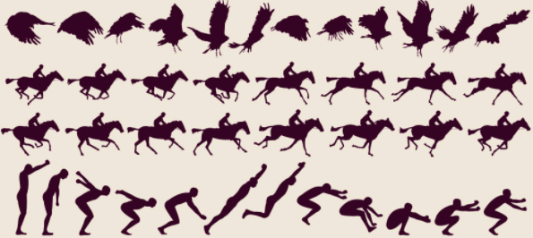

# Pygame

## 简介

Python Pygame 是一款专门为开发和设计 2D 电子游戏而生的软件包，它支 Windows、Linux、Mac OS 等操作系统，具有良好的跨平台性。Pygame 由 Pete Shinners 于 2000 年开发而成，是一款免费、开源的的软件包，因此您可以放心地使用它来开发游戏，不用担心有任何费用产生。

Pygame 在 SDL（Simple DirectMedia Layer，使用 C语言编写的多媒体开发库） 的基础上开发而成，它提供了诸多操作模块，比如图像模块（image）、声音模块（mixer）、输入/输出（鼠标、键盘、显示屏）模块等。相比于开发 3D 游戏而言，Pygame 更擅长开发 2D 游戏，比如于飞机大战、贪吃蛇、扫雷等游戏。

## 安装

使用`pip`包管理工具安装即可，首先确定的您的电脑已经安装了 Python（推荐使用 3.7 以上版本），然后打开 cmd 命令行工具，输入以下命令即可成功安装：

```shell
pip install pygame
```

上述安装方法同样适用于 Linux 和 Mac 操作系统。

安装完毕可以使用如下命令进行验证包是否安装成功：

```shell
python -m pygame --version
```

成功则输出如下所示:

```css
pygame 2.6.1 (SDL 2.28.4, Python 3.13.2)
Hello from the pygame community. https://www.pygame.org/contribute.html
```

# Pygame教程

### 1. 简单窗口

```python
import pygame

#初始化pygame
pygame.init()

#创建一个窗口，需要传递窗口大小
window = pygame.display.set_mode((800, 600))

#设置窗口标题，即游戏名称
pygame.display.set_caption("Hello Pygame")

#等待2000毫秒
pygame.time.wait(2000)

#退出窗口
pygame.display.quit()

#退出pygame,清理所有资源
pygame.quit()
```

首先，导入pygame模块。

然后，需要调用`pygame.init()`函数，来初始化pygame库。

接着，调用`set_mode((800,600))`来初始化一个窗口，800是窗口宽度，600是窗口高度。

最后，为了防止窗口消失，我们将调用`pygame.time.wait`。 此函数将等待给定的毫秒数。 一毫秒是千分之一秒。 这意味着上面的代码将使窗口等待2000 /1000秒或2秒。  

需要注意的重要一点是，当Pygame延迟时，它不能接受来自键盘或鼠标的输入。 当您运行这个程序时，如果它没有响应，请不要惊慌。 我们没有给它处理鼠标和键盘的代码。  

退出之前需要调用`pygame.display.quit()`手动销毁窗口和调用`pygame.quit()`清理所有初始化的子系统。

### 2. 图形绘制

Pygame 中提供了一个`draw`模块用来绘制一些简单的图形状，比如矩形、多边形、圆形、直线、弧线等。

```python
#绘制图形

#绘制之后需要调用update更新窗口
pygame.display.update()
```

#### 绘制直线

Draw 模块提供了两类绘制直线的方法，即是否消除直线的锯齿，并且根据实际情况，我们还可以选择绘制一条或者多条直线。

```python
pygame.draw.line(surface, color, start_pos, end_pos,width = 1)
```

参数说明如下：

- surface：指主游戏窗口，无特殊情况，一般都会绘制在主窗口上；
- color：该参数用于该图形着色；
- start_pos，end_pos：线段的起始、终止位置。用 (x,y)元组来表示起始位置
- width：线条宽度，默认为1

如果是绘制一条消除锯齿的平滑线，此时则使用 blend = 1 参数，如下所示：

```python
pygame.draw.aaline(surface, color, start_pos, end_pos,blend = 1)
```

#### 绘制折线

当需要绘制多条直线的时候，我们可以使用以下方法：

```python
pygame.draw.lines(surface, color, closed, points,width = 1)
```

其中 closed与points参数含义如下：

- closed：布尔值参数，如果设置为 True，表示直线的第一个端点和直线的最后一个端点要首尾相连；
- points：参数值为列表，包含了一些列点坐标的列表

如果绘制抗锯齿直线，使用以下方法：

```python
pygame.draw.aalines(surface, color, closed, points,blend = 1)
```

#### 绘制多边形

当需要绘制多边形的时候，我们可以使用以下方法：

```python
pygame.draw.polygon(surface, color, points,width = 0)
```

**参数解析:**

+ points列表参数，它表示组成多边形顶点的 3 个或者多个 (x,y) 坐标，通过元组或者列表来表示这些多边形顶点。

+ width参数为0则绘制填充多边形，非0则绘制非填充多边形。

#### 绘制矩形

绘制矩形的语法格式如下：

```python
pygame.draw.rect(surface, color, rect, width=0)
```

**参数解析:**

+ 其中rect表示矩形，包含绘制图形的位置和尺寸大小；

+ width参数为0则绘制填充矩形，非0则绘制非填充矩形。

实际上`pygame.draw.rect`还有更多可选参数：

```python
pygame.draw.rect(surface, color, rect, width=0,
                border_radius,											#边框圆角半径
                border_top_left_radius,border_top_right_radius,			#边框左上角和右上角圆角半径
                border_bottom_left_radius,border_bottom_right_radius)	#边框左下角和右下角圆角半径
```

#### 绘制圆形

**正圆**

```python
pygame.draw.circle(surface, color, center, radius,width = 0, 
                   [
                    draw_top_right,			#只绘制右上角饼图
                    draw_top_left,			#只绘制左上角饼图
                    draw_bottom_left,		#只绘制左下角饼图
                    draw_bottom_right		#只绘制右下角饼图
                   ]
                  ): 
```

其中center参数表示，圆心坐标；radius参数用来指定圆的半价

**椭圆**

```python
pygame.draw.ellipse(surface, color, rect)
```

绘制椭圆形的过程，其实就是在矩形区域内部（Rect）绘制一个内接椭圆形。

#### 绘制弧线

```python
pygame.draw.arc(surface, color, rect, start_angle, stop_angle,width = 1): 
```

与 ellipse 函数相比，该函数多了两个参数：

- start_angle是该段圆弧的起始弧度；
- stop_angle是终止弧度；

这两个都是用弧度制来表示的，而原点就是矩形 Rect 的中心位置。

> 弧度范围为[0,2π]，刚好一个圆，逆时针旋转！

### 3. 事件处理

#### 事件处理流程

除了将图像放在屏幕上之外，游戏还要求您处理来自用户的输入。您可以使用 Pygame事件处理系统来做到这一点。

```python
//主循环标志
isRunning = True
```

在输出表面和更新窗口表面之后，我们声明了一个退出标志，用于跟踪用户是否已退出，初始化为True。

Pygame事件是有意义的，比如 [按键](http://wiki.libPygame.org/Pygame_KeyboardEvent?highlight=(\bCategoryStruct\b)|(CategoryEvents))、 [鼠标移动](http://wiki.libPygame.org/Pygame_MouseMotionEvent?highlight=(\bCategoryStruct\b)|(CategoryEvents))、 [操纵杆 按钮按下](http://wiki.libPygame.org/Pygame_JoyButtonEvent?highlight=(\bCategoryStruct\b)|(CategoryEvents))等。在这个应用程序中，我们将找到退出事件来结束应用程序。

```python
while isRunning:
```

在之前的教程中，我们让程序在关闭前等待几秒钟。 在这个应用程序中，我们让应用程序等到用户退出后才关闭。  

当用户没有退出时，我们会有应用程序循环。 这种在应用程序处于活动状态时持续运行的循环称为主循环，有时也称为游戏循环。 它是任何游戏应用程序的核心。  

```python
    for ev in pygame.event.get():
        if ev.type == pygame.QUIT:
            isRunning = False
```

在主循环里面写了事件循环。 这样做的作用是继续处理事件队列，直到它为空。  

当您按下一个键、移动鼠标或触摸触摸屏时，事件就会被放到事件队列中。  

然后事件队列将按照事件发生的顺序存储它们，等待您处理它们。 当您想知道发生了什么事件以便处理它们时，您可以轮询事件队列，通过调用`pygame.event.get()`获取最近的事件列表。  

`for ev in pygame.event.get()` 将不断从队列中取出事件，直到队列为空。所以这段代码所做的就是不断轮询事件队列中的事件，直到它为空。如果来自事件队列的事件是 pygame.QUIT 事件（用户点击窗口右上角关闭按钮产生的事件），我们将运行标志设置为 False，以便我们可以退出应用程序。

```python
    #绘制矩形
    pygame.draw.rect(window,(255,0,0),(50,50,60,60))
    #更新窗口
    pygame.display.update()
```

在我们处理完一帧的事件后，我们绘制到屏幕并更新它。如果退出标志设置为真，应用程序将在循环结束时退出。如果它仍然是假的，它将一直持续到用户 X 掉窗口。

#### 帧率控制

帧率控制非常重要，它能够确保游戏在不同性能的计算机上都能以相对稳定的速度运行，避免游戏出现过快或过慢的情况。Pygame 提供了 `pygame.time.Clock` 类来帮助实现帧率控制。

##### 基本原理

`pygame.time.Clock` 类可以用来跟踪时间并控制游戏的帧率。通过 `Clock` 对象的 `tick()` 方法，你可以指定游戏每秒运行的帧数（FPS）。`tick()` 方法会根据上一次调用该方法到当前调用的时间间隔，自动调整程序的执行速度，使得游戏尽可能接近指定的帧率运行。

##### 代码实现

以下是一个简单的示例，展示了如何使用 `pygame.time.Clock` 来控制游戏的帧率：

```python
import pygame

# 初始化 Pygame
pygame.init()

# 设置屏幕尺寸
screen = pygame.display.set_mode((800, 600))
pygame.display.set_caption("FPS Control Example")

# 创建一个 Clock 对象
clock = pygame.time.Clock()

# 目标帧率
target_fps = 60

running = True
while running:
    for event in pygame.event.get():
        if event.type == pygame.QUIT:
            running = False

    # 填充背景色
    screen.fill((227, 227, 227))

    # 更新显示
    pygame.display.flip()

    # 控制帧率
    clock.tick(target_fps)

# 退出 Pygame
pygame.quit()
```

##### 查看帧率

如果你想查看游戏当前的帧率，可以使用 `Clock` 对象的 `get_fps()` 方法。

```python
    # 获取当前帧率
    current_fps = clock.get_fps()
```

##### 总结

通过使用 `pygame.time.Clock` 类的 `tick()` 方法，你可以方便地控制游戏的帧率，确保游戏在不同性能的计算机上都能稳定运行。同时，使用 `get_fps()` 方法可以实时查看游戏的帧率。

#### 键盘事件

退出事件只是 Pygame 能够处理的事件之一。在游戏中大量使用的另一种输入是键盘。我们将根据按下的键对图像进行移动  。  

```python
import pygame

#初始化pygame
pygame.init()

#创建一个窗口，需要传递窗口大小
window = pygame.display.set_mode((800, 600))

#用指定的颜色填充窗口背景
#window.fill((227,227,227))

#设置窗口标题，即游戏名称
pygame.display.set_caption("Hello Pygame")

#定义坐标
x,y = 50,50

isRunning = True
```

在进入主循环之前，我们先将绘制进行加载，并且定义坐标点x和y。  

```python
while isRunning:
    for ev in pg.event.get():
        if ev.type == pg.QUIT:
            isRunning = False
        # 判断某个键是否按下
        if ev.type == pg.KEYDOWN:
            if ev.key == pg.K_UP:
                y -= speed
            if ev.key == pg.K_DOWN:
                y += speed
            if ev.key == pg.K_LEFT:
                x -= speed
            if ev.key == pg.K_RIGHT:
                x += speed
        elif ev.type == pg.KEYUP:
            print(f"key {ev.key} released")

    window.fill((227, 227, 227))

    pygame.draw.rect(window,(255,0,0),(x,y,60,60))

    pg.display.update()
```

上面这种方式，只有在按下键的时候才会移动，也就是说需要不断地按键，才能移动，比较麻烦，还有一种方式，更丝滑！

```python
while isRunning:
    for ev in pygame.event.get():
        if ev.type == pygame.QUIT:
            isRunning = False
    #获取按下的所有键
    keys = pygame.key.get_pressed()
    #判断某个键是否按下
    if keys[pygame.K_UP]:
        y -= speed
    if keys[pygame.K_DOWN]:
        y += speed
    if keys[pygame.K_LEFT]:
        x -= speed
    if keys[pygame.K_RIGHT]:
        x += speed

    #填充窗口
    window.fill((255, 0, 0))

	#绘制图片            
    pygame.draw.rect(window,(255,0,0),(x,y,60,60))

	#更新窗口            
    pygame.display.update()
```

#### 鼠标事件

```c
while isRunning:
    for ev in pg.event.get():
        if ev.type == pg.QUIT:
            isRunning = False
        #鼠标移动事件
        elif ev.type == pg.MOUSEMOTION:
            print(f"Mouse Moved to {pg.mouse.get_pos()}")
		#鼠标键按下                
        elif ev.type == pg.MOUSEBUTTONDOWN:
            x,y = pg.mouse.get_pos()
            if ev.button == pg.BUTTON_LEFT:
                print(f"Left mouse button pressed at ({x},{y})")
            elif ev.button == pg.BUTTON_MIDDLE:
                print(f"Middle mouse button pressed at ({x},{y})")
            elif ev.button == pg.BUTTON_RIGHT:
                print(f"Left mouse button pressed at ({x},{y})")
		#鼠标键弹起                    
        elif ev.type == pg.MOUSEBUTTONUP:
            x,y = pg.mouse.get_pos()
            if ev.button == pg.BUTTON_LEFT:
                print(f"Left mouse button released at ({x},{y})")
            elif ev.button == pg.BUTTON_MIDDLE:
                print(f"Middle mouse button released at ({x},{y})")
            elif ev.button == pg.BUTTON_RIGHT:
                print(f"Left mouse button released at ({x},{y})")
        #鼠标滚轮滚动
        elif ev.type == pg.MOUSEWHEEL:
            if ev.precise_y == 1:   #向远离用户方向滚动
                print(f"Mouse wheel scrolled up")
            elif ev.precise_y == -1: #向靠近用户方向滚动
                print(f"Mouse wheel scrolled down")
```

注意：在通过ev访问`button`和`precise_y`属性时，是没有提示的！！！坑爹！

### 4. 绘制图片

我们都知道游戏中最常用到的就是图形绘制，简单地说就是将图像显示到屏幕上。图像在 Pygame 中被封装为一Surface类，它代表了所有像素相关的内容数据。

#### 绘图流程

一般情况都是从硬盘上直接加载相关的绘制转换为图片结构体。Pygame提供了相关的函数：

```c
pygame.image.load(filename)
```

这个函数可以从本地磁盘上加载一个绘制。

```python
sfc = pygame.image.load("hello_world.bmp").convert()

window.blit(sfc,(0,0))
```

接着使用 `window.blit()`函数将图片拷贝到后台缓冲中，最后在使用完毕后释放相关资源。

函数原型如下：

```c
def blit(
    source: Surface,
    dest: Union[Coordinate, RectValue],
    area: Optional[RectValue] = None,
    special_flags: int = 0,
)
```

+ **`source`**：要绘制的源 `Surface` 对象，它可以是通过 `pygame.image.load()` 加载的图像，也可以是用 `pygame.Surface()` 创建的新表面。
+ **`dest`**：源 `Surface` 对象在目标 `Surface`（也就是 `window`）上的位置。可以是一个二元组 `(x, y)` 来指定左上角的坐标，也可以是一个 `Rect` 对象。
+ **`area`**：可选参数，是一个 `Rect` 对象，用于指定源 `Surface` 中要绘制的区域。若未提供该参数，就会绘制整个源 `Surface`。
+ **`special_flags`**：可选参数，用于指定特殊的绘制标志，比如混合模式等。默认值为 `0`。

#### 透明贴图

在 Pygame 里，透明贴图能够让你在游戏里实现更自然和丰富的视觉效果，像角色、道具、背景元素等可以使用带有透明通道的图像。

##### 1. 设置透明色

在前面使用的`hello_world.bmp`图片，文本是黑色的，背景是白色的，现在想要将白色背景去掉，如何处理呢?

```python
sfc = pygame.image.load("hello_world.bmp").convert()
sfc.set_colorkey(pg.Color("white"))
```

通过设置图片的透明色，即可在绘制时，不显示改颜色。

##### 2. 加载带有透明通道的图像

在 Pygame 里，你可以使用 `pygame.image.load()` 函数来加载带有透明通道的图像，比如 PNG 格式的图像。同时，要使用 `convert_alpha()` 方法来保留图像的透明度信息。

```python
# 加载带有透明通道的图像
image = pygame.image.load("Resource/images/hero.png").convert_alpha()
```

在上述代码中，`convert_alpha()` 方法能够确保图像的透明通道被正确处理，这样在绘制图像时，透明部分就不会覆盖屏幕上的其他内容。

##### 3. 创建透明的 Surface

除了加载带有透明通道的图像，你还可以手动创建一个透明的 `Surface` 对象，然后在上面绘制图形。

```python
#创建一个透明的Surface
trans_img = pg.Surface((200,200),pg.SRCALPHA)
#在透明Surface上绘制一个半透明矩形
pg.draw.rect(trans_img,(255,0,0,128),(50,50,100,100))
#绘制图片边框，方便观察
pg.draw.rect(trans_img,pg.Color("black"),(0,0,trans_img.get_width(),trans_img.get_height()),1)
```

在这个例子中，`pygame.SRCALPHA` 标志用于创建一个支持透明度的 `Surface`。在绘制矩形时，颜色元组 `(255, 0, 0, 128)` 中的最后一个值 `128` 表示透明度，范围是 0（完全透明）到 255（完全不透明）。

##### 3. 处理精灵的透明度

如果你使用 `pygame.sprite` 模块来管理游戏中的元素，同样可以为精灵设置透明度。

```python
import pygame as pg

pg.init()

# 设置屏幕尺寸
screen = pg.display.set_mode((800, 600))
pg.display.set_caption("Sprite Transparency Example")

clock = pg.time.Clock()

# 定义一个精灵类
class TransparentSprite(pg.sprite.Sprite):
    def __init__(self, x, y):
        super().__init__()
        self.image = pg.Surface((100, 100), pg.SRCALPHA)
        pg.draw.circle(self.image, (0, 0, 255, 128), (50, 50), 50)
        self.rect = self.image.get_rect()
        self.rect.x = x
        self.rect.y = y

# 创建精灵实例
sprite = TransparentSprite(100, 100)
# 创建精灵组
all_sprites = pg.sprite.Group()
all_sprites.add(sprite)

frames = 0

# 初始透明度
alpha = 255
# 透明度变化步长
alpha_step = 1

running = True
while running:
    for event in pg.event.get():
        if event.type == pg.QUIT:
            running = False

    screen.fill((255, 255, 255))
    # 淡入效果
    #sprite.image.set_alpha((frames /100)%255)
    # 改变透明度
    alpha -= alpha_step
    if alpha < 0:
        alpha = 0
        alpha_step = -alpha_step  # 反向改变透明度
    elif alpha > 255:
        alpha = 255
        alpha_step = -alpha_step  # 反向改变透明度

    # 设置图片的透明度
    sprite.image.set_alpha(alpha)

    # 更新和绘制所有精灵
    all_sprites.update()
    all_sprites.draw(screen)

    pg.display.flip()
    frames +=1
    clock.tick(60)

pg.quit()
```

在这个示例中，定义了一个 `TransparentSprite` 类，在其初始化方法中创建了一个带有透明度的圆形 `Surface` 作为精灵的图像。

### 5.图像变换

`pygame.transform` 是 Pygame 库中的一个模块，它提供了一系列用于对 `Surface` 对象进行变换操作的函数。这些变换操作包括缩放、旋转、翻转等，能够帮助开发者实现丰富的视觉效果。以下是对 `pygame.transform` 模块中一些常用函数的详细介绍：

#### 1. 缩放操作

```python
# 加载图片
image = pygame.image.load("your_image.png").convert()
# 缩放图片
scaled_image = pygame.transform.scale(image, (200, 200))
```

**transform.scale()**：用于将图片缩放成指定大小。

- **函数原型**：`pygame.transform.scale(Surface, (width, height), DestSurface=None)`
- 参数解释：
  - `Surface`：要进行缩放的 `Surface` 对象。
  - `(width, height)`：缩放后的目标尺寸，是一个二元组。
  - `DestSurface`（可选）：指定缩放后的图像绘制到哪个 `Surface` 上，如果不指定则会返回一个新的 `Surface` 对象。
    -  `DestSurface` 的尺寸必须和 `(width, height)` 一致，不然就会引发问题。

**transform.smoothscale()**和**scale**一样是缩放图片，只不过是平滑缩放,比sacle缩放之后的效果好，但是比sacle函数缩放的效率低。

- **示例代码**：

```python
#将图片缩放成指定大小
dest_img = pg.transform.scale(img,(80,100))
dest_img = pg.transform.smoothscale(img,(80,100)) #平滑缩放,比sacle缩放之后的效果好，但是比sacle函数缩放的效率低
#将图片放大为原来的两倍
dest_img = pg.transform.scale2x(img)
#按比例缩放图片
dest_img = pg.transform.scale_by(img,0.5)
dest_img = pg.transform.smoothscale_by(img,2)
```

#### 2. 旋转操作

**transform.rotate()**：将一个 `Surface` 对象绕其中心点旋转指定的角度。

- 参数解释：
  - `Surface`：要进行旋转的 `Surface` 对象。
  - `angle`：旋转的角度，以度为单位，正值表示逆时针旋转，负值表示顺时针旋转。
- **示例代码**：

```python
#逆时针旋转45度
dest_img = pg.transform.rotate(img,45)

#旋转加缩放
dest_img = pg.transform.rotozoom(img,45,0.5)
```

#### 3. 翻转操作

**transform.flip()**：将一个 `Surface` 对象在水平或垂直方向上进行翻转。

- 参数解释：
  - `Surface`：要进行翻转的 `Surface` 对象。
  - `flip_x`：布尔值，`True` 表示在水平方向上翻转，`False` 表示不翻转。
  - `flip_y`：布尔值，`True` 表示在垂直方向上翻转，`False` 表示不翻转。
- **示例代码**：

```python
dest_img = pg.transform.flip(img,True,False)
```

#### 注意事项

- 这些变换操作通常会返回一个新的 `Surface` 对象，而不会修改原始的 `Surface` 对象。
- 旋转和缩放操作可能会改变 `Surface` 对象的大小，因此在使用变换后的 `Surface` 时需要注意其位置和尺寸的变化。

通过使用 `pygame.transform` 模块，你可以轻松实现对游戏中图像的各种变换效果，增强游戏的视觉表现力。

### 5.文本绘制

#### 渲染文本

文本绘制和图像绘制本质上是一样的，绘制文字之前先将文字转化为图片，然后在通过绘制绘制的方式绘制文字。该库支持 TrueType 字体绘制，TrueType 字体就是我们常用的 ttf 为后缀的字体，直接在 Windows 的字体文件夹下就可以找到。

找到合适的字体之后，接下来先用 `pg.font.Font()`打开字体，接着用 font的render函数将文字转换为 Surface 对象，后面的步骤就和绘制图片步骤完全一致了。

```python
#将文本渲染渲染成surface,中文不能正常显示,必须使用中文字体
#不能使用SysFont加载字体，必须使用Font直接创建对象,否则中文会显示小方框
chinese_font = pg.font.Font("C:/Windows/Fonts/simkai.ttf",36)
chinese_sfc = chinese_font.render(u"你好 Pygame",True,pg.color.Color(144,167,89),(255,245,219))
```

如果不需要处理中文，用以下的方式更为简单。

```python
#从系统字体创建一个pygame字体，如果name为None则使用默认字体
font = pg.font.SysFont(None,36)

#将文本渲染渲染成surface
text_sfc = font.render("Hello Pygame",True,pg.color.Color("red"))
```

#### 字体样式

```python
#设置加粗
chinese_font.set_bold(True)
#设置斜体
chinese_font.set_italic(True)
#设置下划线
chinese_font.set_underline(True)
#设置删除线
chinese_font.set_strikethrough(True)
```

### 6.播放音乐

#### 播放音乐

`pygame.mixer.music` 可用来播放较长的音乐文件，像 MP3、OGG 等格式。

##### 基本使用

```python
#加载音乐
pg.mixer.music.load("Resource/music/BAAM.mp3")

#播放音乐
pg.mixer.music.play()
```

使用`mixer.music.load`把音乐加载到内存，然后使用`mixer.music.play()`播放音乐。

`mixer.music.play(loops=0, start=0.0,fade_ms=0)`可以传入三个参数：

**参数解释**

1. **`loops`**

   - **类型**：整数

   - **默认值**：`0`

   - 作用

     ：指定音乐的循环次数。

     - 当 `loops` 为 `0` 时，音乐仅播放一次。
     - 当 `loops` 为正整数 `n` 时，音乐将播放 `n + 1` 次。例如，`loops = 2` 表示音乐总共会播放 3 次。
     - 当 `loops` 为 `-1` 时，音乐将无限循环播放，直到手动停止。

2. **`start`**

   - **类型**：浮点数
   - **默认值**：`0.0`
   - **作用**：指定音乐开始播放的位置，单位为秒。例如，`start = 5.0` 表示音乐从第 5 秒开始播放。不过，这个参数对 MP3 文件的支持不太稳定，对于 OGG 文件效果会更好。

3. **`fade_ms`**

   - **类型**：整数
   - **默认值**：`0`
   - **作用**：指定音乐淡入的时间，单位为毫秒。当设置了 `fade_ms` 时，音乐将在指定的时间内逐渐增大音量到正常音量，从而实现淡入效果。例如，`fade_ms = 2000` 表示音乐将在 2 秒内从无声逐渐增大到正常音量。

   接下来我们可以对音乐进行控制，比如暂停、恢复、停止等！

```python
 elif ev.type == pg.KEYDOWN:
     if ev.key == pg.K_SPACE:
         #如果音乐正在播放
         if pg.mixer.music.get_busy():
             #暂停播放
             pg.mixer.music.pause()
         else:
             #恢复播放
             pg.mixer.music.unpause()

```

在主循环里面，进行事件处理，当按下空格键时，实现暂停和播放功能！

如果需要彻底停止音乐的播放，可以使用`stop`，比如当按下s键时停止，应该这样写代码

```python
     elif ev.key == pg.K_s:
         #停止播放
         pg.mixer.music.stop()
```

如果你想从头重新播放当前音乐，代码如下：

```python
     # 从头开始播放
     elif ev.key == pg.K_r:
         pg.mixer.music.rewind()
```

当音量太大或太小时，还需要对音量进行设置，使用`set_volume`函数即可实现。

```python
    #调大音量
    elif ev.key == pg.K_UP:
        #获取音量，[0.0~1.0]之间
        volume = pg.mixer.music.get_volume()
        #设置音量
        pg.mixer.music.set_volume(volume+0.01)
    # 调小音量
    elif ev.key == pg.K_DOWN:
        volume = pg.mixer.music.get_volume()
        pg.mixer.music.set_volume(volume-0.01)
```

`set_volume`函数传入需要设置的音量，音量范围在[0~1]之间，超过1将被限定在1。

当音乐播放完成时，我们经常回去干一些事情，那么如何知晓音乐是否播放完成呢？答案是自己注册播放完成事件，在当前音乐播放完成时，会自动触发事件。

```python
#自定义音乐结束类型
MUSIC_END = pg.USEREVENT + 1
#设置音乐结束时发送的自定义事件
pg.mixer.music.set_endevent(MUSIC_END)  
```

设置好事件之后，还需要在事件循环中进行处理。

```python
   elif ev.type == MUSIC_END:
       pg.mixer.music.load(mus_list[current_index])
       pg.mixer.music.play()  
```

mus_list和current_index，定义如下:

```python
#音乐列表
mus_list = ["Resource/music/BAAM.mp3","Resource/music/LUVORATORRRRRY.mp3","Resource/music/That-Girl.mp3"]
current_index = 0
```

有了音乐列表，还可以实现切换上一曲和下一曲的功能:

```python
      #上一曲
      elif ev.key == pg.K_LEFT:
          current_index-=1
          if current_index < 0:
              current_index = len(mus_list)-1
          pg.mixer.music.load(mus_list[current_index])
          pg.mixer.music.play()
      # 上一曲
      elif ev.key == pg.K_RIGHT:
          current_index += 1
          if current_index >= len(mus_list):
              current_index = 0
          pg.mixer.music.load(mus_list[current_index])
          pg.mixer.music.play()
```


##### 获取音乐信息

#### 播放音效

`pygame.mixer.Sound` 可用于播放短的音效文件，如按钮点击声、射击声等。

当你需要以较低的延迟方式播放**未压缩**的音频文件(通常是WAV文件)，并且适用于响应用户操作的“反馈”类型的声音(例如虚拟键盘声音，弹出对话框的积极或消极反馈，或游戏声音)。如果低延迟不是很重要，可以考虑使用pygame.mixer.music，因为它支持更广泛的媒体格式，而且资源较少。

```python
#加载音效
sound = pg.mixer.Sound("Resource/sound/video_call.wav")

#播放音效
sound.play(-1,5000)
```

使用`mixer.Sound`加载音效，然后使用音效的`play`方法播放音效。

`play`方法原型如下：

```c
    def play(
        self,
        loops: int = 0,
        maxtime: int = 0,
        fade_ms: int = 0,
    )
```

+ loops：该参数指定音效的重复播放次数。默认值为 `0`，意味着音效仅播放一次。若将其设为 `-1`，音效会持续循环播放，直至手动停止。
+ maxtime：该参数以毫秒为单位，用于限制音效的播放时长。若不指定，音效会完整播放。若设置了 `maxtime`，音效播放到指定时长后就会停止。
+ fade_ms：该参数以毫秒为单位，用于设置音效淡入的时间。淡入指的是音效从音量为 0 逐渐增大到设定音量的过程。默认值为 `0`，表示没有淡入效果。

### 7.精灵

精灵（英文译为 Sprite），其实在一个游戏程序中，精灵本质指的是一张张小尺寸的图片，比如游戏中的各种道具、人物、场景装饰等，它们都可以看做成一张张小的“精灵”图。除此之外，人物的移动也可以看做是一系列小精灵图构成的序列（按帧组成的序列），如下图所示：



如果将逐帧分解后的动作，按照一定的频率播放，那么就形成了动画精灵，您将会看到雄鹰展翅高飞、人在策马奔腾、运动员奋力跳远。

精灵有个特点就是允许精灵之间进行交互，也称之为碰撞，而碰撞检测，指的就是检测两个精灵之间是否发生了碰撞。比如在贪吃蛇游戏中蛇的头部是否与食物发生了碰撞，或者飞机大战游戏中子弹是否击中了外星人等等。当检测到碰撞发生后，接下来会触发某些事件，比如子弹击中外星人，外星人就会消失，玩家的得分也会随之增加，并且在游戏屏幕上又会出现一个外星人。

Pygame 专门提供了一个处理精灵的模块，也就是 sprite（pygame.sprite）模块。通常情况下，我们使用该模块的基类 Sprite 来创建一个子类，从而达到处理精灵的目的，该子类提供了操作精灵的常用属性和方法，如下所示：

| 属性&方法       | 说明                                       |
| --------------- | ------------------------------------------ |
| self.image      | 加载要显示的精灵图片，控制图片大小和填充色 |
| self.rect       | 精灵图片显示在哪个位置                     |
| Sprite.update() | 刷新精灵图，使其相应效果生效               |
| Sprite.add()    | 添加精灵图到精灵组中（groups）             |
| Sprite.remove() | 从精灵组中删除选中的精灵图                 |
| Sprite.kill()   | 删除精灵组中全部的精灵                     |
| Sprite.alive()  | 判断某个精灵是否属于精灵组                 |

注意，当游戏中有大量的精灵时，操作它们将变得复杂，此时通过构建精灵容器（group 类）也就是精灵组来统一管理这些精灵。构建方法如下：

```python
# 创建精灵组
group = pygame.sprite.Group()
# 向组内添加一个精灵
group.add(sprite_one)
```

于此同时`pygame.sprite`模块也提供了多种检测精灵是否碰撞的方法，如下所示：

| 方法                             | 说明                                                         |
| -------------------------------- | ------------------------------------------------------------ |
| pygame.sprite.collide_rect()     | 两个精灵之间的矩形检测，即矩形区域是否有交汇，返回一个布尔值。 |
| pygame.sprite.collide_circle()   | 两个精灵之间的圆形检测，即圆形区域是否有交汇，返回一个布尔值。 |
| pygame.sprite.collide_mask()     | 两个精灵之间的像素蒙版检测，更为精准的一种检测方式。         |
| pygame.sprite.spritecollide()    | 精灵和精灵组之间的矩形碰撞检测，一个组内的所有精灵会逐一地对另外一个单个精灵进行碰撞检测，返回值是一个列表，包含了发生碰撞的所有精灵。 |
| pygame.sprite.spritecollideany() | 精灵和精灵组之间的矩形碰撞检测，上述函数的变体，当发生碰撞时，返回组内的一个精灵，无碰撞发生时，返回 None。 |
| pygame.sprite.groupcollide()     | 检测在两个组之间发生碰撞的所有精灵，它返回值是一个字典，将第一组中发生碰撞的精灵作为键，第二个组中发生碰撞的精灵作为值。 |

下面看一组简单的示例，代码如下所示：

### 8. IMGUI