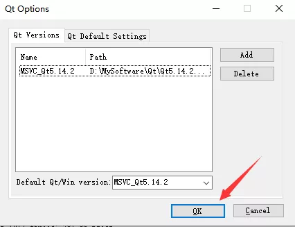
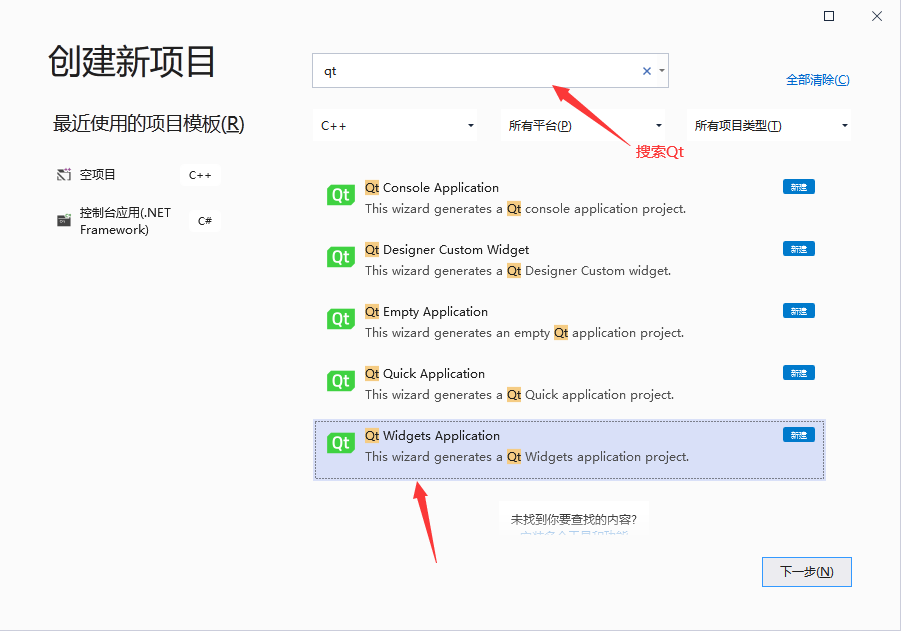
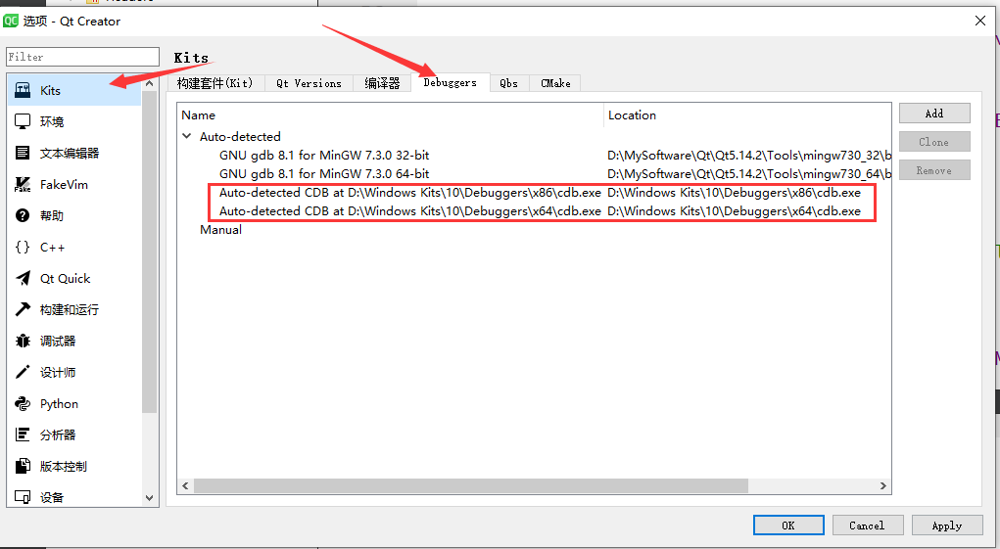

# 1.Qt是什么？

Qt（官方发音 [kju:t]，音同 cute）是一个跨平台的 C++ 开发库，主要用来开发图形用户界面（Graphical User Interface，GUI）程序，当然也可以开发不带界面的命令行（Command User Interface，CUI）程序。

Qt 是纯 C++ 开发的，所以学好 C++ 非常有必要，Qt 还存在 Python、Ruby、Perl 等脚本语言的绑定， 也就是说可以使用脚本语言开发基于 Qt 的程序。开源社区就是这样，好东西就会被派生扩展，到处使用， 越来越壮大。

Qt 支持的操作系统有很多，例如通用操作系统 Windows、Linux、Unix，智能手机系统 Android、iOS、WinPhone， 嵌入式系统 QNX、VxWorks 等等。


## Qt 可以做什么？

Qt 虽然经常被当做一个 GUI 库，用来开发图形界面应用程序，但这并不是 Qt 的全部；Qt 除了可以绘制漂亮的界面（包括控件、布局、交互），还包含很多其它功能，比如多线程、访问数据库、图像处理、音频视频处理、网络通信、文件操作等，这些 Qt 都已经内置了。

Qt 是应用程序开发的一站式解决方案，有了 Qt，你就可以高枕无忧了！Qt 本身包含的模块也日益丰富， 一直有新模块和第三方模块加入进来。 

大部分应用程序都可以使用 Qt 实现，除了与计算机底层结合特别紧密的，例如驱动开发，它直接使用硬件提供的编程接口，而不能使用操作系统自带的函数库。

1997年，Qt 被用来开发 Linux 桌面环境 KDE，大获成功，使 Qt 成为 Linux 环境下开发 C++ GUI 程序的事实标准。

下面的程序都使用 Qt 开发：WPS、YY语音、Skype、豆瓣电台、虾米音乐、淘宝助理、千牛、暴雪的战网客户端、VirtualBox、Opera、咪咕音乐、Google地图、Adobe Photoshop Album 等。

Linux 也是嵌入式的主力军，广泛应用于消费类电子、工业控制、军工电子、电信/网络/通讯、航空航天、汽车电子、医疗设备、仪器仪表等相关行业。

Qt 虽然也支持手机操作系统，但是由于 Android 本身已经有 Java 和 Kotlin，iOS 本身已经有 Objective-C 和 Swift，所以 Qt 在移动端的市场份额几乎可以忽略。

总起来说，Qt 主要用于桌面程序开发和嵌入式开发。

## Qt 的辛酸史

说到 Qt 的发展史，那真是一波三折，几经卖身。

Qt 最早是 1991 年由挪威的 Eirik Chambe-Eng 和 Haavard Nord 开发的， 他们随后于 1994 年 3 月 4 号正式成立奇趣科技公司（Trolltech）。Qt 原本是商业授权的跨平台开发库， 在 2000 年奇趣科技公司为开源社区发布了遵循 GPL（GNU General Public License）许可证的开源版本。

在 2008 年，诺基亚公司收购了奇趣科技公司，并增加了 LGPL（GNU Lesser General Public License）的授权模式。诺基亚联合英特尔利用 Qt 开发了全新的智能手机系统 MeeGo，可惜遭遇了微软木马屠城，诺基亚被迫放弃了 MeeGo， 而 Qt 商业授权业务也于 2011 年 3 月出售给了芬兰 IT 服务公司 Digia。


当然好消息是 Digia 于 2014 年 9 月宣布成立 Qt Company 全资子公司，独立运营 Qt 商业授权业务。目前 Qt 公司大力推广移动平台开发和商业应用， 总的来说 Qt 历经曲折，现在算是步入正轨了。

经过 30 多年的发展，Qt 已经成为最优秀的跨平台开发框架之一，在各行各业的项目开发中得到广泛应用。许多大型软件都是用 Qt 开发的，如 Autodesk Maya、Google Earth、Skype、WPS Office等。

> 永远不要忽视微软帝国的威胁，作为软件业的一代霸主，任何人都不要天真地试图和它做朋友，因为霸主不可能有朋友。微软的木马屠城是所有诺基亚人和芬兰人的痛，希望读者们都记牢这条。

## Qt 和 KDE

之前提到 Qt 原本是商业授权软件，是怎么开源的呢？这就涉及 Qt 和 KDE 的纠葛了。

KDE 是 Linux 操作系统的桌面环境，与 GNOME 桌面是类似的，作为开源桌面它们竞争的情况更为多见。

KDE 是采用 GPL 许可证发布的开源软件，而最初 Qt 是商业授权的，存在商业侵权风险，GNOME 则是基于开源 GTK 库的，没有什么商业风险，这一度是 GNOME 优越于 KDE 的特性。

由于 Qt 的商业授权，KDE 社区一度混乱纠结，与此同时 GNOME 则如火如荼发展起来了。 KDE 毕竟算是亲儿子，被另一波人欺负，奇趣科技公司当然看不下去了，最后是奇趣科技公司为了赢得开发者的支持，为 Qt 增加了 GPL 的开源授权， 对于开源社区而言，遵循 GPL 使用 Qt 就不需要付费，这为 KDE 解决了燃眉之急。

之后 KDE 桌面和 GNOME 都发展壮大起来，都做得越来越好了。

## GPL 和 LGPL

除了商业授权，目前 Qt 的开源授权有两种，一种是 GPL 授权，另一种是 LGPL 授权（诺基亚收购后新增）。

对这两种开源授权，简单来说，使用 GPL 版本的软件一定还是 GPL 的开源软件，无论是使用了 Qt 的程序代码还是修改了 Qt 库代码，都必须按照 GPL 来发布，这是 GPL 的传染性。

GPL 是什么都要开源，这对商业软件应用是不利的，所以诺基亚增加了 LGPL 授权 （第一个 L 可以叫 Lesser 宽松版或 Library 开发库版）。使用 LGPL 授权就可以利用 Qt 官方动态链接库，而不必开放商业代码。只要不修改和定制 Qt 库，仅使用 Qt 官方发布的动态链接库就可以不开源，这是商业友好的授权模式。

其实只要不是做商业，就不太需要关注用什么授权，以 GPL 授权发布程序代码就可以了。

## 如何选择开源协议

世界上的开源协议有上百种，很少有人能彻底搞清它们之间的区别，即使在最流行的六种开源协议——GPL、BSD、MIT、Mozilla、Apache 和 LGPL——之中做选择，也很复杂。

乌克兰程序员 Paul Bagwell 画了一张分析图，说明应该怎么选择开源协议，大家看了一目了然，真是清爽。


最后请认准 Qt 官方网站[Qt官网](https://www.qt.io/)


# 2.为什么用Qt？

用 Qt 来开发 Windows 桌面程序有以下优点：

- 简单易学：Qt 封装的很好，几行代码就可以开发出一个简单的客户端，不需要了解 Windows API。
- 资料丰富：资料丰富能够成倍降低学习成本，否则你只能去看源码，关于 DirectUI、Htmlayout、aardio 的资料就很少。
- 漂亮的界面：Qt 很容易做出漂亮的界面和炫酷的动画，而 MFC、WTL、wxWidgets 比较麻烦。
- 独立安装：Qt 程序最终会编译为本地代码，不需要其他库的支撑，而 Java 要安装虚拟机，C# 要安装 .NET Framework。
- 跨平台：如果你的程序需要运行在多个平台下，同时又希望降低开发成本，Qt 几乎是必备的。

#### Qt 和 MFC

读者经常将 MFC 和 Qt 进行对比，MFC 只能应用在 Windows 平台，而 Qt 是跨平台的，一次编写，到处运行。

另外，Qt 已经封装了底层细节，学习 Qt 将会非常简单；而 MFC 只是给 Windows API 加了一层包装，不了解 Windows API 也学不好 MFC，大家普遍反映 MFC 难学。

我们不能简单地说 Qt 好还是 MFC 好，两者都有用武之地；但是初学者学习 Qt 会比较简单，不用应付那些烦人的 Windows API，很快就能开发出带有漂亮界面的应用程序。


# 3.Qt Creator

[安装文档教程](https://mp.weixin.qq.com/s/n58OskK1ldmelCnRXPgOCg)

[安装视频教程](https://www.bilibili.com/video/BV1r54y1G7m4/)

## 安装之后添加组件

1，找到Qt安装目录中的维护工具MaintenanceTool.exe


2，添加国内源

手动添加储存库要定位一个储存有***\*QT在线安装镜像的地址\****，这可难坏我了，但是经过不懈努力还是被我找到了（网址：http://download.qt.io/static/mirrorlist/）这个网站，显示了各国的qt镜像站点，中国有四个，我用的是中科大的站，点击HTTP会进入一个网络文件夹。


然后依次进入/online/qtsdkrepository/windows_x86/root/qt/ 最终的文件夹显示如下，在这个界面**复制一下当前地址框地址**

Qt Creator是跨平台的 Qt IDE， Qt Creator 是 Qt 被 Nokia收购后推出的一款新的轻量级集成开发环境（IDE）。此 IDE 能够跨平台运行，支持的系统包括 Linux（32 位及 64 位）、Mac OS X 以及 Windows。

+ <font color="red">使用QtCreator创建的项目目录中不能包含中文和空格</font>
+ <font color="red">QtCreator默认使用Utf8格式编码对文件字符进行编码</font>

> 为了处理汉字，程序员设计了用于简体中文的GB2312和用于繁体中文的big5。GB2312 支持的汉字太少，1995年的汉字扩展规范GBK1.0，支持了更多的汉字。2000年的 GB18030取代了GBK1.0成为了正式的国家标准。Unicode 也是一种字符编码方法，不过它是由国际组织设计，可以容纳全世界所有语言文字的编码方案。

修改Qt Creator文件编码：菜单栏->工具->选项->文本编辑器->行为->文件编码


## 主界面


## 创建项目

+ 选择项目模板


+ 填写项目名称和选择路径(<font color="red">不能包含中文和空格~不能包含中文和空格~不能包含中文和空格~</font>)


+ 定义编译系统(qmake即可)

  

+ 选择窗口类信息


+ 选择编译套件(用Qt Creator开发请选择MinGW `Minimalist GNU for Windows`)

  


## 项目文件

### main.cpp

> 主函数所在的文件

```cpp
#include "widget.h"				//生成的窗口类头文件
#include <QApplication>			//引用程序类头文件

int main(int argc, char *argv[])
{
    //创建应用程序对象, 在一个Qt项目中实例对象有且仅有一个
    // 类的作用: 检测触发的事件, 进行事件循环并处理
    QApplication a(argc, argv);	
    //创建窗口对象
    Widget w;
    //显示窗口
    w.show();
    //应用程序对象开始事件循环，保证应用程序不退出
    return a.exec();
}
```


### widget.h

> 窗口类头文件

```cpp
#ifndef WIDGET_H
#define WIDGET_H

#include <QWidget>			//Qt标准窗口类头文件

class Widget : public QWidget	//自己的类继承自Qwidget类
{
    Q_OBJECT					//使用信号与槽机制，必须包含该宏

public:
    Widget(QWidget *parent = nullptr);
    ~Widget();
};
#endif // WIDGET_H
```


### widget.cpp

> 窗口类源文件

```cpp
#include "widget.h"

Widget::Widget(QWidget *parent)
    : QWidget(parent)
{
}

Widget::~Widget()
{
}
```


### HelloQt.pro

> Qt项目文件，注释需要用#号

```properties
#项目编译时需要加载哪些模块
QT       += core gui

# 如果当前Qt版本大于4, 要添加一个额外的模块: widgets
# Qt 5中对gui模块进行了拆分, 将 widgets 独立出来了
greaterThan(QT_MAJOR_VERSION, 4): QT += widgets

# 让Qt支持c++11标准
CONFIG += c++11

#如果您使用任何已标记为不推荐使用的Qt功能，则以下定义使您的编译器发出警告（确切的警告取决于您的编译器）。 
#请参考不推荐使用的API的文档，以了解如何将您的代码移植远离它。
DEFINES += QT_DEPRECATED_WARNINGS

#如果使用过时的API，您还可以使代码无法编译。
#为此，请取消注释以下行。
#您也可以选择仅在特定版本的Qt之前禁用已弃用的API。
#DEFINES + = QT_DISABLE_DEPRECATED_BEFORE = 0x060000    ＃禁用所有在Qt 6.0.0之前弃用的API

# 项目中的源文件	删除后，项目里不会显示所有的源文件
SOURCES += \
    main.cpp \
    widget.cpp

# 项目中的头文件
HEADERS += \
    widget.h

#部署的默认规则
qnx: target.path = /tmp/$${TARGET}/bin					#嵌入式
else: unix:!android: target.path = /opt/$${TARGET}/bin	#unix
!isEmpty(target.path): INSTALLS += target
```

pro是Qt的工程文件，这个文件是给qmake用来生成Makefile用的。

如果了解makefile的人应该知道，Makefile的三个关键点就是`目标`，`依赖`，`命令`。这里也很类似。pro文件中可以指明这个Qt项目的`头文件`，`源文件`，`链接的外部库`，`目标文件名`，`模板(生成什么样的Makefile)`，`版本配置(debug/release)`等。

### 常用qmake变量

| .pro中变量     | 含义                                               | 示例                                      |
| :------------- | :------------------------------------------------- | :---------------------------------------- |
| TEMPLATE       | 模板变量指定生成makefile(app:应用程序/lib:库)      | TEMPLATE = app                            |
| QT             | 使用到的Qt定义的类(core/gui/widgets...)            | QT += widgtes                             |
| DESTDIR        | 指定生成的应用程序放置的目录                       | DESTDIR += ../bin                         |
| TARGET         | 指定生成的应用程序名                               | TARGET = hello                            |
| HEADERS        | 工程中包含的头文件                                 | HEADERS += hello.h                        |
| FORMS          | 工程中包含的.ui设计文件                            | FORMS += hello.ui                         |
| SOURCES        | 工程中包含的源文件                                 | SOURCES += main.cpp hello.cpp             |
| RESOURCES      | 工程中包含的资源文件                               | RESOURCES += qrc/hello.qrc                |
| LIBS           | 引入的lib文件的路径 -L：引入路径                   | LIBS += -L.                               |
| CONFIG         | 用来告诉qmake关于应用程序的配置信息                | CONFIG+= qt warn_on release               |
| UI_DIR         | 指定.ui文件转化成`ui_*.h`文件的存放目录            | UI_DIR += forms                           |
| RCC_DIR        | 指定将.qrc文件转换成`qrc_*.h`文件的存放目录        | RCC_DIR += ../tmp                         |
| MOC_DIR        | 指定将含Q_OBJECT的头文件转换成标准.h文件的存放目录 | MOC_DIR += ../tmp                         |
| OBJECTS_DIR    | 指定目标文件(obj)的存放目录                        | OBJECTS_DIR += ../tmp                     |
| DEPENDPATH     | 程序编译时依赖的相关路径                           | DEPENDPATH += . forms include qrc sources |
| INCLUDEPATH    | 头文件包含路径                                     | INCLUDEPATH += .                          |
| DEFINES        | 增加预处理器宏（gcc的-D选项）。                    | DEFINES += USE_MY_STUFF                   |
| QMAKE_CFLAGS   | 设置c编译器flag参数                                | QMAKE_CFLAGS += -g                        |
| QMAKE_CXXFLAGS | 设置c++编译器flag参数                              | QMAKE_CXXFLAGS += -g                      |
| QMAKE_LFLAGS   | 设置链接器flag参数                                 | QMAKE_LFLAGS += -rdynamic                 |

## 项目操作

### 添加新文件


### 打开Qt项目


### 其他


## 常用快捷键

+ 运行     Ctrl + r
+ 编译     Ctrl + b
+ 注释     Ctrl + /
+ 字体缩放 Ctrl + 鼠标滚轮
+ 查找/替换 Ctrl + f
+ 整行移动   Ctrl + Shift + ↑ 或 ↓
+ 自动对齐   Ctrl + i
+ 帮助文档
  + 第一种：Qt Creator 直接查看   F1
  + 第二种：打开独立的帮助文档程序  assistant
+ 同名.h 和 .cpp 之间的切换  F4
+ 快速添加函数的定义  Alt + Enter      <span style="font-size:15px">`鼠标移动到函数申明上`</span>
+ 修改变量名，并应用到所有用到该变量的地方  Ctrl + Shift +r
+ 快速打开输出窗口 Alt + 数字键(1-8)


+ 书签功能,即在某行代码处进行标记,方便以后找到。书签也可以添加文字标注。

  + 按Ctrl + M   添加/删除书签

  + 按Ctrl + .     查找并移动到下一个标签

## 主题配置

萝卜白菜各有所爱，如何修改QtCreator的主题呢？

`菜单栏->工具->选项->文本编辑器`


上面是选择系统自带的，当然也可以自己配置一个，我这配置了一个Vs白色主题的。

+ xml文件 `Visual studio white(Qt creator代码样式).xml`

+ 把该文件复制到Qt的安装目录下的->Qt\Qt5.14.2\Tools\QtCreator\share\qtcreator\styles目录中
+ 最后进入文本编辑器选择


# 4.Qt+VS2019

为什么用VS写Qt程序？

很多人在Qt上写代码时，感觉不是很舒服，所以想在Vs上写Qt程序，而且Vs具有强大的调试能力，所以咱们可以通过一些配置实现此目的。


### 1.打开VS

选择菜单栏->扩展->管理扩展


### 2.VS安装Qt插件

选择菜单栏的 扩展->管理扩展，输入Qt搜索，然后下载Qt Visual Studio Tools（下载灰常的银杏，慢的死~还不一定能下载）


**如果实在不能忍受这龟速，咱们来别的办法**

先到Qt官网下载对于版本的插件，我这里是Vs2019：

[Qt官网插件下载](https://download.qt.io/official_releases/vsaddin/)

[微软拓展商店下载](https://marketplace.visualstudio.com/items)


如果跳到如下页面，选择清华大学镜像源下载即可。


### 3.安装VSIX(即上面下载的那个插件)

如果是通过Vs下载的，会自动安装。

如果是手动下载的，需要双击自己安装。

打开安装包之后，点击Install等待安装完成即可。


安装之前，请先关掉Vs`没有关掉会出现如下界面，点击end tasks即可`


关闭Vs之后，一秒安装完成


安装完成，关掉程序

### 4.设置插件

再次打开Vs，扩展->Qt VS Tools->Qt Options


点击Qt Options之后会弹出如下界面


如果在弹出上述界面的同时，还弹出如下这个错误界面，不要担心，这是由于安装插件的时候，会自动配置，但是自动配置的路径和实际的Qt安装路径不一致，我们自己再配置一下就ok了


首先删掉自动配置好的路径，然后点击Add自己添加一个，如下是具体的路径选项，选择msvc2017_64文件夹，点击确定即可


然后点击OK(Name是自己取的)



### 5.VS创建Qt项目

在Vs中点击新建项目，搜索Qt找到Qt Widgets Application然后点击下一步。



下一步之后，给项目取名称


点击创建，然后点击Next


然后从Debug和Release模式里选择一个即可(默认即可)


然后点击完成


最后，Ctrl+F5，大功告成


### 6，中文乱码

由于windows默认的编码方式为GB2312，而Qt使用的是Unicode，两种编码方式不一样导致了乱码产生。

我们需要把代码文件改为utf-8保存，可以手动修改，也可以借助插件自动修改。

#### 1，手动修改

VS隐藏了高级保存功能，导致没办法直接去设置代码编码。那么我们直接把高级保存功能调用出来即可：

1. 单击“工具”|“自定义”命令，弹出“自定义”对话框。

   

2. 单击“命令”标签，进入“命令”选项卡；在“菜单栏”下拉列表中，选择“文件”选项；单击“添加命令”按钮，弹出“添加命令”对话框。

   

3. 在“类别”列表中，选择“文件”选项；在“命令”列表中，选择“高级保存选项”选项。 单击“确定”。

   

...这个操作还是比较麻烦，使用下面的自动修改是最方便的

#### 2，自动修改

打开 VS2017，依次点击 工具 -> 扩展和更新，搜索插件 “ForceUTF8”，安装后源码文件会强制保存为带 BOM 的 UTF-8。


**注意：**<font color=red>修改之后，写C/C++代码会出现乱码，此时再进到插件->已安装吧Force UTF-8禁用掉，然后重启Vs即可</font>


### 7，Vs中修改应用程序图标

+ 1，备好一个.ico图标文件

+ 2，创建一个.rc文件(创建txt修改后缀即可)，然后加入以下代码

  ```css
  IDI_ICON1 ICON DISCARDABLE "zay.ico"
  ```

+ 3，将.rc文件和.ico文件都放在项目的文件夹中

+ 在VS中右击Source File筛选器选择**添加**||**现有项**，将**logo.rc**和**zay.ico**文件添加到项目中，重新生成即可

# 5.Qt Creator + MSVC

先安装好Qt Creator和visual studio，前者做编辑器，用后者的编译器，最后安装一个调试器。

通过[windows SDK](https://developer.microsoft.com/zh-cn/windows/downloads/windows-sdk/)工具安装调试器(CDB)。

下载之后安装即可


安装完成之后重新打开Qt Creator，会自动检测调试工具的路径。



安装Vs之后，编译器也会自动检测到(我这是安装了2019与2021，所以有很多)


最后需要自己选择一下，对应版本的编译器和调试器x64和x86都可以配置一下


## 中文乱码

如果出现乱码可以在.pro文件中加入以下代码

```css
msvc
{
	QMAKE_CFLAGS += /utf-8	#C语言编译器选项
	QMAKE_CXXFLAGS+=/utf-8	#C++编译器选项
}
```


# 6.需要的C++知识

## 1.什么是C++

C++是C语言的继承，它既可以进行C语言的过程化程序设计，又可以进行以抽象数据类型为特点的基于对象的程序设计，还可以进行以继承和多态为特点的面向对象的程序设计。

## 2.如何定义一个类

```cpp
class Animal
{
public:
    Animal(const std::string& name,int age)
        :name(name),age(age)
    {

    }
    void cry()
    {
        std::cout<<name<<" "<<age<<" "<<u8"Animal cry"<<std::endl;
    }
private:
    std::string name;
    int age;
};
```

3.什么是对象，如何定义？

+ 对象是类的实例化

```cpp
Animal cat("猫",5);

Animal *dog = new Animal("dog",3);
delete dog;
```

## 4.如何访问类的成员变量

普通变量通过" . “，指针变量通过” -> "

```cpp
cat.cry();
dog->cry();
```

## 5.类的函数成员

一：在类里面声明
		二：实现这个函数，我们可以直接在类的里面写，也可以写在类的外面。

```cpp
class Animal
{
public:
    Animal(const std::string& name,int age);
    void cry();
private:
    std::string name;
    int age;
};

Animal::Animal(const std::string& name,int age)
        :name(name),age(age)
{}
void Animal::cry()
{
    std::cout<<name<<" "<<age<<" "<<u8"Animal cry"<<std::endl;
}
```

## 6.类函数的重载特性

C++允许在同一范围中声明几个功能类似的同名函数，但是这些同名函数的形式参数（指参数的个数、类型或者顺序）必须不同，这就是重载函数。重载函数常用来实现功能类似而所处理的数据类型不同的问题。不能只有函数返回值类型不同。

```cpp
class Animal
{
public:
	...
    void cry()
    {
        std::cout<<name<<" "<<age<<" "<<u8"Animal cry"<<std::endl;
    }
    void cry(int count)
    {
        for(int i=0;i<count;i++)
        {
            std::cout<<i<<"->"<<name<<" "<<age<<" "<<u8"Animal cry"<<std::endl;
        }
    }
private:
	...
};
```

## 7.构造函数和析构函数

构造函数：定义对象时会调用构造函数

析构函数：生命周期结束或者释放对象时，会调用析构函数	
**特点**

+ 构造函数和析构函数的函数名和类名一样，能够重载；没有返回类型申明
+ 析构函数在名字前面加~，析构函数不能被重载；没有返回类型申明

**匿名对象**

**深、浅拷贝**

**移动语义**


## 8.类的继承

类的继承允许我们在新的类里面继承父类的public和protected部分。

```cpp
class Snake:public Animal
{
public:
    using Animal::Animal;
    Snake(int age)
        :Animal("snake",age)
    {

    }
};
```

## 9.虚函数和纯虚函数

虚函数：有实际定义的，允许派生类对他进行覆盖式的替换，virtual修饰。
		纯虚函数：没有实际定义的虚函数就是纯虚函数,子类必须自己实现。

虚函数的优点是可以预留接口(API)。

## 10.lambda表达式

Lambda 表达式（lambda expression）是一个匿名函数，Lambda表达式基于数学中的λ演算得名，直接对应于其中的lambda抽象（lambda abstraction），是一个匿名函数，即没有函数名的函数。

基本语法：

```cpp
[capture list] (parameter list)mutable/noexcept -> return type { function body }
/*
capture list		参数捕获列表
parameter list 		形参列表(可省略)
mutable/noexcept	选项	  (可省略)
	·mutable	可以修改按值传递进来的拷贝（注意是能修改拷贝，而不是值本身）
	·noexcept	表示函数不抛异常
-> return type		尾置返回类型(可省略)
function body		函数体
*/
```

+ **capture list**		参数捕获列表
  + `[] `	不捕捉任何变量
  + `[&] `  捕获外部作用域中所有变量, 并作为引用在函数体内使用 (`按引用捕获`)
  + `[=] `  捕获外部作用域中所有变量, 并作为副本在函数体内使用 (`按值捕获`)
    - 拷贝的副本在匿名函数体内部是只读的
  + `[=, &foo]`   按值捕获外部作用域中所有变量, 并按照引用捕获外部变量 foo
  + `[bar]`   按值捕获 bar 变量, 同时不捕获其他变量
  + `[&bar]`   按值捕获 bar 变量, 同时不捕获其他变量
  + `[this]`   捕获当前类中的this指针
    - 让lambda表达式拥有和当前类成员函数同样的访问权限
    - 如果已经使用了 & 或者 =, 默认添加此选项
+ **parameter list** 		形参列表(可省略)
+ **mutable/noexcept**	选项	  (可省略)
  + mutable	可以修改按值传递进来的拷贝（注意是能修改拷贝，而不是值本身）
  + noexcept	表示函数不抛异常
+ **-> return type**		尾置返回类型(可省略)
+ **function body**		函数体

