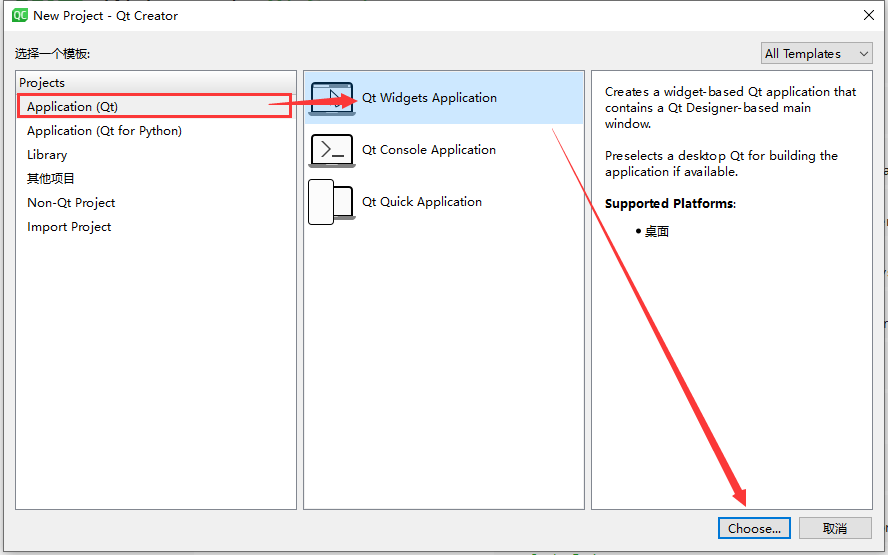
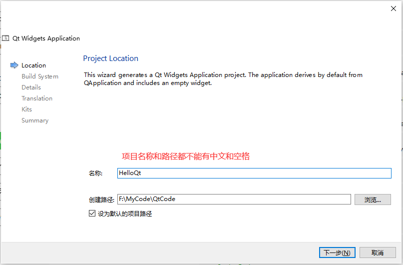
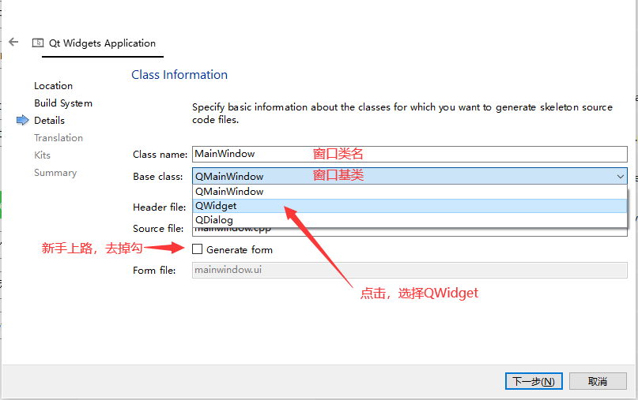

# 1.Qt介绍

Qt（官方发音 [kju:t]，音同 cute）是一个跨平台的 C++ 开发库，主要用来开发图形用户界面（Graphical User Interface，GUI）程序，当然也可以开发不带界面的命令行（Command User Interface，CUI）程序。

Qt 是纯 C++ 开发的，所以学好 C++ 非常有必要，Qt 还存在 Python、Ruby、Perl 等脚本语言的绑定， 也就是说可以使用脚本语言开发基于 Qt 的程序。开源社区就是这样，好东西就会被派生扩展，到处使用， 越来越壮大。

Qt 支持的操作系统有很多，例如通用操作系统 Windows、Linux、Unix，智能手机系统 Android、iOS、WinPhone， 嵌入式系统 QNX、VxWorks 等等。

请认准 Qt 官方网站[Qt官网](https://www.qt.io/)


## Qt 可以做什么？

Qt 虽然经常被当做一个 GUI 库，用来开发图形界面应用程序，但这并不是 Qt 的全部；Qt 除了可以绘制漂亮的界面（包括控件、布局、交互），还包含很多其它功能，比如多线程、访问数据库、图像处理、音频视频处理、网络通信、文件操作等，这些 Qt 都已经内置了。

Qt 是应用程序开发的一站式解决方案，有了 Qt，你就可以高枕无忧了！Qt 本身包含的模块也日益丰富， 一直有新模块和第三方模块加入进来。 

大部分应用程序都可以使用 Qt 实现，除了与计算机底层结合特别紧密的，例如驱动开发，它直接使用硬件提供的编程接口，而不能使用操作系统自带的函数库。

1997年，Qt 被用来开发 Linux 桌面环境 KDE，大获成功，使 Qt 成为 Linux 环境下开发 C++ GUI 程序的事实标准。

下面的程序都使用 Qt 开发：WPS、YY语音、Skype、豆瓣电台、虾米音乐、淘宝助理、千牛、暴雪的战网客户端、VirtualBox、Opera、咪咕音乐、Google地图、Adobe Photoshop Album 等。

Linux 也是嵌入式的主力军，广泛应用于消费类电子、工业控制、军工电子、电信/网络/通讯、航空航天、汽车电子、医疗设备、仪器仪表等相关行业。

Qt 虽然也支持手机操作系统，但是由于 Android 本身已经有 Java 和 Kotlin，iOS 本身已经有 Objective-C 和 Swift，所以 Qt 在移动端的市场份额几乎可以忽略。

总起来说，Qt 主要用于桌面程序开发和嵌入式开发。

## Qt 的辛酸史

说到 Qt 的发展史，那真是一波三折，几经卖身。

Qt 最早是 1991 年由挪威的 Eirik Chambe-Eng 和 Haavard Nord 开发的， 他们随后于 1994 年 3 月 4 号正式成立奇趣科技公司（Trolltech）。Qt 原本是商业授权的跨平台开发库， 在 2000 年奇趣科技公司为开源社区发布了遵循 GPL（GNU General Public License）许可证的开源版本。

在 2008 年，诺基亚公司收购了奇趣科技公司，并增加了 LGPL（GNU Lesser General Public License）的授权模式。诺基亚联合英特尔利用 Qt 开发了全新的智能手机系统 MeeGo，可惜遭遇了微软木马屠城，诺基亚被迫放弃了 MeeGo， 而 Qt 商业授权业务也于 2011 年 3 月出售给了芬兰 IT 服务公司 Digia。


当然好消息是 Digia 于 2014 年 9 月宣布成立 Qt Company 全资子公司，独立运营 Qt 商业授权业务。目前 Qt 公司大力推广移动平台开发和商业应用， 总的来说 Qt 历经曲折，现在算是步入正轨了。

经过 30 多年的发展，Qt 已经成为最优秀的跨平台开发框架之一，在各行各业的项目开发中得到广泛应用。

> 永远不要忽视微软帝国的威胁，作为软件业的一代霸主，任何人都不要天真地试图和它做朋友，因为霸主不可能有朋友。微软的[木马屠城](https://business.sohu.com/20130903/n385756364.shtml)是所有诺基亚人和芬兰人的痛，希望读者们都记牢这条。

## 为什么用Qt？

用 Qt 来开发 Windows 桌面程序有以下优点：

- 简单易学：Qt 封装的很好，几行代码就可以开发出一个简单的客户端，不需要了解 Windows API。
- 资料丰富：资料丰富能够成倍降低学习成本，否则你只能去看源码，关于 DirectUI、Htmlayout、aardio 的资料就很少。
- 漂亮的界面：Qt 很容易做出漂亮的界面和炫酷的动画，而 MFC、WTL、wxWidgets 比较麻烦。
- 独立安装：Qt 程序最终会编译为本地代码，不需要其他库的支撑，而 Java 要安装虚拟机，C# 要安装 .NET Framework。
- 跨平台：如果你的程序需要运行在多个平台下，同时又希望降低开发成本，Qt 几乎是必备的。

## Qt 和 MFC

读者经常将 MFC 和 Qt 进行对比，MFC 只能应用在 Windows 平台，而 Qt 是跨平台的，一次编写，到处运行。

另外，Qt 已经封装了底层细节，学习 Qt 将会非常简单；而 MFC 只是给 Windows API 加了一层包装，不了解 Windows API 也学不好 MFC，大家普遍反映 MFC 难学。

我们不能简单地说 Qt 好还是 MFC 好，两者都有用武之地；但是初学者学习 Qt 会比较简单，不用应付那些烦人的 Windows API，很快就能开发出带有漂亮界面的应用程序。


# 2.Qt Creator

[安装文档教程](https://mp.weixin.qq.com/s/n58OskK1ldmelCnRXPgOCg)

[安装视频教程](https://www.bilibili.com/video/BV1r54y1G7m4/) 

## 安装

Qt从5.15开始，不再提供离线安装包，必须在线安装，so，先下载[在线安装程序](https://download.qt.io/archive/online_installers/4.3/)

根据不同的平台下载不同的版本，这里下载windows版本。


双击安装，然后登录Qt账户，没有的去官网注册一个


下一步之后，下面两个选择框勾上


下一步之后，等待元信息下载完成。(时间稍长可以泡个茶)


下载完成之后，点击下一步，直到选择安装文件夹为止，目录可以自己指定


然后选择组件，如下图所示


然后一直下一步，然后耐心等待安装完成即可。。


## 卸载

1，再开始菜单栏找到Qt 维护工具，并打开


2，选上下方的仅卸载，点击下一步


3，最后点击卸载，等待完成即可


## 编码问题

Qt Creator是跨平台的 Qt IDE， Qt Creator 是 Qt 被 Nokia收购后推出的一款新的轻量级集成开发环境（IDE）。此 IDE 能够跨平台运行，支持的系统包括 Linux（32 位及 64 位）、Mac OS X 以及 Windows。

+ <font color="red">使用QtCreator创建的项目目录中不能包含中文和空格</font>
+ <font color="red">QtCreator默认使用Utf8格式编码对文件字符进行编码</font>

> 为了处理汉字，程序员设计了用于简体中文的GB2312和用于繁体中文的big5。GB2312 支持的汉字太少，1995年的汉字扩展规范GBK1.0，支持了更多的汉字。2000年的 GB18030取代了GBK1.0成为了正式的国家标准。Unicode 也是一种字符编码方法，不过它是由国际组织设计，可以容纳全世界所有语言文字的编码方案。

修改Qt Creator文件编码：菜单栏->工具->选项->文本编辑器->行为->文件编码


## 主界面


## 创建项目

+ 选择项目模板



+ 填写项目名称和选择路径(<font color="red">不能包含中文和空格~不能包含中文和空格~不能包含中文和空格~</font>)



+ 定义编译系统(CMake即可)

  

+ 选择窗口类信息



+ 选择编译套件(用Qt Creator开发请选择MinGW `Minimalist GNU for Windows`)

  


## 项目文件

### main.cpp

> 主函数所在的文件

```cpp
#include "widget.h"				//生成的窗口类头文件
#include <QApplication>			//引用程序类头文件

int main(int argc, char *argv[])
{
    //创建应用程序对象, 在一个Qt项目中实例对象有且仅有一个
    // 类的作用: 检测触发的事件, 进行事件循环并处理
    QApplication a(argc, argv);	
    //创建窗口对象
    Widget w;
    //显示窗口
    w.show();
    //应用程序对象开始事件循环，保证应用程序不退出
    return a.exec();
}
```


### widget.h

> 窗口类头文件

```cpp
#ifndef WIDGET_H
#define WIDGET_H

#include <QWidget>			//Qt标准窗口类头文件

class Widget : public QWidget	//自己的类继承自Qwidget类
{
    Q_OBJECT					//使用信号与槽机制，必须包含该宏

public:
    Widget(QWidget *parent = nullptr);
    ~Widget();
};
#endif // WIDGET_H
```


### widget.cpp

> 窗口类源文件

```cpp
#include "widget.h"

Widget::Widget(QWidget *parent)
    : QWidget(parent)
{
}

Widget::~Widget()
{
}
```


### CMakeLists.txt

> Qt项目文件，注释需要用#号

```cmake
#CMake的最低版本，低于指定版本，无法生成
cmake_minimum_required(VERSION 3.5)
#指定项目名、项目版本、编程语言
project(HelloQt VERSION 0.1 LANGUAGES CXX)
#自动将当前源目录和构建目录添加到包含路径。
set(CMAKE_INCLUDE_CURRENT_DIR ON)
#自动UIC、MOC、RCC
set(CMAKE_AUTOUIC ON)
set(CMAKE_AUTOMOC ON)
set(CMAKE_AUTORCC ON)
#启用C++17标准
set(CMAKE_CXX_STANDARD 17)
#设置指定的C++标准是必须的(如果不支持C++17则无法生成)，如果不设置，或者为OFF，则指定版本不可用时，会使用上一版本。
set(CMAKE_CXX_STANDARD_REQUIRED ON)
#查找Qt库版本
find_package(QT NAMES Qt6 Qt5 REQUIRED COMPONENTS Widgets)
#查找当前Qt版本的Widgets模块
find_package(Qt${QT_VERSION_MAJOR} REQUIRED COMPONENTS Widgets)

#项目中的源文件、头文件、资源文件
set(PROJECT_SOURCES
        main.cpp
        mainwindow.cpp
        mainwindow.h
)
#如果是Qt6及以上版本
if(${QT_VERSION_MAJOR} GREATER_EQUAL 6)
    qt_add_executable(HelloQt
        MANUAL_FINALIZATION	#指示要手动终止可执行程序的生成
        ${PROJECT_SOURCES}
    )
#安卓开发    
# Define target properties for Android with Qt 6 as:
#    set_property(TARGET HelloQt APPEND PROPERTY QT_ANDROID_PACKAGE_SOURCE_DIR
#                 ${CMAKE_CURRENT_SOURCE_DIR}/android)
# For more information, see https://doc.qt.io/qt-6/qt-add-executable.html#target-creation
else()
    if(ANDROID)
        add_library(HelloQt SHARED
            ${PROJECT_SOURCES}
        )
# Define properties for Android with Qt 5 after find_package() calls as:
#    set(ANDROID_PACKAGE_SOURCE_DIR "${CMAKE_CURRENT_SOURCE_DIR}/android")
#其他Qt6以下版本使用这个
    else()
        add_executable(HelloQt
            ${PROJECT_SOURCES}
        )
    endif()
endif()
#把Qt::Widgets模块的库连接到HelloQt
target_link_libraries(HelloQt PRIVATE Qt${QT_VERSION_MAJOR}::Widgets)

set_target_properties(HelloQt PROPERTIES
    MACOSX_BUNDLE_GUI_IDENTIFIER my.example.com
    MACOSX_BUNDLE_BUNDLE_VERSION ${PROJECT_VERSION}
    MACOSX_BUNDLE_SHORT_VERSION_STRING ${PROJECT_VERSION_MAJOR}.${PROJECT_VERSION_MINOR}
    MACOSX_BUNDLE TRUE		#在 macOS 或 iOS 上将可执行文件构建为应用程序包。
    WIN32_EXECUTABLE TRUE	#在 Windows 上构建一个带有 WinMain 入口点的可执行文件。
)
#如果大于Qt6 则手动终止可执行程序的生成
if(QT_VERSION_MAJOR EQUAL 6)
    qt_finalize_executable(HelloQt)
endif()

```

CMakeLists.txt是Qt的工程文件，这个文件是给CMake用来生成Makefile用的。

如果了解makefile的人应该知道，Makefile的三个关键点就是`目标`，`依赖`，`命令`。这里也很类似。pro文件中可以指明这个Qt项目的`头文件`，`源文件`，`链接的外部库`，`目标文件名`，`模板(生成什么样的Makefile)`，`版本配置(debug/release)`等。


## 项目操作

### 添加新文件


### 打开Qt项目


**注意：**如果出现无法打开explorer.exe，则需要把路径`C:\Windows`配置到PATH系统环境变量。


## 常用快捷键

+ 运行     Ctrl + r
+ 编译     Ctrl + b
+ 注释     Ctrl + /
+ 字体缩放 Ctrl + 鼠标滚轮
+ 查找/替换 Ctrl + f
+ 整行移动   Ctrl + Shift + ↑ 或 ↓
+ 自动对齐   Ctrl + i
+ 帮助文档
  + 第一种：Qt Creator 直接查看   F1
  + 第二种：打开独立的帮助文档程序  assistant
+ 同名.h 和 .cpp 之间的切换  F4
+ 快速添加函数的定义  Alt + Enter      <span style="font-size:15px">`鼠标移动到函数申明上`</span>
+ 修改变量名，并应用到所有用到该变量的地方  Ctrl + Shift +r
+ 快速打开输出窗口 Alt + 数字键(1-8)


+ 书签功能,即在某行代码处进行标记,方便以后找到。书签也可以添加文字标注。

  + 按Ctrl + M   添加/删除书签

  + 按Ctrl + .     查找并移动到下一个标签

## 文本编辑器样式、界面颜色配置

**文本编辑器**

萝卜白菜各有所爱，如何修改QtCreator的文本编辑器样式呢？

`菜单栏->工具->选项->文本编辑器`


上面是选择系统自带的，当然也可以自己配置一个，我这配置了一个Vs白色主题的。

+ xml文件 `Visual studio white(Qt creator代码样式).xml`

+ 把该文件复制到Qt的安装目录下的->`E:\MySoftware\Qt\Tools\QtCreator\share\qtcreator\styles`目录中
+ 最后进入文本编辑器选择

**界面颜色**

选择你最喜欢的颜色和主题即可！


# 3.Visual Studio

如果没有生成ui文件的对应头文件，可以在CMakeLists.txt中添加如下命令。

```cmake
#根据ui文件生成头文件
qt_wrap_ui(QtProject "MainWindow.ui")	
#包含ui生成的头文件的目录
include_directories(CMAKE_INCLUDE_PATH ${CMAKE_BINARY_DIR})
```


# 3. Qt 模块解析

Qt把所有类按照不同功能、不同平台支持等等，划分为不同的模块，在需要的时候添加模块即可！

[Qt 所有模块](assets/xmind/QtModules.xmind)

## Qt Essentials(基础模块)

Qt Essentials定义了Qt在所有平台上的基础。它们可以在所有受支持的开发平台和测试的目标平台上使用。

基本模块对于大多数Qt应用程序来说是通用的和有用的。用于特殊用途的模块被视为附加模块，即使它在所有支持的平台上都可用。

## Qt Add-Ons

Qt Add-On模块为特定目的带来额外的价值。这些模块可能只在某些开发平台上可用。许多附加模块要么功能完整，存在向后兼容，要么只适用于某些平台。每个附加模块分别指定其兼容性承诺。


# 4.需要的C++知识

## 1.什么是C++

C++是C语言的继承，它既可以进行C语言的过程化程序设计，又可以进行以抽象数据类型为特点的基于对象的程序设计，还可以进行以继承和多态为特点的面向对象的程序设计。

## 2.如何定义一个类

```cpp
class Animal
{
public:
    Animal(const std::string& name,int age)
        :name(name),age(age)
    {

    }
    void cry()
    {
        std::cout<<name<<" "<<age<<" "<<u8"Animal cry"<<std::endl;
    }
private:
    std::string name;
    int age;
};
```

3.什么是对象，如何定义？

+ 对象是类的实例化

```cpp
Animal cat("猫",5);

Animal *dog = new Animal("dog",3);
delete dog;
```

## 4.如何访问类的成员变量

普通变量通过" . “，指针变量通过” -> "

```cpp
cat.cry();
dog->cry();
```

## 5.类的函数成员

一：在类里面声明
		二：实现这个函数，我们可以直接在类的里面写，也可以写在类的外面。

```cpp
class Animal
{
public:
    Animal(const std::string& name,int age);
    void cry();
private:
    std::string name;
    int age;
};

Animal::Animal(const std::string& name,int age)
        :name(name),age(age)
{}
void Animal::cry()
{
    std::cout<<name<<" "<<age<<" "<<u8"Animal cry"<<std::endl;
}
```

## 6.类函数的重载特性

C++允许在同一范围中声明几个功能类似的同名函数，但是这些同名函数的形式参数（指参数的个数、类型或者顺序）必须不同，这就是重载函数。重载函数常用来实现功能类似而所处理的数据类型不同的问题。不能只有函数返回值类型不同。

```cpp
class Animal
{
public:
	...
    void cry()
    {
        std::cout<<name<<" "<<age<<" "<<u8"Animal cry"<<std::endl;
    }
    void cry(int count)
    {
        for(int i=0;i<count;i++)
        {
            std::cout<<i<<"->"<<name<<" "<<age<<" "<<u8"Animal cry"<<std::endl;
        }
    }
private:
	...
};
```

## 7.构造函数和析构函数

构造函数：定义对象时会调用构造函数

析构函数：生命周期结束或者释放对象时，会调用析构函数	
**特点**

+ 构造函数和析构函数的函数名和类名一样，能够重载；没有返回类型申明
+ 析构函数在名字前面加~，析构函数不能被重载；没有返回类型申明

**匿名对象**

**深、浅拷贝**

**移动语义**


## 8.类的继承

类的继承允许我们在新的类里面继承父类的public和protected部分。

```cpp
class Snake:public Animal
{
public:
    using Animal::Animal;
    Snake(int age)
        :Animal("snake",age)
    {

    }
};
```

## 9.虚函数和纯虚函数

虚函数：有实际定义的，允许派生类对他进行覆盖式的替换，virtual修饰。
纯虚函数：没有实际定义的虚函数就是纯虚函数,子类必须自己实现。

虚函数的优点是可以预留接口(API)。

## 10.lambda表达式

Lambda 表达式（lambda expression）是一个匿名函数，Lambda表达式基于数学中的λ演算得名，直接对应于其中的lambda抽象（lambda abstraction），是一个匿名函数，即没有函数名的函数。

基本语法：

```cpp
[capture list] (parameter list)mutable/noexcept -> return type { function body }
/*
capture list		参数捕获列表
parameter list 		形参列表(可省略)
mutable/noexcept	选项	  (可省略)
	·mutable	可以修改按值传递进来的拷贝（注意是能修改拷贝，而不是值本身）
	·noexcept	表示函数不抛异常
-> return type		尾置返回类型(可省略)
function body		函数体
*/
```

+ **capture list**		参数捕获列表
  + `[] `	不捕捉任何变量
  + `[&] `  捕获外部作用域中所有变量, 并作为引用在函数体内使用 (`按引用捕获`)
  + `[=] `  捕获外部作用域中所有变量, 并作为副本在函数体内使用 (`按值捕获`)
    - 拷贝的副本在匿名函数体内部是只读的
  + `[=, &foo]`   按值捕获外部作用域中所有变量, 并按照引用捕获外部变量 foo
  + `[bar]`   按值捕获 bar 变量, 同时不捕获其他变量
  + `[&bar]`   按值捕获 bar 变量, 同时不捕获其他变量
  + `[this]`   捕获当前类中的this指针
    - 让lambda表达式拥有和当前类成员函数同样的访问权限
    - 如果已经使用了 & 或者 =, 默认添加此选项
+ **parameter list** 		形参列表(可省略)
+ **mutable/noexcept**	选项	  (可省略)
  + mutable	可以修改按值传递进来的拷贝（注意是能修改拷贝，而不是值本身）
  + noexcept	表示函数不抛异常
+ **-> return type**		尾置返回类型(可省略)
+ **function body**		函数体

