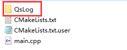

# 1. 基础类型

因为Qt是一个C++框架, 因此C++中所有的语法和数据类型在Qt中都是被支持的, 但是Qt中也定义了一些属于自己的数据类型, 下边给大家介绍一下这些基础的数类型。

Qt基本数据类型定义在`#include <QtGlobal>` 中，Qt基本数据类型有：

| 类型名称   | 注释                                         | 备注                                                         |
| ---------- | -------------------------------------------- | ------------------------------------------------------------ |
| qint8      | signed char                                  | 有符号8位数据                                                |
| qint16     | signed short                                 | 16位数据类型                                                 |
| qint32     | signed short                                 | 32位有符号数据类型                                           |
| qint64     | long long int 或(__int64)                    | 64位有符号数据类型，Windows中定义为__int64                   |
| qintptr    | qint32 或 qint64                             | 指针类型 根据系统类型不同而不同，32位系统为qint32、64位系统为qint64 |
| qlonglong  | long long int 或(__int64)                    | Windows中定义为__int64                                       |
| qptrdiff   | qint32 或 qint64                             | 根据系统类型不同而不同，32位系统为qint32、64位系统为qint64   |
| qreal      | double 或 float                              | 除非配置了-qreal float选项，否则默认为double                 |
| quint8     | unsigned char                                | 无符号8位数据类型                                            |
| quint16    | unsigned short                               | 无符号16位数据类型                                           |
| quint32    | unsigned int                                 | 无符号32位数据类型                                           |
| quint64    | unsigned long long int 或 (unsigned __int64) | 无符号64比特数据类型，Windows中定义为unsigned __int64        |
| quintptr   | quint32 或 quint64                           | 根据系统类型不同而不同，32位系统为quint32、64位系统为quint64 |
| qulonglong | unsigned long long int 或 (unsigned __int64) | Windows中定义为__int64                                       |
| uchar      | unsigned char                                | 无符号字符类型                                               |
| uint       | unsigned int                                 | 无符号整型                                                   |
| ulong      | unsigned long                                | 无符号长整型                                                 |
| ushort     | unsigned short                               | 无符号短整型                                                 |
| qsizetype  | size_t                                       |                                                              |


# 2. log输出

> 在Qt中进行log输出, 一般不使用c中的`printf`, 也不是使用C++中的`cout`, Qt框架提供了专门用于日志输出的类, 头文件名为 `QDebug`。

## 基本分类

+ qDebug：调试信息提示
+ qInfo     ：输出信息
+ qWarning ：一般的警告提示
+ qCritical ：严重的错误提示
+ qFatal ：致命错误提示，会直接中断程序

**C风格输出**

```cpp
qDebug("我是%s，今年%d岁了~","maye",20);
qInfo("maye%d",666);
qWarning("hello %s","warning");
qCritical("helo %s","critical");
qFatal("hello %s","qFatal");		//致命错误会直接中断程序
```

**C++风格**

```cpp
qDebug()<<"好帅"<<endl;
qInfo()<<"qInfo"<<endl;
qWarning()<<"qWarnning"<<endl;
qCritical()<<"qCritical"<<endl;
#qFatal()<<"qFatal"<<endl;			//致命错误不能用<<输出
```

## 格式化日志

默认情况下，日志格式是只输出对应的日志内容没有额外信息的。我们可以通过修改环境变量QT_MESSAGE_PATTERN或者调用方法 qSetMessagePattern来修改日志的输出格式。日志格式中常用的占位符号如下所示:

```shell
%{appname}     应用程序的名称(QCoreApplication::applicationName())
%{category}    日志所处的领域
%{file}        打印该日志的文件路径 
%{function}    打印日志的函数
%{line}        打印日志在文件中的行数
%{message}     日志的内容
%{pid}         打印日志的程序的PID(QCoreApplication::applicationPid())
%{threadid}    打印日志的线程ID
%{qthreadptr}  打印日志的线程指针
%{type}        日志级别("debug", "warning", "critical" or "fatal")
%{time process}日志发生时程序启动了多久
%{time boot}   日志发生时系统启动了多久
%{time [format]}以固定时间格式输出日志打印的时间，默认为QISODate格式
```

### 普通格式化

格式化日志方法如下：

```cpp
int main(int argc, char *argv[])
{
    QApplication a(argc, argv);

	qSetMessagePattern("%{time yyyy-MM-dd hh:mm:ss} [%{type}] %{file} [%{function}(%{line})]  %{message}");
    qInfo()<<"info";
    qDebug()<<"debug";
    qWarning()<<"warning";
    qCritical()<<"Critical";

    return a.exec();
}
```

输出的日志内容如下：

```css
2023-09-23 15:57:30 [info] F:/Downloads/QtFirstPro/main.cpp [qMain(43)]  info
2023-09-23 15:57:30 [debug] F:/Downloads/QtFirstPro/main.cpp [qMain(44)]  debug
2023-09-23 15:57:30 [warning] F:/Downloads/QtFirstPro/main.cpp [qMain(45)]  warning
2023-09-23 15:57:30 [critical] F:/Downloads/QtFirstPro/main.cpp [qMain(46)]  Critical
```

注意：在Release模式下，文件名、函数名、行号获取不到，需要添加编译时宏`QT_MESSAGELOGCONTEXT`


### 条件格式化

在消息参数中还可以使用条件，给不同级别的日志指定不同的格式，语法如下：

```
%{if-<debug | info | warning | critical | fatal>} ... %{endif}
```

比如，只想在debug级别下输出文件名、函数名以及行号，代码格式如下：

```cpp
 qSetMessagePattern("%{time yyyy-MM-dd hh:mm:ss} [%{type}] %{if-debug}%{file}%{endif} %{if-} [%{function}(%{line})]  %{message}");
```

### 环境变量设置格式化

模式也可以在运行时通过设置QT_MESSAGE_PATTERN环境变量来更改；

如果调用了qSetMessagePattern()并且设置了QT_MESSAGE_PATTERN，则环境变量优先。

```cpp
qputenv("QT_MESSAGE_PATTERN", QByteArray("%{time yyyy-MM-dd hh:mm:ss} [%{type}] %{file} [%{function}(%{line})]  %{message}"));
```

## 日志输出位置

QT默认的日志内容是输出到终端的，不会输出到文件里面，如果需要将日志内容输出到文件中我们需要通过qInstallMessageHandler设置日志信息处理函数。使用方法如下:

```cpp
#include <QApplication>
#include <QFile>
#include <QTextStream>
//日志消息的处理函数
void logmessageHander(QtMsgType type, const QMessageLogContext& context, const QString& message)
{
    //获取格式化的日志信息
    QString typeStr = qFormatLogMessage(type,context,message);
    //可以根据日志的级别进行过滤（比如不想要Debug输出，可以直接reutrn）
    QString levelText;
    switch (type) {
    case QtDebugMsg:
        levelText = "Debug";
       	//return;	//加上return之后就不会打印debug日志了          
        break;
    case QtInfoMsg:
        levelText = "Info";
        break;
    case QtWarningMsg:
        levelText = "Warning";
        break;
    case QtCriticalMsg:
        levelText = "Critical";
        break;
    case QtFatalMsg:
        levelText = "Fatal";
        break;
    }
    QFile file("myapp.log");
    file.open(QIODevice::WriteOnly | QIODevice::Append);
    QTextStream textStream(&file);
    textStream << typeStr << "\n";
}
int main(int argc,char*argv[])
{
    QCoreApplication app(argc, argv);
    qSetMessagePattern("%{time yyyy-MM-dd hh:mm:ss} [%{type}]%{if-warning}[%{function}]%{endif}%{if-fatal}[%{function}--%{line}]%{endif}:%{message}");
    qInstallMessageHandler(logmessageHander);
    qDebug() << "debuginfo occured";
    qInfo() <<  "call other function";
    qWarning() << "doesn't work";
    qFatal("fatal error");
    return app.exec();
}
```

如果需要关闭日志输出，取消之前注册的日志处理函数，我们可以调用`qInstallMessageHandler(nullptr);`

## 日志输出对象信息

在调试一些复杂对象的时候，我们需要输出对象的成员信息到日志当中。但是默认情况下qt的日志库是不支持输出自定义对象的。这时候我们可以通过重写操作符实现对自定义象的日志输出。使用方法如下:

```cpp
class Person
{
public:
    QString name;
    quint8   age;
    
    inline friend QDebug operator<<(QDebug debug,const Person& person)
    {
        debug<<"Person("<<person.name<<","<<person.age<<")";
        return debug;
    }
};

int main(int argc,char*argv[])
{
    QCoreApplication app(argc, argv);

    Person person{"maye",18};
    qDebug()<<person;

    return app.exec();
}
```

## 禁用输出

在开发或者调试时，我们必须借助日志来进行判断，但是当程序需要发布时，调试的日志信息将不再需要，此时如果把代码删除，又不太方便，万一出bug了，又需要调试了呢？

所以Qt提供了禁用`qInfo`、`qWarning`、`qDebug`输出的宏，`qCritical`、`qFatal`是错误不能屏蔽！

在CMakeLists.txt文件中添加如下三行，即可禁用`qInfo`、`qWarning`、`qDebug`的输出。

```cmake
add_compile_definitions(QT_NO_INFO_OUTPUT)
add_compile_definitions(QT_NO_DEBUG_OUTPUT)
add_compile_definitions(QT_NO_WARNING_OUTPUT)
#或
add_compile_definitions(
    QT_NO_INFO_OUTPUT
    QT_NO_DEBUG_OUTPUT
    QT_NO_WARNING_OUTPUT)
```

可根据需要进行添加！

## QsLog日志库

QsLog是一个基于Qt的QDebug类的易于使用的记录器。QsLog是在MIT许可下以开源形式发布的。

[QsLog Github下载](https://github.com/victronenergy/QsLog)，可能访问不了，已经提前准备好了[源码](./QsLog)！

QsLog的特征：

- 六个日志级别(从跟踪到致命)；
- 运行时可配置的日志级别阈值；
- 关闭日志记录时的最小开销；
- 支持多个目标，附带文件和调试目标；
- 线程安全
- 支持现成的常见Qt类型的日志记录；
- 小依赖：直接把它放到你的项目中。

### 使用方法

1，将QsLog目录直接拷贝到项目`CMakeList.txt`同级目录中~



2，打开项目`CMakeLists.txt`文件，输入如下代码

```cmake
#添加子目录
add_subdirectory(./QsLog)
#把QsLog库链接到目标 QsLog_test
target_link_libraries(QsLog_test Qt${QT_VERSION_MAJOR}::Core QsLog)
```

3，然后进行日志记录器的配置

```cpp
#include <QCoreApplication>
#include "QsLog/QsLog.h"
int main(int argc, char *argv[])
{
    QCoreApplication a(argc, argv);

    using namespace QsLogging;

    //1,获取日志单例
    Logger &logger = Logger::instance();
    logger.setLoggingLevel(Level::DebugLevel);

    //2,添加两个日志输出目的地
    DestinationPtr file_dest(DestinationFactory::MakeFileDestination("log.txt"));
    DestinationPtr console_dest(DestinationFactory::MakeDebugOutputDestination());

    logger.addDestination(file_dest);
    logger.addDestination(console_dest);

    //3,开始日志记录
    QLOG_DEBUG()<<"Pragam started";

    return a.exec();
}
```

4，运行程序，控制台会输出一次，指定的文件里面也会有一条日志记录。日志内容如下：

```css
DEBUG 2023-09-23T18:51:39.382 Pragam started
```

输出的日志记录默认是没有文件名和行号的，如果需要，在CMakeLists.txt添加宏定义即可！

```cmake
#开启行号
add_compile_definitions(QS_LOG_LINE_NUMBERS)
```

5，如果要禁用日志输出，则定义宏`QS_LOG_DISABLE`即可！


# 3. 字符串类型

> C     => `char*`
>
> C++ => `std::string`
>
> Qt	=> `QByteArray`, `QString`

## 3.1 QByteArray

> 在Qt中`QByteArray`可以看做是C语言中 `char*`的升级版本。我们在使用这种类型的时候可通过这个类的构造函数申请一块动态内存，用于存储我们需要处理的字符串数据。
>
> 下面给大家介绍一下这个类中常用的一些API函数，`大家要养成遇到问题主动查询帮助文档的好习惯`

- 构造函数

  ```c++
  // 构造空对象, 里边没有数据
  QByteArray::QByteArray();
  // 将data中的size个字符进行构造, 得到一个字节数组对象
  // 如果 size==-1 函数内部自动计算字符串长度, 计算方式为: strlen(data)
  QByteArray::QByteArray(const char *data, int size = -1);
  // 构造一个长度为size个字节, 并且每个字节值都为ch的字节数组
  QByteArray::QByteArray(int size, char ch);
  ```

  

- 数据操作

  ```c++
  // 其他重载的同名函数可参考Qt帮助文档, 此处略
  QByteArray &QByteArray::append(const QByteArray &ba);
  void QByteArray::push_back(const QByteArray &other);
  
  // 其他重载的同名函数可参考Qt帮助文档, 此处略
  QByteArray &QByteArray::prepend(const QByteArray &ba);
  void QByteArray::push_front(const QByteArray &other);
  
  // 插入数据, 将ba插入到数组第 i 个字节的位置(从0开始)
  // 其他重载的同名函数可参考Qt帮助文档, 此处略
  QByteArray &QByteArray::insert(int i, const QByteArray &ba);
  
  // 删除数据
  // 从大字符串中删除len个字符, 从第pos个字符的位置开始删除
  QByteArray &QByteArray::remove(int pos, int len);
  // 从字符数组的尾部删除 n 个字节
  void QByteArray::chop(int n);
  // 从字节数组的 pos 位置将数组截断 (前边部分留下, 后边部分被删除)
  void QByteArray::truncate(int pos);
  // 将对象中的数据清空, 使其为null
  void QByteArray::clear();
  
  // 字符串替换
  // 将字节数组中的 子字符串 before 替换为 after
  // 其他重载的同名函数可参考Qt帮助文档, 此处略
  QByteArray &QByteArray::replace(const QByteArray &before, const QByteArray &after);
  ```
  
- 子字符串查找和判断

  ```c++
  // 判断字节数组中是否包含子字符串 ba, 包含返回true, 否则返回false
  bool QByteArray::contains(const QByteArray &ba) const;
  bool QByteArray::contains(const char *ba) const;
  // 判断字节数组中是否包含子字符 ch, 包含返回true, 否则返回false
  bool QByteArray::contains(char ch) const;
  
  // 判断字节数组是否以字符串 ba 开始, 是返回true, 不是返回false
  bool QByteArray::startsWith(const QByteArray &ba) const;
  bool QByteArray::startsWith(const char *ba) const;
  // 判断字节数组是否以字符 ch 开始, 是返回true, 不是返回false
  bool QByteArray::startsWith(char ch) const;
  
  // 判断字节数组是否以字符串 ba 结尾, 是返回true, 不是返回false
  bool QByteArray::endsWith(const QByteArray &ba) const;
  bool QByteArray::endsWith(const char *ba) const;
  // 判断字节数组是否以字符 ch 结尾, 是返回true, 不是返回false
  bool QByteArray::endsWith(char ch) const;
  ```

  

- 遍历

  ```c++
  // 使用迭代器
  iterator QByteArray::begin();
  iterator QByteArray::end();
  
  // 使用数组的方式进行遍历
  // i的取值范围 0 <= i < size()
  char QByteArray::at(int i) const;
  char QByteArray::operator[](int i) const;
  
  ```

  

- 查看字节数

  ```c++
  // 返回字节数组对象中字符的个数
  int QByteArray::length() const;
  int QByteArray::size() const;
  int QByteArray::count() const;
  
  // 返回字节数组对象中 子字符串ba 出现的次数
  int QByteArray::count(const QByteArray &ba) const;
  int QByteArray::count(const char *ba) const;
  // 返回字节数组对象中 字符串ch 出现的次数
  int QByteArray::count(char ch) const;
  ```

- 类型转换

  ```c++
  // 将QByteArray类型的字符串 转换为 char* 类型
  char *QByteArray::data();
  const char *QByteArray::data() const;
  
  // int, short, long, float, double -> QByteArray
  // 其他重载的同名函数可参考Qt帮助文档, 此处略
  QByteArray &QByteArray::setNum(int n, int base = 10);
  QByteArray &QByteArray::setNum(short n, int base = 10);
  QByteArray &QByteArray::setNum(qlonglong n, int base = 10);
  QByteArray &QByteArray::setNum(float n, char f = 'g', int prec = 6);
  QByteArray &QByteArray::setNum(double n, char f = 'g', int prec = 6);
  [static] QByteArray QByteArray::number(int n, int base = 10);
  [static] QByteArray QByteArray::number(qlonglong n, int base = 10);
  [static] QByteArray QByteArray::number(double n, char f = 'g', int prec = 6);
  
  // QByteArray -> int, short, long, float, double
  int QByteArray::toInt(bool *ok = Q_NULLPTR, int base = 10) const;
  short QByteArray::toShort(bool *ok = Q_NULLPTR, int base = 10) const;
  long QByteArray::toLong(bool *ok = Q_NULLPTR, int base = 10) const;
  float QByteArray::toFloat(bool *ok = Q_NULLPTR) const;
  double QByteArray::toDouble(bool *ok = Q_NULLPTR) const;
  
  // std::string -> QByteArray
  [static] QByteArray QByteArray::fromStdString(const std::string &str);
  // QByteArray -> std::string
  std::string QByteArray::toStdString() const;
  
  // 所有字符转换为大写
  QByteArray QByteArray::toUpper() const;
  // 所有字符转换为小写
  QByteArray QByteArray::toLower() const;
  ```

  

## 3.2 QString

> QString也是封装了字符串, 但是内部的编码为`utf8`, UTF-8属于Unicode字符集, 它固定使用多个字节（window为2字节, linux为3字节）来表示一个字符，这样可以将世界上几乎所有语言的常用字符收录其中。
>
> 下面给大家介绍一下这个类中常用的一些API函数。

### 构造函数

```c++
// 构造一个空字符串对象
QString();
// 将 char* 字符串 转换为 QString 类型
QString(const char *str);
// 将 QByteArray 转换为 QString 类型
QString(const QByteArray &ba);
// 其他重载的同名构造函数可参考Qt帮助文档, 此处略
```


### 数据操作

```c++
// 尾部追加数据
QString& append(const QString &str);
QString& append(const char *str);
QString& append(const QByteArray &ba);
void push_back(const QString &other);

// 头部添加数据
QString& prepend(const QString &str);
QString& prepend(const char *str);
QString& prepend(const QByteArray &ba);
void QString::push_front(const QString &other);

// 插入数据, 将 str 插入到字符串第 position 个字符的位置(从0开始)
QString& insert(int position, const QString &str);
QString& insert(int position, const char *str);
QString& insert(int position, const QByteArray &str);

// 删除数据
// 从大字符串中删除len个字符, 从第pos个字符的位置开始删除
QString& remove(int position, int n);

// 从字符串的尾部删除 n 个字符
void  chop(int n);
// 从字节串的 position 位置将字符串截断 (前边部分留下, 后边部分被删除)
void  truncate(int position);
// 将对象中的数据清空, 使其为null
void  clear();

// 字符串替换
// 将字节数组中的 子字符串 before 替换为 after
// 参数 cs 为是否区分大小写, 默认区分大小写
QString& replace(const QString &before, const QString &after, Qt::CaseSensitivity cs = Qt::CaseSensitive);
```

### 子字符串查找和判断

```c++
// 参数 cs 为是否区分大小写, 默认区分大小写
// 其他重载的同名函数可参考Qt帮助文档, 此处略

// 判断字符串中是否包含子字符串 str, 包含返回true, 否则返回false
bool  contains(const QString &str, Qt::CaseSensitivity cs = Qt::CaseSensitive) const;

// 判断字符串是否以字符串 ba 开始, 是返回true, 不是返回false
bool startsWith(const QString &s, Qt::CaseSensitivity cs = Qt::CaseSensitive) const;

// 判断字符串是否以字符串 ba 结尾, 是返回true, 不是返回false
bool endsWith(const QString &s, Qt::CaseSensitivity cs = Qt::CaseSensitive) const;
```

### 遍历

```c++
// 使用迭代器
iterator  begin();
iterator  end();

// 使用数组的方式进行遍历
const QChar  at(int position) const
const QChar  operator[](int position) const;
```

### 查看字节数

```c++
// 返回字节数组对象中字符的个数
int  length() const;
int  size() const;
int  count() const;

// 返回字节串对象中 子字符串 str 出现的次数
// 参数 cs 为是否区分大小写, 默认区分大小写
int  count(const QStringRef &str, Qt::CaseSensitivity cs = Qt::CaseSensitive) const;
```

### 类型转换

```c++
// int, short, long, float, double -> QString
// 其他重载的同名函数可参考Qt帮助文档, 此处略
QString& setNum(int n, int base = 10);
QString& setNum(short n, int base = 10);
QString& setNum(long n, int base = 10);
QString& setNum(float n, char format = 'g', int precision = 6);
QString&QString::setNum(double n, char format = 'g', int precision = 6);
[static] QString QString::number(long n, int base = 10);
[static] QString QString::number(int n, int base = 10);
[static] QString QString::number(double n, char format = 'g', int precision = 6);

// QString -> int, short, long, float, double
int QString::toInt(bool *ok = Q_NULLPTR, int base = 10) const;
short QString::toShort(bool *ok = Q_NULLPTR, int base = 10) const;
long QString::toLong(bool *ok = Q_NULLPTR, int base = 10) const
float QString::toFloat(bool *ok = Q_NULLPTR) const;
double QString::toDouble(bool *ok = Q_NULLPTR) const;


// 所有字符转换为大写
QString QString::toUpper() const;
// 所有字符转换为小写
QString QString::toLower() const;
```

### 字符串格式化

C语言中有sprintf()函数，QString也提供了一个asprintf()函数。

```cpp
 QString res =  asprintf("fileName:%s size:%d","./av.jpg",20);
 qDebug()<<res<<endl;
```

不过QString还提供的另一种格式化字符串输出的函数arg()，更为方便。

```c++
QString arg(const QString &a, int fieldWidth = 0, QChar fillChar = QLatin1Char( ' ' )) const;
QString arg(int a, int fieldWidth = 0, int base = 10, QChar fillChar = QLatin1Char( ' ' )) const;
//用于填充字符串中的%1,%2…为给定格式的整形数字，其中第一个参数是要填充的数字，第二个参数为最小宽度，第三个参数为进制，第四个参数为当原始数字长度不足最小宽度时用于填充的字符

// 示例程序
QString str =  QString("%1 %2 %3").arg(1).arg(2);
str = str.arg("hello");
qDebug()<<str<<endl;     //"hello 2 1"

QString text = QString("%1:%2:%3").arg(1,2,10,QChar('0')).arg(35).arg(59);
qDebug()<<text<<endl;    //"01:35:59"
```

## 3.2 不同字符串类型相互转换

```cpp
// std::string -> QString
[static] QString QString::fromStdString(const std::string &str);
// QString -> std::string
std::string QString::toStdString() const;

#QString -> QByteArray
// 转换为本地编码, 跟随操作系统
QByteArray QString::toLocal8Bit() const;
// 转换为 Latin-1 编码的字符串 不支持中文
QByteArray QString::toLatin1() const;
// 转换为 utf8 编码格式的字符串 (常用)
QByteArray QString::toUtf8() const;

#QByteArray -> QString
//使用QString的构造函数即可
```


# 4. QVariant

> QVariant(变体数据类型)这个类很神奇，或者说方便。很多时候，需要几种不同的数据类型需要传递，如果用结构体，又不大方便，容器保存的也只是一种数据类型，而QVariant则可以统统搞定。
>
> QVariant 这个类型充当着最常见的数据类型的联合。QVariant 可以保存很多Qt的数据类型，包括`QBrush、QColor、QCursor、QDateTime、QFont、QKeySequence、 QPalette、QPen、QPixmap、QPoint、QRect、QRegion、QSize和QString`，并且还有C++基本类型，如` int、float`等。

## 4.1 标准类型

- 将标准类型转换为QVariant类型

```c++
// 这类转换需要使用QVariant类的构造函数, 由于比较多, 大家可自行查阅Qt帮助文档, 在这里简单写几个
QVariant(int val);
QVariant(bool val);
QVariant(double val);
QVariant(const char *val);
QVariant(const QByteArray &val);
QVariant(const QString &val);
......
    
// 使用设置函数也可以将支持的类型的数据设置到QVariant对象中
// 这里的 T 类型, 就是QVariant支持的类型
void setValue(const T &value);
// 该函数行为和 setValue() 函数完全相同
[static] QVariant fromValue(const T &value);
```

**Exmple**

```cpp
QVariant v(5);

QVariant v;
v.setValue(5);

QVariant v = QVariant::fromValue(5);

int i = v.toInt();          // i is now 5
QString s = v.toString();   // s is now "5"
```

- 判断 QVariant中封装的实际数据类型

> Type 是枚举类型

```c++
//获取类型，返回的是一个枚举类型;如QVariant::Int ...
Type type() const;
//获取类型名
const char *typeName() const;
//根据类型id(枚举)获取类型名(字符串)
[static] const char *typeToName(int typeId);
//根据类型名(字符串)获取类型id(枚举)
[static] Type nameToType(const char *name);
```


- 将QVariant对象转换为实际的数据类型

```c++
//在转换之前可以先判断能够转换成对应的类型
bool canConvert(int targetTypeId) const
bool canConvert() const

bool 		toBool() const;
QByteArray 	toByteArray() const;
double 		toDouble(bool *ok = Q_NULLPTR) const;
float 		toFloat(bool *ok = Q_NULLPTR) const;
int 		toInt(bool *ok = Q_NULLPTR) const;
QString 	toString() const;
......

T value() const
//v.value<int>();       
```


## 4.2 自定义类型

> 除了标准类型, 我们自定义的类型也可以使用`QVariant`类进行封装, `被QVariant存储的数据类型需要有一个默认的构造函数和一个拷贝构造函数`。为了实现这个功能，首先必须使用`Q_DECLARE_METATYPE()`宏。通常会将这个宏放在类的声明所在头文件的下面， 原型为： 
>
> `Q_DECLARE_METATYPE(Type)`
>
> 使用的具体步骤如下: 

- 第一步: 定义类型，并注册

  ```c++
  //自定义类型
  class Animal
  {
  public:
      Animal(){}  //必须要有默认构造函数
                  //拷贝构造函数也必须有，不过没有深、浅拷贝时，用默认的即可
      Animal(QString name):_name(name){}
      void show()
      {
          qDebug()<<"Animal show name is :"<< _name <<endl;
      }
  private:
      QString _name;
  };
  //自定义类型注册
  Q_DECLARE_METATYPE(Animal);
  ```

- 第二步: 使用forvalue()存储对象

  ```c++
  int main()
  {
      //QVariant vt(Animal("snake"));	//不可以通过构造函数存自定义类型
      QVariant vt;
      //有以下两种方法可以，存自定义类型
      vt = QVariant::fromValue(Animal("dog"));	//①
      vt.setValue(Animal("cat"));					//②
      //如果能转换到Animal类型，就转换
      if(vt.canConvert<Animal>())
      {
          Animal animal = vt.value<Animal>();
          animal.show();
      }
  	return 0;
  }
  ```

操作涉及的API如下:

```c++
// 如果当前QVariant对象可用转换为对应的模板类型 T, 返回true, 否则返回false
bool canConvert() const;
// 将当前QVariant对象转换为实际的 T 类型
T value() const;
```


