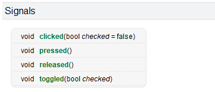
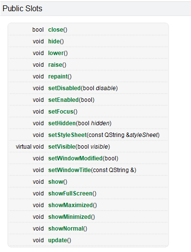

# 1. 信号和槽概述

信号槽是 Qt 框架引以为豪的机制之一。所谓信号槽，实际就是观察者模式(发布-订阅模式)。当某个`事件`发生之后，比如，按钮检测到自己被点击了一下，它就会发出一个信号（signal）。这种发出是没有目的的，类似广播。如果有对象对这个信号感兴趣，它就会使用连接（connect）函数，意思是，将想要处理的信号和自己的一个函数（称为槽（slot））绑定来处理这个信号。也就是说，当信号发出时，被连接的槽函数会自动被回调。这就类似观察者模式：当发生了感兴趣的事件，某一个操作就会被自动触发。

信号和槽是Qt特有的信息传输机制，是Qt设计程序的重要基础，它可以让互不干扰的对象建立一种联系。

## 1.1 信号的本质

当对象的内部状态发生改变，信号就被发射。信号是一个特殊的函数，只需要声明不需要自己实现。

举个简单的例子:

女朋友感觉到自己肚子饿了：就对你说"宝，我饿了"。

上面例子中对你说的话，其实就是一个信号，至于如何处理就看你的了。


## 1.2 槽的本质

槽（Slot）就是对信号响应的函数。槽就是一个函数，与一般的C++函数是一样的，可以定义在类的任何部分（public、private或 protected），可以具有任何参数，可以被重载，也可以被直接调用(但是不能有默认参数)。唯一区别的是：槽可以与信号连接在一起，每当和槽连接的信号被发射的时候，就会调用这个槽。

举个简单的例子：

女朋友说：“我肚子饿了！”，于是我带她去吃饭。

上边例子中相当于女朋友发出了一个信号， 我收到了信号并其将其处理掉了。

- 女朋友 -> 发送信号的对象, 信号内容: 我饿了
- 我 -> 接收信号的对象并且处理掉了这个信号, 处理动作: 带她去吃饭

## 1.3 信号和槽的关系

在Qt中信号和槽函数都是独立的个体，本身没有任何联系，但是由于某种特性需求我们可以将二者连接到一起，好比牛郎和织女想要相会必须要有喜鹊为他们搭桥一样。

信号与槽关联是用 QObject::connect() 函数实现的，其基本格式是：

```cpp
[static] QMetaObject::Connection  QObject::connect(
    const QObject *sender, 								
    const char *signal, 								
    const QObject *receiver, 							
    const char *method, 								
    Qt::ConnectionType type = Qt::AutoConnection);	
```

- **参数:**
  - **sender**: 发出信号的对象
  - **signal**: sender对象的信号，信号是一个函数
  - **receiver**: 信号接收者
  - **method**: receiver对象的槽函数, 当检测到sender发出了signal信号, receiver对象调用method方法

` connect函数相对于做了信号处理动作的注册,调用conenct连接信号与槽时，sender对象的信号并没有产生, 因此receiver对象的method也不会被调用,method槽函数本质是一个回调函数, 调用的时机是信号产生之后。 调用槽函数是Qt框架来执行的,connect中的sender和recever两个指针必须被实例化了, 否则conenct不会成功`。

# 2. 标准信号/槽

在Qt提供的很多类中都可以对用户触发的某些特定事件进行检测,  当事件被触发后就会产生对应的信号, 这些信号都是Qt类内部自带的, 因此称之为标准信号。

同样的，在Qt的很多类内部为我了提供了很多功能函数，并且这些函数也可以作为触发的信号的处理动作，有这类特性的函数在Qt中称之为标准槽函数。

## 2.1 查找标准信号与槽

系统自带的信号和槽通常如何查找呢，这个就需要利用帮助文档了，在帮助文档中比如我们上面的按钮的点击信号，在帮助文档中输入QPushButton，首先我们可以在`Contents`中寻找关键字 `signals`，信号的意思，但是我们发现并没有找到，这时候我们应该看当前类从父类继承下来了哪些信号，因此我们去他的父类QAbstractButton中就可以找到该关键字，点击signals索引到系统自带的信号有如下几个。

+ QPushButton的信号



+ QWidget的槽



## 2.2 使用标准信号与槽

信号与槽都是独立的，必须使用`QObject::connect()`函数，让信号与槽建立关联。

我们先在窗口上放一个按钮，然后实现点击按钮，关闭窗口的功能。

- 按钮: 信号发出者 -> `QPushButton`
- 窗口: 信号的接收者和处理者 -> `QWidget`

```cpp
QObject::connect(btn,&QPushButton::clicked,this,&MainWindow::close);
```

### 关联规则

当然，不是所有的槽都可以和信号建立关联的，必须遵守一些规则：

+ 一般情况下槽函数的参数应该和信号的参数的个数和类型一一对应
+ 信号的参数可以大于等于槽函数的参数个数，未被槽函数接受的参数会被忽略
  + signal：void QPushButton::clicked(bool checked = false)
  + slot：bool QWidget::close()
  + 对于上面两个信号和槽来说，槽函数没有接受信号传递的参数，则这个bool类型的参数被忽略。


# 3. 自定义槽

> 槽函数就是信号的处理动作，自定义槽函数和自定义的普通函数写法是一样的。只不过自定义的槽函数一般放在public slots:后面，Qt5及以后版本，其实可以不用写slots。

**定义槽函数必须遵循以下规则**

1. 槽函数的返回类型必须是void类型，不能是其他类型；

2. 槽函数的参数必须等于或少于信号的参数


**槽函数的类型:**

- 成员函数
  - 普通成员函数
  - 静态成员函数
- 全局函数
- lambda表达式(匿名函数)

**示例:**

```cpp

void global_func();
Widget::Widget(QWidget *parent)
    : QWidget(parent)
{
    QPushButton *btn = new QPushButton(this);
    //连接槽函数
    connect(btn,&QPushButton::clicked,self,&Widget::close);
	//连接普通成员函数
    connect(btn,&QPushButton::clicked,this,&Widget::member_func);
	//连接静态成员函数
    connect(btn,&QPushButton::clicked,this,&Widget::static_func);
    //连接全局函数
    connect(btn,&QPushButton::clicked,this,&Widget::global_func);    
	//连接lambda表达式
    connect(btn,&QPushButton::clicked,this,[=]()
            {
               qInfo()<<"lambda"; 
               this->close(); 
            });    
 
}
//普通成员函数
void Widget::member_func()
{
    this->close();
}
//静态成员函数
void Widget::static_func(bool checked)
{
    qInfo()<<"static_func"<<checked;
}
//全局函数
void global_func()
{
    qInfo()<<"global_func";
}
```


# 4. 自定义信号

> Qt框架提供的信号在某些特定场景下是无法满足我们的项目需求的，因此我们还设计自己需要的的信号，同样还是使用connect()对自定义的信号槽进行连接。
>


如果想要使用自定义的信号和槽, 首先要编写新的类并且让其继承Qt的某些标准类,我们自己编写的类想要在Qt中使用使用信号槽机制, 那么必须要满足的如下条件: 

 - 这个类必须从QObject类或者是其子类进行派生
 - 在定义类的第一行头文件中加入 Q_OBJECT 宏


```c++
// 在头文件派生类的时候，首先像下面那样引入Q_OBJECT宏：
class MyMainWindow : public QWidget
{
    Q_OBJECT
public:
    ......
}
```


## 自定义信号

+ 信号是类的成员函数

+ 返回值是 void 类型

+ 参数可以随意指定, 信号也支持重载

+ 信号需要使用 signals 关键字进行声明, 使用方法类似于public等关键字

+ 信号函数只需要声明, 不需要定义(没有函数体实现)

+ 在程序中发送自定义信号: 发送信号的本质就是调用信号函数

  ```cpp
  emit mysignals();	//发送信号
  ```

  <span style="color:red;font-size:13px;">emit是一个空宏，没有特殊含义，仅用来表示这个语句是发射一个信号，不写当然可以，但是不推荐。</span>

```c++
// 举例: 信号重载
// Qt中的类想要使用信号槽机制必须要从QObject类派生(直接或间接派生都可以)
class MyButton : public QPushButton
{
    Q_OBJECT
signals:
    void testsignal();
    void testsignal(int a);
};
```

信号参数的作用是数据传递, 谁调用信号函数谁就指定实参，实参最终会被传递给槽函数


**场景举例**

```c++
#include<QApplication>
#include<QDebug>
#include<QPushButton>

class MyGirl : public QPushButton
{
    Q_OBJECT
public:
    MyGirl()
    {
        //connect(this,&QPushButton::clicked,this,&MyGirl::hungry);
        connect(this,&QPushButton::clicked,this,[=]
        {
            emit hungry();
        });
    }
signals:
    void hungry();
};

class MySelf:public QWidget
{
    Q_OBJECT
public:
    MySelf()
    {
        girl.setParent(this);
        connect(&girl,&MyGirl::hungry,this,&MySelf::onHungry);
    }
public slots:
    void onHungry()
    {
        qInfo()<<"宝，带你去吃汉堡！";
    }
private:
    MyGirl girl;
};

int main(int argc,char*argv[])
{
    QApplication a(argc,argv);

    MySelf w;
    w.show();

    return a.exec();
}

#include "main.moc"

```


# 4. 信号槽拓展

## 4.1 信号槽使用拓展

- 一个信号可以连接多个槽函数, 发送一个信号有多个处理动作

  - 需要写多个`connect`连接
  - 信号的接收者可以是一个对象, 也可以是多个对象

- 一个槽函数可以连接多个信号, 多个不同的信号, 处理动作是相同的

  - 写多个`connect`就可以

- 信号可以连接信号

  - 信号接收者可以不出来接收的信号, 继续发出新的信号 -> 传递了数据, 并没有进行处理

    ```c++
    QPushButton*btn = new QPushButton("one",this);
    QPushButton*btn2 = new QPushButton("two",this);
    btn2->move(100,0);
    //点击btn按钮，会让btn2按钮发出clicked信号
    connect(btn,&QPushButton::clicked,btn2,&QPushButton::clicked);
    
    connect(btn2,&QPushButton::clicked,this,&Widget::onClicked);
    void Widget::onClicked()
    {
        qDebug()<<"okok";
    }
    ```

- 信号槽是可以断开的

  ```c++
  disconnect(const QObject *sender, &QObject::signal, 
          const QObject *receiver, &QObject::method);
  ```


## 4.2 信号槽的连接方式，信号重载

- Qt5的连接方式

  ```c++
  // 语法:
  QMetaObject::Connection QObject::connect(
      	const QObject *sender, PointerToMemberFunction signal, 
          const QObject *receiver, PointerToMemberFunction method, 
  		Qt::ConnectionType type = Qt::AutoConnection);
  
  // 信号和槽函数也就是第2,4个参数传递的是地址, 编译器在编译过程中会对数据的正确性进行检测
  connect(const QObject *sender, &QObject::signal, 
          const QObject *receiver, &QObject::method);
  ```

  

- Qt4的连接方式

  > 这种旧的信号槽连接方式在Qt5中是支持的, 但是不推荐使用, 因为这种方式在进行信号槽连接的时候, 信号槽函数通过宏`SIGNAL`和`SLOT`转换为字符串类型。
  >
  > 因为信号槽函数的转换是通过宏来进行转换的，因此传递到宏函数内部的数据不会被进行检测， 如果使用者传错了数据，编译器也不会报错，但实际上信号槽的连接已经不对了，只有在程序运行起来之后才能发现问题，而且问题不容易被定位。

  ```c++
  // Qt4的信号槽连接方式
  [static] QMetaObject::Connection QObject::connect(
      const QObject *sender, const char *signal, 
      const QObject *receiver, const char *method, 
      Qt::ConnectionType type = Qt::AutoConnection);
  
  connect(const QObject *sender,SIGNAL(信号函数名(参数1, 参数2, ...)),
          const QObject *receiver,SLOT(槽函数名(参数1, 参数2, ...)));
  ```

- 应用举例

  ```c++
  class Me : public QObject
  {
      Q_OBJECT
  // Qt4中的槽函数必须这样声明, qt5中的关键字 slots 可以被省略
  public slots:
     	void eat();
      void eat(QString somthing);
  signals:
  	void hungury();
      void hungury(QString somthing);
  };
  ```
  


基于上面写的信号与槽，我们来处理如下逻辑: 我饿了, 我要吃东西

+ **分析**: 信号的发出者是我自己, 信号的接收者也是我自己

  ```cpp
  Me m;
  // Qt4处理方式  注意不要把信号与槽的名字写错了，因为是转为字符串写错了不会报错，但是连接会失败
  connect(&m, SIGNAL(eat()), &m, SLOT(hungury()));
  connect(&m, SIGNAL(eat(QString)), &m, SLOT(hungury(QString)));
  
  // Qt5处理方式
  connect(&m, &Me::eat, &m, &Me::hungury);	// error:no matching member function for call to 'connect'
  ```

+ **为什么Qt4的方式没有错误，Qt5的方式却有问题了呢？**
  + Qt4的方式在传信号和槽的时候用了宏进行强转，而且都带了参数，不会有二义性问题产生
  + Qt5中，信号和槽都有重载，此事connect函数根本就不知道你要使用的是重载中的哪一个，所以只能报错咯！

+ **如何解决Qt5中的信号和槽重载中的二义性问题呢？**

  + 一，通过函数指针解决

    ```cpp
    //信号
    void (Me::*funchungury)() = &Me::hungury;
    void (Me::*funchungury_QString)(QString) = &Me::hungury;
    //槽
    void (Me::*funceat)() = &Me::eat;
    void (Me::*funceat_QString)(QString) = &Me::eat;
    //有参连接
    connect(me,funchungury_QString,me,funceat_QString);
    //无参连接
    connect(me,funchungury,me,funceat);
    ```

  + 二，通过Qt提供的重载类(QOverload)解决

    ```cpp
    //有参连接
    connect(this,QOverload<QString>::of(&MyButton::hungury),this,QOverload<QString>::of(&MyButton::eat));
    //无参连接
    connect(this,QOverload<>::of(&MyButton::hungury),this,QOverload<>::of(&MyButton::eat));
    ```

- **总结**
  - Qt4的信号槽连接方式因为使用了宏函数, 宏函数对用户传递的信号槽不会做错误检测, 容易出bug
  - Qt5的信号槽连接方式, 传递的是信号槽函数的地址, 编译器会做错误检测, 减少了bug的产生
  - 当信号槽函数被重载之后, Qt4的信号槽连接方式不受影响
  - 当信号槽函数被重载之后, Qt5中需要给被重载的信号或者槽定义函数指针 

## 4.3 Lambda表达式

```cpp
QPushButton*btn = new QPushButton("touch me",this);
QPushButton*btn2 = new QPushButton("天王盖地虎",this);
btn2->move(100,0);

//禁止用&引用捕获临时变量，因为函数结束变量会销毁，在lambda中使用会产生错误
//应该使用按值捕获 = 
connect(btn,&QPushButton::clicked,this,[=]()
{
    static  int flag = false;	//可以这样用
    if(!flag)
    {
        btn2->setText("小鸡顿蘑菇");
    }else
    {
        btn2->setText("天王盖地虎");
    }
    flag = !flag;
});
```


Lambda表达式是C++11最重要也是最常用的特性之一，是现代编程语言的一个特点，简洁，提高了代码的效率并且可以使程序更加灵活，Qt是完全支持c++语法的， 因此在Qt中也可以使用Lambda表达式。

Lambda表达式就是一个匿名函数， 语法格式如下：

```c++
[capture](params) opt -> ret {body;};
	- capture: 捕获列表
    - params: 参数列表
    - opt: 函数选项
    - ret: 返回值类型
    - body: 函数体
        
// 示例代码->匿名函数的调用:
int ret = [](int a) -> int
{
	return a+1;
}(100);
```

关于Lambda表达式的细节介绍:

1. 捕获列表: 捕获一定范围内的变量
   - `[] `- 不捕捉任何变量
   - `[&] `- 捕获外部作用域中所有变量, 并作为引用在函数体内使用 (`按引用捕获`)
   - `[=] `-  捕获外部作用域中所有变量, 并作为副本在函数体内使用 (`按值捕获`)
     - 拷贝的副本在匿名函数体内部是只读的
   - `[=, &foo]` - 按值捕获外部作用域中所有变量, 并按照引用捕获外部变量 foo
   - `[bar]` - 按值捕获 bar 变量, 同时不捕获其他变量
   - `[&bar]` - 按值捕获 bar 变量, 同时不捕获其他变量
   - `[this]` - 捕获当前类中的this指针
     - 让lambda表达式拥有和当前类成员函数同样的访问权限
     - 如果已经使用了 & 或者 =, 默认添加此选项
2. 参数列表: 和普通函数的参数列表一样
3. opt 选项 -->  `可以省略`
   - mutable: 可以修改按值传递进来的拷贝（注意是能修改拷贝，而不是值本身）
   - exception: 指定函数抛出的异常，如抛出整数类型的异常，可以使用throw();
4. 返回值类型:
   - 标识函数返回值的类型，当返回值为void，或者函数体中只有一处return的地方（此时编译器可以自动推断出返回值类型）时，这部分可以省略
5. 函数体:
   - 函数的实现，这部分不能省略，但函数体可以为空。    

