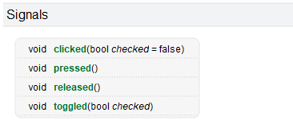
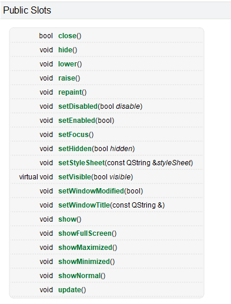
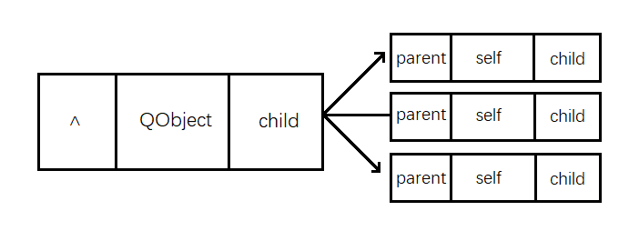
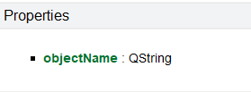

# Qt元对象系统

元对象系统是一个基于标准C++的扩展，为Qt提供了信号与槽机制、实时类型信息、动态属性系统。

## 1. 什么是元对象？

在计算机科学中，元对象是这样一个东西：它可以操纵、创建、描述、或执行其他对象。元对象描述的对象称为基对象。元对象可能存在这样的信息：基础对象的类型、接口、类、方法、属性、变量、控制结构等。

## 2. 元对象系统组成

Qt中的元对象系统基于一下三个东西:

### QObject

QObject是 QT 对象模型的核心，绝大部分的 Qt类都是从这个类继承而来。

### Q_OBJECT

Q_OBJECT宏必须出现在类定义的私有部分，用来开启信号和槽、动态属性系统，或Qt元对象系统提供的其他服务。

```jade
#define Q_OBJECT \
public: \
    QT_WARNING_PUSH \
    Q_OBJECT_NO_OVERRIDE_WARNING \
    static const QMetaObject staticMetaObject; \
    virtual const QMetaObject *metaObject() const; \
    virtual void *qt_metacast(const char *); \
    virtual int qt_metacall(QMetaObject::Call, int, void **); \
    QT_TR_FUNCTIONS \
private: \
    Q_OBJECT_NO_ATTRIBUTES_WARNING \
    Q_DECL_HIDDEN_STATIC_METACALL static void qt_static_metacall(QObject *, QMetaObject::Call, int, void **); \
    QT_WARNING_POP \
    struct QPrivateSignal {}; \
    QT_ANNOTATE_CLASS(qt_qobject, "")
```


### MOC

MOC编译器为QObject子类提供了一些实现元对象特性所需要的一些代码。就比如说信号，大家知识在类声明的时候声明了所需要的信号，在MOC编译时，会为信号添加函数定义。


## 3. 信号与槽

信号槽是 Qt 框架引以为豪的机制之一。所谓信号槽，实际就是观察者模式(发布-订阅模式)。当某个`事件`发生之后，比如，按钮检测到自己被点击了一下，它就会发出一个信号（signal）。这种发出是没有目的的，类似广播。如果有对象对这个信号感兴趣，它就会使用连接（connect）函数，意思是，将想要处理的信号和自己的一个函数（称为槽（slot））绑定来处理这个信号。也就是说，当信号发出时，被连接的槽函数会自动被回调。这就类似观察者模式：当发生了感兴趣的事件，某一个操作就会被自动触发。

信号和槽是Qt特有的信息传输机制，是Qt设计程序的重要基础，它可以让互不干扰的对象建立一种联系。

### 信号和槽本质

信号是由对象发射出去的消息，信号实际上是一个特殊的函数，不需要由程序员实现，而是由Qt的`Qt Meta Object System`实现。

槽实际上就是普通的函数，成员函数、全局函数、静态函数、lambda函数都可以！

当我们把对象的信号和槽绑定在一起之后，当信号触发时，与之绑定的槽函数将会自动调用，并把信号的参数传递给槽函数！

#### 绑定信号与槽

在Qt中信号和槽函数都是独立的个体，本身没有任何联系，但是由于某种特性需求我们可以将二者连接到一起，好比牛郎和织女想要相会必须要有喜鹊为他们搭桥一样。

信号与槽绑定使用`QObject::connent()`函数实现，其基本格式如下:

```cpp
 [static] QMetaObject::Connection connect(
     const QObject *sender, 
     const QMetaMethod &signal, 
     const QObject *receiver, 
     const QMetaMethod &method,
 	, Qt::ConnectionType type = Qt::AutoConnection)
     
 [static] QMetaObject::Connection connect(
     const QObject *sender, 
     PointerToMemberFunction signal, 
     Functor functor)
```

**参数解析**

+ **sender：**信号发出者，需要传递一个QObject族的对象
+ **signal：**发出的具体信号，需要传递一个函数指针
+ **receiver：**信号接收者，需要传递一个QObject族的对象
+ **method：**接收到信号之后，信号接收者处理动作，需要传递一个函数指针(槽函数)

+ **type：**第一个connect函数独有的参数，表示信号和槽的连接类型；有默认值，一般不需要修改。

.png)

 connect函数相对于做了信号处理动作的注册，调用conenct连接信号与槽时，sender对象的信号并没有产生，因此receiver对象的method也不会被调用，method槽函数本质是一个回调函数, 调用的时机是信号产生之后。 调用槽函数是Qt框架来执行的,connect中的sender和recever两个指针必须被实例化了, 否则conenct不会成功。

**断开连接:**

信号与槽连接之后，还可以断开连接，断开之后，信号出发之后，槽函数就不会调用了！

+ 注意的是，信号与槽的断开，必须与连接的时候参数完全一致！

```cpp
bool disconnect(const QObject *sender, const QMetaMethod &signal, const QObject *receiver, const QMetaMethod &method)
```

+ 当然，也可以使用connect的返回值断开连接

```cpp
bool disconnect(const QMetaObject::Connection &connection)
```


### 标准信号与槽

在Qt提供的很多类中都可以对用户触发的某些特定事件进行检测,  当事件被触发后就会产生对应的信号, 这些信号都是Qt类内部自带的, 因此称之为标准信号。

同样的，在Qt的很多类内部为我了提供了很多功能函数，并且这些函数也可以作为触发的信号的处理动作，有这类特性的函数在Qt中称之为标准槽函数。

#### 查找

系统自带的信号和槽通常如何查找呢，这个就需要利用帮助文档了，在帮助文档中比如我们上面的按钮的点击信号，在帮助文档中输入QPushButton，首先我们可以在`Contents`中寻找关键字 `signals`，信号的意思，但是我们发现并没有找到，这时候我们应该看当前类从父类继承下来了哪些信号，因此我们去他的父类QAbstractButton中就可以找到该关键字，点击signals索引到系统自带的信号有如下几个。

+ QPushButton的信号



+ QWidget的槽



#### 使用

我们先在窗口上放一个按钮，取名为btn，实现点击按钮，关闭窗口的功能QAQ！

如果不知道如何连接信号与槽，我们可以先分析一下：

+ 信号发出者：btn
+ 具体信号：clicked()
+ 信号接受者：this
+ 处理动作：close()

最后连接一下！

```cpp
QObject::connect(btn,&QPushButton::clicked,this,&MainWindow::close);
```

ok!现在我们点击按钮，窗口就会关闭了！使用是不是很简单~

当然，在关联信号与槽的时候，必须遵守一些规则，否则无法建立关联：

+ 一般情况下槽函数的参数应该和信号的参数的个数和类型一一对应
+ 信号的参数可以大于等于槽函数的参数个数，未被槽函数接受的参数会被忽略
  + signal：void QPushButton::clicked(bool checked = false)
  + slot：bool QWidget::close()
  + 对于上面两个信号和槽来说，槽函数没有接受信号传递的参数，则这个bool类型的参数被忽略。

**断开连接**

+ 使用和连接一样的方式断开

```cpp
QObject::disconnect(btn,&QPushButton::clicked,this,&MainWindow::close);
```

+ 使用连接标识断开连接

```cpp
QMetaObject::Connection  con = QObject::connect(btn,&QPushButton::clicked,this,&MainWindow::close);

QObject::disconnect(con);
```


### 自定义槽

> 槽函数就是信号的处理动作，自定义槽函数和自定义的普通函数写法是一样的。只不过自定义的槽函数一般放在public slots:后面，Qt5及以后版本，其实可以不用写slots。

**定义槽函数必须遵循以下规则**

1. 槽函数的返回类型必须是void类型，不能是其他类型；

2. 槽函数的参数必须等于或少于信号的参数


**槽函数的类型:**

- 成员函数
  - 普通成员函数
  - 静态成员函数
- 全局函数
- lambda表达式(匿名函数)

```cpp

void global_func();
Widget::Widget(QWidget *parent)
    : QWidget(parent)
{
    QPushButton *btn = new QPushButton(this);
    //连接标准槽函数
    connect(btn,&QPushButton::clicked,self,&Widget::close);
	//连接普通成员函数
    connect(btn,&QPushButton::clicked,this,&Widget::member_func);
	//连接静态成员函数
    connect(btn,&QPushButton::clicked,this,&Widget::static_func);
    //连接全局函数
    connect(btn,&QPushButton::clicked,this,&Widget::global_func);    
	//连接lambda表达式
    connect(btn,&QPushButton::clicked,this,[=]()
            {
               qInfo()<<"lambda"; 
               this->close(); 
            });    
 
}
//普通成员函数
void Widget::member_func()
{
    this->close();
}
//静态成员函数
void Widget::static_func(bool checked)
{
    qInfo()<<"static_func"<<checked;
}
//全局函数
void global_func()
{
    qInfo()<<"global_func";
}
```

如果你想在槽中知道是哪个对象触发的信号，那么你可以使用` QObject *sender() const`函数获取，信号的发送者。

### 自定义信号

> Qt框架提供的信号在某些特定场景下是无法满足我们的项目需求的，因此我们还设计自己需要的的信号，同样还是使用connect()对自定义的信号槽进行连接。

如果想要使用自定义的信号和槽, 首先要编写新的类并且让其继承Qt的某些标准类,我们自己编写的类想要在Qt中使用使用信号槽机制, 那么必须要满足的如下条件: 

 - 这个类必须从QObject类或者是其子类进行派生
 - 在定义类的第一行头文件中加入 Q_OBJECT 宏

```cpp
// 在头文件派生类的时候，首先像下面那样引入Q_OBJECT宏：
class MyMainWindow : public QWidget
{
    Q_OBJECT
public:
    ......
}
```

如果是单文件编写的，还需要在代码的最下面加上`#include "name.moc"`,name是指原文件的名称。


**自定义信号需要遵循以下规则：**

+ 信号是类的成员函数，并且返回类型必须是 void 类型

+ 信号函数只需要声明, 不需要定义(没有函数体实现)

+ 参数可以随意指定, 信号也支持重载

+ 信号需要使用 signals 关键字进行声明, 使用方法类似于public等关键字

+ 在程序中发送自定义信号: 发送信号的本质就是调用信号函数

  ```cpp
  emit mysignals();	//发送信号
  ```

  <span style="color:red;font-size:13px;">emit是一个空宏，没有特殊含义，仅用来表示这个语句是发射一个信号，不写当然可以，但是不推荐。</span>

```c++
// 举例: 信号重载
// Qt中的类想要使用信号槽机制必须要从QObject类派生(直接或间接派生都可以)
class MyButton : public QPushButton
{
    Q_OBJECT
signals:
    void testsignal();
    void testsignal(int a);
};
```

信号参数的作用是数据传递, 谁调用信号函数谁就指定实参，实参最终会被传递给槽函数。


### 信号和槽重载二义性问题

+ 一，通过函数指针解决

  ```cpp
  //信号
  void (Me::*funchungury)() = &Me::hungury;
  void (Me::*funchungury_QString)(QString) = &Me::hungury;
  //槽
  void (Me::*funceat)() = &Me::eat;
  void (Me::*funceat_QString)(QString) = &Me::eat;
  //有参连接
  connect(me,funchungury_QString,me,funceat_QString);
  //无参连接
  connect(me,funchungury,me,funceat);
  ```

+ 二，通过Qt提供的重载类(QOverload)解决

  ```cpp
  //有参连接
  connect(this,QOverload<QString>::of(&MyButton::hungury),this,QOverload<QString>::of(&MyButton::eat));
  //无参连接
  connect(this,QOverload<>::of(&MyButton::hungury),this,QOverload<>::of(&MyButton::eat));
  ```

- 三，Qt4的连接方式
  > 这种旧的信号槽连接方式在Qt6中是支持的, 但是不推荐使用, 因为这种方式在进行信号槽连接的时候, 信号槽函数通过宏`SIGNAL`和`SLOT`转换为字符串类型。
  >
  > 因为信号槽函数的转换是通过宏来进行转换的，因此传递到宏函数内部的数据不会被进行检测， 如果使用者传错了数据，编译器也不会报错，但实际上信号槽的连接已经不对了，只有在程序运行起来之后才能发现问题，而且问题不容易被定位。

  ```cpp
  Me m;
  // Qt4处理方式  注意不要把信号与槽的名字写错了，因为是转为字符串写错了不会报错，但是连接会失败
  connect(&m, SIGNAL(eat()), &m, SLOT(hungury()));
  connect(&m, SIGNAL(eat(QString)), &m, SLOT(hungury(QString)));
  
  // Qt5处理方式
  connect(&m, &Me::eat, &m, &Me::hungury);	// error:no matching member function for call to 'connect'
  ```

  

- **总结**
  - Qt4的信号槽连接方式因为使用了宏函数, 宏函数对用户传递的信号槽不会做错误检测, 容易出bug
  - Qt5的信号槽连接方式, 传递的是信号槽函数的地址, 编译器会做错误检测, 减少了bug的产生
  - 当信号槽函数被重载之后, Qt4的信号槽连接方式不受影响
  - 当信号槽函数被重载之后, Qt6中需要给被重载的信号或者槽定义函数指针 


## 4. 内存管理

### 1. 简介

C++中 new 和 delete 必须配对使用：delete少了，则内存泄露，多了麻烦更大。Qt中使用了new却很少delete，因为Qt实现了其独特的内存管理机制。

QObject 以对象树的形式组织起来。当为一个对象创建子对象时，子对象会自动地添加到父对象的children()列表中。父对象拥有子对象的所有权，比如父对象可以在自己的析构函数中删除它的孩子对象。使用findChild()或findChildren()通过名字和类型查询孩子对象。

```cpp
 QObject(QObject *parent = nullptr)
```

（1）QObject及其派生类的对象，如果其parent非nullptr，那么其parent析构时会析构该对象。

（2）父子关系：父对象、子对象、父子关系。这是Qt中所特有的，与类的继承关系无关，传递参数是与parent有关（基类、派生类，或父类、子类，这是对于派生体系来说的，与parent无关）。

### 2. 关联图

在Qt中，最基础和核心的类是：QObject，QObject内部有一个名为children的QObjectList列表，会保存所有子对象，还有一个指针parent，用来指向父对象，当自己析构时，会先把自己从parent列表中删除并且析构所有的children。



### 3. 详解

#### 3.1 对象分配在栈上

当把对象分配到栈上时，内存会随着对象的生命周期而释放，非常安全！

```cpp
int main(int argc,char*argv[])
{
    QApplication a(argc,argv);

    QObject obj;

    qInfo()<<"hello Qt!";
    return a.exec();
}
```

#### 3.2 对象分配在堆上

##### 问题

当把对象分配到堆上时，如果忘记`delete`，内存就不会释放，会发生内存泄漏

```cpp
#include<QApplication>
#include<QDebug>
int main(int argc,char*argv[])
{
    QApplication a(argc,argv);

    QObject* obj = new QObject;

    qInfo()<<"hello Qt!";
    return a.exec();
}
```

##### 释放内存

+ 使用`delete`或者Qt提供的成员函数`deleteLater()`释放内存，对象释放时会触发QObject::destroyed(QObject *obj = nullptr)信号

```cpp
int main(int argc,char*argv[])
{
    QApplication a(argc,argv);

    QObject* obj = new QObject;
    
    //delete obj;				//①
    //obj->deleteLater();		//②

    qInfo()<<"hello Qt!";
    return a.exec();
}
```

+ 使用指定父对象的方式自动管理内存

```cpp
#include<QApplication>
#include<QDebug>

class MyObject:public QObject
{
public:
    MyObject(QObject* parent = nullptr)
        :QObject(parent)
        {
            qInfo()<<"MyObject created!";
        }
    ~MyObject()
    {
        qInfo()<<"MyObject destory!";
    }
};

int main(int argc,char*argv[])
{
    QApplication a(argc,argv);
    
    {
        MyObject parent;
        {
            MyObject* obj = new MyObject(&parent);
            //obj->deleteLater();
            //MyObject obj;
        }
    }
    
    qInfo()<<"hello Qt!";
    return a.exec();
}
```

### 4. 对象名

在Qt中可以给对象设置对象名，从而可以使用findChild()通过名称(和类型)查找对象；还可以通过findChildren()找到一组对象。

+ 设置对象名

  ```cpp
  void QObject::setObjectName(const QString &name);
  ```

+ 获取对象名

  ```cpp
  QString QObject::objectName() const;
  ```

+ 通过对象名查找对象

  ```cpp
  template <typename T>
  T findChild(const QString &name = QString(), Qt::FindChildOptions options = Qt::FindChildrenRecursively) const
  ```

  根据指定的名称name和指定的类型T(T可以是父类)查找子对象，如果没有这样的子对象，则返回nullptr；

  + 此示例返回名为“button1”的 parentWidget 的子 QPushButton，即使该按钮不是父级的直接子级：

    ```cpp
     QPushButton *button = parentWidget->findChild<QPushButton *>("button1");
    ```

  + 这个例子返回了parentWidget的QListWidget子组件:

    ```cpp
     QListWidget *list = parentWidget->findChild<QListWidget *>();
    ```

  + 这个例子返回了parentWidget(它的直接父元素)的一个名为"button1"的子QPushButton:

    ```cpp
     QPushButton *button = parentWidget->findChild<QPushButton *>("button1", Qt::FindDirectChildrenOnly);
    ```

  + 这个例子返回一个parentWidget的QListWidget子组件，它的直接父组件:

    ```cpp
     QListWidget *list = parentWidget->findChild<QListWidget *>(QString(), Qt::FindDirectChildrenOnly);
    ```

    

+ 通过类型查找对象

  ```cpp
   QList<T> findChildren(const QString &name = QString(), Qt::FindChildOptions options = Qt::FindChildrenRecursively) const
   QList<T> findChildren(const QRegularExpression &re, Qt::FindChildOptions options = Qt::FindChildrenRecursively) const
  ```

  根据指定的名称name和指定的类型T(T可以是父类)查找子对象，如果没有这样的子对象，则返回nullptr；
  
  + 以下示例显示了如何查找名为 widgetname 的指定父 Widget 的子 Widget 列表：
  
    ```cpp
     QList<QWidget *> widgets = parentWidget.findChildren<QWidget *>("widgetname");
    ```
  
  + 这个例子返回了parentWidget的所有子QPushButton:
  
    ```cpp
     QList<QPushButton *> allPButtons = parentWidget.findChildren<QPushButton *>();
    ```
  
  + 这个例子返回所有与parentWidget直接关联的QPushButton:
  
    ```cpp
     QList<QPushButton *> childButtons = parentWidget.findChildren<QPushButton *>(QString(), Qt::FindDirectChildrenOnly);
    ```
  
    

## 5. 属性系统

>  The Property System

Qt提供了一个复杂的属性系统，类似于一些编译器供应商提供的属性系统。然而，作为一个独立于编译器和平台的库，Qt不依赖于像__property或[property]这样的非标准编译器特性。Qt解决方案可以在Qt支持的每一个平台上使用任何标准的c++编译器。它基于元对象系统，也通过信号和插槽提供对象间通信。

属性的行为类似于类数据成员，但它具有通过元对象系统访问的附加特性。我们先来看属性的基本使用，附加特性稍后再说QAQ！

### 获取/设置属性值

首先，咱们通过帮助文档可以知道，QObject类就只有一个`objectName`属性。



那么我们就可以通过获取属性值的函数获取`objectName`的值。

```cpp
 qInfo()<<obj->property("objectName").toString();
```

同样我们可以通过修改属性值的函数修改`objectName`的值。

```cpp
obj->setProperty("objectName","OBJ");
```

QObject::setProperty() 也可用于在运行时向类的实例添加新属性。

当使用名称和值调用它时，如果QObject中存在具有给定名称的属性，并且给定值与属性的类型兼容，则将值存储在属性中，并返回true。

如果该值与属性的类型不兼容，则不会更改该属性，并返回 false。

但是如果具有给定名称的属性在 QObject 中不存在（即，如果它没有使用 Q_PROPERTY() 声明），具有给定名称和值的新属性会自动添加到 QObject，但 false 仍然回来。这意味着返回 false 不能用于确定是否实际设置了特定属性，除非您事先知道该属性已经存在于 QObject 中。

请注意，动态属性是在每个实例的基础上添加的，即它们被添加到 QObject，而不是 QMetaObject。通过将属性名称和无效的 QVariant 值传递给 QObject::setProperty()，可以从实例中删除属性。 QVariant 的默认构造函数构造了一个无效的 QVariant。


### 自己声明属性

除了通过`setProperty`动态添加属性之外，怎样才能在代码中，声明属性呢？

要声明属性，请在继承 QObject 的类中使用 Q_PROPERTY() 宏。

```css
 Q_PROPERTY(type name
            (READ getFunction [WRITE setFunction] |
             MEMBER memberName [(READ getFunction | WRITE setFunction)])
            [RESET resetFunction]
            [NOTIFY notifySignal]
            [REVISION int | REVISION(int[, int])]
            [DESIGNABLE bool]
            [SCRIPTABLE bool]
            [STORED bool]
            [USER bool]
            [BINDABLE bindableProperty]
            [CONSTANT]
            [FINAL]
            [REQUIRED])
```

属性的行为类似于类数据成员，但它具有通过元对象系统访问的附加特性。

+ 如果未指定 MEMBER 变量，则需要 READ 访问器函数。 它用于读取属性值。 理想情况下，const 函数用于此目的，它必须返回属性的类型或对该类型的 const 引用。 例如，QWidget::focus 是一个带有 READ 函数的只读属性，QWidget::hasFocus()。

+ WRITE 访问器函数是可选的。 它用于设置属性值。 它必须返回 void 并且必须只接受一个参数，该参数可以是属性的类型，也可以是指向该类型的指针或引用。 例如，QWidget::enabled 具有 WRITE 函数 QWidget::setEnabled()。 只读属性不需要 WRITE 函数。 例如，QWidget::focus 没有 WRITE 功能。

+ 如果未指定 READ 访问器函数，则需要 MEMBER 变量关联。 这使得给定的成员变量可读可写，而无需创建 READ 和 WRITE 访问器函数。 如果您需要控制变量访问，除了 MEMBER 变量关联之外，仍然可以使用 READ 或 WRITE 访问器函数。
+ RESET 功能是可选的。 它用于将属性设置回其特定于上下文的默认值。 例如，QWidget::cursor 有典型的 READ 和 WRITE 函数，QWidget::cursor() 和 QWidget::setCursor()，它还有一个 RESET 函数，QWidget::unsetCursor()，因为没有调用 QWidget:: setCursor() 可以表示重置为特定于上下文的光标。 RESET 函数必须返回 void 并且不带任何参数。
+ NOTIFY 信号是可选的。 如果已定义，则应指定该类中的一个现有信号，该信号在属性值更改时发出。 MEMBER 变量的 NOTIFY 信号必须采用零个或一个参数，该参数必须与属性的类型相同。 该参数将采用属性的新值。 NOTIFY 信号只应在属性真正被更改时发出，以避免在 QML 中不必要地重新评估绑定，例如。 当没有显式设置器的 MEMBER 属性需要时，Qt 会自动发出该信号。

+ REVISION 编号或 REVISION() 宏是可选的。 如果包含，它定义了要在 API 的特定修订版中使用的属性及其通知信号（通常用于暴露于 QML）。 如果不包含，则默认为 0。

+ DESIGNABLE 属性指示该属性是否应在 GUI 设计工具（例如 Qt Designer）的属性编辑器中可见。 大多数属性都是可设计的（默认为 true）。 有效值为真和假。

+ SCRIPTABLE 属性指示脚本引擎是否可以访问此属性（默认为 true）。 有效值为真和假。
+ STORED 属性指示该属性是否应该被认为是独立存在的，或者取决于其他值。 它还指示在存储对象的状态时是否必须保存属性值。 大多数属性是 STORED 的（默认为 true），但例如，QWidget::minimumWidth() 的 STORED 为 false，因为它的值只是从属性 QWidget::minimumSize() 的宽度分量中获取的，它是一个 QSize。

+ USER 属性指示该属性是被指定为该类的面向用户的属性还是用户可编辑的属性。 通常，每个类只有一个 USER 属性（默认为 false）。 例如，QAbstractButton::checked 是（可检查）按钮的用户可编辑属性。 请注意，QItemDelegate 获取和设置小部件的 USER 属性。

+ BINDABLE bindableProperty 属性表明该属性支持绑定，并且可以通过元对象系统 (QMetaProperty) 设置和检查与该属性的绑定。 bindableProperty 命名 QBindable<T> 类型的类成员，其中 T 是属性类型。 这个属性是在 Qt 6.0 中引入的。

+ CONSTANT 属性的存在表明属性值是常量。 对于给定的对象实例，常量属性的 READ 方法在每次调用时都必须返回相同的值。 对于对象的不同实例，该常数值可能不同。 常量属性不能有 WRITE 方法或 NOTIFY 信号。

+ FINAL 属性的存在表明该属性不会被派生类覆盖。 这在某些情况下可用于性能优化，但并非由 moc 强制执行。 必须注意永远不要覆盖 FINAL 属性。

+ REQUIRED 属性的存在表明该属性应该由该类的用户设置。 这不是由 moc 强制执行的，并且对于暴露给 QML 的类最有用。 在 QML 中，除非设置了所有 REQUIRED 属性，否则无法实例化具有 REQUIRED 属性的类。

可以继承 READ、WRITE 和 RESET 函数。 它们也可以是虚拟的。 当它们在使用多重继承的类中被继承时，它们必须来自第一个继承的类。

属性类型可以是 QVariant 支持的任何类型，也可以是用户定义的类型。 在此示例中，类 QDate 被认为是用户定义的类型。

```cpp
 Q_PROPERTY(QDate date READ getDate WRITE setDate)
```

因为QDate是用户定义的，所以必须在属性声明中包含<QDate>头文件。

#### 自定义属性

```cpp
class MyObject:public QObject
{
    Q_OBJECT
    Q_PROPERTY(QString name READ getName WRITE setName RESET unsetName NOTIFY nameChanged)
public:
    MyObject(QObject*parent = nullptr)
    :QObject(parent){}

    QString getName()
    {
         qInfo()<<__FUNCTION__;
        return m_name;
    }
    void setName(const QString& name)
    {
        qInfo()<<__FUNCTION__;
        emit nameChanged(name);		//需要自己发射信号
        m_name = name;     
    }
    void unsetName()
    {
        qInfo()<<__FUNCTION__;
        m_name ="unknown";
    }
signals:
    void nameChanged(const QString&);
private:
    QString m_name;
};


int main(int argc,char*argv[])
{
   QApplication a(argc,argv);
   MyObject obj;

   QObject::connect(&obj,&MyObject::nameChanged,[](auto name)
                    {
                        qInfo()<<"slot:"<<name;
                    });
   //通过函数访问 
   obj.setName("maye");		
   qInfo()<<obj.getName();	//输出maye 
   obj.unsetName();			//把name重置为 unknown
    
    //通过属性接口访问 
   obj.setProperty("name","顽石");
   qInfo()<<obj.property("name").toString();	//输出"顽石"
   obj.setProperty("name",QVariant());			//把name重置为 unknown
    
    return a.exec();
}
```

在上面的代码中，使用属性“name”就相当于使用了成员变量m_name;但是通过属性接口访问或设置属性值时，是通过指定的读写函数实现的。

如果指定了NOTIFY函数(信号)，则需要自己在合适的时机发射信号，Qt不会自动发出。

#### 属性关联成员变量

```cpp
class MyObject:public QObject
{
    Q_OBJECT
    //Q_PROPERTY(QString name READ getName WRITE setName RESET unsetName NOTIFY nameChanged)
    Q_PROPERTY(QString name MEMBER m_name NOTIFY nameChanged)
public:
    MyObject(QObject*parent = nullptr)
    :QObject(parent){}
	//不需要读写函数，当然如果需要也可以写上
signals:
    void nameChanged(const QString&);
private:
    QString m_name;
};

int main(int argc,char*argv[])
{
   QApplication a(argc,argv);
   MyObject obj;

   QObject::connect(&obj,&MyObject::nameChanged,[](auto name)
                    {
                        qInfo()<<"slot:"<<name;
                    });
 
   obj.setProperty("name","顽石");			   //修改属性，会自动触发nameChanged信号
   qInfo()<<obj.property("name").toString();	//输出"顽石"
    
    return a.exec();
}

```

在上面的代码中，使用属性“name”就相当于使用了成员变量m_name;而且通过属性接口访问或设置属性值时，是直接修改的成员变量m_name,不需要读写函数。

如果指定了NOTIFY函数(信号)，则通过属性接口改变name的值时，信号会自动触发。


### 绑定属性

> Qt Bindable Properties

Qt提供了可绑定属性。可绑定属性是具有值或使用任何c++函数(通常是c++ lambda表达式)指定的属性。如果它们是使用c++函数指定的，那么当它们的依赖项发生变化时，它们就会自动更新。

可绑定属性在 QProperty 类中实现，它由数据对象和指向管理数据结构的指针组成，而在 QObjectBindableProperty 类中实现，它仅由数据对象组成并使用封装的 QObject 来存储指向管理数据结构的指针 。

**为什么使用绑定属性？**

属性绑定是 QML 的核心特性之一。 它们允许指定不同对象属性之间的关系，并在它们的依赖关系发生变化时自动更新属性的值。 可绑定属性不仅允许在 QML 代码中实现相同的功能，而且还允许在 C++ 中实现相同的功能。 使用可绑定属性有助于简化程序，因为它消除了用于跟踪和响应不同对象的依赖更新的大量样板代码。

下面的介绍性示例演示了 C++ 代码中可绑定属性的用法。 您还可以查看可绑定属性示例，了解可绑定属性如何帮助改进您的代码。

#### QProperty

**示例**

我们定义了一个`Rectangle`矩形类，通过构造函数传入宽度和高度，自动计算矩形面积；

```cpp
struct Rectangle
{
    int w;
    int h;
    int area;
    Rectangle(int width,int height)
        :w(width),h(height)
    {
        area = w * h;
    }
};

void test()
{
    Rectangle rect(2,5);
    qInfo()<<rect.w<<rect.h<<rect.area; //2 5 10

    rect.w = 3;     //area:15
    qInfo()<<rect.w<<rect.h<<rect.area; //3 5 10
}
```

从上面代码可以看出，只有在构造对象时，才能正确计算面积；如果在对象定义之后，修改宽度或者高度，面积都将变得不正确，因为它没有及时更新。

矩形的面积是依赖于矩形的宽度和高度的，那么当高度或者高度变化之后，应该需要自动更新面积，这个应该如何做到呢？

绑定表达式通过读取其他QProperty值来计算该值。在幕后跟踪这种依赖关系。每当检测到任何属性的依赖关系发生更改时，都会重新计算绑定表达式，并将新的结果应用于该属性。例如:

```cpp
struct Rectangle
{
    QProperty<int>  w{0};
    QProperty<int>  h{0};
    QProperty<int>  area{0};

    Rectangle(int width,int height)
        :w(width), h(height)
    {
        //设置绑定属性
        area.setBinding([&]()->int {return w * h; });
    }
};

void test()
{
    Rectangle rect(2,5);
    qInfo()<<rect.w<<rect.h<<rect.area; //2 5 10

    rect.w = 3;     //area:15
    //rect.w.setValue(3);
    qInfo()<<rect.w<<rect.h<<rect.area; //3 5 15
}
```

#### QObjectBindableProperty

QObjectBindableProperty是一个通用容器，它保存T的一个实例，其行为主要类似于QProperty。它是实现Qt绑定属性的类之一。与QProperty不同，它将其管理数据结构存储在QObject中。额外的模板参数用于标识周围的类和作为更改处理程序的类的成员函数。

您可以使用 QObjectBindableProperty 为使用 Q_PROPERTY 的代码添加绑定支持。 getter 和 setter 方法必须根据[可绑定属性 Getter 和 Setter](#) 中描述的规则进行仔细调整。

为了在属性更改时调用更改信号，请使用QObjectBindableProperty并将更改信号作为回调传递。

```cpp
struct Rectangle :public QObject
{
    Q_OBJECT
 	//不声明为属性也行，但是在QML中使用必须声明    
    Q_PROPERTY(int w MEMBER w)
    Q_PROPERTY(int h MEMBER h)
    Q_PROPERTY(int area MEMBER area)
public:
    Rectangle(int width,int height)
        :w(width),h(height)
    {
        area.setBinding([&]() {return w * h; });
    }
signals:
    void areaChanged(int area);
public:
    Q_OBJECT_BINDABLE_PROPERTY(Rectangle, int, w);                              //定义可绑定属性
    Q_OBJECT_BINDABLE_PROPERTY_WITH_ARGS(Rectangle, int, h,0);                  //可以给默认值
    Q_OBJECT_BINDABLE_PROPERTY(Rectangle, int, area,&Rectangle::areaChanged);   //属性改变时，会触发areaChanged信号
};  

void test()
{
    Rectangle rect(2,5);
    QObject::connect(&rect, &Rectangle::areaChanged, [&](int area) 
        { 
            qInfo() << "lambda:" << rect.area<< area; 
        });

    qInfo()<<rect.w<<rect.h<<rect.area; //2 5 10

    rect.w = 3;     //area:15
    //rect.w.setValue(3);
    qInfo()<<rect.w<<rect.h<<rect.area; //3 5 15
}
```

通常不会直接使用QObjectBindableProperty，而是通过使用Q_OBJECT_BINDABLE_PROPERTY宏创建它的实例。

在类声明中使用Q_OBJECT_BINDABLE_PROPERTY宏将属性声明为可绑定的。

如果需要使用一些非默认值直接初始化属性，可以使用Q_OBJECT_BINDABLE_PROPERTY_WITH_ARGS宏。它接受一个初始化值作为它的参数之一。

#### 注意：

QProperty是可绑定属性的通用类。QObjectBindableProperty只能在QObject中使用。


## 6. 实时类型信息

### 何为内省

所谓内省是指面向对象语言的一种在运行期间查询对象信息的能力， 比如如果该语具有运行期间检查对象型别的能力，那么我们称它是型别内省（`type intropection`）的，型别内省可以用来实施多态。

C++的内省比较有限，它仅支持上面所说的型别内省， C++的型别内省是通过运行时类型识别（`RTTI`）(`Run-Time Type Information`)中的`typeid` 以及`dynamic_case`关键字来实现的，举例说明：

```cpp
// Dog 派生于 Animal, jump为虚函数  
if (Dog *pdog = dynamic_case<Animal*>(obj))     
{     
   p->cry();     
}     
//我们还可以通过typeid萃取到对象的型别信息，比如对象的名称   
std::cout << typeid(obj).name() << std::endl   
```

----

Qt拓展了C++的内省机制，（实际上，它并没有采用C++的RTTI),而是提供了更为强大的元对象(`meta object`)机制，来实现内省。接下来，就让我们看看，Qt是如何扩展c++内省机制的。

要深刻理解Qt的内省机制，首先理解`QObject`，`QObject`类是整个Qt对象模型的心脏，Qt对象模型最为核心的功能是提供一种无缝的对象通讯机制，即就是我们所熟知的信号和槽。`QObject`主要有三大职责： 内存管理、内省(`intropection`)与事件处理。本文将集中在在内省的讨论。以下代码介绍了`QObject`类提供的内省方法:

```cpp
//判断该类是否继承自指定的类
bool inherits(const char *className) const;

QWidget* w = new QWidget;
w.inherits("QObject");		//true
w.inherits("QWidget");		//false
```

让我们再来一下`QObject::inherits`方法的底层实现：

```cpp
inline bool inherits(const char *classname) const   
{ 
    return const_cast<QObject *>(this)->qt_metacast(classname) != 0; 
}  
```

原来，`QObject::inherits`是通过`qt_metacast()`这个虚函数实现的， 事实上每个`QObject`的派生类都必须实现`metaObject()`以及其他`qt_metacall()`方法，从而满足自省方法`className`, `inherits`等方法的调用（当然还有其他用途）。

而所有有关派生从`QObject`的子类中的内省方法无须有用户实现，用户只要在类中声明宏`Q_OBJECT`即可，Qt的元对象编译器（`moc`)负责实现派生`QObject`的子类中的内省方法。

```java
#define Q_OBJECT \
public: \
    QT_WARNING_PUSH \
    Q_OBJECT_NO_OVERRIDE_WARNING \
    static const QMetaObject staticMetaObject; \
    virtual const QMetaObject *metaObject() const; \
    virtual void *qt_metacast(const char *); \
    virtual int qt_metacall(QMetaObject::Call, int, void **); \
    QT_TR_FUNCTIONS \
private: \
    Q_OBJECT_NO_ATTRIBUTES_WARNING \
    Q_DECL_HIDDEN_STATIC_METACALL static void qt_static_metacall(QObject *, QMetaObject::Call, int, void **); \
    QT_WARNING_POP \
    struct QPrivateSignal {}; \
    QT_ANNOTATE_CLASS(qt_qobject, "")
```

此外，所有的`Qt widgets`类均继承自`QObject`, `QObject`所提供的`isWidgetType`自省方法可以很方便让`QObject`子对象查询自己是否是`Wideget`, 而且它会比 `qobject_cast<QWidget *>(obj)` 或者`obj->inherits`快很多。原因`qobject_cast()`和`inherits()`都是借助元对象系统来实现其功能的，`isWidgetType()`是`QObject`本身的标志位得以实现。

更多自省方法定义在[`QMetaObject`](#附录)。


### 总结

1. Qt是通过`QObject`、`QMetaObject`类实现其内省机制,
2. `QObject`暴露给用户的共有自省方法有`objectName()`, `inherits()`， `isWidgetType()`等
3. 大多数自省方法是`QObject`派发给`QMetaObject`实现 (e.g. `QMetaObject::className`)，元对象模型编译器`moc`负责自省方法的实现
4. 更多自省方法定义在`QMetaObject`，是为了信号槽通讯、事件派发等机制


# 附录

## QMetaObject

QMetaObject 类包含有关 Qt 对象的元信息。

### 附加信息

Q_CLASSINFO()宏，它可用于将附加的<名称-值>对附加到类的元对象，例如：

```cpp
 Q_CLASSINFO("Version", "3.0.0")
```

然后通过`QMetaObject `以下几个函数访问类信息。

```cpp
 QMetaClassInfo classInfo(int index) const
 int classInfoCount() const
 int classInfoOffset() const
 const char *className() const
```

**示例:**

```cpp
class MyObject : public QObject
{
    Q_OBJECT
    Q_CLASSINFO("version", "1.0")
    Q_CLASSINFO("author", "顽石")
public:

};

class MyObject1 : public MyObject
{
    Q_OBJECT
    Q_CLASSINFO("version", "2.0")
    Q_CLASSINFO("name", "maye")
public:

};

int main(int argc,char*argv[])
{
    QApplication a(argc,argv);

    MyObject1 obj;
    const QMetaObject* metaObj = obj.metaObject();
    int cnt =  metaObj->classInfoCount();
    for(int i = 0;i<cnt;i++)
    {
        qInfo()<<metaObj->classInfo(i).name()<<metaObj->classInfo(i).value();
    }
    qInfo() << metaObj->classInfoOffset();
    qInfo() << metaObj->className();

    return a.exec();
}
```

输出:

```cpp
version 1.0
author 顽石
version 2.0
name maye
2
MyObject1
```


