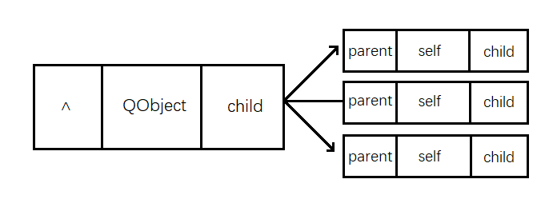

# Qt元对象系统

元对象系统是一个基于标准C++的扩展，为Qt提供了信号与槽机制、实时类型信息、动态属性系统。

## 1. 什么是元对象？

在计算机科学中，元对象是这样一个东西：它可以操纵、创建、描述、或执行其他对象。元对象描述的对象称为基对象。元对象可能存在这样的信息：基础对象的类型、接口、类、方法、属性、变量、控制结构等。

## 2. 元对象系统组成

Qt中的元对象系统基于一下三个东西:

### QObject

QObject是 QT 对象模型的核心，绝大部分的 Qt类都是从这个类继承而来。

### Q_OBJECT

Q_OBJECT宏必须出现在类定义的私有部分，用来开启信号和槽、动态属性系统，或Qt元对象系统提供的其他服务。

```jade
#define Q_OBJECT \
public: \
    QT_WARNING_PUSH \
    Q_OBJECT_NO_OVERRIDE_WARNING \
    static const QMetaObject staticMetaObject; \
    virtual const QMetaObject *metaObject() const; \
    virtual void *qt_metacast(const char *); \
    virtual int qt_metacall(QMetaObject::Call, int, void **); \
    QT_TR_FUNCTIONS \
private: \
    Q_OBJECT_NO_ATTRIBUTES_WARNING \
    Q_DECL_HIDDEN_STATIC_METACALL static void qt_static_metacall(QObject *, QMetaObject::Call, int, void **); \
    QT_WARNING_POP \
    struct QPrivateSignal {}; \
    QT_ANNOTATE_CLASS(qt_qobject, "")
```


### MOC

MOC编译器为QObject子类提供了一些实现元对象特性所需要的一些代码。就比如说信号，大家知识在类声明的时候声明了所需要的信号，在MOC编译时，会为信号添加函数定义。

[百度文库元对象系统](https://wenku.baidu.com/view/00c9dfa2cf22bcd126fff705cc17552707225e01.html)

[知乎](https://zhuanlan.zhihu.com/p/425820672)

[Qt内省机制](https://blog.csdn.net/wanywhn/article/details/80293581)

[QObject简单介绍](https://blog.csdn.net/aidem_brown/article/details/80236188)


## 3. 信号与槽

前面已经讲过了


## 4. 内存管理

### 1. 简介

C++中 new 和 delete 必须配对使用：delete少了，则内存泄露，多了麻烦更大。Qt中使用了new却很少delete，因为Qt实现了其独特的内存管理机制。

QObject 以对象树的形式组织起来。当为一个对象创建子对象时，子对象会自动地添加到父对象的children()列表中。父对象拥有子对象的所有权，比如父对象可以在自己的析构函数中删除它的孩子对象。使用findChild()或findChildren()通过名字和类型查询孩子对象。

```cpp
 QObject(QObject *parent = nullptr)
```

（1）QObject及其派生类的对象，如果其parent非nullptr，那么其parent析构时会析构该对象。

（2）父子关系：父对象、子对象、父子关系。这是Qt中所特有的，与类的继承关系无关，传递参数是与parent有关（基类、派生类，或父类、子类，这是对于派生体系来说的，与parent无关）。

### 2. 关联图

在Qt中，最基础和核心的类是：QObject，QObject内部有一个名为children的QObjectList列表，会保存所有子对象，还有一个指针parent，用来指向父对象，当自己析构时，会先把自己从parent列表中删除并且析构所有的children。



### 3. 详解

#### 3.1 对象分配在栈上

当把对象分配到栈上时，内存会随着对象的生命周期而释放，非常安全！

```cpp
int main(int argc,char*argv[])
{
    QApplication a(argc,argv);

    QObject obj;

    qInfo()<<"hello Qt!";
    return a.exec();
}
```

#### 3.2 对象分配在堆上

##### 问题

当把对象分配到堆上时，如果忘记`delete`，内存就不会释放，会发生内存泄漏

```cpp
#include<QApplication>
#include<QDebug>
int main(int argc,char*argv[])
{
    QApplication a(argc,argv);

    QObject* obj = new QObject;

    qInfo()<<"hello Qt!";
    return a.exec();
}
```

##### 释放内存

+ 使用`delete`或者Qt提供的成员函数`deleteLater()`释放内存

```cpp
int main(int argc,char*argv[])
{
    QApplication a(argc,argv);

    QObject* obj = new QObject;
    
    //delete obj;				//①
    //obj->deleteLater();		//②

    qInfo()<<"hello Qt!";
    return a.exec();
}
```

+ 使用指定父对象的方式自动管理内存

```cpp
#include<QApplication>
#include<QDebug>

class MyObject:public QObject
{
public:
    MyObject(QObject* parent = nullptr)
        :QObject(parent)
        {
            qInfo()<<"MyObject created!";
        }
    ~MyObject()
    {
        qInfo()<<"MyObject destory!";
    }
};

int main(int argc,char*argv[])
{
    QApplication a(argc,argv);
    
    {
        MyObject parent;
        {
            MyObject* obj = new MyObject(&parent);
            //obj->deleteLater();
            //MyObject obj;
        }
    }
    
    qInfo()<<"hello Qt!";
    return a.exec();
}
```

### 4. 对象名

在Qt中可以给对象设置对象名，从而可以使用findChild()通过名称(和类型)查找对象；还可以通过findChildren()找到一组对象。

+ 设置对象名

  ```cpp
  void QObject::setObjectName(const QString &name);
  ```

+ 获取对象名

  ```cpp
  QString QObject::objectName() const;
  ```

+ 通过对象名查找对象

  ```cpp
  template <typename T>
  T findChild(const QString &name = QString(), Qt::FindChildOptions options = Qt::FindChildrenRecursively) const
  ```

  根据指定的名称name和指定的类型T(T可以是父类)查找子对象，如果没有这样的子对象，则返回nullptr；

+ 通过类型查找对象

  ```cpp
   QList<T> findChildren(const QString &name = QString(), Qt::FindChildOptions options = Qt::FindChildrenRecursively) const
   QList<T> findChildren(const QRegularExpression &re, Qt::FindChildOptions options = Qt::FindChildrenRecursively) const
  ```

  


## 5. 实时类型信息

### 何为内省

所谓内省是指面向对象语言的一种在运行期间查询对象信息的能力， 比如如果该语具有运行期间检查对象型别的能力，那么我们称它是型别内省（`type intropection`）的，型别内省可以用来实施多态。

C++的内省比较有限，它仅支持上面所说的型别内省， C++的型别内省是通过运行时类型识别（`RTTI`）(`Run-Time Type Information`)中的`typeid` 以及`dynamic_case`关键字来实现的，举例说明：

```cpp
// Dog 派生于 Animal, jump为虚函数  
if (Dog *pdog = dynamic_case<Animal*>(obj))     
{     
   p->cry();     
}     
//我们还可以通过typeid萃取到对象的型别信息，比如对象的名称   
std::cout << typeid(obj).name() << std::endl   
```

----

Qt拓展了C++的内省机制，（实际上，它并没有采用C++的RTTI),而是提供了更为强大的元对象(`meta object`)机制，来实现内省。接下来，就让我们看看，Qt是如何扩展c++内省机制的。

要深刻理解Qt的内省机制，首先理解`QObject`，`QObject`类是整个Qt对象模型的心脏，Qt对象模型最为核心的功能是提供一种无缝的对象通讯机制，即就是我们所熟知的信号和槽。`QObject`主要有三大职责： 内存管理、内省(`intropection`)与事件处理。本文将集中在在内省的讨论。以下代码介绍了`QObject`类提供的内省方法:

```cpp
//判断该类是否继承自指定的类
bool inherits(const char *className) const;

QWidget* w = new QWidget;
w.inherits("QObject");		//true
w.inherits("QWidget");		//false
```

让我们再来一下`QObject::inherits`方法的底层实现：

```cpp
inline bool inherits(const char *classname) const   
{ 
    return const_cast<QObject *>(this)->qt_metacast(classname) != 0; 
}  
```

原来，`QObject::inherits`是通过`qt_metacast()`这个虚函数实现的， 事实上每个`QObject`的派生类都必须实现`metaObject()`以及其他`qt_metacall()`方法，从而满足自省方法`className`, `inherits`等方法的调用（当然还有其他用途）。

而所有有关派生从`QObject`的子类中的内省方法无须有用户实现，用户只要在类中声明宏`Q_OBJECT`即可，Qt的元对象编译器（`moc`)负责实现派生`QObject`的子类中的内省方法。

```java
#define Q_OBJECT \
public: \
    QT_WARNING_PUSH \
    Q_OBJECT_NO_OVERRIDE_WARNING \
    static const QMetaObject staticMetaObject; \
    virtual const QMetaObject *metaObject() const; \
    virtual void *qt_metacast(const char *); \
    virtual int qt_metacall(QMetaObject::Call, int, void **); \
    QT_TR_FUNCTIONS \
private: \
    Q_OBJECT_NO_ATTRIBUTES_WARNING \
    Q_DECL_HIDDEN_STATIC_METACALL static void qt_static_metacall(QObject *, QMetaObject::Call, int, void **); \
    QT_WARNING_POP \
    struct QPrivateSignal {}; \
    QT_ANNOTATE_CLASS(qt_qobject, "")
```

此外，所有的`Qt widgets`类均继承自`QObject`, `QObject`所提供的`isWidgetType`自省方法可以很方便让`QObject`子对象查询自己是否是`Wideget`, 而且它会比 `qobject_cast<QWidget *>(obj)` 或者`obj->inherits`快很多。原因`qobject_cast()`和`inherits()`都是借助元对象系统来实现其功能的，`isWidgetType()`是`QObject`本身的标志位得以实现。

更多自省方法定义在`QMetaObject`，以下是`QMetaObject`声明的源代码：

```cpp
 QMetaClassInfo classInfo(int index) const
 int classInfoCount() const
 int classInfoOffset() const
 const char *className() const
 QMetaMethod constructor(int index) const
 int constructorCount() const
 QMetaEnum enumerator(int index) const
 int enumeratorCount() const
 int enumeratorOffset() const
 int indexOfClassInfo(const char *name) const
 int indexOfConstructor(const char *constructor) const
 int indexOfEnumerator(const char *name) const
 int indexOfMethod(const char *method) const
 int indexOfProperty(const char *name) const
 int indexOfSignal(const char *signal) const
 int indexOfSlot(const char *slot) const
 bool inherits(const QMetaObject *metaObject) const
 QMetaType metaType() const
 QMetaMethod method(int index) const
 int methodCount() const
 int methodOffset() const
 QObject *newInstance(QGenericArgument val0 = QGenericArgument(nullptr), QGenericArgument val1 = QGenericArgument(), QGenericArgument val2 = QGenericArgument(), QGenericArgument val3 = QGenericArgument(), QGenericArgument val4 = QGenericArgument(), QGenericArgument val5 = QGenericArgument(), QGenericArgument val6 = QGenericArgument(), QGenericArgument val7 = QGenericArgument(), QGenericArgument val8 = QGenericArgument(), QGenericArgument val9 = QGenericArgument()) const
 QMetaProperty property(int index) const
 int propertyCount() const
 int propertyOffset() const
 const QMetaObject *superClass() const
 QMetaProperty userProperty() const
```

### 总结

1. Qt是通过`QObject`、`QMetaObject`类实现其内省机制,
2. `QObject`暴露给用户的共有自省方法有`objectName()`, `inherits()`， `isWidgetType()`等
3. 大多数自省方法是`QObject`派发给`QMetaObject`实现 (e.g. `QMetaObject::className`)，元对象模型编译器`moc`负责自省方法的实现
4. 更多自省方法定义在`QMetaObject`，是为了信号槽通讯、事件派发等机制


## 6. 属性系统

Qt提供了一个复杂的属性系统，类似于一些编译器供应商提供的属性系统。然而，作为一个独立于编译器和平台的库，Qt不依赖于像__property或[property]这样的非标准编译器特性。Qt解决方案可以在Qt支持的每一个平台上使用任何标准的c++编译器。它基于元对象系统，也通过信号和插槽提供对象间通信。