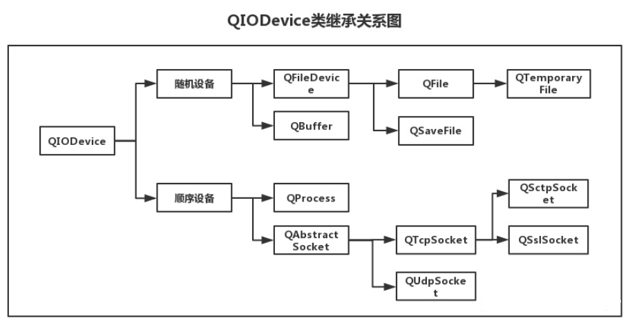

# I/O设备

Qt中的I/O操作通过统一的接口简化了文件与外部设备的操作方式，Qt中文件被当作一种特殊的外部设备，文件操作与外部设备操作相同。I/O操作的本质是连续存储空间的数据读写。

QIODevice为支持读写数据块(如QFile、QBuffer和QTcpSocket)的设备提供了通用实现和抽象接口。QIODevice是抽象的，不能被实例化，但是通常使用它定义的接口来提供与设备无关的I/O特性。

## I/O设备的类型

顺序存取设备：只能从头开始顺序读写数据，不能指定数据的读写位置

随机存取设备：可以定位到任意位置进行数据的读写



## 打开模式

文件打开需要指定模式，模式是一个枚举类型`QIODeviceBase::OpenModeFlag`，打开模式与QIODevice::open()一起使用，描述设备的打开模式。它也由QIODevice::openMode()返回。

| 枚举                        | 描述                                                         |
| --------------------------- | ------------------------------------------------------------ |
| QIODeviceBase::NotOpen      | 设备未打开                                                   |
| QIODeviceBase::ReadOnly     | 只读设备                                                     |
| QIODeviceBase::WriteOnly    | 只写打开的设备，注意，对于文件系统子类(例如QFile)，这种模式意味着截断(清空文件)，除非与ReadOnly、Append或NewOnly结合使用。 |
| QIODeviceBase::ReadWrite    | 读写设备                                                     |
| QIODeviceBase::Append       | 以追加模式打开设备，这样所有数据都被写入文件的末尾。         |
| QIODeviceBase::Truncate     | 如果可以，则打开时会清空设备                                 |
| QIODeviceBase::Text         | 读取时，行尾终止符被翻译为'\n'。在编写时，行尾终止符被转换为本地编码，例如Win32中的'\r\n'。 |
| QIODeviceBase::Unbuffered   | 设备中的任何缓冲区都被绕过。                                 |
| QIODeviceBase::NewOnly      | 如果要打开的文件已经存在，则失败。仅在文件不存在时创建并打开该文件。操作系统保证您是唯一创建和打开文件的人。注意，这种模式意味着WriteOnly，并且允许将其与ReadWrite结合使用。此标志目前只影响QFile。 |
| QIODeviceBase::ExistingOnly | 如果要打开的文件不存在，则失败。此标志必须与ReadOnly、WriteOnly或ReadWrite一起指定。注意，单独将此标志与ReadOnly一起使用是多余的，因为当文件不存在时，ReadOnly已经失败了。此标志目前只影响QFile。 |

# 文件读写

## QFile

QFile是一个用于读写文本、二进制文件和资源的I/O设备。 QFile可以单独使用，或者更方便地与QTextStream或QDataStream一起使用。  

文件名通常在构造函数中传递，但它可以在任何时候使用setFileName()设置。 无论操作系统是什么，QFile都希望文件分隔符是'/'。 不支持使用其他分隔符(比如'\\\')。  

可以使用exists()检查文件是否存在，并使用remove()删除文件。 (更高级的文件系统相关操作由QFileInfo和QDir提供。)  

文件用open()打开，用close()关闭，用flush()刷新。 数据通常使用QDataStream或QTextStream读取和写入，但你也可以调用QIODevice继承的函数read()， readLine()， readAll()， write()。 QFile还继承了getChar()、putChar()和ungetChar()，它们每次只工作一个字符。  

文件的大小由size()返回。 您可以使用pos()获取当前文件位置，或者使用seek()移动到新的文件位置。 如果您已经到达文件的末尾，atEnd()将返回true。  

### 打开文件

创建QFile对象，通过构造函数或者setFilename()设置文件名，然后使用open函数以指定的打开模式打开文件。

如果打开失败，可以通过errorString()获取失败的原因。

```cpp
void testOpen()
{
	QFile file("./Maye.txt");
	if (!file.open(QIODevice::ReadOnly /*| QIODevice::WriteOnly */))
	{
		qWarning() << file.fileName() << "open failed：" << file.errorString();
		return;
	}
	
	file.close();
}
```

### 写文件

文件打开成功后，使用write()来写入数据。

```cpp
void write()
{
	QFile file("./Maye.txt");
	if (!file.open(QIODevice::WriteOnly))
	{
		qWarning() << file.fileName() << "open failed：" << file.errorString();
		return;
	}
	//写点东西
	qInfo()<<"write size"<< file.write("hello Mayejun\n");
	qInfo() << "write size" << file.write(QByteArray("123\n"));
	
	file.close();
}
```

### 读文件

文件打开成功后，使用read()来读取指定长度的数据，使用readLine()来读取一行，使用readAll读取所有数据。

```cpp
void open()
{
	QFile file("./Maye.txt");
	if (!file.open(QIODevice::ReadOnly))
	{
		qWarning() << file.fileName() << "open failed：" << file.errorString();
		return;
	}
	//读取一行
	//qInfo() << file.readLine();
	//读取所有
	//qInfo() << file.readAll();

    qInfo() <<"pos" << file.pos();	//获取文件位置指针的位置
	file.seek(0);		//设置文件位置指针的位置
    qInfo()<<"size"<<file.size();	//获取文件大小
    
	//读取一些
	qInfo() << file.read(5);

	QByteArray arr(10,'\0');
	qint64 len = file.read(arr.data(), 10);
	qInfo() << "len" << len << arr;

	file.close();
}
```

### 静态函数

```cpp
void staticFun()
{
	//把Maye.txt拷贝到上级目录中的hello.txt中(hello.txt必须不存在)
	if (!QFile::copy("Maye.txt", "../hello.txt"))
	{
		qWarning() << "copy failed!";
	}
	//判断某个文件是否存在
	if (!QFile::exists("Maye.txt"))
	{
		qWarning() << "file not exists!";
	}
	//给文件创建符号链接(快捷方式) 后缀必须是.lnk
	if (!QFile::link("Maye.txt", "../马也.lnk"))
	{
		qWarning() << "create link failed!";
	}
	//将指定的文件移动到垃圾桶。
	//如果成功返回true，并将pathInTrash(如果提供)设置为可以在垃圾桶中找到文件的路径;
	//F:\$RECYCLE.BIN\S-1-5-21-1636343760-2586981136-1097798577-1001\$RLGDA2K.txt 可以打开
	//F:/$RECYCLE.BIN/S-1-5-21-1636343760-2586981136-1097798577-1001/$RLGDA2K.txt 打不开(只能使用反斜杠)
	//否则返回false。
	QString trashPath;
	if (!QFile::moveToTrash("Maye.txt",&trashPath))
	{
		qWarning() << "moveToTrash failed!";
	}
	else
	{
		qInfo() << "moveToTrash successful,path is" << trashPath;
	}

	//删除文件,返回值不太行，成功失败都是false
	bool ok = QFile::remove("Maye.txt");
	qInfo() << ok;
	if (!ok)
	{
		qWarning() << "remove failed";
	}

	//重命名文件
	if (!QFile::rename("Maye1.txt", "Maye2.txt"))
	{
		qWarning() << "rename failed!";
	}
	//设置文件名为sz的大小(以字节为单位)。如果调整成功，返回true;否则错误。如果sz大于当前的fileName，则新字节将被设置为0，如果sz小于则文件将被截断。
	if (!QFile::resize("Maye2.txt", 512))
	{
		qWarning() << "resize failed!";
	}

	//返回指定的符号链接(或Windows上的快捷方式)引用的文件或目录的绝对路径，如果fileName不对应于符号链接则返回空字符串。
	//此名称可能不代表现有文件; 它只是一个字符串。如果符号链接指向一个现有的文件，QFile::exists()返回true。
	auto targetStr = QFile::symLinkTarget("../马也.lnk");
	if (targetStr.isEmpty())
	{
		qWarning() << "不是符号链接";
	}
	qInfo() << targetStr;
}
```

## Stream

在上面的读写文件中，我们发现操作还是太过复杂，为了简化文本文件和数据文件的读写操作，QT提供了QTextStream和QDataStream辅助类。QTextStream可将写入的数据全部转换为可读文本，QDataStream可将写入的数据根据类型转换为二进制数据。

### QTextStream

QTextStream可以在QIODevice, QByteArray或QString上操作。 使用QTextStream的流操作符，可以方便地读和写单词，行和数字。 对于生成文本，QTextStream支持字段填充和对齐的格式化选项，以及数字的格式化。

  ```cpp
class Student
{
public:
    qint64 number;
    QString name;
    QString grade;
    qreal math;
    qreal chinese;
    qreal english;
    friend QDebug& operator<<(QDebug& out, const Student& other)
    {
        out.noquote() << other.number << other.name << other.grade << other.math << other.chinese << other.english;
        return out;
    }
};
void readStudentInfo()
{
     QFile file("./student.txt");
    if (!file.open(QIODevice::ReadOnly | QIODevice::Text))
    {
        return -1;
    }

    Student stu;
    QTextStream stream(&file);
    qDebug().noquote() <<stream.readLine();
    while (!stream.atEnd())
    {
        stream >> stu.number >> stu.name >> stu.grade >> stu.math >> stu.chinese >> stu.english;
        qDebug() << stu;
    }
}
void test()
{
    QString res;
    QTextStream textstream(&res);
    textstream << "maye" << QString("冷寂") << "young"; 	//注意：中文要用Qstirng包起来，否则会乱码
    qDebug() <<res;
}
  ```


### QDataStream

```cpp
QByteArray data;
QDataStream stream(&data,QIODevice::ReadWrite);
stream << "image" << 1024 << "ABC";
//"[\x00\x00\x00\x06image\x00]   [\x00\x00\x04\x00]  [\x00\x00\x00\x04" "ABC\x00"] 22
qDebug() << data << data.size();
```

使用QDataStream串行化数据，如果数据是字符串则会在前面用4个字节表明字符串长度，如果是整数则直接存储。

[QIODevice 类 - 什么是设备？](https://zhuanlan.zhihu.com/p/50675356)

[Qt文档指南](https://qtguide.ustclug.org/)

[文件操作](https://blog.51cto.com/u_9291927/1872474)

[Qt压缩和解压 zip--Qt](https://blog.csdn.net/xiaopei_yan/article/details/90267714)

## QFileInfo

QFileInfo类提供与系统无关的文件信息。  

```cpp
QFileInfo info(file);
QFileInfo info("../QFile-test/what.txt");
qDebug() << info.size();                //文件大小
qDebug() << info.absoluteFilePath();    //文件绝对路径(包括文件名)
qDebug() << info.absolutePath();        //绝对路径(不包括文件名)
qDebug() << info.absoluteDir();         //绝对路径 返回QDir
qDebug() << info.path();                //文件路径
qDebug() << info.filePath();			//返回文件名，包括路径(可以是绝对路径也可以是相对路径)。  

if (info.isFile())  //如果是文件
{
    qDebug() << info.fileName();            //带后缀的文件名
    qDebug() << info.baseName();            //不带后缀的文件名
    qDebug() << info.suffix();              //获取文件后缀
}
```

# 配置文件

## QSettings

### 简介

用户通常希望应用程序在会话中记住它的设置(窗口大小和位置，选项等)。 这些信息通常存储在Windows上的系统注册表中(HKEY_CURRENT_USERSoftware/MySoft )，以及macOS和iOS上的属性列表文件中。 在Unix系统上，在缺乏标准的情况下，许多应用程序(包括KDE应用程序)使用INI文本文件。  

QSettings是对这些技术的抽象，使您能够以可移植的方式保存和恢复应用程序设置。 它还支持自定义存储格式。  

QSettings的API基于QVariant，因此我们可以保存很多的类型，如QString、QRect和QImage。  

如果您所需要的只是一个非持久的基于内存的结构，那么可以考虑使用QMap<QString,QVariant>替代。  

### 基本用法

创建QSettings对象时，必须传递**公司或组织的名称**以及**应用程序的名称**。 例如，如果你的程序名为QQ，而你的公司名为NiuBi，你将构造QSettings对象如下:  

```cpp
 QSettings setting("NiuBi","QQ");
```

QSettings对象既可以在堆栈上创建，也可以在堆上创建(即使用new)。 构造和销毁QSettings对象非常快。  

如果你在应用程序的很多地方使用QSettings，你可能想要使用QCoreApplication::setOrganizationName()和QCoreApplication::setApplicationName()指定组织名称和应用程序名称，然后使用默认的QSettings构造函数:  

```cpp
QCoreApplication::setOrganizationName("NiuBi");
QCoreApplication::setOrganizationDomain("NiuBi.com");
QCoreApplication::setApplicationName("QQ");
...
QSettings settings;
```

QSettings存储设置。 每个设置由一对(key,value)键值对(`key为QStirng类型，value为QVariant`)组成。 要写入设置，可以使用setValue()。 例如: 

```cpp
setting.setValue("size",QSize(640,480));
qDebug()<< setting.fileName();	//获取配置文件保存位置
```

如果已经存在具有相同键的设置，则现有值将被新值覆盖。 为了提高效率，更改可能不会立即保存到永久存储中。 (可以调用sync()来立即提交更改。)  

你可以使用value()获取设置的值:  

```cpp
QSize size =  setting.value("size",QSize(250,250)).value<QSize>();
```

如果没有指定名称的设置，QSettings返回一个空的QVariant(无效的)。你可以通过传递第二个参数给value()来指定另一个默认值(这里传了QSize(250,250)，如果配置文件中没有size，就返回自己传的这个数据)。

#### 配置文件格式

在windows下，默认为写入注册表，如果想要写入到.ini文件并保存到exe所在目录，该怎么设置呢？

```cpp
QApplication::setOrganizationName("NiuBi");
QApplication::setApplicationName("QQ");

QSettings setting(QApplication::applicationDirPath()+"/qfile.ini" ,QSettings::Format::IniFormat);
```


### 公有函数

#### 常用

+ 设置将key设置为value的值。 如果键已经存在，则覆盖前面的值。

```cpp
void setValue(const QString &key, const QVariant &value)
```

+ 返回设置键的值。 如果该设置不存在，则返回defaultValue。  

  如果没有指定默认值，则返回一个默认的QVariant。  

```cpp
QVariant QSettings::value(const QString &key, const QVariant &defaultValue = QVariant()) const
```

+ 将任何未保存的更改写入永久存储，并重新加载与此同时被另一个应用程序更改的任何设置。  

  这个函数会定期从QSettings的析构函数和事件循环中自动调用，所以您通常不需要自己调用它。

```cpp
void QSettings::sync()
```

+ 返回一个状态码，指示QSettings遇到的第一个错误，如果没有错误发生，则返回QSettings::NoError。  

```cpp
QSettings::Status status() const
```

+ 删除设置键和键的任何子设置。  

```cpp
void remove(const QString &key)
```

+ 返回使用该QSettings对象写入的设置存储的路径。  

  在Windows上，如果格式为QSettings::NativeFormat，则返回值为系统注册表路径，而不是文件路径。  

```cpp
QString QSettings::fileName() const
```

#### 分组

+ 向当前组添加前缀。

```cpp
void beginGroup(const QString &prefix)
```

+ 将组重置为相应beginGroup()调用之前的值。  

```cpp
void endGroup()
```

+ 返回当前组。

```cpp
QString QSettings::group() const
```

+ 向当前组添加前缀并开始从数组读取。 返回数组的大小。[有案例]  

```cpp
int beginReadArray(const QString &prefix)
```

+ 向当前组添加前缀，并开始写入大小为size的数组。 如果size为-1(默认值)，则根据写入的条目的索引自动确定size。  [有案例]

```cpp
void beginWriteArray(const QString &prefix, int size = -1)
```

+ 关闭数组

```cpp
void endArray()
```

+ 将当前数组的索引设置为i。调用setValue()、value()、remove()和contains()等函数将对该索引处的数组项进行操作。  

```cpp
void setArrayIndex(int i)
```

## QJsonDocment

QJsonDocument是一个包装完整JSON文档的类，它可以从基于UTF-8编码的文本表示中读取和写入该文档。
可以使用QJsonDocument::fromJson()将JSON文档从基于文本的表示形式转换为QJsonDocument。toJson()将其转换回文本。解析器能非常快速且有效的将JSON转换为Qt使用的二进制表示形式。

isNull()可以查询已解析文档的有效性。

可以使用isArray()和isObject()查询文档是否包含数组或对象。可以使用array()或object()检索文档中包含的数组或对象，然后读取或操作。

### 解析Json

```cpp
QJsonDocument parseJson()
{
    QFile file("../../../test.json");
	if (!file.open(QIODevice::ReadOnly))
		return QJsonDocument();

	QJsonParseError jpe;
	QJsonDocument jdoc = QJsonDocument::fromJson(file.readAll(),&jpe);
	if (jdoc.isNull())
	{
		qDebug() << "解析json失败" << jpe.errorString();
	}
    return jdoc;
}
```


### 简单的对象

有如下json对象：

```json
{
  "name": "顽石老师",
  "course_name": "Qt入门到入土",
  "version": "qt6.5.2",
  "age": 18
}
```

要获取对象中的每个键对应的值，可以使用QJsonDocument提供的operator[]函数。

```cpp
void test_jsondoc()
{
	QJsonDocument jdoc = parseJson("../../../test.json");

	qDebug()<<jdoc["version"]<<jdoc["name"]<<jdoc["course_name"]<<jdoc["age"].toDouble();
}
```

### 复杂对象

而对于复杂的对象必须通过object和array获取到具体对象，然后再进行解析。

如有以下json数据`person.json`：

```json
{
  "maye": {
    "age": 18,
    "name": "maye",
    "tel": "123456"
  },
  "yue": {
    "age": 26,
    "name": "月月",
    "tel": "987654321"
  }
}
```

读取某个对象很简单，比如要读取“maye"对象的所有信息，如下：

```cpp
auto obj = jdoc["maye"].toObject();
qDebug() << "name:" << obj.value("name").toString();
qDebug() << "age:" << obj["age"].toInt();
qDebug() << "tel:" << obj["tel"].toString();
```

如果想要读取所有对象信息，则需要获取所有key，然后进行解析。

```cpp
auto rootObj =  jdoc.object();	//获取根对象
auto keys =  rootObj.keys();	//获取根对象所有键
for (auto& key : keys)
{
	auto obj = jdoc[key].toObject();
	qDebug() << "name:" << obj.value("name").toString()
		<< "age:" << obj["age"].toInt()
		<< "tel:" << obj["tel"].toString();
}
```

### 数组

对于Json数组来说，也是比较简单的。

```json
void test_jsonarray()
{
	auto jdoc =  parseJson("../../../test.json");

	if (jdoc.isArray())
	{
		QJsonArray array =  jdoc.array();
		for (size_t i = 0; i < array.size(); i++)
		{
			QJsonValue v = array[i];
			if (v.isString())
				qDebug() << v.toString();
			else if (v.isDouble())
				qDebug() << v.toDouble();
			else
				qDebug() << v;
		}
	}
}
```

以上就是json解析基本步骤，接下来来个复杂的案例吧！

### 省市区解析

在某些时候，我们需要很方便的对省市区进行选择，每个省对应的城市，每个城市对应的区/县以json文件存储。

[省市区JSON](city.json)

+ 全部输出

  ```cpp
  {
  	//获取省级行政区
  	auto array = jdoc.array();
  	for (size_t i = 0; i < array.count(); i++)
  	{
  		auto obj = array[i].toObject();
  		qDebug() << obj["name"].toString();
  		//获取市级行政区
  		auto cityArray = obj["city"].toArray();
  		for (size_t i = 0; i < cityArray.size(); i++)
  		{
  			auto cityObj = cityArray[i].toObject();
  			qDebug() << "---" << cityObj["name"].toString();
  			//获取区/县级行政区
  			auto areaArray = cityObj["area"].toArray();
  			for (size_t i = 0; i < areaArray.size(); i++)
  			{
  				qDebug() << "    ----" << areaArray[i].toString();
  			}
  		}
  	}
  }
  ```

+ 获取指定省/市的所有区/县

  ```cpp
  	{
  		QString provinceStr = "湖南省";
  		QString cityStr = "常德市";
  
  		auto provinceArray = jdoc.array();
  		for (size_t i = 0; i < provinceArray.size(); i++)
  		{
  			auto provinceObj = provinceArray[i].toObject();
  			if (provinceObj.value("name") == provinceStr)
  			{
  				qDebug() << provinceObj["name"].toString();
  				auto cityArray = provinceObj["city"].toArray();
  				for (size_t i = 0; i < cityArray.size(); i++)
  				{
  					auto cityObj = cityArray[i].toObject();
                      //if (cityObj.value("name") == cityStr)	//对市进一步筛选
  					{
  						qDebug() << "---" << cityObj["name"].toString();
  
  						//获取区/县级行政区
  						auto areaArray = cityObj["area"].toArray();
  						for (size_t i = 0; i < areaArray.size(); i++)
  						{
  							qDebug() << "    ----" << areaArray[i].toString();
  						}
  					}
  				}
  			}
  		}
  	}
  ```

  

# 目录/路径

## QDir

QDir类提供对目录结构及其内容的访问。  

QDir功能如下：

  A、目录分隔符统一使用’/’

  B、能够对目录进行任意操作（创建、删除、重命名）

```cpp
bool mkdir(const QString &dirName) const
bool mkpath(const QString &dirPath) const
        
bool rmdir(const QString &dirName) const	//删除子目录(必须为空才能删除)
bool rmpath(const QString &dirPath) const	//删除路径(必须为空才能删除)
bool remove(const QString &fileName)		//删除指定文件
bool removeRecursively()					//删除目录，包括它的所有内容 

bool rename(const QString &oldName, const QString &newName)	//重命名
```

  C、能够获取指定目录中的所有条目（文件和文件夹）

```cpp
QFileInfoList entryInfoList(const QStringList &nameFilters, QDir::Filters filters = NoFilter, QDir::SortFlags sort = NoSort) const
QFileInfoList entryInfoList(QDir::Filters filters = NoFilter, QDir::SortFlags sort = NoSort) const
QStringList entryList(const QStringList &nameFilters, QDir::Filters filters = NoFilter, QDir::SortFlags sort = NoSort) const
QStringList entryList(QDir::Filters filters = NoFilter, QDir::SortFlags sort = NoSort) const
```

  E、获取常用路径

```cpp
//返回应用程序当前目录的绝对路径
QDir current()
QString currentPath()

//返回用户主目录  C:/Users/Maye
QDir home()
QString homePath()
 
//返回系统的临时目录。   
QDir temp()
QString tempPath()
    
//返回根目录列表 C:/  D:/ ...
QFileInfoList drives()
```

+ 计算目录的大小

  ```cpp
  quint32 dirSize(const QString& dirName)
  {
      QDir dir(dirName);
      if (!dir.exists())
          return ~0;
      quint32 size = 0;
      for (QFileInfo& info : dir.entryInfoList(QDir::Filter::NoDotAndDotDot | QDir::Files | QDir::Dirs))
      {
          qDebug() << info.fileName();
          if (info.isFile())
          {
              size += info.size();
          }
          else
          {
              size += dirSize(info.filePath());
          }
      }
      return size;
  }
  ```

## QDirIterator

您可以使用QDirIterator一次导航目录中的一个条目。它类似于QDir::entryList()和QDir::entryInfoList()，但由于它一次列出一个条目而不是一次列出所有条目，因此它的可伸缩性更好，更适合大型目录。它还支持递归列出目录内容，并遵循符号链接。与QDir::entryList()不同，QDirIterator不支持排序。

QDirIterator构造函数接受一个QDir或一个目录作为参数。构造之后，迭代器位于第一个目录条目之前。下面是如何依次遍历所有条目:

```cpp
 QDirIterator it("/etc", QDirIterator::Subdirectories);
 while (it.hasNext()) {
     QString dir = it.next();
     qDebug() << dir;
     // /etc/.
     // /etc/..
     // /etc/X11
     // /etc/X11/fs
     // ...
 }

```


## QStandardPaths

### 简介

QStandardPaths类提供了访问标准路径的方法。 所谓系统标准路径指的是本地文件系统中，用户的特定目录或系统的配置目录。比如在Windows系统中的“我的文档”，“视频”，“图片”等目录位置。

对于一个大型项目，系统的标准目录是保存数据，配置信息的一个非常有用的地方。例如，一个应用程序需要将下载好的文档保存在本地文件系统的某个地方，而它不能假设某个定好的路径是存在于磁盘上的。有的人可能会将这个文档保存在应用程序所在的工作目录中，当然这是个好方法，但有时应用程序并不希望将数据放在工作目录中，这是因为：

- 这会使得程序工作目录变得复杂，让用户来干预工作目录，这无疑是一件危险的事情，很可能会破坏程序。
- 有的程序会希望工作目录是只读的，所以禁止其它用户来对其进行修改。
- 如果某些配置文件是和其它程序是共享的，如若放置这些文件在某个程序的工作目录中，显然是不明智的做法，而最好的做法就是放在这些标准目录中啦。

对于系统标准目录，我们可以认定它是必然存在的（即使不存在，也可自动创建），但是不同的操作系统，可能有不一样的系统标准目录。例如“我的文档”目录位置

- Windows：C:/Users/$username$/Documents
- MacOs ：~/Documents
- Linux : ~/Documents
- Android :/Documents,//Documents
- IOS :/Documents

如果想要做跨平台的系统，像这些路径，你都得想办法获取，这只是一个我的文档，如果再加上“下载”，“图片”等标准路径，想想是不是都很麻烦。

然而，Qt却给我们提供了非常方便的类来获取这些标准目录路径，它就是马上要学习的QStandardPaths类。所有函数均为**静态函数**。

### 静态公有函数

+ 返回给定位置类型的本地化显示名称，如果找不到相关位置，则返回空QString。  

```cpp
[static] QString displayName(QStandardPaths::StandardLocation type)
```

+ 在指定路径中查找名为executableName的可执行文件，如果路径为空则查找系统路径。 

```cpp
[static] QString findExecutable(const QString &executableName, const QStringList &paths = QStringList())
```

+ 在type的标准位置中查找名为fileName的文件或目录。 

```cpp
[static] QString locate(QStandardPaths::StandardLocation type, const QString &fileName, QStandardPaths::LocateOptions options = LocateFile)
```

+ 根据文件名fileName在type的标准位置查找所有文件或目录。 

```cpp
[static] QStringList locateAll(QStandardPaths::StandardLocation type, const QString &fileName, QStandardPaths::LocateOptions options = LocateFile)
```

+ 如果testMode为true，这将在QStandardPaths中启用一个特殊的“测试模式”，它将更改可写的位置以指向测试目录。 这将阻止自动测试读取或写入当前用户的配置。  

```cpp
[static] void setTestModeEnabled(bool testMode)
```

+ 返回该类型文件所属的所有目录。  

```cpp
[static] QStringList standardLocations(QStandardPaths::StandardLocation type)
```

+ 返回写入类型为文件的目录，如果无法确定位置，则返回空字符串。  

```cpp
[static] QString writableLocation(QStandardPaths::StandardLocation type)
```


### 枚举：标准位置

enum QStandardPaths::StandardLocation 描述了各种路径的位置，可用以下函数查询。

+ `QString displayName(QStandardPaths::StandardLocation type)`

  根据路径类型，返回对应的本地路径名称，未找到返回空QString。 

  **Example**

  ```cpp
  qDebug()<<QStandardPaths::displayName(QStandardPaths::DesktopLocation);
  输出:"Desktop"
  ```

+ `QString writableLocation(QStandardPaths::StandardLocation type)`

  根据路径类型，返回对应的本地路径，未找到返回空QString。 

  **Example**

  ```cpp
  qDebug()<< QStandardPaths::writableLocation(QStandardPaths::DesktopLocation);
  输出:"C:/Users/Maye/Desktop"
  ```

+ `QStringList standardLocations(QStandardPaths::StandardLocation type)`

  根据路径类型，返回该类型对应的所有目录路径。 如果可以确定的话，目录列表从高优先级到低优先级排序。 如果type没有定义，则此列表为空

  **Example**

  ```cpp
  qDebug()<<QStandardPaths::standardLocations(QStandardPaths::DataLocation);
  输出:("C:/Users/Maye/AppData/Local/test", "C:/ProgramData/test", "F:/MyCode/QtCode/build-QtCourse-Desktop_Qt_5_14_2_MinGW_32_bit-Debug/test/debug", "F:/MyCode/QtCode/build-QtCourse-Desktop_Qt_5_14_2_MinGW_32_bit-Debug/test/debug/data", "F:/MyCode/QtCode/build-QtCourse-Desktop_Qt_5_14_2_MinGW_32_bit-Debug/test/debug/data/test")
  ```

### 在指定位置查找文件

+ `QString findExecutable(const QString &executableName, const QStringList &paths = QStringList())`

在指定的路径中查找名为executableName的可执行文件，如果paths为空，则在系统路径中查找。 系统路径指PATH环境变量的值。 如果存在，返回可执行文件的绝对文件路径，如果没有找到，则返回空字符串。

**Example**

```cpp
qDebug()<<QStandardPaths::findExecutable("calc.exe");	//只要设置了path环境变量，都可以找到
qDebug()<<QStandardPaths::findExecutable("7z.exe",QStringList()<<"D:\\MySoftWare\\7-Zip");	//如果没有设置path环境变量，可以自己指定多个路径
```

+ `QString locate(QStandardPaths::StandardLocation type, const QString &fileName, QStandardPaths::LocateOptions options = LocateFile)`

+ `QStringList locateAll(QStandardPaths::StandardLocation type, const QString &fileName, QStandardPaths::LocateOptions options = LocateFile)`

  根据标准目录类型，在该目录中查找名为fileName的文件或目录。 返回找到的文件或目录的完整路径(取决于options)。 如果找不到这样的文件或目录，则返回一个空字符串

**Example**

```cpp
qDebug()<< QStandardPaths::locate(QStandardPaths::StandardLocation::DownloadLocation,"下拉.png");
```


## QStorageInfo

允许检索有关卷的空间、挂载点、标签和文件系统名称的信息。

您可以通过将路径作为构造函数参数传递到卷的挂载点来创建QStorageInfo的实例，或者您可以使用setPath()方法设置它。静态mountedVolumes()方法可用于获取所有已挂载文件系统的列表。

QStorageInfo总是缓存检索到的信息，但是你可以调用refresh()来使缓存无效。

下面的示例检索关于系统根卷的最常见信息，并打印有关它的信息。

```cpp
     QStorageInfo storage = QStorageInfo::root();

     qDebug() << storage.rootPath();
     if (storage.isReadOnly())
         qDebug() << "isReadOnly:" << storage.isReadOnly();

     qDebug() << "name:" << storage.name();
     qDebug() << "fileSystemType:" << storage.fileSystemType();
     qDebug() << "size:" << storage.bytesTotal()/1000/1000 << "MB";
     qDebug() << "availableSize:" << storage.bytesAvailable()/1000/1000 << "MB";

```

使用静态函数`mountedVolumes`返回与当前挂载的文件系统列表对应的QStorageInfo对象列表。

这个示例展示了如何检索所有可用的文件系统，跳过只读文件系统。

```cpp
     for (const QStorageInfo &storage : QStorageInfo::mountedVolumes()) {
         if (storage.isValid() && storage.isReady()) {
             if (!storage.isReadOnly()) {
                 // ...
             }
         }
     }
```


