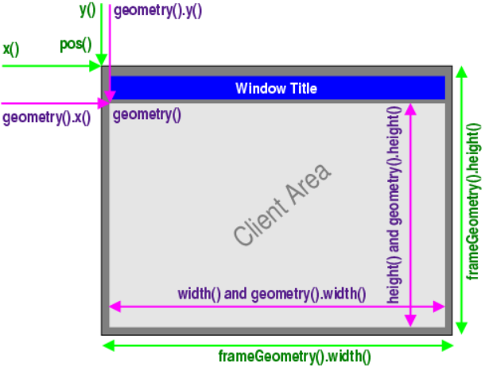

# 1. QWidget

QWidget类是所有可视控件的基类，控件是用户界面的最小元素，用于接受各种事件(如：鼠标、键盘等)并且绘制出来给用户观看。

每个控件都是矩形的，他们按照Z轴顺序排列。

如果控件没有父控件，则称之为窗口，窗口会被一个框架包裹(包含标题栏，边框等)，可以通过某些函数来修改边框属性。

## 窗口几何

> Window and Dialog Widgets

QWidget提供了几个处理小部件几何形状的函数。其中一些函数操作在纯客户区(即不包括窗框的窗口)上，其他函数包括窗框。区分的方式是透明地涵盖最常见的用法。

+ 包含窗口边框：`x()`，`y()`，`frameGeometry()`，`pos()`，and `move()`
+ 不包含窗口边框：`geometry()`， `width()`，`height()`， `rect()`，and `size()`

注意，这种区别只对顶级小部件有意义。对于所有子小部件，frame geometry等于小部件的客 client geometry。



## 大小位置

### 获取坐标和大小

```cpp
//包含窗口边框
int x() const
int y() const
QPoint pos() const
//不包含窗口边框    
int width() const   
int height() const    
QSize size() const
    
const QRect &geometry() const    
QSize frameSize() const  
QRect frameGeometry() const  
//控件内部几何QRect(0,0,width(),height())    
QRect rect() const
```

### 设置坐标和大小

```cpp
void move(const QPoint &)
void move(int x, int y)

void resize(int w, int h)
void resize(const QSize &)
    
void setGeometry(const QRect &)
void setGeometry(int x, int y, int w, int h)    
```

### 固定大小

```cpp
void setFixedSize(const QSize &s)
void setFixedSize(int w, int h) 
```

### 大小限定

去掉set就是获取函数

```cpp
void setMaximumWidth(int maxw) 
void setMaximumHeight(int maxh)
void setMaximumSize(const QSize &)
void setMaximumSize(int maxw, int maxh)
     
void setMinimumWidth(int minw)
void setMinimumHeight(int minh)
void setMinimumSize(const QSize &)
void setMinimumSize(int minw, int minh)
```

## 坐标系统转换

```cpp
QPoint mapFrom(const QWidget *parent, const QPoint &pos) const
QPoint mapFromGlobal(const QPoint &pos) const
QPoint mapFromParent(const QPoint &pos) const
QPoint mapTo(const QWidget *parent, const QPoint &pos) const
QPoint mapToGlobal(const QPoint &pos) const
QPoint mapToParent(const QPoint &pos) const
```

+ 这几个函数都是转换相对坐标系用的. **用另一个坐标系统的坐标值, 来表达当前坐标系统中某个坐标所指向的某个点,**

  记住: 一定要先确**两个坐标系统**再确定**一个点**

+ **相对坐标**：获取自己相对于父控件的位置 QWidget::pos()

+ **绝对坐标**：将当前控件的相对位置转换为屏幕绝对位置 QWidget::mapToGlobal()

+ **绝对坐标转为相对坐标**：将屏幕绝对位置对应到控件的相对位置 QWidget::mapFromGlobal()

## 内容边距

设置小部件内容周围的空白，使其具有左、上、右和下的大小。边距被布局系统使用，并且可以被子类用来指定要绘制的区域(例如，不包括框架)。

```cpp
void setContentsMargins(int left, int top, int right, int bottom)
void setContentsMargins(const QMargins &margins)
QMargins contentsMargins() const
//获取内容区域(除去边距)    
QRect contentsRect() const    
```

**案例**：创建一个窗口，包含一个标签，标签内容为"社会我顽哥，人狠话不多 "，标签大小为300x300，让内容放在标签的右下角。

## 鼠标指针

### 指针形状

```cpp
QCursor cursor() const
void setCursor(const QCursor &)
void unsetCursor()
```

如果要全局设置鼠标光标样式，可以使用`QGuiApplication::setOverrideCursor()`， 设置鼠标指针的形状需要使用QCursor类，通过像素图或枚举指定鼠标光标形状。

#### QCursor

```cpp
 QCursor(const QPixmap &pixmap, int hotX = -1, int hotY = -1)
 QCursor(const QBitmap &bitmap, const QBitmap &mask, int hotX = -1, int hotY = -1)
 QCursor(Qt::CursorShape shape)
```

QCursor提供了获取/设置鼠标全局坐标的静态方法。

```cpp
[static] QPoint pos()
[static] QPoint pos(const QScreen *screen)
[static] void setPos(int x, int y)
[static] void setPos(QScreen *screen, int x, int y)
[static] void setPos(const QPoint &p)
[static] void setPos(QScreen *screen, const QPoint &p)
```

## 顶层窗口相关

### 图标

```cpp
void setWindowIcon(const QIcon &icon)
QIcon windowIcon() const    
```

### 标题

```cpp
QString windowTitle() const
void setWindowTitle(const QString &)
```

窗口标题附加操作！

```cpp
void setWindowModified(bool)
```

此属性保存窗口中显示的文档是否有未保存的更改。

修改后的窗口是指内容已更改但尚未保存到磁盘的窗口。这个标志将根据平台的不同而有不同的效果。在macOS上关闭按钮会有一个修改过的外观；在其他平台上，窗口标题将带有“\*”(星号)。

窗口标题必须包含“[\*]”占位符，它指示“\*”应该出现的位置。通常，它应该出现在文件名后面(例如，"document1.txt[\*] -文本编辑器")。如果窗口没有被修改，占位符就会被删除。

注意，如果一个小部件被设置为已修改，那么它的所有祖先也将被设置为已修改。但是，如果在一个小部件上调用setWindowModified(false)，这将不会传播到它的父组件，因为父组件的其他子组件可能已经被修改了。

如果你想要在窗口标题后面显示，应用程序名称，可以使用以下函数。(这个不算标题的一部分)

```cpp
[static]void QGuiApplication::setApplicationDisplayName(const QString &name)
```

### 不透明度

```cpp
void setWindowOpacity(qreal level)
qreal windowOpacity() const
```

### 窗口状态

```cpp
Qt::WindowStates windowState() const
void setWindowState(Qt::WindowStates windowState)   
bool isActiveWindow()    	//是否为活跃窗口
```

| 枚举                 | 描述     |
| -------------------- | -------- |
| Qt::WindowNoState    | 无状态   |
| Qt::WindowMinimized  | 最小化   |
| Qt::WindowMaximized  | 最大化   |
| Qt::WindowFullScreen | 全屏     |
| Qt::WindowActive     | 活动窗口 |

如果窗口不可见(即isVisible()返回false)，当show()被调用时窗口状态才生效。对于可见的窗口，会立即生效。例如，要在全屏模式和普通模式之间切换，使用以下代码:

```cpp
 w->setWindowState(w->windowState() ^ Qt::WindowFullScreen);
```

为了恢复和激活最小化的窗口(同时保持其最大化和/或全屏状态)，请使用以下命令:

```cpp
 w->setWindowState((w->windowState() & ~Qt::WindowMinimized) | Qt::WindowActive);
```


### 最大化最小化

```cpp
void showFullScreen()
void showMaximized()
void showMinimized()
void showNormal()
    
bool isMaximized() const
bool isMinimized() const    
bool isFullScreen() const    
```


### 窗口标志

[常用标志详见 附录1](#附录一)

```cpp
void overrideWindowFlags(Qt::WindowFlags flags)
     
void setWindowFlag(Qt::WindowType flag, bool on = true)
void setWindowFlags(Qt::WindowFlags type)
Qt::WindowFlags windowFlags() const
```

## 交互状态

#### 是否禁用

```cpp
void setDisabled(bool disable)
void setEnabled(bool)
bool isEnabled() const
bool isEnabledTo(const QWidget *ancestor) const    
```

#### 是否显示/隐藏

```cpp
virtual void setVisible(bool visible)
```

`setVisible`的马甲

```cpp
void show()
void hide()
void setHidden(bool hidden)    
```

判断是否可见

```cpp
bool isVisible() const
bool isHidden() const
bool isVisibleTo(const QWidget *ancestor) const    //如果能随着widget控件的显示和隐藏, 而同步变化, 则返回true 
```

## 帮助系统

> Help System

### toolTip

当鼠标悬停在空间上时，会在鼠标旁边显示"工具提示"

```cpp
void setToolTip(const QString &)
QString toolTip() const
     
void setToolTipDuration(int msec)     
int toolTipDuration() const
```


### whatsThis

切换到whatsThis模式，鼠标点击控件会显示"这是啥提示"

```cpp
void setWhatsThis(const QString &)
QString whatsThis() const    
```

+ 先创建三个按钮

  ```cpp
  QPushButton*btn1 = new QPushButton("open",this);  
  QPushButton*btn2 = new QPushButton("new",this);   
  QPushButton*btn3 = new QPushButton("look",this);  
  btn2->move(100,0);                                
  btn3->move(200,0);                                
                                                    
  btn1->setToolTip("打开文件");                         
  btn1->setWhatsThis("open a new file");            
                                                    
  btn2->setToolTip("新建文件");                         
  btn2->setWhatsThis("create a new file");          
                                                    
  btn3->setToolTip("查看");                           
  btn3->setWhatsThis("查看其他按钮的详细信息");                
                                                    
  connect(btn3,&QPushButton::clicked,this,[=]()     
  {                                                 
      QWhatsThis::enterWhatsThisMode();                
  });                                               
  ```

+ 运行程序后按Shift + F1会出现当前获得焦点的widget的whatsThis信息

+ 调用QWhatsThis的静态函数enterWhatsThisMode进入whatsThis模式，此时当鼠标移动到设置了whatsThis的widget上光标会出现一个问号，再点击则会出现whatsThis的窗口。

## 父子关系

返回控件坐标系中位置(x, y)处的可见子控件，没有则返回nullptr。

```cpp
QWidget *childAt(int x, int y) const
QWidget *childAt(const QPoint &p) const 
```

返回包裹所有子控件的矩形(隐藏的控件除外)

```cpp
QRect childrenRect() const
QRegion childrenRegion() const 
```

返回父控件

```cpp
QWidget *parentWidget() const  
```

## 层级控制

```cpp
void lower()	//将控件降低到父控件堆栈的底部
void raise()    //将控件提升到父控件堆栈顶部 
void stackUnder(QWidget *w)	//将控件放在w控件下面。控件本身和w必须是兄弟姐妹。
```


## 焦点控制

### 单个控件

```cpp
void setFocus(Qt::FocusReason reason)    
void clearFocus()
Qt::FocusPolicy focusPolicy() const
```


### 多个子控件

```cpp
QWidget *focusWidget() const
bool focusNextChild()
bool focusPreviousChild()
virtual bool focusNextPrevChild(bool next)
[static] void setTabOrder(QWidget *first, QWidget *second)
```


### 设置exe图标

设置完窗口图标之后，我们可能需要设置可执行程序exe文件的图标，这个稍微麻烦一点点，但是也是三步搞定，走起！

+ 1，创建一个图标格式(ico)的文件，`可以将一个普通的图片转成.ico格式的图标文件`，[图片格式在线转换](https://convertio.co/zh/) 

+ 2，将转换好的ico文件放到源文件所在目录，即和CMakeLists.txt文件同级目录，并创建名为`icon.rc`的文件，写入如下内容。

  ```cpp
  IDI_ICON1 ICON DISCARDABLE "zay.ico"
  ```

+ 3，最后在CMakeLists.txt中添加如下命令

  ```cmake
  aux_source_directory(. MY_SCOURCES)
  add_executable(QtTest ${MY_SCOURCES} "icon.rc")
  ```

最后重新运行程序，找到exe，完成！     


## 设置窗口属性

+ setAttribute用来设置小部件的属性，testAttribute查看是否设置了某种属性。

**常用属性**

| 枚举                         | 值(十进制) | 描述                                                         |
| ---------------------------- | ---------- | ------------------------------------------------------------ |
| Qt::WA_AcceptDrops           | 78         | 允许来自拖放操作的数据被拖放到小部件上(参见QWidget::setAcceptDrops()) |
| Qt::WA_AlwaysShowToolTips    | 84         | 为非活动窗口启用工具提示                                     |
| Qt::WA_CustomWhatsThis       | 47         | 表示小部件希望在“这是什么?”模式下继续正常运行。 这是由小部件的作者设置的。 |
| Qt::WA_DeleteOnClose         | 55         | 使Qt在小部件接受关闭事件时删除该小部件                       |
| Qt::WA_MouseTracking         | 2          | 指示小部件启用了鼠标跟踪。 参见QWidget:: mouseTracking       |
| Qt::WA_TranslucentBackground | 120        | 指示小部件应该有一个半透明的背景，也就是说，小部件的任何非透明区域都将是半透明的，因为小部件将有一个alpha通道。 设置此标志将导致设置WA_NoSystemBackground。 在Windows上，小部件还需要设置Qt:: framesswindowhint窗口标志。 该标志由小部件的作者设置或清除。 |

## Qt部署应用程序发布包

windeployqt.exe是Qt自带的工具，用于创建应用程序发布包。 简单来说，这个工具可以自动地将某程序依赖的库、资源拷贝到其所在目录，防止程序在其他电脑上运行报找不到库的错误。

### 原理

windeployqt.exe工作原理很简单，它会到当前的环境变量PATH配置的搜索路径中，查找应用程序所需要的库和资源，拷贝到应用程序目录中。

### 使用

+ 先从开始菜单中打开**「对应版本的Qt」**的命令行终端界面，如下图：


+ 然后再命令行中输入`windeployqt AppName` ，AppName表示应用程序完整路径；

  我们知道，Qt项目路径不能包含中文，所以为了保险起见，应用程序路径中不要包含中文。另外，如果应用程序路径中包含空格，需要用双引号将整个路径字符串包裹起来。

### 注意坑

大体上的流程只有这两步。 整个发布过程看似比较简单，但是其中还是存在一些坑的。

**坑点一：未使用Qt的命令行终端执行发布命令，导致库版本拷贝错误**

**坑点二：未使用与Qt版本对应的windeployqt.exe**

**坑点三：发布时，默认文件不会覆盖**

如果已经存在同名的文件，则不会自动覆盖，可以通过添加强制覆盖参数--force强制覆盖已存在的文件。

```sh
windeployqt --force D:\test\maye.exe
```

**注意点：**命令行在启动是，会有一行提示,`记得调用vcvarsall.bat来完成环境设置!`


意思是说，我们还没有运行vcvarsall.bat，所以VS的环境变量没有配置好，因此不会拷贝VS相关的依赖库。

vcvarsall.bat是VS自带的配置环境变量的批处理文件。它的位置取决你的安装位置，我的在`D:\MySoftWare\Microsoft Visual Studio\2022\Professional\VC\Auxiliary\Build`下，接下来就尝试运行vcvarsall.bat来配置一下VS的环境。

```css
maye> D:\MySoftWare\\"Microsoft Visual Studio\"\2022\Professional\VC\Auxiliary\Build\vcvarsall.bat

maye>windeployqt F:\MyCode\QtTest.exe
```


这样发布出来的目录就带上了VS的依赖库，拷贝到没有安装VS的电脑上亦可以运行。


# 2. 资源文件 .qrc

> 需要我们给窗口设置图标

```c++
// 弊端: 发布的exe 必须要加载 d:\\pic\\1.ico 如果对应的目录中么有图片, 图标就无法被加载
//			发布exe 需要额外发布图片, 将其部署到某个目录中
setWindowIcon(QIcon("d:\\pic\\1.ico"));
```

使用资源文件解决上述的弊端:

> 优势: 
>
> 1. 将图片资源放到资源文件
> 2. 当程序编译的时候, 资源文件中的图片会被转换为二进制, 打包到exe中
> 3. 直接发布exe就可以, 不需要额外提供图片资源了

在VS中使用资源文件，需要安装Vs的Qt插件，具体操作如下。

**2.1.打开VS**

选择菜单栏->扩展->管理扩展


**2.VS安装Qt插件**

选择菜单栏的 扩展->管理扩展，输入Qt搜索，然后下载Qt Visual Studio Tools（下载灰常的银杏，慢的死~还不一定能下载）


**如果实在不能忍受这龟速，咱们来别的办法**

先到Qt官网下载对于版本的插件，我这里是VS2022：

[Qt官网插件下载](https://download.qt.io/official_releases/vsaddin/2.8.1/)


如果跳到如下页面，选择清华大学镜像源下载即可。


3.安装VSIX(即上面下载的那个插件)

如果是通过Vs下载的，会自动安装。

如果是手动下载的，需要双击自己安装。

打开安装包之后，点击Install等待安装完成即可。


安装之前，请先关掉Vs`没有关掉会出现如下界面，点击end tasks即可`


关闭Vs之后，一秒安装完成


安装完成，关掉程序


# 附录一 

+ 此枚举类型用于为小部件指定各种窗口系统属性。 它们相当不寻常，但在少数情况下是必要的。 其中一些标志取决于底层窗口管理器是否支持它们。

| 枚举              | 值(十六进制)        | 描述                                                         |
| ----------------- | ------------------- | ------------------------------------------------------------ |
| Qt::Widget        | 0x00000000          | 这是QWidget的默认类型。 这种类型的控件如果有父控件，则为控件，如果没有父控件，则为独立窗口。 |
| Qt::Window        | 0x00000001          | 指示小部件是一个窗口，通常带有窗口系统框架和标题栏，而不管小部件是否有父窗口。 |
| Qt::Dialog        | 0x00000002\| Window | 指示小部件是一个窗口，应该装饰为一个对话框(即，通常在标题栏中没有最大化或最小化按钮)。 |
| Qt::Sheet         | 0x00000004\| Window | 指示窗口是macOS上的工作表。 由于使用工作表意味着窗口模式，推荐的方法是使用QWidget::setWindowModality()，或QDialog::open() |
| Qt::Drawer        | Sheet \| Dialog     | 指示小部件是macOS上的一个抽屉                                |
| Qt::Popup         | 0x00000008\| Window | 指示小部件是弹出式顶级窗口，即它是模态窗口，但具有适合于弹出式菜单的窗口系统框架。 |
| Qt::Tool          | Popup \| Dialog     | 指示小部件是工具窗口。 工具窗口通常是一个小窗口，比通常的标题栏和装饰更小，通常用于工具按钮集合 |
| Qt::ToolTip       | Popup \| Sheet      | 指示小部件是一个工具提示。 这在内部用于实现工具提示          |
| Qt::SplashScreen  | ToolTip \| Dialog   | 表示该窗口为启动画面。 这是QSplashScreen的默认类型           |
| Qt::Desktop       | 0x00000010\| Window | 指示此小部件是桌面。 这是QDesktopWidget(此类已经过时)的类型  |
| Qt::SubWindow     | 0x00000012          | 指示此小部件是子窗口，例如QMdiSubWindow小部件                |
| Qt::ForeignWindow | 0x00000020\| Window | 表示此窗口对象是一个句柄，表示由另一个进程或手动使用本机代码创建的本机平台窗口。 |
| Qt::CoverWindow   | 0x00000040\| Window | 指示该窗口表示覆盖窗口，该窗口在某些平台上最小化应用程序时显示。 |

+ 窗口提示可以有多个(不一定会生效，看平台是否支持)

| 枚举                            | 值(十六进制)                                        | 描述                                                         |
| ------------------------------- | --------------------------------------------------- | ------------------------------------------------------------ |
| Qt::FramelessWindowHint         | 0x00000800                                          | 窗口无边框                                                   |
| Qt::NoDropShadowWindowHint      | 0x40000000                                          | 去掉窗口阴影                                                 |
| Qt::CustomizeWindowHint         | 0x02000000                                          | 关闭默认的窗口标题提示                                       |
| Qt::WindowTitleHint             | 0x00001000                                          | 给窗口一个标题栏                                             |
| Qt::WindowSystemMenuHint        | 0x00002000                                          | 添加一个窗口系统菜单，可能还有一个关闭按钮(例如在Mac上)。 如果你需要隐藏或显示关闭按钮，使用WindowCloseButtonHint更便于移植。 |
| Qt::WindowMinimizeButtonHint    | 0x00004000                                          | 激活最小化和关闭按钮，禁止最大化按钮                         |
| Qt::WindowMaximizeButtonHint    | 0x00008000                                          | 激活最大化和关闭按钮，禁止最小化按钮                         |
| Qt::WindowMinMaxButtonsHint     | WindowMinimizeButtonHint \|WindowMaximizeButtonHint | 激活最小化，最大化和关闭按钮                                 |
| Qt::WindowCloseButtonHint       | 0x08000000                                          | 添加一个关闭按钮                                             |
| Qt::WindowContextHelpButtonHint | 0x00010000                                          | 添加问号和关闭按钮，同对话框                                 |
| Qt::WindowStaysOnTopHint        | 0x00040000                                          | 窗口顶置                                                     |
| Qt::WindowStaysOnBottomHint     | 0x04000000                                          | 窗口底置                                                     |

# 附录二

+ 窗口状态 `Qt::WindowState`

| 枚举                 | 值         | 描述                                 |
| -------------------- | ---------- | ------------------------------------ |
| Qt::WindowNoState    | 0x00000000 | 窗口没有状态设置(正常状态)           |
| Qt::WindowMinimized  | 0x00000001 | 窗口被最小化(即图标化)               |
| Qt::WindowMaximized  | 0x00000002 | 窗户周围有一个框架，使其最大化       |
| Qt::WindowFullScreen | 0x00000004 | 窗口填充了整个屏幕，周围没有任何边框 |
| Qt::WindowActive     | 0x00000008 | 该窗口是活动窗口，即它有键盘焦点     |

