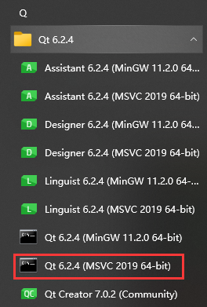
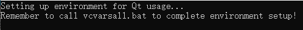
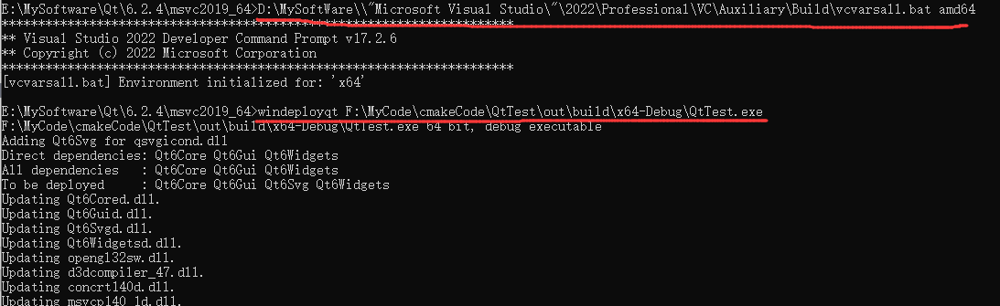
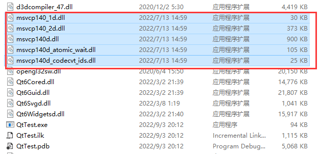
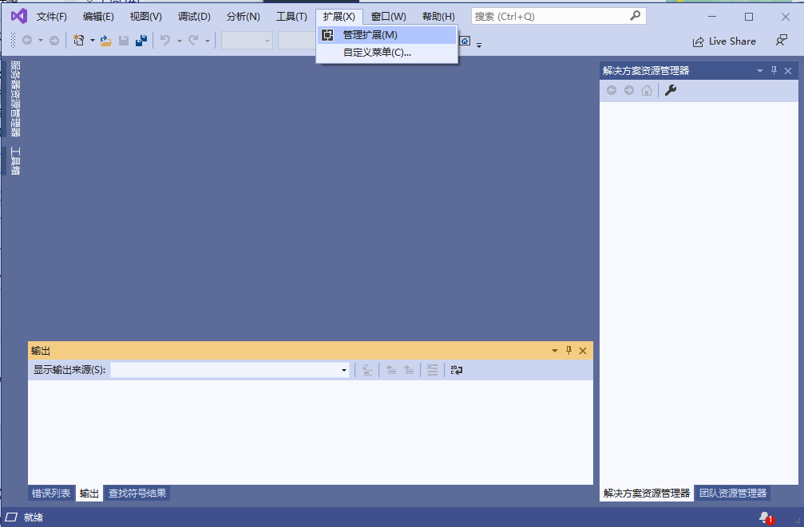
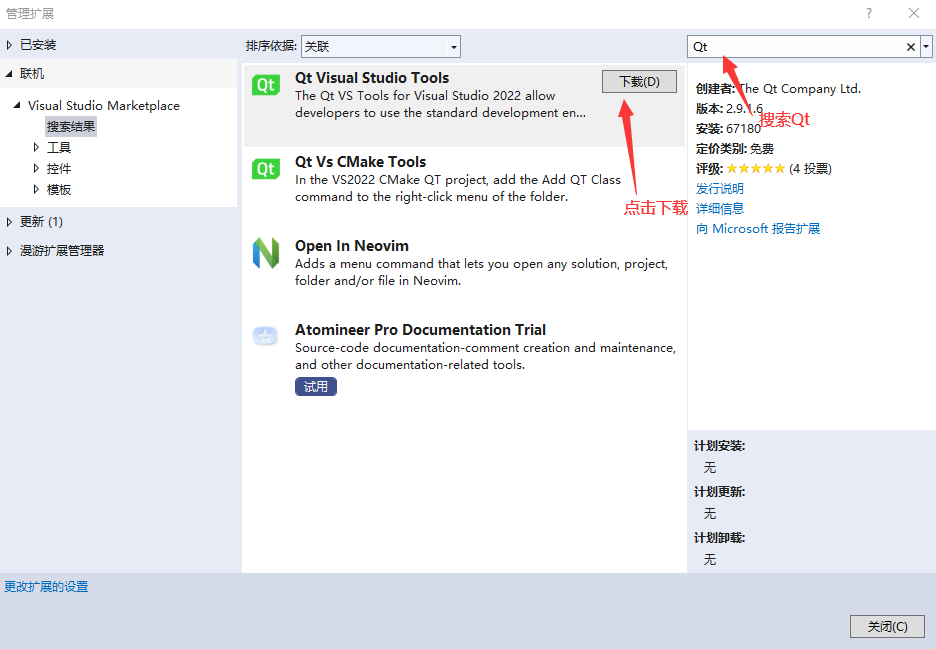
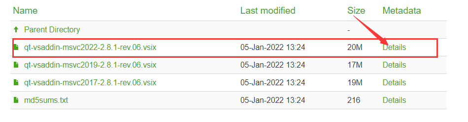
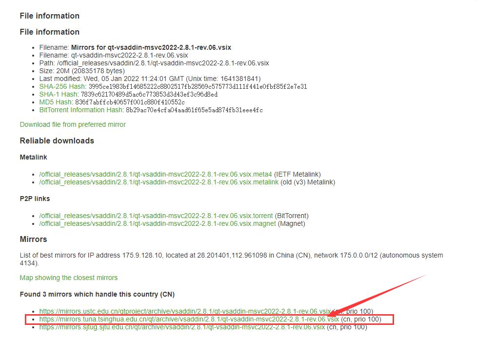
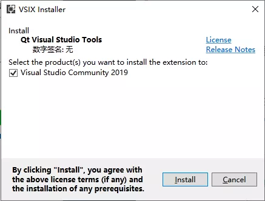
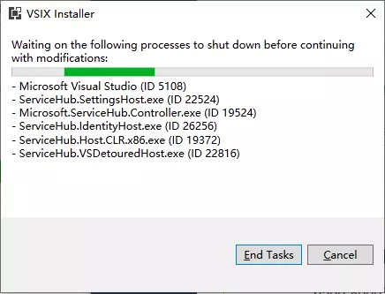

# 1. QWidget

QWidget类是所有可视控件的基类，控件是用户界面的最小元素，用于接受各种事件(如：鼠标、键盘等)并且绘制出来给用户观看。

每个控件都是矩形的，他们按照Z轴顺序排列。

如果控件没有父控件，则称之为窗口，窗口会被一个框架包裹(包含标题栏，边框等)，可以通过某些函数来修改边框属性。

## 1. API

[QWidget API xmind](assets\xmind\QWidgets.xmind)

# 2. 设置exe图标

设置完窗口图标之后，我们可能需要设置可执行程序exe文件的图标，这个稍微麻烦一点点，但是也是三步搞定，走起！

+ 1，创建一个图标格式(ico)的文件，`可以将一个普通的图片转成.ico格式的图标文件`，[图片格式在线转换](https://convertio.co/zh/) 

+ 2，将转换好的ico文件放到源文件所在目录，即和CMakeLists.txt文件同级目录，并创建名为`icon.rc`的文件，写入如下内容。

  ```cpp
  IDI_ICON1 ICON DISCARDABLE "zay.ico"
  ```

+ 3，最后在CMakeLists.txt中添加如下命令

  ```cmake
  aux_source_directory(. MY_SCOURCES)
  add_executable(QtTest ${MY_SCOURCES} "icon.rc")
  ```

最后重新运行程序，找到exe，完成！     


# 3. Qt部署应用程序发布包

windeployqt.exe是Qt自带的工具，用于创建应用程序发布包。 简单来说，这个工具可以自动地将某程序依赖的库、资源拷贝到其所在目录，防止程序在其他电脑上运行报找不到库的错误。

### 原理

windeployqt.exe工作原理很简单，它会到当前的环境变量PATH配置的搜索路径中，查找应用程序所需要的库和资源，拷贝到应用程序目录中。

### 使用

+ 先从开始菜单中打开**「对应版本的Qt」**的命令行终端界面，如下图：



+ 然后再命令行中输入`windeployqt AppName` ，AppName表示应用程序完整路径；

  我们知道，Qt项目路径不能包含中文，所以为了保险起见，应用程序路径中不要包含中文。另外，如果应用程序路径中包含空格，需要用双引号将整个路径字符串包裹起来。

### 注意坑

大体上的流程只有这两步。 整个发布过程看似比较简单，但是其中还是存在一些坑的。

**坑点一：未使用Qt的命令行终端执行发布命令，导致库版本拷贝错误**

**坑点二：未使用与Qt版本对应的windeployqt.exe**

**坑点三：发布时，默认文件不会覆盖**

如果已经存在同名的文件，则不会自动覆盖，可以通过添加强制覆盖参数--force强制覆盖已存在的文件。

```sh
windeployqt --force D:\test\maye.exe
```

**注意点：**命令行在启动是，会有一行提示,`记得调用vcvarsall.bat来完成环境设置!`



意思是说，我们还没有运行vcvarsall.bat，所以VS的环境变量没有配置好，因此不会拷贝VS相关的依赖库。

vcvarsall.bat是VS自带的配置环境变量的批处理文件。它的位置取决你的安装位置，我的在`D:\MySoftWare\Microsoft Visual Studio\2022\Professional\VC\Auxiliary\Build`下，接下来就尝试运行vcvarsall.bat来配置一下VS的环境。

```css
maye> D:\MySoftWare\\"Microsoft Visual Studio\"\2022\Professional\VC\Auxiliary\Build\vcvarsall.bat

maye>windeployqt F:\MyCode\QtTest.exe
```



这样发布出来的目录就带上了VS的依赖库，拷贝到没有安装VS的电脑上亦可以运行。



### 把发布包打包成安装程序

https://jrsoftware.org/isinfo.php

# 4. 资源文件 .qrc

> 需要我们给窗口设置图标

```c++
// 弊端: 发布的exe 必须要加载 d:\\pic\\1.ico 如果对应的目录中么有图片, 图标就无法被加载
//			发布exe 需要额外发布图片, 将其部署到某个目录中
setWindowIcon(QIcon("d:\\pic\\1.ico"));
```

使用资源文件解决上述的弊端:

> 优势: 
>
> 1. 将图片资源放到资源文件
> 2. 当程序编译的时候, 资源文件中的图片会被转换为二进制, 打包到exe中
> 3. 直接发布exe就可以, 不需要额外提供图片资源了

在VS中使用资源文件，需要安装Vs的Qt插件，具体操作如下。

**2.1.打开VS**

选择菜单栏->扩展->管理扩展



**2.VS安装Qt插件**

选择菜单栏的 扩展->管理扩展，输入Qt搜索，然后下载Qt Visual Studio Tools（下载灰常的银杏，慢的死~还不一定能下载）



**如果实在不能忍受这龟速，咱们来别的办法**

先到Qt官网下载对于版本的插件，我这里是VS2022：

[Qt官网插件下载](https://download.qt.io/official_releases/vsaddin/2.8.1/)



如果跳到如下页面，选择清华大学镜像源下载即可。



3.安装VSIX(即上面下载的那个插件)

如果是通过Vs下载的，会自动安装。

如果是手动下载的，需要双击自己安装。

打开安装包之后，点击Install等待安装完成即可。



安装之前，请先关掉Vs`没有关掉会出现如下界面，点击end tasks即可`



关闭Vs之后，一秒安装完成


安装完成，关掉程序


# 附录一 

+ 此枚举类型用于为小部件指定各种窗口系统属性。 它们相当不寻常，但在少数情况下是必要的。 其中一些标志取决于底层窗口管理器是否支持它们。

| 枚举              | 值(十六进制)        | 描述                                                         |
| ----------------- | ------------------- | ------------------------------------------------------------ |
| Qt::Widget        | 0x00000000          | 这是QWidget的默认类型。 这种类型的控件如果有父控件，则为控件，如果没有父控件，则为独立窗口。 |
| Qt::Window        | 0x00000001          | 指示小部件是一个窗口，通常带有窗口系统框架和标题栏，而不管小部件是否有父窗口。 |
| Qt::Dialog        | 0x00000002\| Window | 指示小部件是一个窗口，应该装饰为一个对话框(即，通常在标题栏中没有最大化或最小化按钮)。 |
| Qt::Sheet         | 0x00000004\| Window | 指示窗口是macOS上的工作表。 由于使用工作表意味着窗口模式，推荐的方法是使用QWidget::setWindowModality()，或QDialog::open() |
| Qt::Drawer        | Sheet \| Dialog     | 指示小部件是macOS上的一个抽屉                                |
| Qt::Popup         | 0x00000008\| Window | 指示小部件是弹出式顶级窗口，即它是模态窗口，但具有适合于弹出式菜单的窗口系统框架。 |
| Qt::Tool          | Popup \| Dialog     | 指示小部件是工具窗口。 工具窗口通常是一个小窗口，比通常的标题栏和装饰更小，通常用于工具按钮集合 |
| Qt::ToolTip       | Popup \| Sheet      | 指示小部件是一个工具提示。 这在内部用于实现工具提示          |
| Qt::SplashScreen  | ToolTip \| Dialog   | 表示该窗口为启动画面。 这是QSplashScreen的默认类型           |
| Qt::Desktop       | 0x00000010\| Window | 指示此小部件是桌面。 这是QDesktopWidget(此类已经过时)的类型  |
| Qt::SubWindow     | 0x00000012          | 指示此小部件是子窗口，例如QMdiSubWindow小部件                |
| Qt::ForeignWindow | 0x00000020\| Window | 表示此窗口对象是一个句柄，表示由另一个进程或手动使用本机代码创建的本机平台窗口。 |
| Qt::CoverWindow   | 0x00000040\| Window | 指示该窗口表示覆盖窗口，该窗口在某些平台上最小化应用程序时显示。 |

+ 窗口提示可以有多个(不一定会生效，看平台是否支持)

| 枚举                            | 值(十六进制)                                        | 描述                                                         |
| ------------------------------- | --------------------------------------------------- | ------------------------------------------------------------ |
| Qt::FramelessWindowHint         | 0x00000800                                          | 窗口无边框                                                   |
| Qt::NoDropShadowWindowHint      | 0x40000000                                          | 去掉窗口阴影                                                 |
| Qt::CustomizeWindowHint         | 0x02000000                                          | 关闭默认的窗口标题提示                                       |
| Qt::WindowTitleHint             | 0x00001000                                          | 给窗口一个标题栏                                             |
| Qt::WindowSystemMenuHint        | 0x00002000                                          | 添加一个窗口系统菜单，可能还有一个关闭按钮(例如在Mac上)。 如果你需要隐藏或显示关闭按钮，使用WindowCloseButtonHint更便于移植。 |
| Qt::WindowMinimizeButtonHint    | 0x00004000                                          | 激活最小化和关闭按钮，禁止最大化按钮                         |
| Qt::WindowMaximizeButtonHint    | 0x00008000                                          | 激活最大化和关闭按钮，禁止最小化按钮                         |
| Qt::WindowMinMaxButtonsHint     | WindowMinimizeButtonHint \|WindowMaximizeButtonHint | 激活最小化，最大化和关闭按钮                                 |
| Qt::WindowCloseButtonHint       | 0x08000000                                          | 添加一个关闭按钮                                             |
| Qt::WindowContextHelpButtonHint | 0x00010000                                          | 添加问号和关闭按钮，同对话框                                 |
| Qt::WindowStaysOnTopHint        | 0x00040000                                          | 窗口顶置                                                     |
| Qt::WindowStaysOnBottomHint     | 0x04000000                                          | 窗口底置                                                     |

# 附录二

+ 窗口状态 `Qt::WindowState`

| 枚举                 | 值         | 描述                                 |
| -------------------- | ---------- | ------------------------------------ |
| Qt::WindowNoState    | 0x00000000 | 窗口没有状态设置(正常状态)           |
| Qt::WindowMinimized  | 0x00000001 | 窗口被最小化(即图标化)               |
| Qt::WindowMaximized  | 0x00000002 | 窗户周围有一个框架，使其最大化       |
| Qt::WindowFullScreen | 0x00000004 | 窗口填充了整个屏幕，周围没有任何边框 |
| Qt::WindowActive     | 0x00000008 | 该窗口是活动窗口，即它有键盘焦点     |

